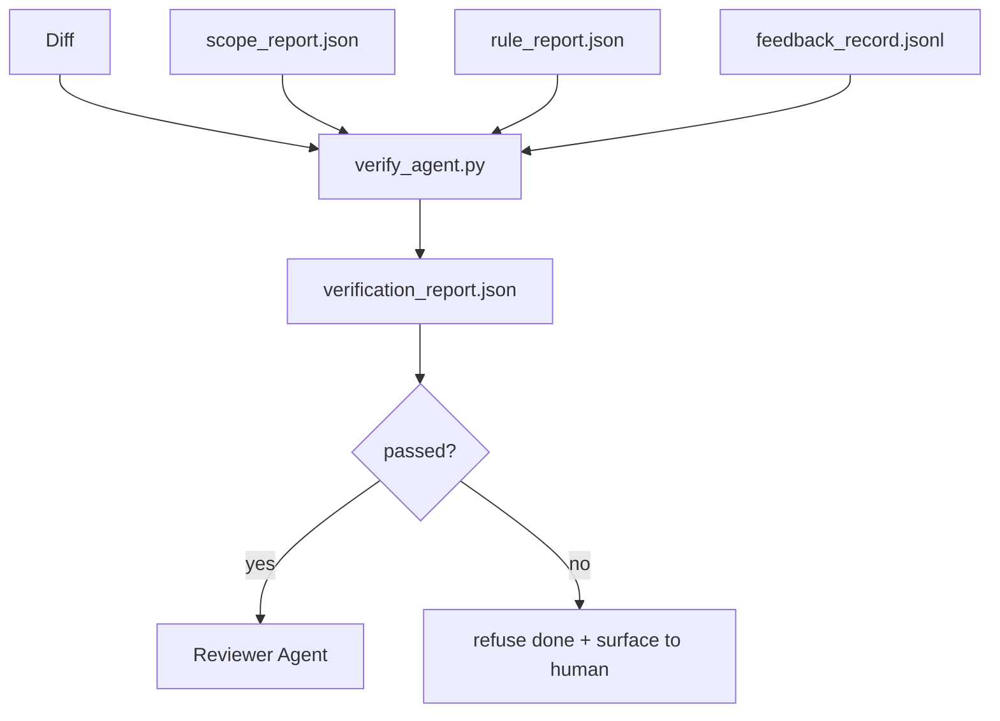

# 查證閘門

> 代理沒有資格把自己的工作標記成完成。查證閘門會讀範圍契約、回饋日誌、規則報告與 diff，然後回答一個問題：這項任務真的完成了嗎？如果閘門說沒有，那它就沒完成，不管聊天裡怎麼說。

**類型：** 建構
**程式語言：** Python (stdlib)
**先修單元：** 階段 14 · 33（規則）、階段 14 · 36（範圍）、階段 14 · 37（回饋）
**時間：** 約 55 分鐘

## 學習目標

- 把查證閘門定義成一個作用在工作台產物上的決定性函數。
- 把規則報告、範圍報告、回饋紀錄與 diff 合成單一份裁決。
- 產出一份審查者代理與 CI 都讀得到的 `verification_report.json`。
- 只要有任何 block 等級的失敗就拒絕讓任務往前，沒有例外。

## 問題所在

代理太容易宣告成功。三種失敗形狀最常見：

- 「看起來不錯。」模型讀了自己的 diff，然後決定它是對的。
- 「測試通過了。」講得很有自信。但沒有任何紀錄顯示測試真的跑過。
- 「驗收達成了。」驗收準則被解讀得夠寬鬆，寬鬆到「任何像完成的東西」都算。

工作台的修法是單一道查證閘門，去讀代理已經產出的那些產物，然後做出判定。閘門是決定性的。閘門在版本控制裡。閘門接進 CI。代理賄賂不了它。

## 核心概念



### 閘門檢查什麼

| 檢查 | 來源產物 | 嚴重度 |
|-------|-----------------|----------|
| 所有驗收指令都跑過 | `feedback_record.jsonl` | block |
| 所有驗收指令都以零離開 | `feedback_record.jsonl` | block |
| 範圍檢查沒有禁止的寫入 | `scope_report.json` | block |
| 範圍檢查沒有範圍外的寫入 | `scope_report.json` | block 或 warn |
| 所有 block 等級的規則都通過 | `rule_report.json` | block |
| 回饋裡沒有 `null` 離開碼 | `feedback_record.jsonl` | block |
| 動過的檔案符合 `scope.allowed_files` | 兩者 | warn |

`warn` 等級的發現會替裁決加註；`block` 等級的發現會讓 `passed: true` 不成立。

### 決定性，不是機率性

同一組產物，閘門每次都必須產出同樣的裁決。不要 LLM 裁判。LLM 裁判屬於審查者那一側（階段 14 · 39），那裡的目標是質性評價，不是狀態判定。

### 一份報告，一條路徑

每次任務收尾，閘門產出一份 `verification_report.json`，寫在 `outputs/verification/<task_id>.json` 底下。CI 消費同一條路徑。多個閘門用不同路徑，就會把真值來源分岔掉。

### 拒絕，沒有例外

Block 等級的發現不能由代理覆寫。它們只能由人類覆寫，並記下 `override_reason` 與 `overridden_by` 使用者 id。那次覆寫是一個有簽章的變更，不是代理的決定。

## 建構它

`code/main.py` 實作了：

- 每種輸入產物的載入器，全都在本地做成樁，好讓這一課自成一體。
- 一個 `verify(task_id, artifacts) -> VerdictReport` 純函數。
- 一個印表器，顯示逐項檢查的結果與最終的通過／失敗。
- 一個含三種任務情境的示範：乾淨通過、範圍蔓延、缺少驗收。

跑它：

```
python3 code/main.py
```

輸出：三份裁決報告，各自存在腳本旁邊。

## 野地裡的生產模式

有四種模式，把閘門從「又一份 lint 工作」提升成「那條決定性的邊」。

**縱深防禦，不是單一閘門。** pre-commit 掛鉤 → CI 狀態檢查 → 工具前授權掛鉤 → 合併前閘門。每一層都是決定性的，所以某一層的失誤會被下一層接住。microservices.io 2026 年 3 月那份手冊講得很明白：pre-commit 掛鉤是不可繞過的，因為它跟模型端的技能不同，不依賴代理有沒有照指示走。查證閘門坐在 CI／合併前那一層。

**用決定性檢查做防禦，模型裁判只用在細緻之處。** Anthropic 2026 年那組 Hybrid Norm 配對：可驗證的獎勵（單元測試、schema 檢查、離開碼）回答「這段程式碼有沒有解決問題？」—— LLM 評分準則回答「這段程式碼可讀嗎、安全嗎、符合風格嗎？」閘門跑第一類；審查者（階段 14 · 39）跑第二類。把兩者混在一起會讓訊號塌掉。

**要有簽章的覆寫日誌，不要 Slack 討論串。** 每次覆寫都在 `outputs/verification/overrides.jsonl` 產生一列，內含：時間戳、發現代碼、理由、簽章使用者、當前 HEAD commit。執行環境拒絕任何沒有簽章的覆寫；那條稽核軌跡由 git 追蹤。這就是「覆寫政策」與「覆寫劇場」之間的分界線。

**把覆蓋率地板當成一等的檢查。** 一份 `coverage_report.json` 餵給一項 `coverage_floor`（預設 80%）檢查。若量到的覆蓋率跌破地板，或比上一次合併的地板低超過 1 個百分點，閘門就失敗。沒有這項檢查，代理會悄悄把失敗的測試刪掉，而查證報告依然一片綠。

**`--strict` 模式把 warn 升成 block。** 對發布分支、會擋出貨的 PR，或事故後的檢傷分類，`--strict` 讓每個警告都變成硬性失敗。這個旗標依分支選擇性啟用；不要當成全域預設，因為對什麼都嚴格會腐蝕日常流程。

## 框架應用

生產模式：

- **CI 步驟。** 一個 `verify_agent` 工作對著代理的最終產物跑這道閘門。合併保護在沒有 `passed: true` 時拒絕。
- **交接前掛鉤。** 代理執行環境在產生交接文件之前呼叫閘門。沒有綠燈裁決，就沒有交接。
- **人工檢傷。** 當代理宣稱成功而人類起疑時，維運者去讀那份報告。

在工作台的流程裡，閘門就是那條決定性的邊。其他每個表面都在它的上游。

## 產出交付

`outputs/skill-verification-gate.md` 會把閘門接進某個特定專案：哪些驗收指令餵給它、哪些規則是 block 等級、哪些範圍外寫入可以容忍、覆寫稽核日誌怎麼存。

## 練習

1. 加一項 `coverage_floor` 檢查：測試指令必須產出覆蓋率至少 80% 的報告。決定由哪份產物帶著那個地板值。
2. 支援一個 `--strict` 模式，把每個 `warn` 升成 `block`。把「嚴格模式才是對的預設」的那些情況寫成文件。
3. 讓閘門除了 JSON 之外也產出一份 Markdown 摘要。替「哪些欄位該進摘要」辯護。
4. 加一項 `time_since_last_human_touch` 檢查：任何在人類敲鍵盤後 60 秒內被編輯的檔案，豁免於範圍外標記。
5. 拿你產品裡一份真實的代理 diff 跑這道閘門。有幾項發現是真的、幾項是雜訊？閘門還需要在哪裡長大？

## 關鍵術語

| 術語 | 大家怎麼說 | 實際是什麼意思 |
|------|----------------|------------------------|
| 查證閘門 | 「那個會把事情擋下來的檢查」 | 作用在工作台產物上、產出通過／失敗裁決的決定性函數 |
| Block 嚴重度 | 「硬性失敗」 | 一項會讓 `passed: true` 不成立、且需要簽章覆寫的發現 |
| 覆寫日誌 | 「我們為什麼放它過」 | 帶理由與使用者 id 的簽章條目，由審查稽核 |
| 驗收指令 | 「那個證明」 | 一個 shell 指令，它以零離開就是「完成」的意思 |
| 單一報告路徑 | 「真值來源」 | `outputs/verification/<task_id>.json`，CI 與人類都消費它 |

## 延伸閱讀

- [Anthropic, Harness design for long-running application development](https://www.anthropic.com/engineering/harness-design-long-running-apps)
- [OpenAI Agents SDK guardrails](https://openai.github.io/openai-agents-python/guardrails/)
- [microservices.io, GenAI dev platform: guardrails](https://microservices.io/post/architecture/2026/03/09/genai-development-platform-part-1-development-guardrails.html) —— pre-commit 與 CI 之間的縱深防禦
- [ICMD, The 2026 Playbook for Agentic AI Ops](https://icmd.app/article/the-2026-playbook-for-agentic-ai-ops-guardrails-costs-and-reliability-at-scale-1776661990431) —— 核准閘門的階梯（草稿 → 核准 → 門檻內自動）
- [Type-Checked Compliance: Deterministic Guardrails (arXiv 2604.01483)](https://arxiv.org/pdf/2604.01483) —— 以 Lean 4 作為決定性把關的上限
- [logi-cmd/agent-guardrails — merge gate spec](https://github.com/logi-cmd/agent-guardrails) —— 範圍 + 突變測試的閘門
- [Guardrails AI x MLflow](https://guardrailsai.com/blog/guardrails-mlflow) —— 把決定性驗證器當成 CI 的評分器
- [Akira, Real-Time Guardrails for Agentic Systems](https://www.akira.ai/blog/real-time-guardrails-agentic-systems) —— 工具前／後的閘門
- 階段 14 · 27 —— 提示詞注入防禦（閘門的對抗性搭檔）
- 階段 14 · 36 —— 這道閘門所強制執行的範圍契約
- 階段 14 · 37 —— 這道閘門所評分的回饋日誌
- 階段 14 · 39 —— 閘門交接過去的那個審查者代理
