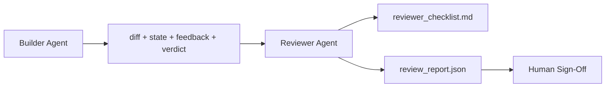

# 審查者代理：把建造者與批改者分開

> 寫程式碼的那個代理不能替它打分數。審查者是第二個迴圈，帶不同的系統提示詞、不同的目標，以及對建造者所有產出的唯讀存取。建造者與審查者之間的那道縫隙，正是多數可靠性所在之處。

**類型：** 建構
**程式語言：** Python (stdlib)
**先修單元：** 階段 14 · 38（查證閘門）
**時間：** 約 55 分鐘

## 學習目標

- 說出為何同一個代理沒辦法可靠地審查自己的工作。
- 做一個審查者代理迴圈，消費建造者的產物並產出一份結構化審查報告。
- 撰寫一份審查者評分準則，評的是具體維度，不是感覺。
- 把審查者接進工作台，好讓人類審查那一步是從一份真實產物開始。

## 問題所在

你叫代理修一個臭蟲。它編輯了四個檔案、跑了測試、回報完成。查證閘門（階段 14 · 38）確認驗收跑過、範圍守住了。閘門說 `passed: true`。你合併了。兩天後你發現那個修補解掉的是這個臭蟲錯的那一半。

驗收是必要條件，不是充分條件。審查者問的是驗收問不出來的那些問題：這解掉的是對的問題嗎？它有沒有沒標記就擴張範圍？它有沒有把那些本該被質疑的假設寫下來？它留下的工作台狀態，下一個工作階段接得上嗎？

## 核心概念



### 審查者評分準則

五個維度，每個給 0 到 2 分。

| 維度 | 問題 |
|-----------|----------|
| 問題契合度 | 這個變更解的是任務所陳述的那件事，還是旁邊那件事？ |
| 範圍紀律 | 編輯有沒有守在契約之內，或者契約是被刻意擴張的？ |
| 假設 | 所有隱含假設有沒有寫在某個可審查的地方？ |
| 查證品質 | 那個驗收指令真的證明了目標，還是只證明了一個較弱的版本？ |
| 交接就緒度 | 下一個工作階段能不能從當前狀態乾淨地接手？ |

滿分 10。低於 7 是軟性失敗；低於 5 是硬性失敗。

### 審查者是另一個角色，不是另一個模型

你可以用跟建造者同一個模型去跑審查者。紀律在於角色分離：不同的系統提示詞、不同的輸入、對 diff 沒有寫入權限。姿態的改變，就是訊號的改變。

### 審查者不能編輯 diff

審查者讀 diff、狀態、回饋、裁決。它寫一份報告。它不去修補 diff。若報告說「這裡要修」，那就由下一輪建造者去修；審查者回去繼續審查。把角色混在一起，就毀了那道縫隙。

### 審查者評分準則相對於查證閘門

閘門（階段 14 · 38）檢查決定性的事實：驗收有沒有跑、規則有沒有過、範圍有沒有守住。審查者做的是質性判斷：這是對的工作嗎、有沒有記錄下來、交接能不能用。兩者都必要。

## 建構它

`code/main.py` 實作了：

- 一個 `ReviewerInputs` dataclass，把審查者要讀的那些產物打包起來。
- 一個評分準則評分器，一個維度一個函數。每個函數都是決定性的、屬於本課用的樁等級；真實實作會去呼叫 LLM。
- 一個 `review_report.json` 寫入器，含五項分數、總分，以及一個裁決（`pass`、`soft_fail`、`hard_fail`）。
- 兩個示範案例：一個乾淨的變更，以及一個「測試對、問題錯」的變更。

跑它：

```
python3 code/main.py
```

輸出：兩份寫到磁碟上的審查報告，以及一張維度分數的主控台表格。

## 野地裡的生產模式

收據：Cloudflare 2026 年 4 月的 AI Code Review 系統，在 30 天內橫跨 5,169 個儲存庫、48,095 個合併請求，跑了 131,246 次審查。審查中位數在 3 分 39 秒內完成。最多七位專家審查者（安全、效能、程式碼品質、文件、發布管理、法遵、Engineering Codex）在一位 Review Coordinator 之下平行執行，由它去重發現並判定嚴重度。頂級模型只保留給協調者；專家跑在較便宜的層級上。

有四種模式讓這件事在規模上行得通。

**要一群專家，不要一個大審查者。** 一位帶五維度評分準則的審查者，對單人儲存庫夠用。一旦程式庫有了安全關鍵、效能關鍵與文件等表面，就拆成提示詞更小的專家。協調者負責去重；專家從不跑完整的評分準則。模型層級的分離自然掉出來：便宜的專家、昂貴的協調者。

**把偏誤緩解當成設計要求，不是最佳化。** LLM 裁判有四種可靠的偏誤（Adnan Masood，2026 年 4 月）：位置偏誤（GPT-4 在 (A,B) 與 (B,A) 順序上約 40% 不一致）、冗長偏誤（對較長輸出約有 15% 的分數膨脹）、自我偏好（裁判偏好來自同一模型家族的輸出）、權威偏誤（裁判高估對知名作者的引用）。緩解方式：兩種順序都評，只計一致的勝出；用明確獎勵簡潔的 1-4 分量表；跨模型家族輪換裁判；評分前把作者名字剝掉。

**要校準集，不要感覺。** 一組 10-20 項、已知正確裁決的歷史任務集。每次提示詞改動都拿審查者跑一遍。若與歷史紀錄的一致度掉到 80% 以下，那份評分準則就得在審查者出貨前修訂。這是每個團隊最後都會重新發現的事；不如一開始就準備好。

**與閘門構成混合規範。** 查證閘門（階段 14 · 38）處理決定性檢查（驗收有沒有跑、測試有沒有過、範圍有沒有守住）。審查者處理語意檢查（這是不是對的工作、假設有沒有記錄、交接能不能用）。Anthropic 2026 年的指引對這個拆分講得很明白：不要叫審查者去重做閘門已經證明過的事。

## 框架應用

生產模式：

- **Claude Code 的子代理。** 建造者收掉一項任務後，一個審查者子代理接著跑。它在 PR 上留下一則帶評分準則分數的留言。
- **OpenAI Agents SDK 的 handoff。** 建造者在任務完成時交接給審查者。審查者可以帶著一份發現清單交接回去，或往上交給人類。
- **兩模型配對。** 建造者跑在較快較便宜的模型上。審查者跑在較強、脈絡較小、專注於判斷的模型上。

當人類沒辦法親自做每一次審查時，審查者就是工作台長出來的第二雙眼睛。

## 產出交付

`outputs/skill-reviewer-agent.md` 會產出一份專案專屬的審查者評分準則、一個接到建造者產物上的審查者代理樁，以及一份與查證閘門的整合，好讓人類審查是從一份寫好的報告開始，而不是從一張白紙開始。

## 練習

1. 加一個你產品領域專屬的第六維度。論證它為何不會被既有那五個吸收掉。
2. 用兩種不同的系統提示詞（精簡、囉唆）各跑一次審查者。哪一種產出的報告人類比較可能會讀？
3. 替每個維度加一個 `confidence` 欄位。當最低那個維度的信心低於 0.6 時，拒絕出貨這份報告。
4. 做一組校準集：10 次歷史上任務收尾、且已知正確裁決的案例。拿審查者跑一遍。它在哪裡跟歷史紀錄不一致？
5. 加一個「要求更多證據」的能供性：審查者可以在評分前要求建造者跑某個特定測試。什麼樣的退避機制才不會讓它一直繞圈？

## 關鍵術語

| 術語 | 大家怎麼說 | 實際是什麼意思 |
|------|----------------|------------------------|
| 審查者評分準則 | 「檢查清單」 | 五維度 0-2 分制，每個維度都有一條寫下來的問題 |
| 軟性失敗 | 「需要修訂」 | 總分低於 7；建造者拿到一批要處理的發現 |
| 硬性失敗 | 「退件」 | 總分低於 5，或任一維度為 0；停下並呈現給人 |
| 角色分離 | 「不同的提示詞」 | 同一個模型可以扮演兩種角色；紀律在於輸入與姿態 |
| 信心地板 | 「別出貨低訊號的報告」 | 評分準則不確定時，拒絕發出裁決 |

## 延伸閱讀

- [OpenAI Agents SDK handoffs](https://openai.github.io/openai-agents-python/handoffs/)
- [Anthropic Claude Code subagents](https://code.claude.com/docs/en/sub-agents)
- [Cloudflare, Orchestrating AI Code Review at Scale](https://blog.cloudflare.com/ai-code-review/) —— 七專家 + 協調者架構，30 天 13.1 萬次執行
- [Agent-as-a-Judge: Evaluating Agents with Agents (OpenReview / ICLR)](https://openreview.net/forum?id=DeVm3YUnpj) —— DevAI 基準，366 條階層式解答需求
- [Adnan Masood, Rubric-Based Evaluations and LLM-as-a-Judge: Methodologies, Biases, Empirical Validation](https://medium.com/@adnanmasood/rubric-based-evals-llm-as-a-judge-methodologies-and-empirical-validation-in-domain-context-71936b989e80) —— 那四種偏誤與緩解
- [MLflow, LLM-as-a-Judge Evaluation](https://mlflow.org/llm-as-a-judge) —— 建造者／評估者分離的生產級工具
- [LangChain, How to Calibrate LLM-as-a-Judge with Human Corrections](https://www.langchain.com/articles/llm-as-a-judge) —— 校準集的工作流
- [Evidently AI, LLM-as-a-judge: a complete guide](https://www.evidentlyai.com/llm-guide/llm-as-a-judge)
- [Arize, LLM as a Judge — Primer and Pre-Built Evaluators](https://arize.com/llm-as-a-judge/)
- 階段 14 · 05 —— Self-Refine 與 CRITIC（單代理自我審查的基線）
- 階段 14 · 30 —— 評測驅動的代理開發（校準集產生器）
- 階段 14 · 38 —— 審查者會讀的那道查證閘門
- 階段 14 · 40 —— 審查者報告餵養的那份交接封包
