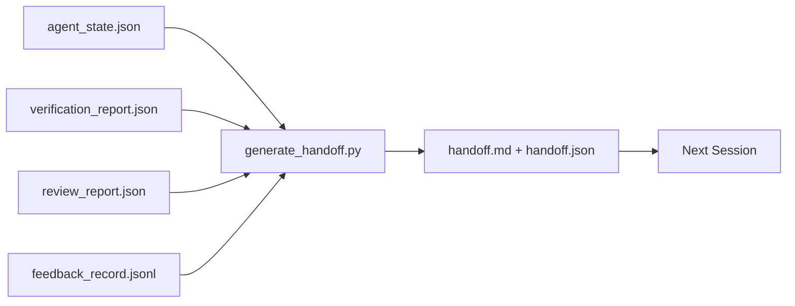

# 跨工作階段交接

> 工作階段會結束。工作不會。交接封包就是那份把「代理工作了一小時」變成「下一個工作階段第一分鐘就有生產力」的產物。要刻意去做它，不要當成事後補的東西。

**類型：** 建構
**程式語言：** Python (stdlib)
**先修單元：** 階段 14 · 34（儲存庫記憶）、階段 14 · 38（查證）、階段 14 · 39（審查者）
**時間：** 約 50 分鐘

## 學習目標

- 指認出每份交接封包都需要的那七個欄位。
- 從工作台產物產生交接，而不用手寫散文。
- 把龐大的回饋日誌修剪成交接尺寸的摘要。
- 讓下一個工作階段的第一個行動是決定性的。

## 問題所在

工作階段結束。代理說「太好了，我們有進展」。下一個工作階段打開。下一個代理問「我們上次做到哪？」第一個代理的答案已經不見了。下一個代理重新發現、重跑同樣的指令、對人類重問同樣的問題，然後燒掉三十分鐘去復原上一個工作階段最後那三十秒。

一次糟糕交接的代價，會在這項任務的整個生命週期裡每個工作階段都被付一次。修法是一份在工作階段結束時自動產生的封包：改了什麼、為什麼、試過什麼、什麼失敗了、還剩什麼、下次先做什麼。

## 核心概念



### 每份交接都帶的七個欄位

| 欄位 | 它回答的問題 |
|-------|---------------------|
| `summary` | 一段話說明做了什麼 |
| `changed_files` | 一眼看完的 diff |
| `commands_run` | 實際執行過什麼 |
| `failed_attempts` | 試過什麼、為什麼行不通 |
| `open_risks` | 下個工作階段可能被咬到的東西，附嚴重度 |
| `next_action` | 下個工作階段要走的第一個具體步驟 |
| `verdict_pointer` | 通往查證與審查報告的路徑 |

`next_action` 是那個承重的欄位。一份什麼都有、就是沒有 `next_action` 的交接，是一份狀態報告，不是交接。

### 交接是被產生的，不是被寫出來的

手寫的交接，就是那種在難熬的日子會被跳過的交接。產生器讀工作台產物並產出封包。代理的職責是把工作台留在產生器總結得了的狀態，而不是去寫那份總結。

### 兩種形式：人類可讀與機器可讀

`handoff.md` 是人類讀的。`handoff.json` 是下一個代理載入的。兩者出自同一批來源產物。若兩者分歧，以 JSON 為準。

### 回饋日誌的修剪

完整的 `feedback_record.jsonl` 可能有數百筆。交接只帶最後 K 筆，加上每一筆非零離開碼的紀錄。下個工作階段若需要，可以自己載入完整日誌，但封包要維持小。

### 留下一個乾淨的狀態

交接描述那份工作。乾淨的狀態才讓那份工作可續作。這兩件事不一樣。一份完美的 `handoff.md` 一文不值 —— 如果下個工作階段打開時看到的是套到一半的 diff、代理忘記的暫存檔、一根迷路的分支，以及還沒跑就出錯的測試。那麼下一個代理的頭十分鐘就會花在替上一個收拾殘局而不是建造，而這筆代價會在這項任務的整個生命週期裡每個工作階段複利下去。

所以工作階段不是在功能能動時結束。它是在工作台處於「產生器總結得了、下個工作階段信得過」的狀態時才結束。清理是它自己的一個階段，在交接之前跑，而且它是一項檢查，不是一個習慣，因為習慣正是難熬的日子會被跳過的東西。

| 檢查 | 乾淨的意思是 | 髒的話為什麼要擋 |
|-------|-------------|----------------------|
| 工作樹 | 每項變更都已提交，或明確加註 stash | 套到一半的 diff 對下個代理來說看起來像刻意的工作 |
| 暫存產物 | 沒有留下 `*.tmp`、暫存目錄、除錯輸出，或被註解掉的區塊 | 迷路的檔案汙染 diff，也汙染下個代理的心智模型 |
| 測試 | 綠燈，或紅燈但已在 `open_risks` 中點名該失敗 | 一個無聲的紅燈測試，是下個工作階段會踩進去的陷阱 |
| 功能板 | `feature_list.json` 的狀態反映現實（階段 14 · 36） | 過期的板子會把下個工作階段派去做已經完成的工作 |
| 分支 | 在預期的分支上、沒有 detached HEAD、沒有孤兒分支 | 分支錯了，就代表下個工作階段的第一個 commit 落在錯的地方 |

清理階段產出一份列著阻擋性議題的 `clean_state.json`；空清單就是交接產生器在寫封包之前所斷言的前置條件。建立在髒工作樹上的交接不是交接，是一團被轉寄出去的爛攤。這兩份產物是一對：清理證明工作台可以安全離開，交接證明下個工作階段知道從哪開始。

## 建構它

`code/main.py` 實作了：

- 一個載入器，把狀態、裁決、審查與回饋收攏成單一個 `WorkbenchSnapshot`。
- 一個 `generate_handoff(snapshot) -> (markdown, payload)` 函數。
- 一個過濾器，挑出最後 K 筆回饋條目加上所有非零離開碼。
- 一次示範執行，在腳本旁邊寫出 `handoff.md` 與 `handoff.json`。

跑它：

```
python3 code/main.py
```

輸出：印出來的交接內文，加上磁碟上的那兩個檔案。

## 野地裡的生產模式

Codex CLI、Claude Code 與 OpenCode 各自出貨了不同的壓實故事；結構化的交接封包則坐在三者之上。

**壓實策略各異；封包 schema 不變。** Codex CLI 的 POST /v1/responses/compact 是伺服器端一團不透明的 AES blob（給 OpenAI 模型的快路徑）；退路則是一份以 `_summary` 使用者角色訊息附加上去的本地「交接摘要」。Claude Code 在脈絡 95% 時跑五階段的漸進式壓實。OpenCode 做基於時間戳的訊息隱藏，加上一份五標題的 LLM 摘要。三種不同機制，同一種需求：把壓縮後還活下來的東西序列化成一份可攜的產物。封包就是那份產物。

**全新工作階段的交接不是壓實。** 壓實延長一個工作階段；交接則乾淨地收掉一個、開始下一個。Hermes Issue #20372 那套說法（2026 年 4 月）是對的：當就地壓縮開始讓品質退化時，代理就該寫一份精簡交接、結束這個工作階段，然後在全新脈絡中續作。封包就是讓那次轉換變便宜的東西。錯誤做法是一直壓到品質崩掉；修法是替一次「早一點、乾淨的交接」編好預算。

**每條分支、每個主題只有一份 active 的交接。** 多代理協調崩掉的原因，常常是過期交接，而不是糟糕的模型輸出。永遠要放進 `branch`、`last_known_good_commit`，以及 `active | superseded | archived` 的 `status`。過期交接一律歸檔；只有 active 的那份驅動下個工作階段。這就是「交接即筆記」與「交接即狀態」之間的差別。

**在脈絡 50-75% 時收尾，不要撐到牆邊。** 那套手寫模式的手冊（CLAUDE.md + HANDOVER.md）回報：工作階段在脈絡預算 50-75% 而不是 95% 時結束，效果最好。封包產生器可以在壓縮產物汙染來源狀態之前乾淨地跑完。脈絡完整時寫它很便宜；等模型已經開始找不到自己的位置時就很貴。

## 框架應用

生產模式：

- **工作階段結束掛鉤。** 使用者關掉聊天時，執行環境觸發產生器。封包進到 `outputs/handoff/<session_id>/`。
- **PR 樣板。** 產生器的 markdown 同時也是 PR 內文。審查者不用打開另外五個檔案就能讀。
- **跨代理交接。** 用一個產品（Claude Code）建造，換另一個（Codex）續作。封包就是那套通用語。

封包又小、又規律、又便宜。省下的成本隨每個工作階段複利。

## 產出交付

`outputs/skill-handoff-generator.md` 會產出一個依專案產物路徑調校過的產生器、一個會跑它的工作階段結束掛鉤，以及一份下個代理啟動時會讀的 `handoff.json` schema。

## 練習

1. 加一個 `assumptions_to_validate` 欄位，把每一個建造者記錄下來、但審查者評分沒有超過 1 的假設都浮出來。
2. 對失敗與通過的執行，用不同方式修剪回饋摘要。替這個不對稱辯護。
3. 放進一份「給人類的問題」清單。一個問題要達到什麼門檻，才該進封包而不是進聊天訊息？
4. 讓產生器冪等：跑兩次產出同一份封包。要讓這件事成立，哪些東西必須是穩定的？
5. 加一個「下個工作階段的前置條件」區段，精確列出下個工作階段在行動前必須載入的那些產物。

## 關鍵術語

| 術語 | 大家怎麼說 | 實際是什麼意思 |
|------|----------------|------------------------|
| 交接封包 | 「工作階段摘要」 | 帶那七個欄位、同時有 markdown 與 JSON 的產生式產物 |
| 下一步行動 | 「先做什麼」 | 啟動下個工作階段的那一個具體步驟 |
| 回饋修剪 | 「日誌摘要」 | 最後 K 筆紀錄加上每一筆非零離開碼 |
| 狀態報告 | 「我們做了什麼」 | 一份缺了 `next_action` 的文件；有用，但不是交接 |
| 裁決指標 | 「收據」 | 通往查證與審查報告、供追溯用的路徑 |

## 延伸閱讀

- [Anthropic, Effective harnesses for long-running agents](https://www.anthropic.com/engineering/effective-harnesses-for-long-running-agents)
- [OpenAI Agents SDK handoffs](https://openai.github.io/openai-agents-python/handoffs/)
- [Codex Blog, Codex CLI Context Compaction: Architecture, Configuration, Managing Long Sessions](https://codex.danielvaughan.com/2026/03/31/codex-cli-context-compaction-architecture/) —— POST /v1/responses/compact 與本地退路
- [Justin3go, Shedding Heavy Memories: Context Compaction in Codex, Claude Code, OpenCode](https://justin3go.com/en/posts/2026/04/09-context-compaction-in-codex-claude-code-and-opencode) —— 三家廠商的壓實比較
- [JD Hodges, Claude Handoff Prompt: How to Keep Context Across Sessions (2026)](https://www.jdhodges.com/blog/ai-session-handoffs-keep-context-across-conversations/) —— CLAUDE.md + HANDOVER.md、50-75% 脈絡預算
- [Mervin Praison, Managing Handoffs in Multi-Agent Coding Sessions: Fresh Context Without Losing Continuity](https://mer.vin/2026/04/managing-handoffs-in-multi-agent-coding-sessions-fresh-context-without-losing-continuity/) —— 以分散式系統切入的框架
- [Hermes Issue #20372 — automatic fresh-session handoff when compression becomes risky](https://github.com/NousResearch/hermes-agent/issues/20372)
- [Hermes Issue #499 — Context Compaction Quality Overhaul](https://github.com/NousResearch/hermes-agent/issues/499) —— Codex CLI 裡以交接為導向的提示詞
- [Microsoft Agent Framework, Compaction](https://learn.microsoft.com/en-us/agent-framework/agents/conversations/compaction)
- [OpenCode, Context Management and Compaction](https://deepwiki.com/sst/opencode/2.4-context-management-and-compaction)
- [LangChain, Context Engineering for Agents](https://www.langchain.com/blog/context-engineering-for-agents)
- 階段 14 · 34 —— 產生器會讀的那個狀態檔
- 階段 14 · 38 —— 封包所指向的那份查證裁決
- 階段 14 · 39 —— 被打包進封包的那份審查者報告
