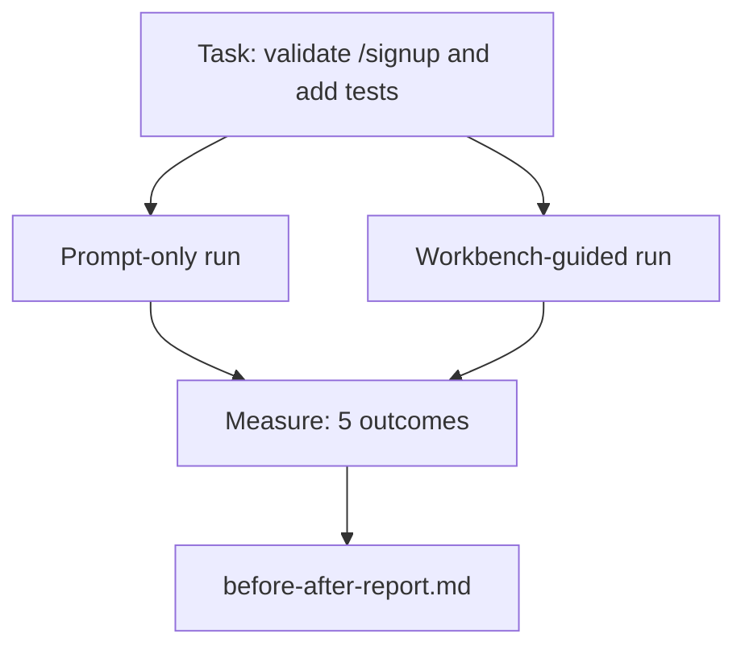

# 把工作台放到真實儲存庫上

> 十一課的表面，如果撐不過跟真實程式庫的接觸，就一文不值。這一課在一個小型範例應用上把同一項任務跑兩次：只有提示詞，對上有工作台引導。讓數字去吵。

**類型：** 建構
**程式語言：** Python (stdlib)
**先修單元：** 階段 14 · 32 到 14 · 40
**時間：** 約 60 分鐘

## 學習目標

- 在一個小型應用上把七個工作台表面湊在一起。
- 把同一項任務跑兩次（只有提示詞、有工作台引導），並量測五項結果。
- 讀那份前後對照報告，判斷哪些表面帶來最大的槓桿。
- 面對「可是我的模型夠好了」這種反推時，替工作台辯護。

## 問題所在

在玩具任務上的示範說服不了任何人。工作台的論據，是在一項有真實感的任務、跑在一個有真實感的儲存庫上，最後以更少的失敗、更少的還原，以及一份下個工作階段用得上的封包進到生產環境時，才成立的。

這一課出貨那個有真實感的儲存庫，並讓同一項任務走過兩條管線。結果是一份你可以交給懷疑論者的前後對照報告。

## 核心概念



### 那個範例應用

`sample_app/` 裡一支最小的 FastAPI 式處理器：

- `app.py`，含 `/signup`（還沒有驗證）。
- `test_app.py`，含一個順利路徑的測試。
- `README.md` 與 `scripts/release.sh` 當作禁區的誘餌。

### 那項任務

> 替 `/signup` 加上輸入驗證：拒絕短於 8 個字元的密碼，並以帶型別的錯誤封套回傳 422。加一個測試證明這個新行為。

### 兩條管線

只有提示詞：

1. 讀 README。
2. 讀 `app.py`。
3. 編輯檔案。
4. 宣稱完成。

有工作台引導：

1. 跑初始化腳本（第 35 課）。
2. 讀範圍契約（第 36 課）。
3. 讀狀態（第 34 課）。
4. 只編輯被允許的檔案。
5. 透過回饋執行器跑驗收指令（第 37 課）。
6. 跑查證閘門（第 38 課）。
7. 跑審查者（第 39 課）。
8. 產生交接（第 40 課）。

### 量測的那五項結果

| 結果 | 為什麼要緊 |
|---------|----------------|
| `tests_actually_run` | 多數「測試通過了」的宣稱是無法查證的 |
| `acceptance_met` | 證明目標的那個測試，必須就是跑過的那個測試 |
| `files_outside_scope` | 範圍蔓延是最主要的無聲失敗 |
| `handoff_quality` | 下個工作階段要為它付錢，或從它得利 |
| `reviewer_total` | 疊在閘門之上的質性判斷 |

```figure
wb-ab-runs
```

## 建構它

`code/main.py` 對同一份範例應用固定樣本，編排那兩條管線。兩條管線都是腳本化的（迴圈裡沒有 LLM），好讓量測可重現。這支腳本把比較寫進 `before-after-report.md` 與 `comparison.json`。

跑它：

```
python3 code/main.py
```

輸出：一張逐管線結果的主控台表格、存在腳本旁邊的 markdown 報告，以及給想畫圖的人用的 JSON。

## 野地裡的生產模式

懷疑論者的問題是「工作台到底幫了多少？」2026 年的數字說的比解釋多得多。

**同一個模型，Terminal Bench 從前 30 名外到前 5 名。** LangChain 的《Anatomy of an Agent Harness》（2026 年 4 月）：一個寫程式代理光是換 harness，就在 Terminal Bench 2.0 上從前 30 名外跳到第五名。同樣的模型。不同的表面。二十五名的落差。

**Vercel 靠刪工具從 80% 到 100%。** Vercel 回報刪掉代理 80% 的工具後，成功率從 80% 拉到 100%。更小的工具表面、更銳利的範圍、更少失敗的方式。負空間勝出。

**Harvey 光靠 harness 就讓準確率翻倍。** 法律代理透過 harness 最佳化把準確率翻了不只一倍，模型沒換。

**88% 的企業 AI 代理專案沒能進到生產。** preprints.org 那篇《Harness Engineering for Language Agents》（2026 年 3 月）把失敗追溯到執行環境，不是推理：過期狀態、脆弱的重試、過度膨脹的脈絡、對中途錯誤的復原不良。

**長脈絡崩塌。** WebAgent 基線 40-50% 的成功率，在長脈絡條件下掉到 10% 以下，主要來自無窮迴圈與目標遺失。Ralph Loop 與交接封包存在的意義，就是去吸收那件事。

**偽陰性仍然存在。** 單步的事實性任務、一行的 lint、跑格式化工具，以及任何模型已經一字不差記住的東西 —— 這些只用提示詞跑得更快。基準應該誠實地把它們列出來，工作台才不會被說成是殺雞用牛刀。

該帶走的重點不是「harness 永遠贏」。模型確實會隨時間吸收掉 harness 的那些招數。該帶走的是：在今天，工程的重量落在那七個表面上，而數字證明了這件事。

## 框架應用

這一課是你在以下場合會引用的案卷：

- 有人問為什麼每個 PR 都帶一份 `agent-rules.md` 與一份範圍契約。
- 某個團隊想「就這個衝刺」把查證閘門拿掉。
- 一個新的代理產品發布，而你需要一份可攜的基準來判斷它是否真的省時間。

數字傳得比解釋遠。

## 產出交付

`outputs/skill-workbench-benchmark.md` 是一份可攜的評測執行框架，會拿任何代理產品、對著某專案自己的範例應用走過兩條管線，並回報那五項結果。

## 練習

1. 加第六項結果：到第一次有意義編輯的時間。你要怎麼乾淨地量它？
2. 在你程式庫裡一項真正的「第二天」任務上跑這份比較。工作台的數字在哪裡滑掉？
3. 加一趟「偽陰性」檢查：那些只用提示詞會更快、而工作台的開銷是真實成本的任務。就算如此，也替保留工作台辯護。
4. 把那個腳本化的「代理」換成真正的 LLM 呼叫。哪些結果變得更吵？
5. 寫一份給非工程師看的一頁摘要。什麼撐得過刪減？

## 關鍵術語

| 術語 | 大家怎麼說 | 實際是什麼意思 |
|------|----------------|------------------------|
| 範例應用 | 「玩具儲存庫」 | 小，但真實到足以操練全部七個表面 |
| 管線 | 「工作流」 | 代理依循的、有順序的表面讀寫序列 |
| 前後對照報告 | 「那些收據」 | 你交給懷疑論者的那份產物 |
| 偽陰性 | 「工作台殺雞用牛刀」 | 只用提示詞更快的任務；誠實列出來很有用 |
| 工作台基準 | 「可靠性分數」 | 在你程式庫上跑這份比較的可攜執行框架 |

## 延伸閱讀

- [LangChain, The Anatomy of an Agent Harness](https://blog.langchain.com/the-anatomy-of-an-agent-harness/) —— Terminal Bench 前 30 名外到前 5 名的那張收據
- [MongoDB, The Agent Harness: Why the LLM Is the Smallest Part of Your Agent System](https://www.mongodb.com/company/blog/technical/agent-harness-why-llm-is-smallest-part-of-your-agent-system) —— Vercel + Harvey 的數字
- [preprints.org, Harness Engineering for Language Agents](https://www.preprints.org/manuscript/202603.1756) —— 88% 的企業失敗率、執行環境的根因
- [HN: Improving 15 LLMs at Coding in One Afternoon. Only the Harness Changed](https://news.ycombinator.com/item?id=46988596) —— 在 15 個模型上重現
- [Cloudflare, Orchestrating AI Code Review at Scale](https://blog.cloudflare.com/ai-code-review/) —— 生產環境中 30 天 13.1 萬次審查執行
- [Anthropic, Building Effective Agents](https://www.anthropic.com/research/building-effective-agents)
- 階段 14 · 32 到 14 · 40 —— 這一課端到端操練的那些表面
- 階段 14 · 19 —— SWE-bench、GAIA、AgentBench，本課所互補的那些宏觀基準
- 階段 14 · 30 —— 同一套執行框架接得上的評測驅動代理開發
