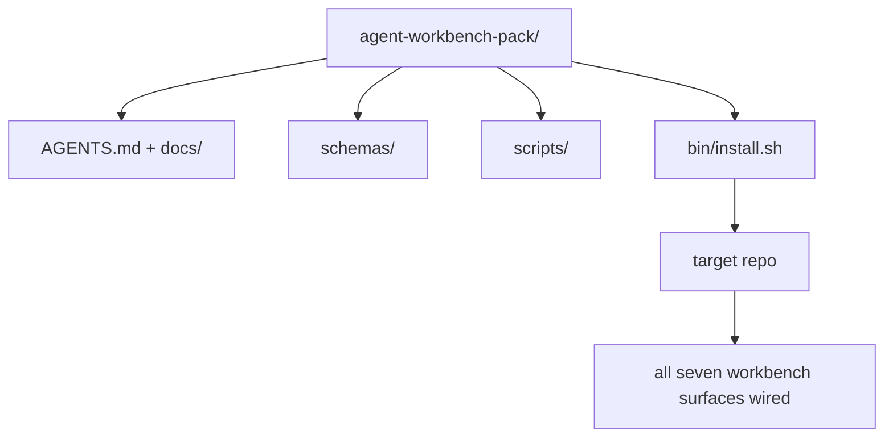

# 總結專案：出貨一份可重用的代理工作台套件

> 這條小支線以一份你可以丟進任何儲存庫的套件收尾。十一課的表面壓縮成一個你可以 `cp -r` 的目錄，隔天早上代理就能可靠地工作。這份總結專案就是本課程賴以立足的那份產物。

**類型：** 建構
**程式語言：** Python (stdlib)
**先修單元：** 階段 14 · 31 到 14 · 41
**時間：** 約 75 分鐘

## 學習目標

- 把七個工作台表面打包成一個可直接丟進去的目錄。
- 把 schema、腳本與樣板釘住，好讓新儲存庫拿到一份已知良好的基線。
- 加上單一支安裝腳本，冪等地把這份套件鋪下去。
- 決定什麼留在套件裡、什麼留在外面，並替每一項取捨辯護。

## 問題所在

一個住在 Google Doc、聊天歷史，加三支只記得一半的腳本裡的工作台，就是一個每季都要重蓋一次的工作台。解藥是一份有版本的套件：一個帶著那些表面、schema、腳本，以及一鍵安裝器的儲存庫或目錄。

這一課結束時，你會在磁碟上有一份出貨好的 `outputs/agent-workbench-pack/`，以及一支能把它丟進任何目標儲存庫的 `bin/install.sh`。

## 核心概念



### 套件的版面

```
outputs/agent-workbench-pack/
├── AGENTS.md
├── docs/
│   ├── agent-rules.md
│   ├── reliability-policy.md
│   ├── handoff-protocol.md
│   └── reviewer-rubric.md
├── schemas/
│   ├── agent_state.schema.json
│   ├── task_board.schema.json
│   └── scope_contract.schema.json
├── scripts/
│   ├── init_agent.py
│   ├── run_with_feedback.py
│   ├── verify_agent.py
│   └── generate_handoff.py
├── bin/
│   └── install.sh
└── README.md
```

### 什麼留在裡面、什麼留在外面

裡面：

- 各表面的 schema。它們就是契約。
- 上面那四支腳本。它們就是執行環境。
- 那四份文件。它們就是規則與評分準則。

外面：

- 專案專屬的任務。任務屬於目標儲存庫的板子，不屬於套件。
- 廠商 SDK 的呼叫。這份套件與框架無關。
- 新人上手的散文。套件住在團隊既有的上手文件旁邊，不住在它裡面。

### 那個安裝器

一支簡短的 `bin/install.sh`（或 `bin/install.py`）：

1. 若已存在套件，沒有 `--force` 就拒絕覆蓋安裝。
2. 把套件複製到目標儲存庫。
3. 若存在 `.github/workflows/` 就把 CI 接起來。
4. 印出後續步驟：填板子、設驗收指令、跑初始化腳本。

### 版本控管

套件帶一個 `VERSION` 檔。需要遷移的 schema 進位與腳本變更會提升主版號。只改文件的變更提升修訂號。目標儲存庫的 `agent_state.json` 會記下它是對著哪個套件版本初始化的。

## 建構它

`code/main.py` 會把套件組裝到課程旁邊的 `outputs/agent-workbench-pack/`，並以這條小支線先前各課的 schema 與腳本、加上你已經寫好的那些文件來播種。

跑它：

```
python3 code/main.py
```

這支腳本會複製並釘住那些表面、寫出 README、印出套件的目錄樹，然後以零離開。重跑是冪等的。

## 野地裡的生產模式

一份套件只有在撐得過 fork、更新，以及不友善的上游時才有價值。有四種模式讓這件事成立。

**`VERSION` 是契約，不是行銷。** 主版號進位需要一次狀態遷移。次版號進位需要重跑檢查器。修訂號進位只改文件。安裝器每次安裝都會把 `.workbench-version` 寫進目標儲存庫；若目標的 lock 與套件的 `VERSION` 不一致，`lint_pack.py` 就拒絕出貨。`npm`、`Cargo` 與 `pyproject.toml` 就是這樣撐過十年動盪的；代理這件事沒有改變任何規則。

**跨工具散布用單一來源。** Nx 出貨一支 `nx ai-setup`，從單一設定檔鋪下 `AGENTS.md`、`CLAUDE.md`、`.cursor/rules/`、`.github/copilot-instructions.md` 與一台 MCP 伺服器。套件也該這麼做；安裝器產出那些符號連結（`ln -s AGENTS.md CLAUDE.md`），好讓單一真值來源扇出到每個寫程式代理。為了偏袒某個工具而 fork 套件，是一種失敗模式。

**`uninstall.sh` 遇到非瑣碎狀態要拒絕。** 移除套件絕不能刪掉使用者的 `agent_state.json`、`task_board.json` 或 `outputs/`。解除安裝器移除 schema、腳本、文件與 `AGENTS.md`（可用 `--keep-agents-md` 選擇不移除），並在狀態檔有任何未提交變更時拒絕繼續。狀態屬於使用者；套件並不擁有它。

**技能即可發布物。SkillKit 式的散布。** 這份套件以 SkillKit 技能出貨：`skillkit install agent-workbench-pack` 就能從單一來源把它鋪到 32 種 AI 代理上。套件儲存庫是真值來源；SkillKit 是散布通道。廠商綁定塌掉；那七個表面維持不變。

## 框架應用

套件出貨的三個地方：

- **當成一個你丟進儲存庫的目錄。** `cp -r outputs/agent-workbench-pack /path/to/repo`。
- **當成一個公開的樣板儲存庫。** fork 之後客製，由 `VERSION` 控管漂移。
- **當成一項 SkillKit 技能。** 接進你的代理產品，讓單一指令就把它鋪好。

套件是那份食譜。每次安裝是一客成品。

## 產出交付

`outputs/skill-workbench-pack.md` 會產出一份依專案調校過的套件：規則依團隊的歷史磨利、範圍 glob 與該儲存庫對齊、評分準則的維度多加一條領域專屬的條目。

## 練習

1. 決定哪一份選配的第五份文件值得升格進正典套件。替你的取捨辯護。
2. 把安裝器改寫成帶 `--dry-run` 旗標的 Python。跟 bash 版比較人體工學。
3. 加一支 `bin/uninstall.sh`，安全地移除套件，並在狀態檔有非瑣碎歷史時拒絕。什麼算非瑣碎？
4. 加一支 `lint_pack.py`，當套件與 `VERSION` 漂移時就失敗。把它接進套件自己那個儲存庫的 CI。
5. 撰寫從手搓工作台遷移到這份套件的維運手冊。什麼樣的操作順序能把停機時間壓到最低？

## 關鍵術語

| 術語 | 大家怎麼說 | 實際是什麼意思 |
|------|----------------|------------------------|
| 工作台套件 | 「入門套組」 | 一個帶齊七個表面、有版本的目錄 |
| 安裝器 | 「設定腳本」 | 冪等地把套件鋪下去的 `bin/install.sh` |
| 套件版本 | 「VERSION」 | schema／腳本變更提主版號，只改文件提修訂號 |
| 可直接丟入的套件 | 「cp -r 就走」 | 第一天就不需要逐儲存庫客製就能運作 |
| 可 fork 的樣板 | 「GitHub 樣板」 | GitHub 的「Use this template」複製得了的公開儲存庫 |

## 延伸閱讀

- 階段 14 · 31 到 14 · 41 —— 這份套件打包的每一個表面
- [SkillKit](https://github.com/rohitg00/skillkit) —— 把這項技能安裝到 32 種 AI 代理上
- [Nx Blog, Teach Your AI Agent How to Work in a Monorepo](https://nx.dev/blog/nx-ai-agent-skills) —— 橫跨六種工具的單一來源產生器
- [agents.md — the open spec](https://agents.md/) —— 你套件裡的路由器必須實作什麼
- [HKUDS/OpenHarness](https://github.com/HKUDS/OpenHarness) —— 等同於套件的參考實作
- [andrewgarst/agentic_harness](https://github.com/andrewgarst/agentic_harness) —— 由 Redis 支撐、帶評測套組的參考實作
- [Augment Code, A good AGENTS.md is a model upgrade](https://www.augmentcode.com/blog/how-to-write-good-agents-dot-md-files) —— 套件文件的品質門檻
- [Anthropic, Effective harnesses for long-running agents](https://www.anthropic.com/engineering/effective-harnesses-for-long-running-agents)
- [Anthropic, Harness design for long-running application development](https://www.anthropic.com/engineering/harness-design-long-running-apps)
- 階段 14 · 30 —— 消費這份套件查證閘門的評測驅動代理開發
- 階段 14 · 41 —— 這份套件所改善的那份前後對照基準
