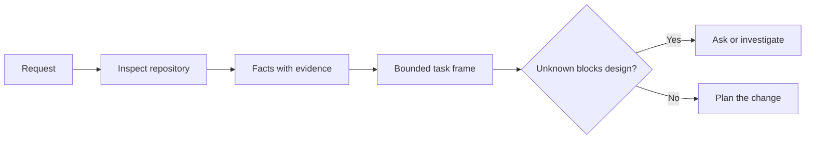

# Frame the Task Before the Agent Writes Code

> A coding agent can implement a clear task quickly. It can also implement an unclear task quickly. The speed is the same. The cost is not.

**Type:** Learn + Build
**Languages:** Python (stdlib)
**Prerequisites:** Phase 14 lessons 31 and 36
**Time:** ~60 minutes

## Learning Objectives

- Turn a request into a bounded task frame before editing.
- Separate repository facts from assumptions and open questions.
- Define allowed paths, forbidden paths, and acceptance evidence.
- Decide when reconnaissance is sufficient to begin work.

## The Expensive Failure

“Add duplicate email protection” sounds specific. It is not. Does uniqueness belong in the API, domain service, or database? Is comparison case-sensitive? Which error shape is already public? Is a migration allowed? Which test proves the behavior?

A capable agent will fill those gaps with plausible choices. That is the dangerous case because the implementation can be clean, tested, and still incompatible with the system.

The first unit of coding-agent work is therefore not an edit. It is a task frame backed by repository evidence.

## The Task Frame

A useful frame has six fields:

| Field | Question |
|---|---|
| Goal | What observable behavior must change? |
| Repository facts | What did you verify in code, tests, config, or history? |
| Allowed paths | Where may the change land? |
| Forbidden paths | What must remain untouched? |
| Acceptance evidence | Which commands or observations prove the goal? |
| Unknowns | Which decisions still need evidence or human judgment? |

Facts need receipts. “The API uses 409 for duplicates” is not a fact until you can point to the existing test or handler. A file path and line is enough. A command result is better when behavior matters.



## Reconnaissance Is a Search for Constraints

Do not read the entire repository. Search for the surfaces that constrain the change:

1. The current behavior and its caller.
2. The closest existing test.
3. The public contract or serialized shape.
4. The project instructions that govern the path.
5. The build and verification commands.
6. Similar completed changes that reveal local patterns.

Stop when every planned decision is either supported by evidence, explicitly delegated, or listed as an unknown. More reading after that point is often avoidance.

## Unknowns Are Not Failures

An unknown is a controlled gap. An assumption is an uncontrolled answer to that gap.

Classify each unknown:

- **Discoverable:** the repository or running system can answer it.
- **Decidable:** the task contract gives the agent authority to choose.
- **Human:** the choice changes product behavior, cost, risk, or public compatibility.
- **Deferred:** the choice is outside this slice and belongs in non-goals.

The agent should continue through discoverable and delegated unknowns. It should pause at human unknowns before the choice is buried in code.

## Acceptance Before Implementation

Write the proof before the patch. The proof can be:

- a focused unit or integration test command;
- a browser journey with a named viewport and expected state;
- a wire request and exact response contract;
- a performance measurement with a threshold;
- a scope check that confirms no unrelated file changed.

“Tests pass” is not a proof plan. Name the authoritative test and the claim it supports.

## Build It

The lab creates a `TaskFrame`, validates its boundaries and evidence, and writes `outputs/task-frame.md`.

Run from this lesson directory:

```bash
python3 code/main.py
python3 -m unittest discover code/tests -v
```

Break the example in four ways: remove the goal, remove a fact receipt, overlap an allowed and forbidden path, and remove the acceptance command. The validator should refuse each frame for a different reason.

## Use It in a Real Repository

Before asking an agent to edit:

1. Write the goal as a behavior, not a file change.
2. Record two or three facts with exact evidence.
3. Name the smallest allowed path set.
4. Name negative space explicitly.
5. Write the command or observation that closes the task.
6. List the decisions you have not earned yet.

The frame should fit on one screen. If it cannot, the task may contain multiple independently verifiable changes.

## Exercises

1. Frame a real bug from one of your repositories without proposing a solution.
2. Find one claim in the frame that is actually an assumption. Replace it with evidence.
3. Add a human unknown whose answer would change the public contract.
4. Split one broad allowed path into the smallest safe set.
5. Add a scope receipt to the acceptance evidence.

## Further Reading

- [Nuseibeh and Easterbrook, Requirements Engineering: A Roadmap](https://www.cs.toronto.edu/~sme/papers/2000/ICSE2000.pdf), for anchoring implementation to real-world goals and evolving constraints.
- [Yang et al., SWE-agent: Agent-Computer Interfaces Enable Automated Software Engineering](https://arxiv.org/abs/2405.15793), for evidence that the interface around a coding agent changes its effectiveness.

## What You Keep

Keep `outputs/task-frame.md`. It is the input to the next lesson, where the frame becomes an evidence-backed execution plan.
