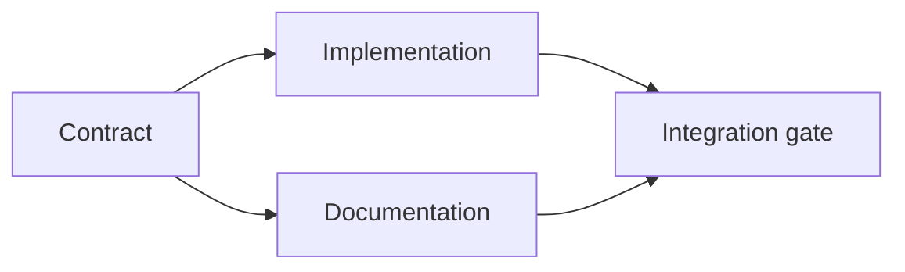

# Build an Evidence-Backed Execution Plan

> A plan is not a prettier to-do list. It is a dependency graph in which every change has a reason and every terminal node has proof.

**Type:** Learn + Build
**Languages:** Python (stdlib)
**Prerequisites:** Phase 14 lesson 43
**Time:** ~65 minutes

## Learning Objectives

- Convert a task frame into work items with evidence and proof.
- Model ordering as dependencies instead of prose sequence.
- Detect missing facts, unknown dependencies, and cycles before editing.
- Separate steps that can run together from steps that must wait.

## Why Agent Plans Fail

Weak plans repeat the request in future tense:

1. Update the API.
2. Add tests.
3. Update documentation.

Nothing in that list says what was found, why those files are correct, which contract changes first, or what can happen concurrently. An agent can follow every step and still create rework.

A strong plan makes five commitments for each work item:

| Commitment | Purpose |
|---|---|
| Identifier | Stable reference for dependencies and handoff |
| Change | The smallest behavior or contract change |
| Evidence | Repository facts that justify the change |
| Dependencies | Work that must be true first |
| Proof | The exact check that closes the item |

## Plan the Contract Before Its Implementations

When multiple surfaces depend on the same behavior, define the behavior first. Tests, implementation, documentation, and integration can then share one contract instead of inventing four versions.



The graph exposes safe concurrency. Implementation and documentation can proceed together after the contract is fixed. Integration waits for both.

## Evidence Changes the Plan

Repository evidence is not decoration. It should be capable of changing the work:

- An existing helper removes a planned new abstraction.
- A compatibility test forces a migration step.
- A deployment constraint moves a schema change into another task.
- A public response type changes the order of implementation and documentation.

If the evidence cannot change the plan, it is probably not evidence for that decision.

## Design for Interruption

Coding-agent sessions end unexpectedly. A resumable plan has work items small enough that another session can determine:

- which item is complete;
- which proof ran;
- which artifacts changed;
- which dependencies are now unblocked;
- what the next safe item is.

Do not encode state only in checked boxes inside a chat. Store the plan next to the work.

## Plan Validation

Reject the plan before execution when:

- an identifier is duplicated;
- a work item has no evidence;
- a work item has no proof;
- a dependency names an unknown item;
- the graph contains a cycle;
- the first irreversible action occurs before the relevant uncertainty is resolved.

The first five checks are mechanical. The last requires judgment and should be called out explicitly.

## Build It

`code/main.py` models work items, validates their receipts, computes execution waves with a topological sort, and writes `outputs/evidence-plan.json`.

Run:

```bash
python3 code/main.py
python3 -m unittest discover code/tests -v
```

The example produces three waves. Contract definition runs first. Implementation and documentation run together. The integration gate runs last.

## Use It with a Coding Agent

Ask the agent to produce the plan before it changes files. Review the plan for three things:

1. Every path and behavior claim has a repository receipt.
2. Every item has one clear completion proof.
3. The graph delays expensive or irreversible work until the uncertainty it depends on is resolved.

Approve the plan, not a vague promise to be careful.

## Exercises

1. Add a migration item that requires explicit human approval.
2. Create a cycle and explain the hidden product disagreement behind it.
3. Split one item that has two proof commands.
4. Add a work item that can run in the second wave without touching either existing branch.
5. Render the plan as Markdown while keeping JSON as the source of truth.

## Further Reading

- [Nuseibeh and Easterbrook, Requirements Engineering: A Roadmap](https://www.cs.toronto.edu/~sme/papers/2000/ICSE2000.pdf), for the iterative relationship between goals, specifications, agreement, and evolution.
- [Barry Boehm, A Spiral Model of Software Development and Enhancement](https://dl.acm.org/doi/10.1145/12944.12948), for ordering development around risk resolution rather than a fixed linear sequence.

## What You Keep

Keep `outputs/evidence-plan.json`. It becomes the delegation contract in the next lesson.
