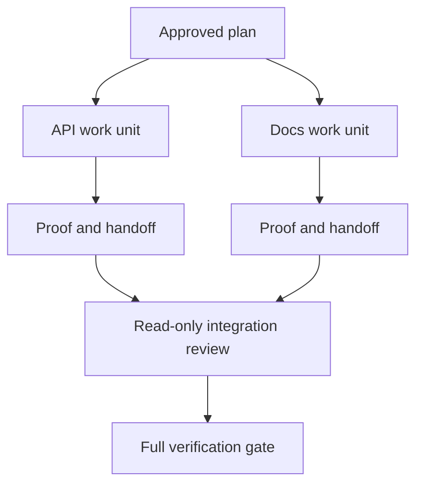

# Delegate Agent Work with Isolation and Merge Contracts

> Parallel agents save wall time only when the work is independent. Otherwise they convert one clear task into a coordination problem with a faster failure rate.

**Type:** Learn + Build
**Languages:** Python (stdlib)
**Prerequisites:** Phase 14 lessons 39 and 44
**Time:** ~70 minutes

## Learning Objectives

- Decide whether delegation is justified by real independence.
- Give each worker exclusive file ownership and explicit proof.
- Compute execution waves from dependencies.
- Design a merge contract for combining agent work safely.

## The Parallelism Test

Do not delegate because more agents are available. Delegate when at least one of these is true:

- two investigations can answer different unknowns independently;
- two implementations own disjoint files and contracts;
- a reviewer can inspect a completed artifact without changing it;
- a slow external check can run while local work continues.

Keep work serial when agents need the same files, the same unresolved decision, or the same mutable environment.

## A Work Unit Is a Contract

Each delegated unit needs:

| Field | Meaning |
|---|---|
| Goal | One observable result |
| Owner | One accountable worker |
| Paths | Exclusive write ownership |
| Dependencies | Completed units required before starting |
| Proof | Exact evidence returned to the integrator |
| Handoff | Files changed, decisions made, remaining risk |

“Handle the backend” is not a work unit. “Implement the duplicate check in `app/accounts.py` and prove it with the focused account test” is.

## Isolation Has Three Layers

1. **Filesystem isolation:** separate worktrees or sandboxes prevent accidental shared edits.
2. **Ownership isolation:** contracts prevent two workers from intentionally editing the same path.
3. **State isolation:** separate logs and outputs prevent one worker from overwriting another worker’s evidence.

Filesystem isolation does not solve ownership. Two clean worktrees can still produce conflicting designs. The merge contract must resolve shared interfaces before work begins.



## The Integrator Does Not Rebuild the Work

The integrator should:

1. confirm each handoff matches its assigned scope;
2. read the proof output, not just the worker’s summary;
3. combine changes in dependency order;
4. run the full cross-unit gate;
5. reject hidden scope expansion;
6. record conflicts as new decisions, not silent edits.

If integration requires rewriting most of a worker’s result, the original decomposition was wrong.

## Human and Agent Roles

Delegation does not remove human judgment. The human still owns choices that change public behavior, risk, authority, or irreversible cost. Agents can own bounded investigation, implementation, verification, and review.

This is calibrated autonomy: the system grants freedom where evidence and rollback are strong, and requires a checkpoint where consequence is high.

## Build It

The lab checks path overlap, validates dependencies, computes safe execution waves, and writes `outputs/delegation-plan.json`.

Run:

```bash
python3 code/main.py
python3 -m unittest discover code/tests -v
```

Change the docs unit to own `app/`. The plan should block because that parent path overlaps the API unit.

## Exercises

1. Decompose a real change into two independent work units and one integrator.
2. Find a proposed parallel split that only looks independent. State the shared decision.
3. Add a read-only research worker whose output is a fact table.
4. Add a merge gate that checks the final changed-file set against all unit contracts.
5. Define a cancellation rule for a worker whose dependency becomes invalid.

## Further Reading

- [Reid Smith, The Contract Net Protocol](https://doi.org/10.1109/TC.1980.1675516), for an early formal treatment of distributed task allocation and result reporting.
- [Eric Horvitz, Principles of Mixed-Initiative User Interfaces](https://dl.acm.org/doi/10.1145/302979.303030), for deciding when automation should act and when it should return control to a person.

## What You Keep

Keep `outputs/delegation-plan.json`. It records why the split is safe, who owns each path, and what proof integration must receive.
