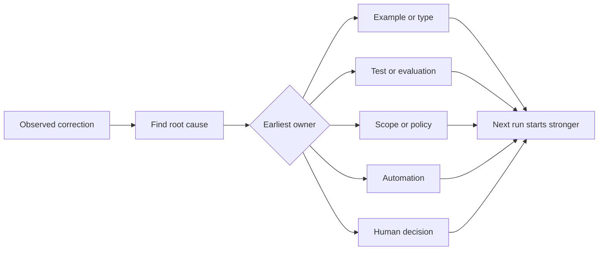

# Turn Every Agent Correction into a System Improvement

> A correction that lives only in chat fixes one run. A correction promoted into a test, boundary, example, or tool improves every later run.

**Type:** Learn + Build
**Languages:** Python (stdlib)
**Prerequisites:** Phase 14 lessons 37 to 41
**Time:** ~65 minutes

## Learning Objectives

- Convert agent corrections into durable controls.
- Place each control at the earliest layer that can prevent recurrence.
- Deduplicate repeated lessons with stable fingerprints.
- Retire controls that no longer protect a real risk.

## Corrections Are Evidence

When you tell an agent “do not edit that file,” you have learned that the scope boundary was not executable. When you say “this output shape is wrong,” you have learned that an example or test was missing. When setup fails again, you have learned that environment knowledge belongs in automation.

Treat the correction as an observation about the work system, not as a prompt-writing failure.

## Promote to the Earliest Effective Layer

Use this order:

| Recurring failure | Durable destination |
|---|---|
| Wrong result or regression | Test or evaluation |
| Off-scope or unsafe action | Scope or permission policy |
| Repeated setup or command mistake | Automation or tool |
| Repeated output-format mistake | Canonical example plus validator |
| Ambiguous local convention | Instruction with a scenario check |
| Product disagreement | Human decision record |

Earlier controls are cheaper. A type that prevents an invalid state is stronger than a review comment that catches it later. A focused test is stronger than a paragraph asking the agent to remember.



## The Ratchet Record

Capture:

- symptom;
- root cause;
- consequence;
- recurrence count;
- chosen control;
- verification for the control;
- owner;
- date to review or retire it.

Do not promote every one-off preference. Promote a correction when recurrence or consequence justifies permanent complexity.

## Separate Cause from Symptom

“The agent edited README” is a symptom. Possible causes include:

- the task allowed the repository root;
- docs were implicitly considered safe;
- the plan bundled implementation and documentation;
- two workers had overlapping ownership.

Each cause belongs to a different control. A rule that merely repeats the symptom will fail in the next slightly different case.

## Controls Also Decay

Old controls can conflict, bloat context, and encode a system that no longer exists. Every promoted rule needs a retirement check. Remove or rewrite it when:

- the underlying architecture changed;
- a stronger executable control replaced it;
- the failure has not recurred across a meaningful window;
- the control creates more friction than the risk it prevents.

The goal is not the longest instruction file. It is the smallest system that preserves hard-won judgment.

## Build It

The lab classifies corrections, promotes them into controls, fingerprints duplicates, and writes `outputs/feedback-ratchet.json`.

Run:

```bash
python3 code/main.py
python3 -m unittest discover code/tests -v
```

Add two differently worded corrections with the same cause. Improve the normalization until they collapse into one control without collapsing unrelated failures.

## Exercises

1. Take five corrections from a recent coding session and classify their real owners.
2. Replace one prose rule with an executable test.
3. Add consequence weighting so a severe first occurrence can be promoted immediately.
4. Add an owner and retirement date to the lab output.
5. Review one existing agent instruction and delete it only after proving a stronger control exists.

## Further Reading

- [Basili, Caldiera, and Rombach, The Goal Question Metric Approach](https://www.cs.toronto.edu/~sme/CSC444F/handouts/GQM-paper.pdf), for turning goals into questions and operational measurements.
- [Shinn et al., Reflexion](https://arxiv.org/abs/2303.11366), for using feedback traces to improve later decisions without changing model weights.
- [Madaan et al., Self-Refine](https://arxiv.org/abs/2303.17651), for iterative feedback and revision inside a task loop.

## What You Keep

Keep `outputs/feedback-ratchet.json`. It is the durable end of the Agent-Assisted Engineering path and the input to future workbench changes.
