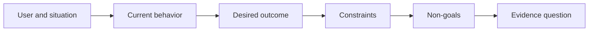

# Define the Outcome Before You Choose the Output

> Fast implementation increases the penalty for choosing the wrong problem. Shape the outcome first so speed points in the right direction.

**Type:** Learn + Build
**Languages:** Python (stdlib)
**Prerequisites:** None
**Time:** ~60 minutes

## Learning Objectives

- Write an outcome frame without naming a solution.
- Identify the user, situation, current behavior, and desired change.
- Make constraints and non-goals explicit.
- Detect solution leakage before it hardens into scope.

## Output Is Not Outcome

“Build an incident assistant” names an output. It does not say who needs it, what becomes better, or what must remain safe.

An outcome frame says:

> When a production alert arrives, the on-call engineer identifies the failing service and a safe next action within two minutes, while diagnosis remains read-only and auditable.

That sentence can be satisfied by software, a runbook, a data repair, or a smaller interface change. It keeps the team attached to the result rather than the first artifact someone imagined.

## The Six-Part Frame

| Part | Question |
|---|---|
| User | Who experiences the problem directly? |
| Situation | When and where does it occur? |
| Current behavior | What happens today, including workarounds? |
| Desired outcome | What observable state should improve? |
| Constraints | Which safety, policy, cost, or compatibility limits are fixed? |
| Non-goals | What tempting adjacent work is excluded? |



## Find Solution Leakage

Outcome statements leak solutions when they contain a product form, interface, model choice, framework, or architecture that has not been earned by evidence.

- “Users receive a weekly AI summary” leaks the summary and cadence.
- “Users understand account changes before approval” states the result.
- “Deploy a vector database” leaks infrastructure.
- “Relevant policy evidence is available during review” states a capability.

Constraints can name technology when compatibility truly fixes it. Record why it is fixed.

## Constraints Protect the Outcome

Constraints are not implementation details. They are part of the real-world goal:

- no production writes during diagnosis;
- response within the incident time budget;
- existing audit events remain authoritative;
- no new runtime dependency;
- accessibility behavior remains intact.

A build that reaches the outcome by violating a constraint has not reached the outcome.

## Non-Goals Create a Boundary

Non-goals prevent a useful slice from turning into a platform. Good non-goals are concrete enough to reject work:

- no automatic remediation;
- no new alert-routing system;
- no replacement of the incident commander;
- no historical analytics in this slice.

## Build It

The lab validates an `OutcomeFrame` and writes `outputs/outcome-frame.json`.

```bash
python3 code/main.py
python3 -m unittest discover code/tests -v
```

Replace the desired outcome with “use the incident assistant.” The validator should flag that the proposed output leaked into the outcome.

## Exercises

1. Rewrite a feature request from your backlog as an outcome frame.
2. Add one constraint that changes which solutions remain possible.
3. Add two non-goals that keep the first slice small.
4. Identify the earliest observation that would disprove the desired outcome.
5. Write three different outputs that could satisfy the same outcome.

## Further Reading

- [Nuseibeh and Easterbrook, Requirements Engineering: A Roadmap](https://www.cs.toronto.edu/~sme/papers/2000/ICSE2000.pdf), for treating real-world goals as the anchor for software work.
- [Dardenne, van Lamsweerde, and Fickas, Goal-Directed Requirements Acquisition](https://doi.org/10.1016/0167-6423(93)90021-G), for refining high-level goals into constraints and operational requirements.

## What You Keep

Keep `outputs/outcome-frame.json`. The next lesson tests it against the workflow people actually perform.
