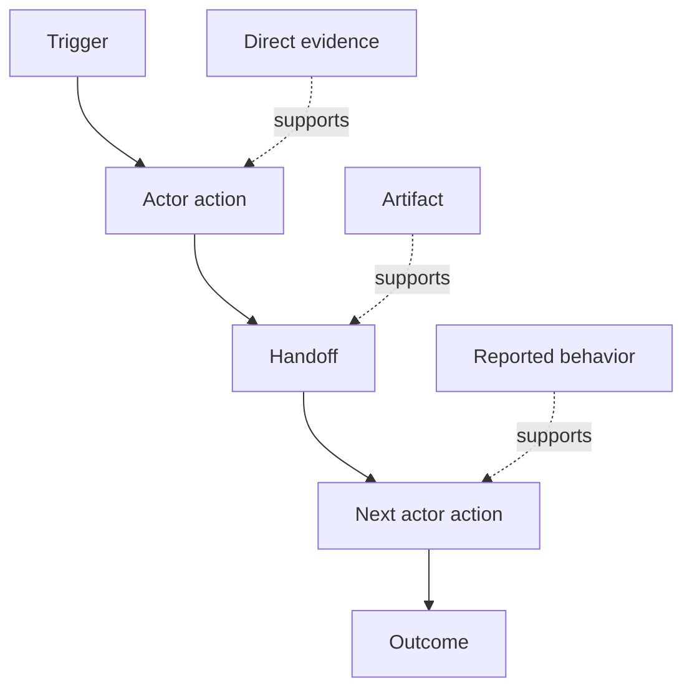

# Discover the Workflow People Actually Perform

> Requirements are not waiting in a meeting to be collected. They are scattered across actions, workarounds, records, and disagreements.

**Type:** Learn + Build
**Languages:** Python (stdlib)
**Prerequisites:** Phase 14 lesson 47
**Time:** ~70 minutes

## Learning Objectives

- Model the current workflow as ordered actions with evidence.
- Separate direct observation from reported or inferred behavior.
- Locate friction, handoffs, authority, and hidden state.
- Keep uncertain claims visible instead of turning them into requirements.

## Start with the Current System

Do not begin by asking what features people want. Begin by reconstructing what happens now.

For each step, record:

| Field | Example |
|---|---|
| Actor | On-call engineer |
| Trigger | Production alert arrives |
| Action | Opens alert, then searches dashboards |
| Input | Alert payload and deployment record |
| Output | Candidate service and owner |
| Friction | Context switching across three tools |
| Authority | Incident commander approves a write |
| Evidence | Screen recording, incident log, runbook |

The workflow is larger than the screen. It includes waiting, copy-paste, side channels, approval, error recovery, and the steps people have stopped noticing.

## Evidence Has Strength

Use a simple evidence ladder:

1. **Direct behavior:** observation, trace, recording, or system event.
2. **Artifact:** ticket, runbook, log, form, or completed output.
3. **Reported behavior:** a person describes what they do.
4. **Inference:** the team concludes what probably happens.

All four can be useful. Only the first two prove current behavior directly. Label the rest so confidence does not silently inflate.



## Search for Four Things

- **Friction:** repeated effort, delay, re-entry, or recovery.
- **Hidden state:** facts carried in memory, chat, or personal notes.
- **Authority:** the person or system allowed to make a consequential change.
- **Exceptions:** the case where the normal workflow stops being normal.

AI features often fail at handoffs and exceptions because the happy path was the only path shaped.

## Do Not Average Away Disagreement

Two users can perform different workflows for good reasons. Preserve the variants until you understand whether they represent:

- different roles;
- different risk levels;
- legacy and current process;
- expertise differences;
- a genuine policy disagreement.

An averaged workflow can describe nobody.

## Build It

The lab stores evidence on every workflow step, validates ordering and confidence, calculates the direct-evidence ratio, and writes `outputs/workflow-evidence.json`.

```bash
python3 code/main.py
python3 -m unittest discover code/tests -v
```

Add an exception path in which the deployment record is missing. Keep the main order intact and record where the branch begins.

## Exercises

1. Reconstruct one workflow from a log without interviewing anyone.
2. Interview a user and mark every claim that still lacks direct evidence.
3. Add one authority boundary and one failure-recovery step.
4. Model two workflow variants without merging them.
5. Identify a proposed feature that removes a visible step but leaves hidden work untouched.

## Further Reading

- [Nuseibeh and Easterbrook, Requirements Engineering: A Roadmap](https://www.cs.toronto.edu/~sme/papers/2000/ICSE2000.pdf), especially its treatment of elicitation as interpretation, modelling, and validation rather than simple capture.
- [Gotel and Finkelstein, An Analysis of the Requirements Traceability Problem](https://doi.org/10.1109/ICRE.1994.292398), for the difficulty of preserving the relationship between requirements and their sources.

## What You Keep

Keep `outputs/workflow-evidence.json`. It turns observed friction and uncertainty into an assumption map in the next lesson.
