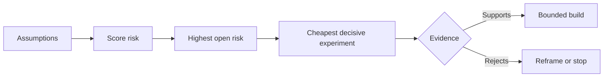

# Map Assumptions and Resolve the Riskiest One First

> A roadmap hides uncertainty inside features. An assumption map exposes what must be true before those features deserve to exist.

**Type:** Learn + Build
**Languages:** Python (stdlib)
**Prerequisites:** Phase 14 lesson 48
**Time:** ~65 minutes

## Learning Objectives

- Convert proposed work into explicit assumptions.
- Score impact, uncertainty, and irreversibility separately.
- Choose the next experiment by risk, not enthusiasm.
- Replace tested assumptions with evidence and decisions.

## Every Build Contains Bets

An incident tool may depend on all of these being true:

- alert context contains enough information to identify a service;
- engineers trust a recommendation they did not derive themselves;
- the desired response time matters operationally;
- required data can be accessed without unsafe authority;
- the workflow happens often enough to justify maintenance.

These are not implementation tasks. They are conditions for the build to be valuable, usable, feasible, and safe.

## Assumption Classes

| Class | Question |
|---|---|
| Value | Will the outcome matter enough? |
| Usability | Can the user understand and act on it? |
| Feasibility | Can the system produce it with available data and constraints? |
| Viability | Can the organization sustain cost, ownership, and operation? |
| Safety | Can it fail without unacceptable consequence? |

Write assumptions as falsifiable statements. “The feature is useful” cannot be tested. “Eight of ten on-call engineers identify the correct service faster with the read-only result” can.

## Risk Is Not One Number

The lab uses three dimensions from one to five:

- **Impact:** damage if the assumption is false.
- **Uncertainty:** weakness of current evidence.
- **Irreversibility:** cost of learning after commitment.

The example score multiplies impact and uncertainty, then adds irreversibility. The formula is not universal. Its purpose is to force the team to state why one unknown should be resolved before another.



## Design an Experiment, Not a Confirmation Ritual

A useful test has:

- a claim that could be false;
- a population or realistic sample;
- an observable result;
- a threshold decided before the result;
- a next decision for pass, fail, and ambiguous evidence.

Avoid tests that only demonstrate that the team can build the idea.

## Reversibility Changes Order

High-consequence, irreversible choices need earlier evidence. A read-only replay can precede a production integration. A temporary adapter can precede a data migration. A human-approved recommendation can precede automatic action.

The shape of the build should follow the shape of uncertainty.

## Build It

The lab ranks assumptions, distinguishes tested from open claims, selects the highest open risk, and writes `outputs/assumption-map.json`.

```bash
python3 code/main.py
python3 -m unittest discover code/tests -v
```

Change the evidence on the highest-risk assumption and observe how the next experiment changes.

## Exercises

1. Write five assumptions for a feature you want to build.
2. Add one safety assumption that your feature list omitted.
3. Define a threshold that would cause you to stop the build.
4. Replace one large experiment with a cheaper decisive test.
5. Compare risk ranking with roadmap priority and explain the mismatch.

## Further Reading

- [Barry Boehm, A Spiral Model of Software Development and Enhancement](https://dl.acm.org/doi/10.1145/12944.12948), for a risk-driven development cycle that resolves uncertainty before deeper commitment.
- [Dardenne, van Lamsweerde, and Fickas, Goal-Directed Requirements Acquisition](https://doi.org/10.1016/0167-6423(93)90021-G), for refining goals while surfacing obstacles and constraints.

## What You Keep

Keep `outputs/assumption-map.json`. The next lesson uses it to choose the smallest slice that can produce decisive evidence.
