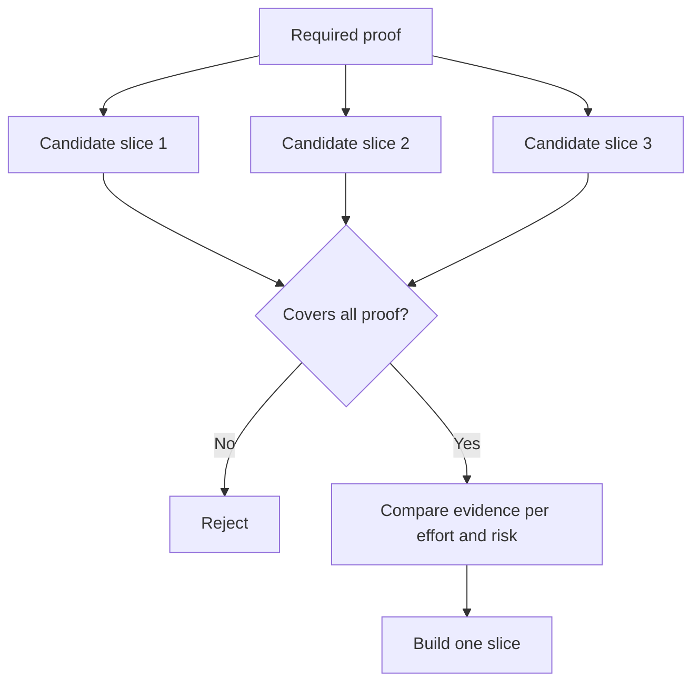

# Choose the Smallest Slice That Can Change the Decision

> Small is useful only when it proves something important. A tiny build that cannot change the next decision is merely incomplete.

**Type:** Learn + Build
**Languages:** Python (stdlib)
**Prerequisites:** Phase 14 lesson 49
**Time:** ~65 minutes

## Learning Objectives

- Define a slice by the assumptions it proves.
- Balance outcome value, uncertainty reduction, effort, and consequence.
- Prefer reversible evidence over premature production commitment.
- Reject slices that omit the risky part of the workflow.

## Vertical Means Evidence End to End

A useful slice crosses the minimum real workflow needed to observe an outcome. It can be narrow in users, data, duration, and capability. It should not be narrow by removing the exact uncertainty you need to test.

Examples:

- A read-only replay across ten real incidents tests service identification and operator trust.
- A polished dashboard on synthetic data may test comprehension but not data feasibility.
- A production auto-remediator tests everything at once with unacceptable consequence.

## Define Required Proof First

Take the highest-risk open assumptions and turn them into a required proof set. A candidate slice is eligible only if it covers that set.

Then compare eligible slices on:

| Dimension | Direction |
|---|---|
| Outcome value | More is better |
| Uncertainty reduced | More is better |
| Effort | Less is better |
| Consequence | Less is better |
| Reversibility | More is better |

The lab’s score is intentionally simple. The eligibility gate matters more than the arithmetic.



## Common False Minimums

- **The UI-only minimum:** removes the data and operational uncertainty.
- **The infrastructure-only minimum:** proves technical possibility without user value.
- **The happy-path minimum:** omits the exception that creates most risk.
- **The demo minimum:** produces a persuasive artifact but no repeatable measurement.
- **The platform minimum:** builds reusable machinery before one workflow earns it.

## Add a Stop Rule

Before implementation, write what happens if the slice fails:

- abandon the outcome;
- change the target user or situation;
- test a different mechanism;
- collect better evidence;
- narrow authority further.

If every result leads to “keep building,” the slice is not an experiment.

## Build It

The lab filters candidates by required proof, scores eligible slices, and writes `outputs/slice-decision.json`.

```bash
python3 code/main.py
python3 -m unittest discover code/tests -v
```

Add a cheaper candidate that proves only one required assumption. It should remain ineligible even if its numerical score is high.

## Exercises

1. Design three slices for the same outcome at different consequence levels.
2. State the required proof set before scoring them.
3. Remove one capability while preserving the decisive evidence.
4. Add a stop rule for a failed pilot.
5. Identify a reusable platform component that should wait until after the slice.

## Further Reading

- [Barry Boehm, A Spiral Model of Software Development and Enhancement](https://dl.acm.org/doi/10.1145/12944.12948), for matching each development cycle to the risks it must resolve.
- [Lenarduzzi and Taibi, MVP Explained: A Systematic Mapping Study on the Definitions of Minimal Viable Product](https://arxiv.org/abs/1609.07592), for the ambiguity around “minimum” and “viable” in software product practice.

## What You Keep

Keep `outputs/slice-decision.json`. It records why this slice is the smallest one that can change the decision.
