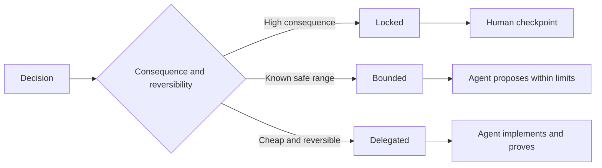

# Write Specifications That Preserve Judgment

> A useful specification fixes invariants and evidence while leaving reversible implementation choices open. It is a decision boundary, not a screenplay.

**Type:** Learn + Build
**Languages:** Python (stdlib)
**Prerequisites:** Phase 14 lesson 50
**Time:** ~75 minutes

## Learning Objectives

- Separate outcome, invariants, examples, non-goals, and proof.
- Mark decisions as locked, bounded, or delegated.
- Preserve agent judgment where choices are cheap and reversible.
- Require human checkpoints where consequence or public behavior changes.

## Two Bad Extremes

An underspecified task asks an agent to guess the system. An overspecified task asks it to transcribe a design that may already be wrong.

The useful middle is an executable contract:

| Surface | Purpose |
|---|---|
| Outcome | The observable result |
| Invariants | Conditions that must always remain true |
| Examples | Concrete cases that reveal intent |
| Non-goals | Adjacent behavior intentionally excluded |
| Decision policy | Which choices are locked, bounded, or delegated |
| Proof | Evidence required before completion |

## Three Decision Modes

- **Locked:** the agent must not choose. Use for public compatibility, authority, safety, irreversible cost, or a product commitment.
- **Bounded:** the agent may choose inside explicit limits. Use for search budgets, retry counts, allowed dependencies, or a known interface family.
- **Delegated:** the agent owns the choice and must explain it. Use for local structure, names, reversible refactors, and implementation details.



## Specify Behavior Through Examples

Examples compress intent better than adjectives. “Helpful,” “robust,” and “production-ready” are not executable. A small set of normal, edge, failure, and forbidden examples gives both the builder and verifier something concrete.

Examples do not replace invariants. One passing case cannot prove a universal safety rule.

## Proof Must Match the Claim

- A unit test proves a local function contract.
- A wire test proves serialization and transport behavior.
- A browser journey proves an interface path.
- A replay set proves behavior over representative cases.
- An audit log proves that authority boundaries held.

Do not accept a lower layer as proof of a higher-layer claim.

## Preserve Unknowns Deliberately

A specification can say “the implementation may choose any read-only source that returns within the time budget.” That is not vagueness. It is an intentional delegated decision with a boundary and proof.

Specifications should evolve when evidence changes. Preserve the reason behind locked and bounded choices so later teams can revise them without archaeology.

## Build It

The lab validates every contract surface, checks decision modes, and writes `outputs/executable-specification.json`.

```bash
python3 code/main.py
python3 -m unittest discover code/tests -v
```

Move the production-write decision from locked to delegated. Explain why the schema accepts the value but the product risk does not.

## Exercises

1. Convert a backlog ticket into the six specification surfaces.
2. Replace three implementation instructions with one invariant and two examples.
3. Mark every decision and justify each locked or bounded choice.
4. Add a proof receipt for every invariant.
5. Remove a constraint that has no evidence or risk rationale.

## Further Reading

- [Nuseibeh and Easterbrook, Requirements Engineering: A Roadmap](https://www.cs.toronto.edu/~sme/papers/2000/ICSE2000.pdf), for the relationship among goals, precise specifications, validation, agreement, and evolution.
- [Zave and Jackson, Four Dark Corners of Requirements Engineering](https://doi.org/10.1145/267895.267896), for separating environmental assumptions, requirements, and specifications.
- [Gotel and Finkelstein, An Analysis of the Requirements Traceability Problem](https://doi.org/10.1109/ICRE.1994.292398), for preserving why a requirement exists and where it came from.

## What You Keep

Keep `outputs/executable-specification.json`. It becomes the contract that coding agents and human reviewers share.
