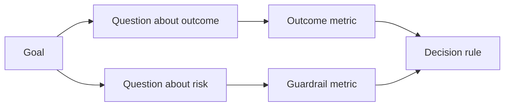

# Design Success Metrics Before the Result Exists

> Measurement should answer a decision, not decorate a dashboard. Start with the goal, derive questions, then choose the smallest metrics that answer them.

**Type:** Learn + Build
**Languages:** Python (stdlib)
**Prerequisites:** Phase 14 lessons 47 and 51
**Time:** ~70 minutes

## Learning Objectives

- Derive questions and metrics from an outcome goal.
- Define thresholds, windows, sources, and directions before observing results.
- Pair outcome metrics with guardrails and counter-metrics.
- Match evaluation evidence to the decision the build must support.

## Goal, Question, Metric

Start with a goal:

> Reduce time to identify the affected service without increasing unsafe actions.

Derive questions:

- How quickly is the correct service identified?
- How often is the identified service correct?
- Does diagnosis remain read-only?
- Does the workflow increase alert dismissal or operator workload?

Then choose metrics that operationalize those questions.



## A Metric Needs a Contract

Every metric needs:

| Field | Example |
|---|---|
| Name | `median_identification_seconds` |
| Direction | at most |
| Threshold | 120 |
| Window | ten incident replays |
| Source | replay event log |
| Population | on-call engineers in the pilot |
| Kind | outcome or guardrail |

Without source and window, a number cannot be reproduced. Without a threshold, it cannot drive a decision.

## Outcome, Guardrail, and Counter-Metric

- **Outcome metric:** did the desired state improve?
- **Guardrail:** did a fixed constraint remain true?
- **Counter-metric:** did the local improvement shift cost or harm elsewhere?

For an incident workflow, speed is not enough. Correctness, production writes, operator workload, and missed alerts protect against a fast but unsafe result.

## Offline and Online Evidence

Offline replay is useful for repeatability and edge coverage. A bounded pilot is useful for real behavior, trust, and workflow effects. Neither substitutes for the other.

Use the cheapest evidence that can answer the current decision. Do not expose real users merely because the implementation is ready.

## Decide Before You Measure

Write the pass, fail, and ambiguous paths before seeing results. Otherwise the team will move the threshold to protect the build.

Example:

- pass: correct service rate at least 0.9 and median time at most 120 seconds;
- fail: any production write or correct rate below 0.75;
- ambiguous: small improvement with wide variance, requiring a larger replay set.

## Build It

The lab validates a measurement plan, evaluates inclusive thresholds, records missing values, and writes `outputs/measurement-report.json`.

```bash
python3 code/main.py
python3 -m unittest discover code/tests -v
```

Remove the guardrail metric and observe why the plan becomes invalid even when the outcome metrics remain.

## Exercises

1. Derive three questions from one outcome goal.
2. Add a counter-metric that catches cost shifted to another role.
3. Define the source, population, and window for every metric.
4. Write pass, fail, and ambiguous decisions before generating values.
5. Identify one metric that is easy to collect but cannot change the decision. Remove it.

## Further Reading

- [Basili, Software Modeling and Measurement: The Goal/Question/Metric Paradigm](https://drum.lib.umd.edu/items/8119803a-362b-42ec-b6ce-2311713e7236), for deriving operational measurements from explicit goals.
- [Basili, Caldiera, and Rombach, The Goal Question Metric Approach](https://www.cs.toronto.edu/~sme/CSC444F/handouts/GQM-paper.pdf), for applying the method as a feedback and improvement system.

## What You Keep

Keep `outputs/measurement-report.json`. It defines the evidence gate for the prototype, pilot, or production stage.
