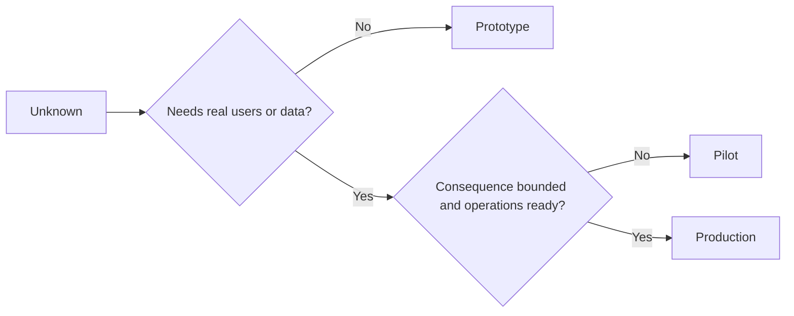

# Choose Prototype, Pilot, or Production Deliberately

> These are different learning environments, not levels of polish. Choose the stage that answers the current unknown with the least unnecessary consequence.

**Type:** Learn + Build
**Languages:** Python (stdlib)
**Prerequisites:** Phase 14 lessons 50 to 52
**Time:** ~70 minutes

## Learning Objectives

- Choose a build stage from the unknown, audience, data, consequence, and readiness.
- Define stage-specific controls and exit criteria.
- Prevent prototypes from quietly becoming production systems.
- Delay real authority until evidence and operations justify it.

## Three Different Questions

| Stage | Primary question |
|---|---|
| Prototype | Can this mechanism produce the evidence at all? |
| Pilot | Does it work safely with a bounded real audience and real conditions? |
| Production | Can we own it continuously at the promised reliability and risk level? |

A prototype can be technically complete and still be disposable. A pilot can use production data while remaining limited in audience and authority. Production begins when the organization accepts ongoing responsibility.

## Prototype

Use a prototype when the unknown does not require real users or real data. Keep it:

- discardable;
- isolated;
- narrow in behavior;
- explicit about the learning question;
- free of false operational guarantees.

Do not optimize architecture before the mechanism earns another stage.

## Pilot

Use a pilot when the unknown requires real behavior, realistic data, or a real workflow, but consequence or readiness is not yet compatible with broad release.

A pilot needs:

- a named audience;
- a human owner;
- bounded duration and authority;
- audit and rollback;
- outcome and guardrail thresholds;
- exit criteria for expand, revise, or stop.

## Production

Production needs more than deployment:

- service level objective;
- on-call and incident ownership;
- security and privacy review;
- cost and capacity controls;
- rollback and recovery;
- continuous monitoring;
- a retirement path.



## Stage Drift

Prototype code becomes dangerous when it acquires users, data, or authority without acquiring ownership. Mark prototype and pilot boundaries in configuration, access control, telemetry, and documentation. A warning banner is not enough.

The stage should be observable from the system itself.

## Build It

The lab chooses a stage from the decision context, returns required controls, and writes `outputs/stage-decisions.json`.

```bash
python3 code/main.py
python3 -m unittest discover code/tests -v
```

Change the pilot example to low consequence with operational readiness. Explain what additional evidence would justify production.

## Exercises

1. Classify three current projects by learning stage, not deployment status.
2. Write pilot exit criteria that include a stop decision.
3. Add a technical control that prevents a prototype from reaching production data.
4. Identify the first operational responsibility that makes the build production.
5. Design a rollback receipt for the bounded pilot.

## Further Reading

- [Barry Boehm, A Spiral Model of Software Development and Enhancement](https://dl.acm.org/doi/10.1145/12944.12948), for matching each iteration’s commitment to resolved risk.
- [Fagerholm et al., Building Blocks for Continuous Experimentation](https://doi.org/10.1145/2601248.2601276), for the organizational and technical conditions required to run experiments continuously.

## What You Keep

Keep `outputs/stage-decisions.json`. It records why each stage is justified and which controls must exist before the next one.
