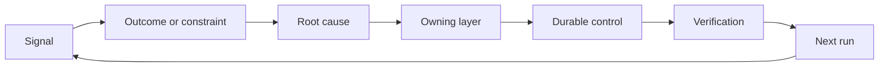

# Build a Feedback Ratchet with Ownership and Retirement

> Shipping closes one build loop and opens the learning loop. Evidence must change the system or it becomes telemetry nobody owns.

**Type:** Learn + Build
**Languages:** Python (stdlib)
**Prerequisites:** Phase 14 lessons 46 and 53
**Time:** ~75 minutes

## Learning Objectives

- Turn incidents, evaluations, user behavior, and corrections into owned actions.
- Route each signal to context, evaluation, policy, runtime, or backlog.
- Prioritize recurrence by severity and frequency.
- Give every control a retirement condition.

## Feedback Is Infrastructure

A team can collect traces, evaluations, support tickets, and incident logs without learning from any of them. The missing mechanism is promotion: a defined path from observation to a durable change with an owner and proof.

The loop is:

1. observe a concrete signal;
2. connect it to an outcome, constraint, or assumption;
3. identify the earliest system layer that owns the cause;
4. create a bounded change;
5. verify that recurrence becomes less likely;
6. review whether the control should remain.

## Route to the Owning Layer

| Signal | Destination |
|---|---|
| False positive, regression, wrong result | Evaluation or test |
| Missing context, duplicate work, stale fact | Context source or retrieval route |
| Unsafe action or authority gap | Policy or permission boundary |
| Timeout, retry storm, unavailable dependency | Runtime control |
| New product need or unresolved tradeoff | Shaped backlog item |

Fix the cause at the earliest effective layer. Do not add another prompt paragraph when a test or permission can make the failure impossible.



## Ownership Is Part of the Control

Every ratchet action needs:

- one owner;
- a priority based on consequence and recurrence;
- the artifact to change;
- the verification that proves the change;
- a review or expiry window;
- a retirement condition.

An unowned improvement is an observation with better formatting.

## Retire Stale Controls

Feedback systems accumulate policy. That policy can become contradictory and expensive. Review controls when:

- architecture or workflow changes;
- a lower-level invariant replaces a higher-level instruction;
- the protected failure has not appeared across the chosen window;
- the control blocks legitimate work more often than it prevents harm.

Retirement also needs evidence. Do not delete a control because it feels old.

## Connect Build and Coding-Agent Feedback

The same ratchet serves both tracks:

- Product evidence changes the outcome frame, assumptions, slice, or measurement plan.
- Coding-agent corrections change tests, context, scope, automation, or handoff.
- Incidents can change both the product boundary and the agent workbench.

This is why shaping the build is not a phase that ends before coding. It continues through every accepted change.

## Build It

The lab classifies signals, creates owned ratchet actions, prioritizes them, and writes `outputs/feedback-backlog.json`.

```bash
python3 code/main.py
python3 -m unittest discover code/tests -v
```

Add a runtime timeout signal and confirm that it routes to the runtime rather than the general backlog.

## Exercises

1. Turn one incident and one user complaint into ratchet actions.
2. Name the earliest layer that can prevent each recurrence.
3. Add verification commands or observations to the lab output.
4. Define a retirement condition for a policy rule.
5. Trace one accepted correction back into the next task frame.

## Further Reading

- [Basili, Caldiera, and Rombach, The Goal Question Metric Approach](https://www.cs.toronto.edu/~sme/CSC444F/handouts/GQM-paper.pdf), for organizational learning through goal-oriented measurement.
- [Fagerholm et al., Building Blocks for Continuous Experimentation](https://doi.org/10.1145/2601248.2601276), for the technical and organizational loop that connects evidence to continued product development.
- [Nuseibeh and Easterbrook, Requirements Engineering: A Roadmap](https://www.cs.toronto.edu/~sme/papers/2000/ICSE2000.pdf), for treating requirements as evolving through the system lifecycle.

## What You Keep

Keep `outputs/feedback-backlog.json`. It is the closing artifact of the Product Judgment and Delivery path and the input to the next outcome frame.
