# 通訊協定

> 說不了同一種語言的代理不是一個團隊。他們是一群對著虛空大喊的陌生人。

**類型：** 建構
**程式語言：** TypeScript
**先修單元：** 階段 14（代理工程）、第 16.01 課（為什麼要多代理）
**時間：** 約 120 分鐘

## 學習目標

- 實作 MCP 的工具發現與調用，讓代理能使用外部伺服器暴露的工具
- 做出一張 A2A agent card 與一個 task 端點，讓一個代理能透過 HTTP 把工作委派給另一個代理
- 比較 MCP（工具存取）、A2A（代理對代理）、ACP（企業稽核）與 ANP（去中心化信任），並解釋哪個協定解哪個問題
- 在單一系統中把多種協定接起來：代理透過 MCP 發現工具、透過 A2A 委派任務

## 問題所在

你把系統拆成多個代理。一個研究員、一個寫程式的、一個審查者。它們各自的工作都做得很好。但現在你需要它們真的彼此對話。

你的第一次嘗試很直覺：傳字串。研究員回傳一團文字，寫程式的代理盡力去解析。它能用，直到寫程式的代理誤讀了一份研究摘要，或兩個代理互等而死鎖，或你需要不同團隊做的代理協作為止。「就傳字串吧」突然就垮了。

這就是通訊協定的問題。沒有一份共享的契約來規定代理如何交換資訊，多代理系統就是脆弱、無法稽核，而且不可能擴展到你親手寫的那幾個代理之外。

AI 生態系以四種協定回應，各自解決問題的不同切片：

- **MCP** 給工具存取
- **A2A** 給代理對代理的協作
- **ACP** 給企業可稽核性
- **ANP** 給去中心化身分與信任

這一課挖得深。你會讀到每份規格的真實線上格式、建出可運作的實作，並把四者接進一個統一的系統。

## 核心概念

### 協定的版圖

把這四種協定想成分層，各自處理一個不同的問題：

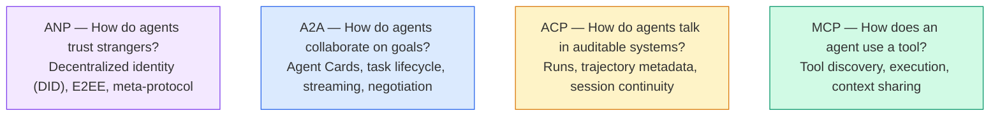

它們不是競爭者。它們在不同層級解決不同問題。

### MCP（回顧）

MCP 在階段 13 有深入涵蓋。快速回顧：MCP 把「LLM 如何連到外部工具與資料來源」標準化。它是一套**客戶端—伺服器**協定，由代理（客戶端）發現並呼叫伺服器暴露的工具。

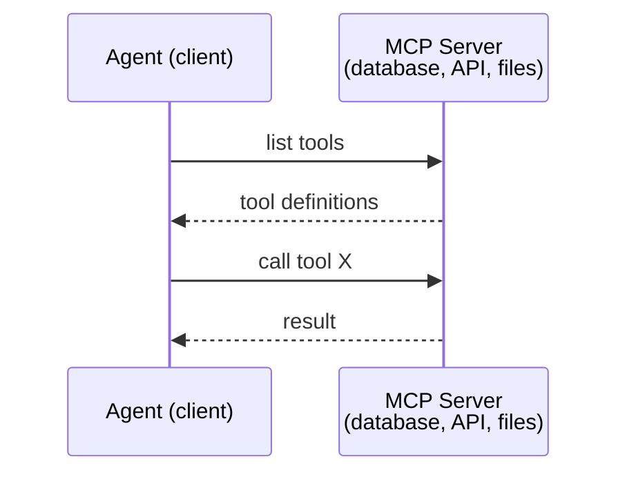

MCP 是**代理對工具**的通訊。它幫不上代理彼此對話。

### A2A（Agent2Agent Protocol）

**建立者：** Google（現在在 Linux Foundation 之下為 `lf.a2a.v1`）
**規格版本：** 1.0.0
**問題：** 自主代理如何協作、談判，並把任務委派給彼此？

A2A 是**點對點代理協作**的協定。MCP 把代理接到工具，A2A 則把代理接到其他代理。每個代理在一個 well-known URL 上發布一張 **Agent Card**，其他代理據以發現它、與它談判，並把任務委派給它。

#### A2A 怎麼運作

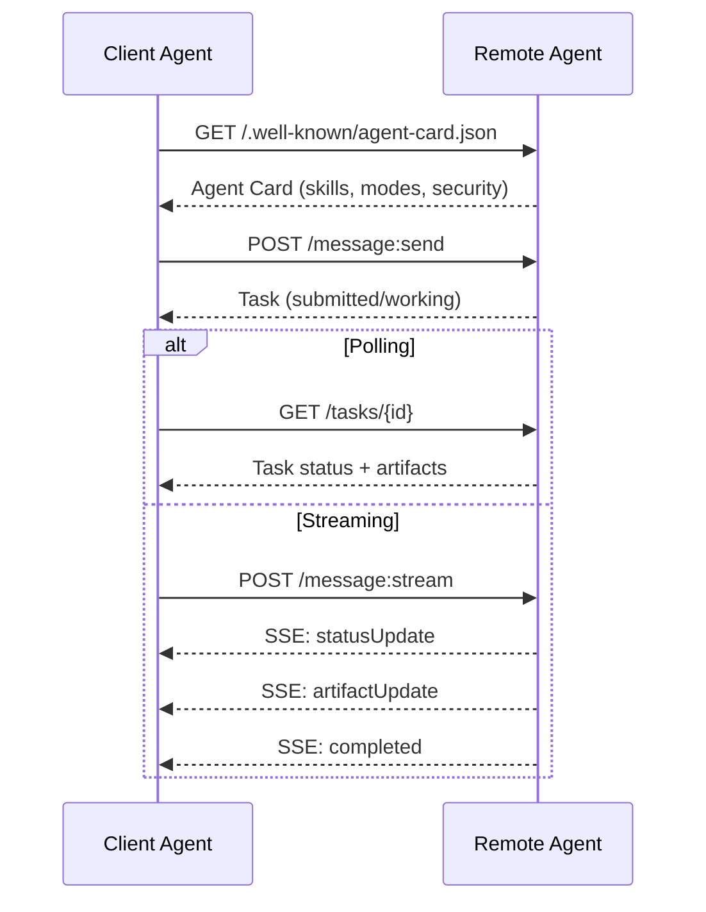

#### 真正的 Agent Card

這就是野地裡 A2A Agent Card 實際的樣子。由 `GET /.well-known/agent-card.json` 提供：

```json
{
  "name": "Research Agent",
  "description": "Searches documentation and summarizes findings",
  "version": "1.0.0",
  "supportedInterfaces": [
    {
      "url": "https://research-agent.example.com/a2a/v1",
      "protocolBinding": "JSONRPC",
      "protocolVersion": "1.0"
    },
    {
      "url": "https://research-agent.example.com/a2a/rest",
      "protocolBinding": "HTTP+JSON",
      "protocolVersion": "1.0"
    }
  ],
  "provider": {
    "organization": "Your Company",
    "url": "https://example.com"
  },
  "capabilities": {
    "streaming": true,
    "pushNotifications": false
  },
  "defaultInputModes": ["text/plain", "application/json"],
  "defaultOutputModes": ["text/plain", "application/json"],
  "skills": [
    {
      "id": "web-research",
      "name": "Web Research",
      "description": "Searches the web and synthesizes findings",
      "tags": ["research", "search", "summarization"],
      "examples": ["Research the latest changes in React 19"]
    },
    {
      "id": "doc-analysis",
      "name": "Documentation Analysis",
      "description": "Reads and analyzes technical documentation",
      "tags": ["docs", "analysis"],
      "inputModes": ["text/plain", "application/pdf"],
      "outputModes": ["application/json"]
    }
  ],
  "securitySchemes": {
    "bearer": {
      "httpAuthSecurityScheme": {
        "scheme": "Bearer",
        "bearerFormat": "JWT"
      }
    }
  },
  "security": [{ "bearer": [] }]
}
```

要注意的關鍵：
- **Skills** 是一個代理能做的事。每一項都有 ID、標籤，以及支援的輸入／輸出 MIME 型別。客戶端代理就是靠這個來判斷這個遠端代理能不能處理它的請求。
- **supportedInterfaces** 列出多種協定綁定。單一個代理可以同時說 JSON-RPC、REST 與 gRPC。
- **Security** 內建在卡片裡。客戶端在發出第一個請求之前，就知道自己需要什麼認證。

#### Task 生命週期

Task 是 A2A 中工作的核心單位。它們在既定的狀態之間移動：

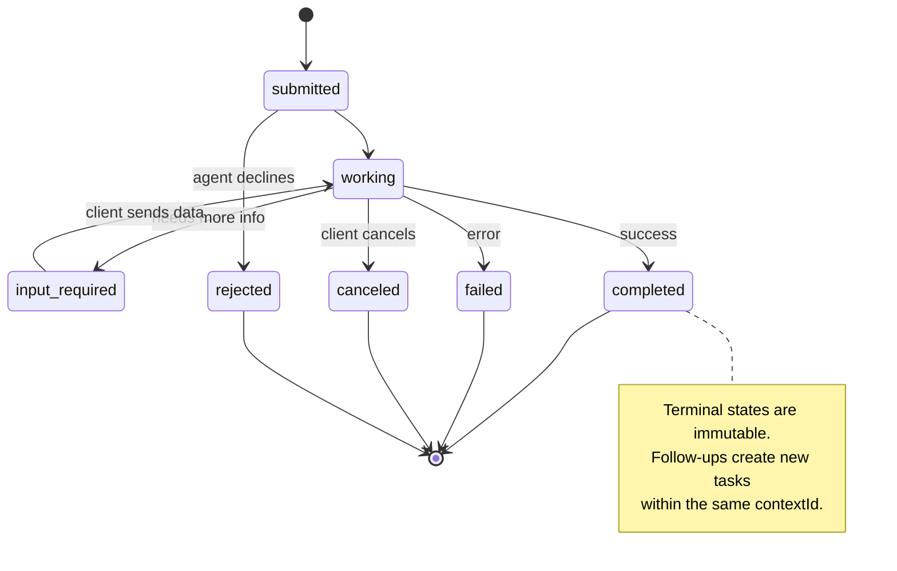

全部 8 種狀態（規格另外定義了 `UNSPECIFIED` 作為哨兵值，此處省略）：

| 狀態 | 終端？ | 意義 |
|---|---|---|
| `TASK_STATE_SUBMITTED` | 否 | 已確認收到，尚未處理 |
| `TASK_STATE_WORKING` | 否 | 正在積極處理中 |
| `TASK_STATE_INPUT_REQUIRED` | 否 | 代理需要客戶端提供更多資訊 |
| `TASK_STATE_AUTH_REQUIRED` | 否 | 需要認證 |
| `TASK_STATE_COMPLETED` | 是 | 成功完成 |
| `TASK_STATE_FAILED` | 是 | 以錯誤結束 |
| `TASK_STATE_CANCELED` | 是 | 在完成前被取消 |
| `TASK_STATE_REJECTED` | 是 | 代理婉拒了該任務 |

一旦任務抵達終端狀態，它就是不可變的。不再有訊息。後續動作會在同一個 `contextId` 內建立一個新任務。

#### 線上格式

A2A 使用 JSON-RPC 2.0。真實的訊息往來長這樣：

**客戶端送出一項任務：**
```json
{
  "jsonrpc": "2.0",
  "id": 1,
  "method": "SendMessage",
  "params": {
    "message": {
      "messageId": "msg-001",
      "role": "ROLE_USER",
      "parts": [{ "text": "Research React 19 compiler features" }]
    },
    "configuration": {
      "acceptedOutputModes": ["text/plain", "application/json"],
      "historyLength": 10
    }
  }
}
```

**代理以一項任務回應：**
```json
{
  "jsonrpc": "2.0",
  "id": 1,
  "result": {
    "task": {
      "id": "task-abc-123",
      "contextId": "ctx-xyz-789",
      "status": {
        "state": "TASK_STATE_COMPLETED",
        "timestamp": "2026-03-27T10:30:00Z"
      },
      "artifacts": [
        {
          "artifactId": "art-001",
          "name": "research-results",
          "parts": [{
            "data": {
              "findings": [
                "React 19 compiler auto-memoizes components",
                "No more manual useMemo/useCallback needed",
                "Compiler runs at build time, not runtime"
              ]
            },
            "mediaType": "application/json"
          }]
        }
      ]
    }
  }
}
```

**透過 SSE 串流：**
```text
POST /message:stream HTTP/1.1
Content-Type: application/json
A2A-Version: 1.0

data: {"task":{"id":"task-123","status":{"state":"TASK_STATE_WORKING"}}}

data: {"statusUpdate":{"taskId":"task-123","status":{"state":"TASK_STATE_WORKING","message":{"role":"ROLE_AGENT","parts":[{"text":"Searching documentation..."}]}}}}

data: {"artifactUpdate":{"taskId":"task-123","artifact":{"artifactId":"art-1","parts":[{"text":"partial findings..."}]},"append":true,"lastChunk":false}}

data: {"statusUpdate":{"taskId":"task-123","status":{"state":"TASK_STATE_COMPLETED"}}}
```

### ACP（Agent Communication Protocol）

**建立者：** IBM／BeeAI
**規格版本：** 0.2.0（OpenAPI 3.1.1）
**狀態：** 正在 Linux Foundation 之下併入 A2A
**問題：** 代理如何在具備完整可稽核性、工作階段連續性與軌跡追蹤的前提下通訊？

ACP 是那個**企業協定**。跟許多摘要宣稱的不同，ACP **不**使用 JSON-LD。它是一套直白、以 OpenAPI 定義的 REST/JSON API。讓它特別的是 **TrajectoryMetadata**：每一則代理回應都可以帶上一份詳盡的日誌，記錄產出它的那些推理步驟與工具呼叫。

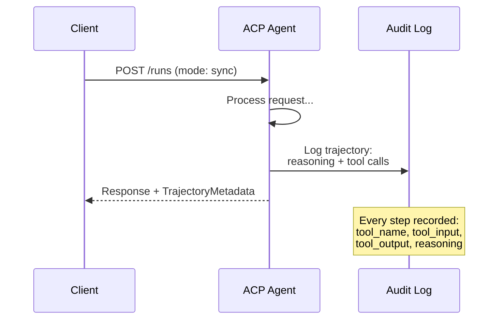

#### ACP 中的代理發現

ACP 定義了四種發現方式：

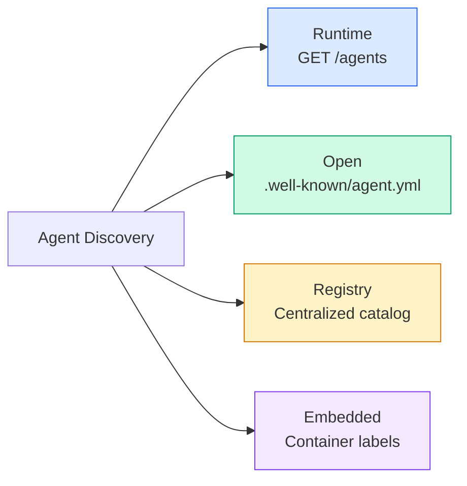

那份 **AgentManifest** 比 A2A 的 Agent Card 簡單：

```json
{
  "name": "summarizer",
  "description": "Summarizes documents with source citations",
  "input_content_types": ["text/plain", "application/pdf"],
  "output_content_types": ["text/plain", "application/json"],
  "metadata": {
    "tags": ["summarization", "RAG"],
    "framework": "BeeAI",
    "capabilities": [
      {
        "name": "Document Summarization",
        "description": "Condenses long documents into key points"
      }
    ],
    "recommended_models": ["llama3.3:70b-instruct-fp16"],
    "license": "Apache-2.0",
    "programming_language": "Python"
  }
}
```

#### Run 生命週期

ACP 用「Run」而不是「Task」。一個 Run 是一次代理執行，有三種模式：

| 模式 | 行為 |
|---|---|
| `sync` | 阻塞。回應中含完整結果。 |
| `async` | 立刻回傳 202。輪詢 `GET /runs/{id}` 取狀態。 |
| `stream` | SSE 串流。代理工作時事件陸續觸發。 |

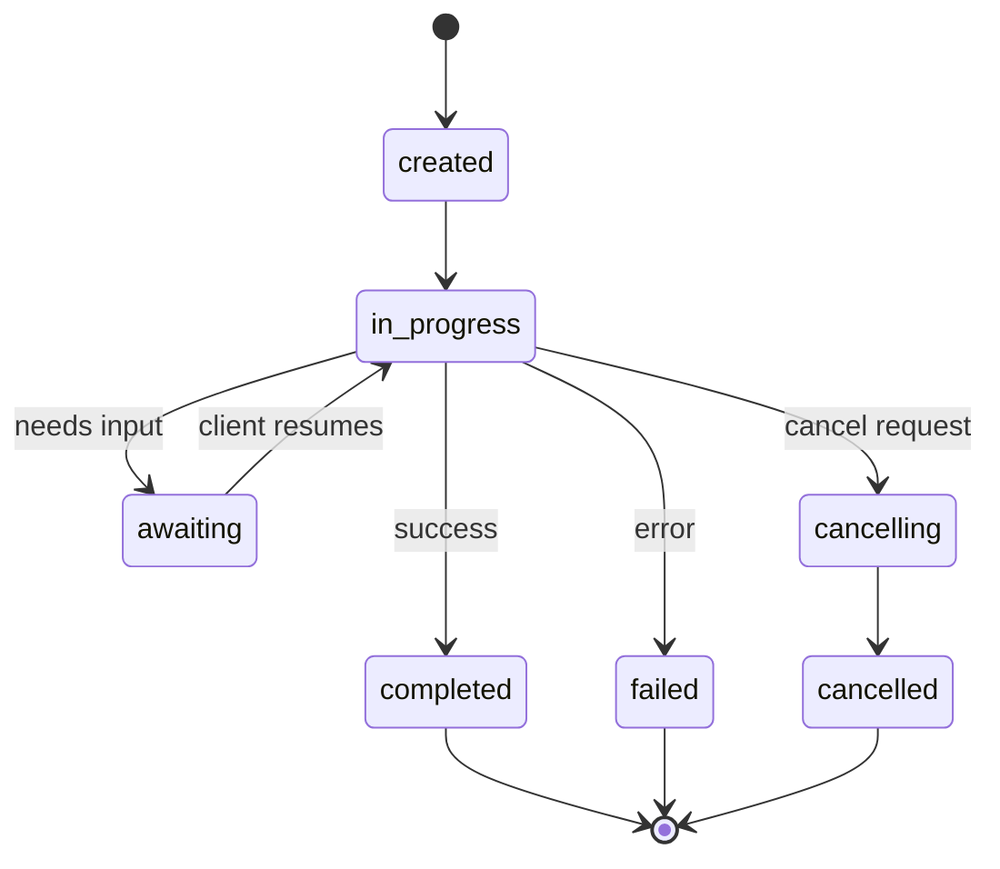

#### TrajectoryMetadata（那條稽核軌跡）

這是 ACP 的關鍵差異化。每一個訊息 part 都可以附上中繼資料，精確顯示代理做了什麼：

```json
{
  "role": "agent/researcher",
  "parts": [
    {
      "content_type": "text/plain",
      "content": "The weather in San Francisco is 72F and sunny.",
      "metadata": {
        "kind": "trajectory",
        "message": "I need to check the weather for this location",
        "tool_name": "weather_api",
        "tool_input": { "location": "San Francisco, CA" },
        "tool_output": { "temperature": 72, "condition": "sunny" }
      }
    }
  ]
}
```

對受監管的產業來說，這是金礦。每一個答案都附帶一條可證明的推理鏈：呼叫了哪些工具、用了什麼輸入、收到什麼輸出。沒有黑箱。

ACP 也支援替來源歸屬用的 **CitationMetadata**：

```json
{
  "kind": "citation",
  "start_index": 0,
  "end_index": 47,
  "url": "https://weather.gov/sf",
  "title": "NWS San Francisco Forecast"
}
```

### ANP（Agent Network Protocol）

**建立者：** 開源社群（由 GaoWei Chang 發起）
**儲存庫：** [github.com/agent-network-protocol/AgentNetworkProtocol](https://github.com/agent-network-protocol/AgentNetworkProtocol)
**問題：** 來自不同組織的代理，如何在沒有中央權威的情況下彼此信任？

ANP 是那個**去中心化身分協定**。它用 W3C 的去中心化識別碼（DID）與端到端加密建立信任。與 A2A 靠已知端點發現代理不同，ANP 讓代理能以密碼學方式證明自己的身分。

ANP 有三層：

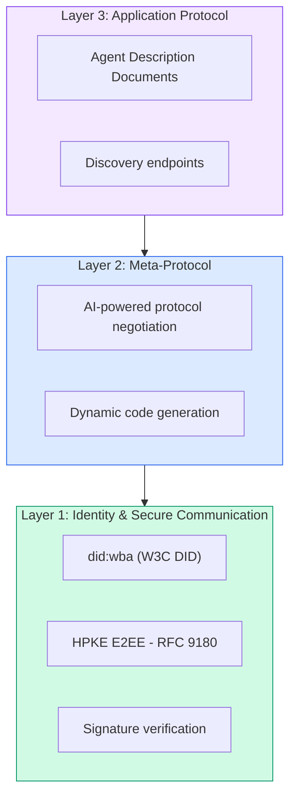

#### DID 文件（真實結構）

ANP 用一種叫 `did:wba`（Web-Based Agent）的自訂 DID 方法。DID `did:wba:example.com:user:alice` 解析到 `https://example.com/user/alice/did.json`：

```json
{
  "@context": [
    "https://www.w3.org/ns/did/v1",
    "https://w3id.org/security/suites/jws-2020/v1",
    "https://w3id.org/security/suites/secp256k1-2019/v1"
  ],
  "id": "did:wba:example.com:user:alice",
  "verificationMethod": [
    {
      "id": "did:wba:example.com:user:alice#key-1",
      "type": "EcdsaSecp256k1VerificationKey2019",
      "controller": "did:wba:example.com:user:alice",
      "publicKeyJwk": {
        "crv": "secp256k1",
        "x": "NtngWpJUr-rlNNbs0u-Aa8e16OwSJu6UiFf0Rdo1oJ4",
        "y": "qN1jKupJlFsPFc1UkWinqljv4YE0mq_Ickwnjgasvmo",
        "kty": "EC"
      }
    },
    {
      "id": "did:wba:example.com:user:alice#key-x25519-1",
      "type": "X25519KeyAgreementKey2019",
      "controller": "did:wba:example.com:user:alice",
      "publicKeyMultibase": "z9hFgmPVfmBZwRvFEyniQDBkz9LmV7gDEqytWyGZLmDXE"
    }
  ],
  "authentication": [
    "did:wba:example.com:user:alice#key-1"
  ],
  "keyAgreement": [
    "did:wba:example.com:user:alice#key-x25519-1"
  ],
  "humanAuthorization": [
    "did:wba:example.com:user:alice#key-1"
  ],
  "service": [
    {
      "id": "did:wba:example.com:user:alice#agent-description",
      "type": "AgentDescription",
      "serviceEndpoint": "https://example.com/agents/alice/ad.json"
    }
  ]
}
```

要注意的關鍵：
- **金鑰分離**是被強制的。簽章金鑰（secp256k1）與加密金鑰（X25519）是分開的。
- **`humanAuthorization`** 是 ANP 特有的。這些金鑰在使用前需要明確的人類核准（生物辨識、密碼、HSM）。像資金轉帳這類高風險操作走這條路徑。
- **`keyAgreement`** 金鑰用於 HPKE 端到端加密（RFC 9180）。
- **service** 這一段連到 Agent Description 文件。

#### ANP 中的信任怎麼運作

ANP **不**使用信任網或背書圖。信任是雙邊的，並且逐次互動驗證：

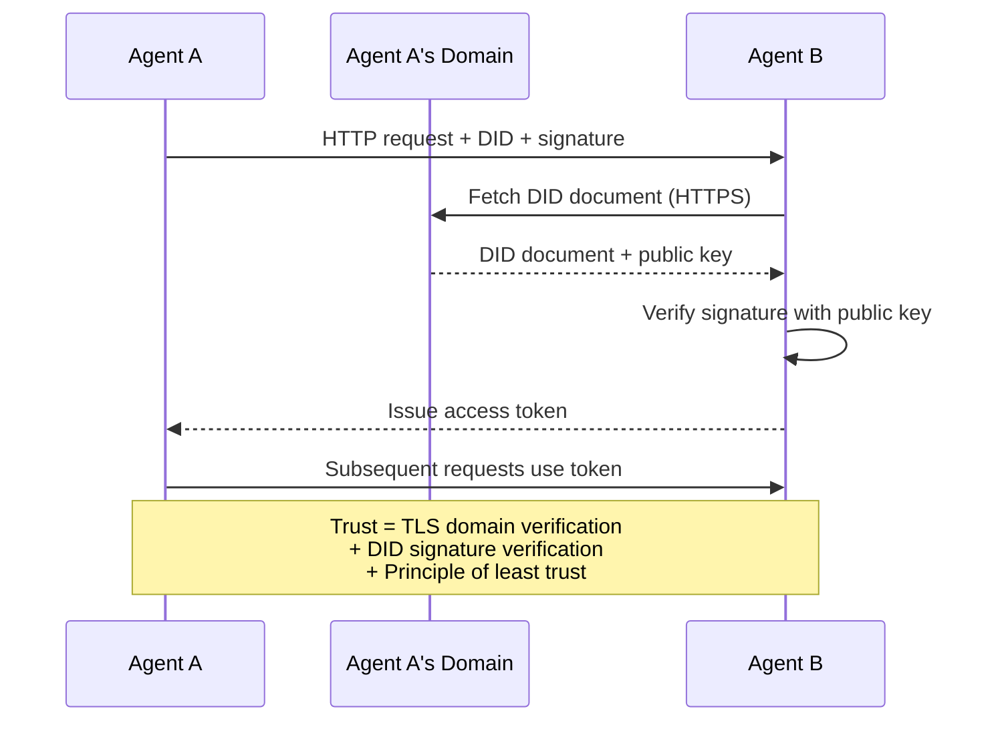

信任來自三個來源：
1. **網域層級的 TLS** 驗證那台 DID 文件主機
2. **DID 的密碼學簽章** 驗證該代理的身分
3. **最小信任原則** 只授予最低限度的權限

沒有基於流言的信任傳播，也沒有 PageRank 式的評分。你透過每個代理的 DID 直接驗證它。

#### 後設協定協商

這是 ANP 最新穎的功能。當來自不同生態系的兩個代理相遇時，它們不需要事先講好的資料格式。它們用自然語言協商：

```json
{
  "action": "protocolNegotiation",
  "sequenceId": 0,
  "candidateProtocols": "I can communicate using:\n1. JSON-RPC with hotel booking schema\n2. REST with OpenAPI 3.1 spec\n3. Natural language over HTTP",
  "modificationSummary": "Initial proposal",
  "status": "negotiating"
}
```

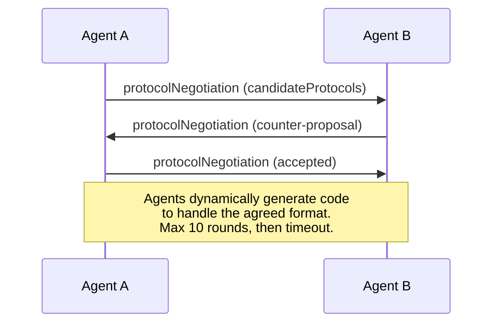

兩個代理來回（最多 10 回合）直到對格式達成一致，然後動態產出程式碼來處理它。狀態值有：`negotiating`、`rejected`、`accepted`、`timeout`。

這代表兩個素未謀面的代理，可以在沒有任何人事先定義共享 schema 的情況下，自己搞清楚要怎麼通訊。

### 對照（已更正）

| | MCP | A2A | ACP | ANP |
|---|---|---|---|---|
| **建立者** | Anthropic | Google／Linux Foundation | IBM／BeeAI | 社群 |
| **規格格式** | JSON-RPC | JSON-RPC／REST／gRPC | OpenAPI 3.1（REST） | JSON-RPC |
| **主要用途** | 代理對工具 | 代理對代理 | 代理對代理 | 代理對代理 |
| **發現方式** | 工具列舉 | `/.well-known/agent-card.json` | `GET /agents`、`/.well-known/agent.yml` | `/.well-known/agent-descriptions`、DID service 端點 |
| **身分** | 隱含（本地） | 安全機制（OAuth、mTLS） | 伺服器層級 | W3C DID（`did:wba`）配 E2EE |
| **稽核軌跡** | 無 | 基本（任務歷史） | TrajectoryMetadata（工具呼叫、推理） | 未正式規範 |
| **狀態機** | 無 | 9 種任務狀態 | 7 種 run 狀態 | 無 |
| **串流** | 無 | SSE | SSE | 與傳輸無關 |
| **獨有功能** | 工具 schema | Agent Card + Skills | 軌跡稽核軌跡 | 後設協定協商 |
| **最適合** | 工具與資料 | 動態協作 | 受監管產業 | 跨組織信任 |
| **狀態** | 穩定 | 穩定（v1.0） | 併入 A2A 中 | 積極開發中 |

### 它們怎麼一起運作

這些協定並不互斥。一套實際的企業系統會用上多種：

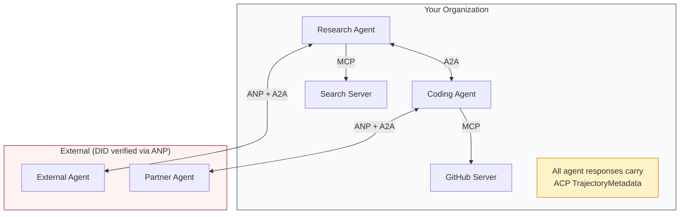

- **MCP** 把每個代理接到它的工具
- **A2A** 處理代理之間的協作（內部與外部）
- **ACP** 把回應包上軌跡中繼資料以供稽核
- **ANP** 替你控制不了的代理提供身分驗證

```figure
swarm-message-bus
```

## 建構它

### 步驟 1：核心訊息型別

每套多代理系統都從訊息格式開始。我們定義的型別會對映到真實協定所使用的東西：

```typescript
import crypto from "node:crypto";

type MessageRole = "user" | "agent";

type MessagePart =
  | { kind: "text"; text: string }
  | { kind: "data"; data: unknown; mediaType: string }
  | { kind: "file"; name: string; url: string; mediaType: string };

type TrajectoryEntry = {
  reasoning: string;
  toolName?: string;
  toolInput?: unknown;
  toolOutput?: unknown;
  timestamp: number;
};

type AgentMessage = {
  id: string;
  role: MessageRole;
  parts: MessagePart[];
  trajectory?: TrajectoryEntry[];
  replyTo?: string;
  timestamp: number;
};

function createMessage(
  role: MessageRole,
  parts: MessagePart[],
  replyTo?: string
): AgentMessage {
  return {
    id: crypto.randomUUID(),
    role,
    parts,
    replyTo,
    timestamp: Date.now(),
  };
}

function textMessage(role: MessageRole, text: string): AgentMessage {
  return createMessage(role, [{ kind: "text", text }]);
}
```

注意：`MessagePart` 是多模態的（文字、結構化資料、檔案），就跟真實的 A2A 與 ACP 規格一樣。`TrajectoryEntry` 捕捉那條推理鏈，對應 ACP 的 TrajectoryMetadata。

### 步驟 2：A2A Agent Card 與註冊表

做出符合真實 A2A 規格的代理發現：

```typescript
type Skill = {
  id: string;
  name: string;
  description: string;
  tags: string[];
  inputModes: string[];
  outputModes: string[];
};

type AgentCard = {
  name: string;
  description: string;
  version: string;
  url: string;
  capabilities: {
    streaming: boolean;
    pushNotifications: boolean;
  };
  defaultInputModes: string[];
  defaultOutputModes: string[];
  skills: Skill[];
};

class AgentRegistry {
  private cards: Map<string, AgentCard> = new Map();

  register(card: AgentCard) {
    this.cards.set(card.name, card);
  }

  discoverBySkillTag(tag: string): AgentCard[] {
    return [...this.cards.values()].filter((card) =>
      card.skills.some((skill) => skill.tags.includes(tag))
    );
  }

  discoverByInputMode(mimeType: string): AgentCard[] {
    return [...this.cards.values()].filter(
      (card) =>
        card.defaultInputModes.includes(mimeType) ||
        card.skills.some((skill) => skill.inputModes.includes(mimeType))
    );
  }

  resolve(name: string): AgentCard | undefined {
    return this.cards.get(name);
  }

  listAll(): AgentCard[] {
    return [...this.cards.values()];
  }
}
```

這比一份簡單的「名稱對能力」對映表豐富得多。你可以依技能標籤、依輸入 MIME 型別，或依名稱發現代理，就跟真實 A2A 規格支援的一樣。

### 步驟 3：A2A 的 Task 生命週期

做出完整的任務狀態機：

```typescript
type TaskState =
  | "submitted"
  | "working"
  | "input-required"
  | "auth-required"
  | "completed"
  | "failed"
  | "canceled"
  | "rejected";

const TERMINAL_STATES: TaskState[] = [
  "completed",
  "failed",
  "canceled",
  "rejected",
];

type TaskStatus = {
  state: TaskState;
  message?: AgentMessage;
  timestamp: number;
};

type Artifact = {
  id: string;
  name: string;
  parts: MessagePart[];
};

type Task = {
  id: string;
  contextId: string;
  status: TaskStatus;
  artifacts: Artifact[];
  history: AgentMessage[];
};

type TaskEvent =
  | { kind: "statusUpdate"; taskId: string; status: TaskStatus }
  | {
      kind: "artifactUpdate";
      taskId: string;
      artifact: Artifact;
      append: boolean;
      lastChunk: boolean;
    };

type TaskHandler = (
  task: Task,
  message: AgentMessage
) => AsyncGenerator<TaskEvent>;

class TaskManager {
  private tasks: Map<string, Task> = new Map();
  private handlers: Map<string, TaskHandler> = new Map();
  private listeners: Map<string, ((event: TaskEvent) => void)[]> = new Map();

  registerHandler(agentName: string, handler: TaskHandler) {
    this.handlers.set(agentName, handler);
  }

  subscribe(taskId: string, listener: (event: TaskEvent) => void) {
    const existing = this.listeners.get(taskId) ?? [];
    existing.push(listener);
    this.listeners.set(taskId, existing);
  }

  async sendMessage(
    agentName: string,
    message: AgentMessage,
    contextId?: string
  ): Promise<Task> {
    const handler = this.handlers.get(agentName);
    if (!handler) {
      const task = this.createTask(contextId);
      task.status = {
        state: "rejected",
        timestamp: Date.now(),
        message: textMessage("agent", `No handler for ${agentName}`),
      };
      return task;
    }

    const task = this.createTask(contextId);
    task.history.push(message);
    task.status = { state: "submitted", timestamp: Date.now() };

    this.processTask(task, handler, message).catch((err) => {
      task.status = {
        state: "failed",
        timestamp: Date.now(),
        message: textMessage("agent", String(err)),
      };
    });
    return task;
  }

  getTask(taskId: string): Task | undefined {
    return this.tasks.get(taskId);
  }

  cancelTask(taskId: string): boolean {
    const task = this.tasks.get(taskId);
    if (!task || TERMINAL_STATES.includes(task.status.state)) return false;
    task.status = { state: "canceled", timestamp: Date.now() };
    this.emit(taskId, {
      kind: "statusUpdate",
      taskId,
      status: task.status,
    });
    return true;
  }

  private createTask(contextId?: string): Task {
    const task: Task = {
      id: crypto.randomUUID(),
      contextId: contextId ?? crypto.randomUUID(),
      status: { state: "submitted", timestamp: Date.now() },
      artifacts: [],
      history: [],
    };
    this.tasks.set(task.id, task);
    return task;
  }

  private async processTask(
    task: Task,
    handler: TaskHandler,
    message: AgentMessage
  ) {
    task.status = { state: "working", timestamp: Date.now() };
    this.emit(task.id, {
      kind: "statusUpdate",
      taskId: task.id,
      status: task.status,
    });

    try {
      for await (const event of handler(task, message)) {
        if (TERMINAL_STATES.includes(task.status.state)) break;

        if (event.kind === "statusUpdate") {
          task.status = event.status;
        }
        if (event.kind === "artifactUpdate") {
          const existing = task.artifacts.find(
            (a) => a.id === event.artifact.id
          );
          if (existing && event.append) {
            existing.parts.push(...event.artifact.parts);
          } else {
            task.artifacts.push(event.artifact);
          }
        }
        this.emit(task.id, event);
      }
    } catch (err) {
      task.status = {
        state: "failed",
        timestamp: Date.now(),
        message: textMessage("agent", String(err)),
      };
      this.emit(task.id, {
        kind: "statusUpdate",
        taskId: task.id,
        status: task.status,
      });
    }
  }

  private emit(taskId: string, event: TaskEvent) {
    for (const listener of this.listeners.get(taskId) ?? []) {
      listener(event);
    }
  }
}
```

這實作了真實的 A2A 任務生命週期：submitted、working、input-required 與終端狀態。處理器是非同步產生器，會吐出事件（狀態更新與產物片段），對應 SSE 的串流模型。

### 步驟 4：ACP 式的稽核軌跡

用軌跡追蹤把通訊包起來：

```typescript
type AuditEntry = {
  runId: string;
  agentName: string;
  input: AgentMessage[];
  output: AgentMessage[];
  trajectory: TrajectoryEntry[];
  status: "created" | "in-progress" | "completed" | "failed" | "awaiting";
  startedAt: number;
  completedAt?: number;
  sessionId?: string;
};

class AuditableRunner {
  private log: AuditEntry[] = [];
  private handlers: Map<
    string,
    (input: AgentMessage[]) => Promise<{
      output: AgentMessage[];
      trajectory: TrajectoryEntry[];
    }>
  > = new Map();

  registerAgent(
    name: string,
    handler: (input: AgentMessage[]) => Promise<{
      output: AgentMessage[];
      trajectory: TrajectoryEntry[];
    }>
  ) {
    this.handlers.set(name, handler);
  }

  async run(
    agentName: string,
    input: AgentMessage[],
    sessionId?: string
  ): Promise<AuditEntry> {
    const entry: AuditEntry = {
      runId: crypto.randomUUID(),
      agentName,
      input: structuredClone(input),
      output: [],
      trajectory: [],
      status: "created",
      startedAt: Date.now(),
      sessionId,
    };
    this.log.push(entry);

    const handler = this.handlers.get(agentName);
    if (!handler) {
      entry.status = "failed";
      return entry;
    }

    entry.status = "in-progress";
    try {
      const result = await handler(input);
      entry.output = structuredClone(result.output);
      entry.trajectory = structuredClone(result.trajectory);
      entry.status = "completed";
      entry.completedAt = Date.now();
    } catch (err) {
      entry.status = "failed";
      entry.trajectory.push({
        reasoning: `Error: ${String(err)}`,
        timestamp: Date.now(),
      });
      entry.completedAt = Date.now();
    }
    return entry;
  }

  getFullAuditLog(): AuditEntry[] {
    return structuredClone(this.log);
  }

  getAuditLogForAgent(agentName: string): AuditEntry[] {
    return structuredClone(
      this.log.filter((e) => e.agentName === agentName)
    );
  }

  getAuditLogForSession(sessionId: string): AuditEntry[] {
    return structuredClone(
      this.log.filter((e) => e.sessionId === sessionId)
    );
  }

  getTrajectoryForRun(runId: string): TrajectoryEntry[] {
    const entry = this.log.find((e) => e.runId === runId);
    return entry ? structuredClone(entry.trajectory) : [];
  }
}
```

每一次代理執行都產出一筆完整的稽核條目：什麼進去、什麼出來，以及中間那條完整的工具呼叫與推理步驟軌跡。你可以依代理、依工作階段，或依個別 run 查詢。

### 步驟 5：ANP 式的身分驗證

做出以 DID 為基礎的身分與驗證：

```typescript
type VerificationMethod = {
  id: string;
  type: string;
  controller: string;
  publicKeyDer: string;
};

type DIDDocument = {
  id: string;
  verificationMethod: VerificationMethod[];
  authentication: string[];
  keyAgreement: string[];
  humanAuthorization: string[];
  service: { id: string; type: string; serviceEndpoint: string }[];
};

type AgentIdentity = {
  did: string;
  document: DIDDocument;
  privateKey: crypto.KeyObject;
  publicKey: crypto.KeyObject;
};

class IdentityRegistry {
  private documents: Map<string, DIDDocument> = new Map();

  publish(doc: DIDDocument) {
    this.documents.set(doc.id, doc);
  }

  resolve(did: string): DIDDocument | undefined {
    return this.documents.get(did);
  }

  verify(did: string, signature: string, payload: string): boolean {
    const doc = this.documents.get(did);
    if (!doc) return false;

    const authKeyIds = doc.authentication;
    const authKeys = doc.verificationMethod.filter((vm) =>
      authKeyIds.includes(vm.id)
    );

    for (const key of authKeys) {
      const publicKey = crypto.createPublicKey({
        key: Buffer.from(key.publicKeyDer, "base64"),
        format: "der",
        type: "spki",
      });
      const isValid = crypto.verify(
        null,
        Buffer.from(payload),
        publicKey,
        Buffer.from(signature, "hex")
      );
      if (isValid) return true;
    }
    return false;
  }

  requiresHumanAuth(did: string, operationKeyId: string): boolean {
    const doc = this.documents.get(did);
    if (!doc) return false;
    return doc.humanAuthorization.includes(operationKeyId);
  }
}

function createIdentity(domain: string, agentName: string): AgentIdentity {
  const did = `did:wba:${domain}:agent:${agentName}`;
  const { publicKey, privateKey } = crypto.generateKeyPairSync("ed25519");

  const publicKeyDer = publicKey
    .export({ format: "der", type: "spki" })
    .toString("base64");

  const keyId = `${did}#key-1`;
  const encKeyId = `${did}#key-x25519-1`;

  const document: DIDDocument = {
    id: did,
    verificationMethod: [
      {
        id: keyId,
        type: "Ed25519VerificationKey2020",
        controller: did,
        publicKeyDer,
      },
      {
        id: encKeyId,
        type: "X25519KeyAgreementKey2019",
        controller: did,
        publicKeyDer,
      },
    ],
    authentication: [keyId],
    keyAgreement: [encKeyId],
    humanAuthorization: [],
    service: [
      {
        id: `${did}#agent-description`,
        type: "AgentDescription",
        serviceEndpoint: `https://${domain}/agents/${agentName}/ad.json`,
      },
    ],
  };

  return { did, document, privateKey, publicKey };
}

function signPayload(identity: AgentIdentity, payload: string): string {
  return crypto
    .sign(null, Buffer.from(payload), identity.privateKey)
    .toString("hex");
}
```

這對映了真實的 ANP 身分模型：代理擁有 DID 文件，其中認證、金鑰協商與人類授權金鑰是分開的。`IdentityRegistry` 模擬 DID 解析（在生產環境中，這會是對代理網域發出的 HTTP 抓取）。

### 步驟 6：協定閘道

把四種協定接進一套統一的系統：

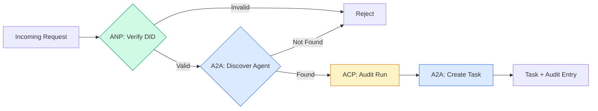

```typescript
class ProtocolGateway {
  private registry: AgentRegistry;
  private taskManager: TaskManager;
  private auditRunner: AuditableRunner;
  private identityRegistry: IdentityRegistry;

  constructor(
    registry: AgentRegistry,
    taskManager: TaskManager,
    auditRunner: AuditableRunner,
    identityRegistry: IdentityRegistry
  ) {
    this.registry = registry;
    this.taskManager = taskManager;
    this.auditRunner = auditRunner;
    this.identityRegistry = identityRegistry;
  }

  async delegateTask(
    fromDid: string,
    signature: string,
    targetAgent: string,
    message: AgentMessage,
    sessionId?: string
  ): Promise<{ task: Task; audit: AuditEntry } | { error: string }> {
    if (!this.identityRegistry.verify(fromDid, signature, message.id)) {
      return { error: "Identity verification failed" };
    }

    const card = this.registry.resolve(targetAgent);
    if (!card) {
      return { error: `Agent ${targetAgent} not found in registry` };
    }

    const audit = await this.auditRunner.run(
      targetAgent,
      [message],
      sessionId
    );
    const task = await this.taskManager.sendMessage(targetAgent, message);

    return { task, audit };
  }

  discoverAndDelegate(
    fromDid: string,
    signature: string,
    skillTag: string,
    message: AgentMessage
  ): Promise<{ task: Task; audit: AuditEntry } | { error: string }> {
    const candidates = this.registry.discoverBySkillTag(skillTag);
    if (candidates.length === 0) {
      return Promise.resolve({
        error: `No agents found with skill tag: ${skillTag}`,
      });
    }
    return this.delegateTask(
      fromDid,
      signature,
      candidates[0].name,
      message
    );
  }
}
```

這個閘道在一次呼叫中做四件事：
1. **ANP**：透過 DID 簽章驗證呼叫者身分
2. **A2A**：發現目標代理並檢查能力
3. **ACP**：把執行包在一條帶軌跡的稽核軌跡裡
4. **A2A**：建立一項帶完整生命週期追蹤的任務

### 步驟 7：把它們全部接起來

```typescript
async function protocolDemo() {
  const registry = new AgentRegistry();
  registry.register({
    name: "researcher",
    description: "Searches and summarizes findings",
    version: "1.0.0",
    url: "https://researcher.local/a2a/v1",
    capabilities: { streaming: true, pushNotifications: false },
    defaultInputModes: ["text/plain"],
    defaultOutputModes: ["text/plain", "application/json"],
    skills: [
      {
        id: "web-research",
        name: "Web Research",
        description: "Searches the web",
        tags: ["research", "search", "summarization"],
        inputModes: ["text/plain"],
        outputModes: ["application/json"],
      },
    ],
  });
  registry.register({
    name: "coder",
    description: "Writes code from specs",
    version: "1.0.0",
    url: "https://coder.local/a2a/v1",
    capabilities: { streaming: false, pushNotifications: false },
    defaultInputModes: ["text/plain", "application/json"],
    defaultOutputModes: ["text/plain"],
    skills: [
      {
        id: "code-gen",
        name: "Code Generation",
        description: "Generates code",
        tags: ["coding", "generation"],
        inputModes: ["text/plain", "application/json"],
        outputModes: ["text/plain"],
      },
    ],
  });

  const taskManager = new TaskManager();
  const auditRunner = new AuditableRunner();

  const researchTrajectory: TrajectoryEntry[] = [];

  taskManager.registerHandler(
    "researcher",
    async function* (task, message) {
      yield {
        kind: "statusUpdate" as const,
        taskId: task.id,
        status: { state: "working" as const, timestamp: Date.now() },
      };

      researchTrajectory.push({
        reasoning: "Searching for React 19 documentation",
        toolName: "web_search",
        toolInput: { query: "React 19 compiler features" },
        toolOutput: {
          results: ["react.dev/blog/react-19", "github.com/react/react"],
        },
        timestamp: Date.now(),
      });

      researchTrajectory.push({
        reasoning: "Extracting key findings from search results",
        toolName: "doc_analysis",
        toolInput: { url: "react.dev/blog/react-19" },
        toolOutput: {
          summary:
            "React 19 compiler auto-memoizes, no manual useMemo needed",
        },
        timestamp: Date.now(),
      });

      yield {
        kind: "artifactUpdate" as const,
        taskId: task.id,
        artifact: {
          id: crypto.randomUUID(),
          name: "research-results",
          parts: [
            {
              kind: "data" as const,
              data: {
                findings: [
                  "React 19 compiler auto-memoizes components",
                  "No more manual useMemo/useCallback needed",
                  "Compiler runs at build time, not runtime",
                ],
                sources: ["react.dev/blog/react-19"],
              },
              mediaType: "application/json",
            },
          ],
        },
        append: false,
        lastChunk: true,
      };

      yield {
        kind: "statusUpdate" as const,
        taskId: task.id,
        status: { state: "completed" as const, timestamp: Date.now() },
      };
    }
  );

  auditRunner.registerAgent("researcher", async () => ({
    output: [
      textMessage("agent", "React 19 compiler auto-memoizes components"),
    ],
    trajectory: researchTrajectory,
  }));

  const identityRegistry = new IdentityRegistry();

  const coderIdentity = createIdentity("coder.local", "coder");
  const researcherIdentity = createIdentity("researcher.local", "researcher");

  identityRegistry.publish(coderIdentity.document);
  identityRegistry.publish(researcherIdentity.document);

  const gateway = new ProtocolGateway(
    registry,
    taskManager,
    auditRunner,
    identityRegistry
  );

  console.log("=== Protocol Demo ===\n");

  console.log("1. Agent Discovery (A2A)");
  const researchAgents = registry.discoverBySkillTag("research");
  console.log(
    `   Found ${researchAgents.length} agent(s):`,
    researchAgents.map((a) => a.name)
  );

  console.log("\n2. Identity Verification (ANP)");
  const message = textMessage("user", "Research React 19 compiler features");
  const signature = signPayload(coderIdentity, message.id);
  const verified = identityRegistry.verify(
    coderIdentity.did,
    signature,
    message.id
  );
  console.log(`   Coder DID: ${coderIdentity.did}`);
  console.log(`   Signature verified: ${verified}`);

  console.log("\n3. Task Delegation (A2A + ACP + ANP)");
  const result = await gateway.delegateTask(
    coderIdentity.did,
    signature,
    "researcher",
    message,
    "session-001"
  );

  if ("error" in result) {
    console.log(`   Error: ${result.error}`);
    return;
  }

  console.log(`   Task ID: ${result.task.id}`);
  console.log(`   Task state: ${result.task.status.state}`);
  console.log(`   Artifacts: ${result.task.artifacts.length}`);

  console.log("\n4. Audit Trail (ACP)");
  console.log(`   Run ID: ${result.audit.runId}`);
  console.log(`   Status: ${result.audit.status}`);
  console.log(`   Trajectory steps: ${result.audit.trajectory.length}`);
  for (const step of result.audit.trajectory) {
    console.log(`     - ${step.reasoning}`);
    if (step.toolName) {
      console.log(`       Tool: ${step.toolName}`);
    }
  }

  console.log("\n5. Full Audit Log");
  const fullLog = auditRunner.getFullAuditLog();
  console.log(`   Total runs: ${fullLog.length}`);
  for (const entry of fullLog) {
    const duration = entry.completedAt
      ? `${entry.completedAt - entry.startedAt}ms`
      : "in-progress";
    console.log(`   ${entry.agentName}: ${entry.status} (${duration})`);
  }
}

protocolDemo().catch((err) => {
  console.error("Protocol demo failed:", err);
  process.exitCode = 1;
});
```

## 什麼會出錯

協定解決的是順利路徑。以下是生產環境中會壞掉的東西：

**Schema 漂移。** 代理 A 發布一張 Agent Card，宣告輸出 `application/json`。但 JSON schema 在版本之間變了。代理 B 用舊格式解析，拿到一堆垃圾。修法：替你的技能與輸出 schema 做版本。A2A 規格在 Agent Card 上支援 `version` 正是為此。

**狀態機違規。** 某個代理處理器吐出一個 `completed` 事件，然後試著再吐更多產物。這個任務已經不可變了。你的程式碼要嘛靜靜地把更新丟掉，要嘛丟例外。修法：在吐出之前檢查終端狀態。上面那個 `TaskManager` 就是用終端狀態之後的 `break` 來強制這件事。

**信任解析失敗。** 代理 A 試著驗證代理 B 的 DID，但代理 B 的網域掛了。DID 文件抓不到。你要 fail open（接受未驗證的代理）還是 fail closed（全部拒絕）？ANP 建議依最小信任原則 fail closed。

**軌跡肥大。** ACP 的軌跡記錄很有力，但很貴。一個每趟做 200 次工具呼叫的複雜代理，會產出巨大的稽核條目。修法：以可設定的詳細度層級記錄軌跡。為法遵記下工具名稱與 IO，非受監管的工作負載就跳過推理步驟。

**發現的驚群效應。** 50 個代理在啟動時同時查詢 `GET /agents`。修法：用 TTL 快取 Agent Card、把發現間隔錯開，或改用基於推送的註冊而不是輪詢。

## 框架應用

### 真實的實作

**A2A** 最成熟。Google 的[官方規格](https://github.com/google/A2A)在 Linux Foundation 之下開源。有 Python 與 TypeScript 的 SDK。如果你的代理需要動態發現與協作，從這裡開始。

**ACP** 正在併入 A2A。IBM 的 [BeeAI 專案](https://github.com/i-am-bee/acp)把 ACP 做成一個 REST 優先的替代方案，但軌跡中繼資料這個概念正在被 A2A 生態系吸收。就算你用 A2A 當傳輸，也可以採用 ACP 的模式（軌跡記錄、run 生命週期）。

**ANP** 最實驗性。那個[社群儲存庫](https://github.com/agent-network-protocol/AgentNetworkProtocol)有一個 Python SDK（AgentConnect）。後設協定協商這個概念是真的新穎。跨組織的代理部署值得盯著它。

**MCP** 在階段 13 已經涵蓋。如果你要讓代理使用工具，MCP 就是那個標準。

### 挑對的協定

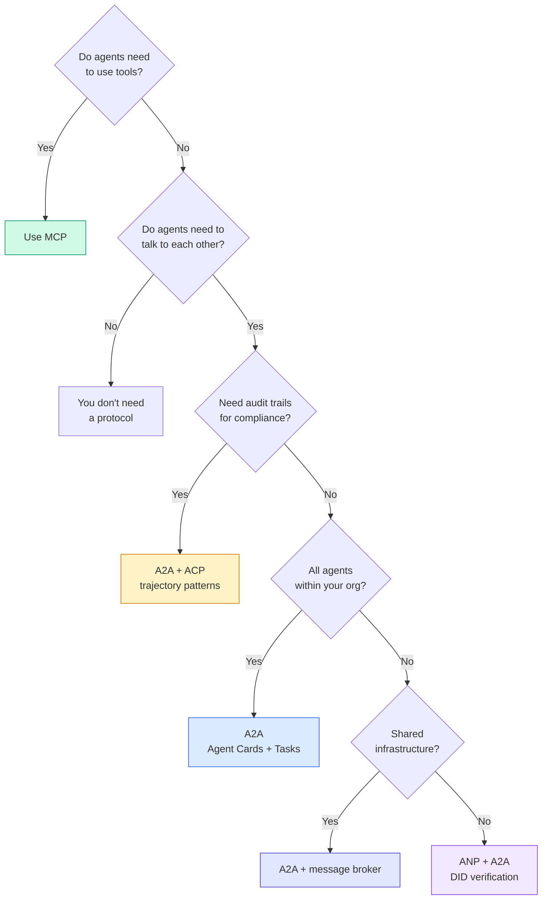

## 產出交付

這一課產出：
- `code/main.ts` —— 四種協定模式的完整實作
- `outputs/prompt-protocol-selector.md` —— 一段幫你替系統挑協定的提示詞

## 練習

1. **多跳任務委派。** 擴充 `TaskManager`，讓代理處理器能把子任務委派給其他代理。研究員收到一項任務，把「搜尋」與「摘要」兩個子任務委派給兩個專家代理，等兩者都完成，再把結果合併進自己的產物。

2. **串流稽核軌跡。** 修改 `AuditableRunner` 以支援串流模式。不要等完整結果，而是在軌跡條目被加入時即時吐出 `AuditEntry` 更新。用一個產出稽核快照的非同步產生器。

3. **DID 輪替。** 替 `IdentityRegistry` 加上金鑰輪替。代理應該能發布一份帶更新金鑰的新 DID 文件，同時維持一個 `previousDid` 參照。驗證者在寬限期內應該同時接受當前與前一把金鑰的簽章。

4. **協定協商。** 實作 ANP 的後設協定概念。兩個代理交換帶候選格式的 `protocolNegotiation` 訊息（例如「我會說 JSON-RPC」對上「我偏好 REST」）。最多 3 回合之後，它們要嘛達成格式共識、要嘛逾時。達成共識的格式決定它們使用哪個 `TaskManager` 或 `AuditableRunner`。

5. **有速率限制的發現。** 加一個 `RateLimitedRegistry` 包裝器，用可設定的 TTL 快取 Agent Card 查找，並限制每個代理每秒的發現查詢數。模擬 100 個代理在啟動時彼此發現的驚群效應，並量出差別。

## 關鍵術語

| 術語 | 大家怎麼說 | 實際是什麼意思 |
|------|----------------|----------------------|
| MCP | 「給 AI 工具用的協定」 | 一套讓代理發現並使用工具的客戶端—伺服器協定。是代理對工具，不是代理對代理。 |
| A2A | 「Google 的代理協定」 | Linux Foundation 之下、供代理協作的點對點協定。透過 Agent Card 發現、9 種狀態的任務生命週期、以 SSE 串流。支援 JSON-RPC、REST 與 gRPC 綁定。 |
| ACP | 「企業級的代理訊息傳遞」 | IBM／BeeAI 供代理 run 使用的 REST API，帶 TrajectoryMetadata：每則回應都帶著完整的推理與工具呼叫鏈。正在併入 A2A。 |
| ANP | 「去中心化的代理身分」 | 一套社群協定，用 `did:wba`（DID）做密碼學身分、用 HPKE 做 E2EE，並用 AI 驅動的後設協定協商，讓素未謀面的代理能溝通。 |
| Agent Card | 「代理的名片」 | 一份放在 `/.well-known/agent-card.json` 的 JSON 文件，描述技能、支援的 MIME 型別、安全機制與協定綁定。 |
| DID | 「去中心化 ID」 | W3C 標準，用於託管在代理自家網域上、可密碼學驗證的身分。ANP 用 `did:wba` 方法。 |
| TrajectoryMetadata | 「那張稽核收據」 | ACP 用來把推理步驟、工具呼叫及其輸入／輸出附到每則代理回應上的機制。 |
| 後設協定 | 「代理在協商怎麼講話」 | ANP 的做法：代理用自然語言動態達成資料格式共識，再產出程式碼來處理它們。 |
| Task | 「一個工作單位」 | A2A 中追蹤工作從提交到完成的有狀態物件。抵達終端後不可變。 |

## 延伸閱讀

- [Google A2A specification](https://github.com/google/A2A) —— 官方規格與 SDK（v1.0.0，Linux Foundation）
- [IBM/BeeAI ACP specification](https://github.com/i-am-bee/acp) —— 供代理 run 與軌跡中繼資料使用的 OpenAPI 3.1 規格
- [Agent Network Protocol](https://github.com/agent-network-protocol/AgentNetworkProtocol) —— 基於 DID 的身分、E2EE、後設協定協商
- [Model Context Protocol docs](https://modelcontextprotocol.io/) —— Anthropic 的 MCP 規格（在階段 13 涵蓋）
- [W3C Decentralized Identifiers](https://www.w3.org/TR/did-core/) —— 支撐 ANP 的那套身分標準
- [RFC 9180 (HPKE)](https://www.rfc-editor.org/rfc/rfc9180) —— ANP 用來做 E2EE 的加密機制
- [FIPA Agent Communication Language](http://www.fipa.org/specs/fipa00061/SC00061G.html) —— 現代代理協定的學術先驅
