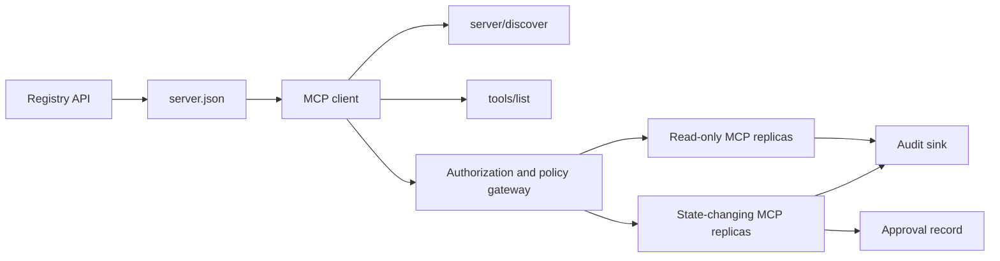

# 綜合專案 13：帶登錄庫與治理的無狀態 MCP 伺服器

> 生產級的 MCP 不是一支伺服器行程。它是一連串契約：可發布的中繼資料、即時發現、一份無狀態的請求信封、授權、政策、稽核，以及部署證據。

**類型：** 綜合專案
**程式語言：** Python 與 TypeScript 參考模型；生產環境用任何語言
**先修單元：** 階段 11、階段 13、階段 14、階段 17、階段 18
**必讀的 MCP 深入單元：** [第 28 課：工具契約](../../../13-tools-and-protocols/28-mcp-tool-contracts-and-content/docs/en.md)、[第 29 課：可靠性](../../../13-tools-and-protocols/29-mcp-reliability-cancellation-and-flow-control/docs/en.md)、[第 30 課：登錄庫供應鏈](../../../13-tools-and-protocols/30-mcp-registry-supply-chain-and-drift/docs/en.md)，以及[第 31 課：一致性維運](../../../13-tools-and-protocols/31-mcp-conformance-versioning-and-operations/docs/en.md)
**協定目標：** MCP `2026-07-28`
**時間：** 約 25 小時

## 學習目標

- 實作無狀態的 MCP 請求與結果信封。
- 讓登錄庫中繼資料與即時的協定發現分開。
- 做出確定的、會用快取的工具發現。
- 對每一次工具呼叫都強制簽發者、受眾、範圍與核可政策。
- 部署不依賴工作階段黏著的 Streamable HTTP。
- 在線路、授權、政策、登錄庫與稽核這幾道邊界上證明行為。

## 必修的 MCP 前置路線

在把這個綜合專案當成可上生產之前，先依序讀完那四堂連結過去的階段 13 課程：

1. [第 28 課](../../../13-tools-and-protocols/28-mcp-tool-contracts-and-content/docs/en.md)定義了這台伺服器必須暴露的工具、schema、內容、分頁、補全、路由與錯誤契約。
2. [第 29 課](../../../13-tools-and-protocols/29-mcp-reliability-cancellation-and-flow-control/docs/en.md)定義了取消競態、期限、幂等性、背壓、重試與重連行為。
3. [第 30 課](../../../13-tools-and-protocols/30-mcp-registry-supply-chain-and-drift/docs/en.md)定義了命名空間、來源出處、准入釘選、登錄庫狀態、漂移、帳本與回滾證據。
4. [第 31 課](../../../13-tools-and-protocols/31-mcp-conformance-versioning-and-operations/docs/en.md)定義了黃金與負向逐字紀錄、嚴格的版本紀元、SDK 差異檢查、代理證明、遮蔽、健康狀態與發布把關。

這個綜合專案是把那些產物整合起來。它不會用一個走順風路徑的 SDK 測試把它們取代掉。

## 問題所在

一個內部平台需要唯讀的資料工具，以及一小組會改變狀態的工具。開發者必須能夠發現這台伺服器、了解怎麼連上它、檢視它即時的能力，並且只呼叫他們被授權使用的操作。

難的部分不是把一個函式註冊進去。難的部分是讓六種不同的真相彼此對齊：

1. `server.json` 說的是這台伺服器可以在哪裡安裝或連到。
2. `server/discover` 說的是這支活著的行程現在支援什麼。
3. 每一個請求都說出它用的是哪個協定修訂版與哪些客戶端能力。
4. 授權把呼叫方綁到正確的簽發者、資源與範圍上。
5. 政策決定這一個具體動作可不可以執行。
6. 稽核證據記下有什麼跨過了邊界，同時不洩漏密鑰或敏感酬載。

這六項只要有一項漂掉，平台就可能列出一台連不上的伺服器、把不相容的客戶端路由過去、收下一個為別的資源簽發的權杖，或是在缺少預期審查的情況下暴露一個破壞性動作。

## 兩層發現

登錄庫與活著的 MCP 伺服器回答的是不同的問題。

| 層 | 契約 | 它回答的問題 |
|---|---|---|
| 發布 | `server.json` 與登錄庫 API | 這台伺服器是什麼、它的套件或遠端端點在哪、它怎麼設定？ |
| 執行期 | `server/discover` | 這支行程支援哪些協定版本、能力、擴充與伺服器身分？ |

官方登錄庫用的是有版本的 `server.json` schema。一筆遠端項目可以指名一個 Streamable HTTP 網址：

```json
{
  "$schema": "https://static.modelcontextprotocol.io/schemas/2025-12-11/server.schema.json",
  "name": "com.example/internal-readonly",
  "title": "Internal Read-Only Tools",
  "description": "Read-only incident and data lookup tools.",
  "version": "1.0.0",
  "remotes": [
    {
      "type": "streamable-http",
      "url": "https://mcp.internal.example.com/readonly"
    }
  ]
}
```

登錄庫的 schema 版本跟 MCP 協定修訂版是互相獨立的。不要為了讓兩者一致就去改寫其中一個日期。各自用它自己的契約去驗證。

schema 有效並不證明命名空間的所有權。一個針對 `example.com` 完成驗證的發布者，用的是反向 DNS 命名空間 `com.example/*` 或它底下的子命名空間。登錄庫的認證流程證明的就是那份所有權。把網域標籤留在平常的順序，指到的是另一個命名空間。

標準庫模型裡的 `validate_registry_document` 函式，刻意只是一個針對遠端側寫的部分驗證器。它檢查官方必填的 `name`、`description` 與 `version` 欄位；選配的 `title`；發布名稱與長度限制；具體版本的形狀；以及每一個 `streamable-http` 或 `sse` 遠端的 HTTP(S) 網址形狀。它另外要求 `remotes` 不得為空，因為這個綜合專案總是會去實際探測一個遠端。`validate_publisher_namespace` 另外把名稱對照已驗證的發布者網域做檢查，而 `validate_runtime_alignment` 則把發布用的名稱與版本跟即時的 `serverInfo` 做比對。官方 schema 也支援只有套件的紀錄，以及更多遠端欄位。發布之前，請用釘選的官方 JSON Schema 或 `mcp-publisher` 驗證整份文件；不要把這個零依賴的子集說成完整的 schema 驗證。

伺服器必須實作 `server/discover`；客戶端可以在呼叫其他方法之前先叫它。這個綜合專案的客戶端是在解析出端點之後叫它，並收到現行的協定修訂版與即時能力：

```json
{
  "resultType": "complete",
  "supportedVersions": ["2026-07-28"],
  "capabilities": {
    "tools": {
      "listChanged": false
    }
  },
  "_meta": {
    "io.modelcontextprotocol/serverInfo": {
      "name": "com.example/internal-readonly",
      "version": "1.0.0"
    }
  },
  "ttlMs": 3600000,
  "cacheScope": "public"
}
```

一個私有目錄可以額外索引所有權、審查或生命週期資料，但它不能把那些資料當成 MCP 線路欄位或 `server.json` 的根層欄位憑空造出來。把組織政策存在那筆已發布紀錄旁邊。當公開的自訂中繼資料非要不可時，用登錄庫的 `_meta.io.modelcontextprotocol.registry/publisher-provided` 擴充，並待在它 4 KB 的上限內。

## 無狀態的 MCP 核心

MCP 修訂版 `2026-07-28` 移除了協定工作階段，以及 `initialize` / `notifications/initialized` 握手。它也移除了 `Mcp-Session-Id`。

每一個請求都在 `params._meta` 裡帶著協定脈絡：

```json
{
  "io.modelcontextprotocol/protocolVersion": "2026-07-28",
  "io.modelcontextprotocol/clientCapabilities": {},
  "io.modelcontextprotocol/clientInfo": {
    "name": "internal-platform-client",
    "version": "1.0.0"
  }
}
```

版本與能力是請求的事實，不是連線的事實。負載平衡器可以把連續的請求送到不同的健康副本，因為任一個副本都能只從訊息本身驗證這個請求。

一般結果會帶 `resultType: "complete"`。伺服器應該在每一份結果裡，把自己的身分放進 `_meta.io.modelcontextprotocol/serverInfo`。協定版本缺漏或不是字串，是無效參數 `-32602`。錯誤 `-32022` 只用於「送來的字串是不支援的版本」，而且它的 data 必須剛好是 `{"supported": ["2026-07-28"], "requested": "..."}`。

### 可快取的發現

對同一組生效的工具集，`tools/list` 必須是確定的。結果裡包含：

- `ttlMs`，給客戶端的新鮮度提示；
- `cacheScope`，值是 `public` 或 `private`；
- 一個穩定的工具排序，好讓一樣的清單能重用提示詞快取；
- `resultType: "complete"` 與伺服器身分中繼資料。

逐使用者的授權通常應該產出 `cacheScope: "private"`。不要把因人而異的工具可見性放進共用的公開快取後面。

## Streamable HTTP

一台網路伺服器暴露一個接受 POST 的 MCP 端點。每一個 JSON-RPC 請求或通知各走自己的一次 POST。

對一個請求，伺服器回傳的是一個 JSON 物件，或一條範圍限定在那個請求上的 SSE 串流。一個長生命週期的 `subscriptions/listen` 請求會承載已選擇加入的變更通知。現行的傳輸裡沒有獨立的 GET 串流、沒有工作階段 DELETE、沒有工作階段標頭，也沒有 `Last-Event-ID` 重播。

每一個請求都包含：

- `MCP-Protocol-Version`，跟本體中繼資料一致；
- `Mcp-Method`，跟 JSON-RPC 方法一致；
- 給 `tools/call`、`resources/read` 與 `prompts/get` 用的 `Mcp-Name`；
- `Accept: application/json, text/event-stream`。

鏡像標頭不一致時，用規格指定的 `-32020` 錯誤拒絕。驗證 `Origin`、把本機開發伺服器綁在 loopback 上、對遠端客戶端做認證，並把一條被關掉的請求範圍 SSE 回應當成取消。



```figure
cf-mcp-gate
```

## 授權與政策

傳輸中繼資料不是授權。每一次呼叫都要驗證授權。

對遠端伺服器：

1. 發現受保護資源中繼資料。
2. 為那個資源選出授權伺服器。
3. 優先使用 Client ID Metadata Documents 做客戶端註冊。把動態客戶端註冊當成相容性支援。
4. 在授權過程中送出資源指示子。
5. 把回傳的 `iss` 值對照這次流程所記錄的授權伺服器做驗證。
6. 客戶端憑證以簽發者為鍵。絕不要跨簽發者重用註冊資料。
7. 在 MCP 伺服器上驗證權杖的簽發者、受眾或資源、到期時間與範圍。
8. 對具體的工具與引數再做第二次政策決策。

`readOnlyHint`、`destructiveHint` 這類工具註記有助於客戶端呈現風險。它們不是可信的授權控制。

### 核可是一筆紀錄，不是一個魔法範圍

一個會改變狀態的呼叫，需要一筆綁定行動者、工具、正規化引數或其摘要、目標環境、到期時間，以及一次性或可重複使用政策的核可紀錄。單靠一則聊天訊息不構成核可的證據。

Python 模型會對鍵排序過的正規 JSON 取雜湊，再把那份摘要跟權杖主體、工具名稱、伺服器網址與到期時間綁在一起。只要改動任何一個引數，重播那筆紀錄都會在處理器執行之前失敗。核可是獨立的證據，不是加在存取權杖上的一個範圍。

當這麼做能實質縮小影響範圍時，就把高風險工具留在一個可以獨立審查的介面上。分離只有在憑證、政策、部署身分與稽核控制也一起分離時才有用。

## 動手實作

### 1. 建模發布中繼資料

建立 `server.json` 並用 schema 驗證它。放進一個位於發布者已認證命名空間內的穩定名稱，再加上版本、描述、適用時的官方 `repository` 或 `packages` 中繼資料，以及一個遠端或 stdio 傳輸。把密鑰寫成宣告出來的環境變數輸入，絕不要寫成字面值。

### 2. 實作即時發現

在任何功能 RPC 之前先實作 `server/discover`。公告支援的協定版本、能力、擴充與伺服器身分。加上一個用 `-32022` 拒絕版本的案例。

### 3. 實作無狀態信封

要求每一個請求都帶協定版本與客戶端能力。在每一份結果裡回傳 `resultType` 與伺服器身分。移除初始化狀態、以連線為範圍的能力快取，以及工作階段識別碼。

### 4. 做出工具介面

先做兩個唯讀工具與一個會改變狀態的工具。每一個都給它一份有界的 JSON Schema、精確的描述、確定的結果形狀，以及誠實的註記。當客戶端會依賴有結構的結果時，加上輸出 schema。

### 5. 加上會用快取的列表

以穩定的順序回傳工具，並帶上 `ttlMs` 與 `cacheScope`。快取到期與清單變更通知的行為要分開操練。

### 6. 加上授權與政策

驗證簽發者、受眾、到期時間與範圍。每一次工具呼叫都跑一次政策決策。把核可綁到確切的高風險動作上。在執行處理器之前就拒絕缺漏或過期的核可。

### 7. 把登錄庫驗證與執行期驗證分開

先驗證那份靜態的 `server.json` 紀錄，再用 `server/discover` 探測那個遠端端點。當已發布的遠端、身分、版本或必要能力跟活著的行程不一致時，回報漂移。

### 8. 加上稽核證據

記下行動者、簽發者、資源、工具、政策決策、請求識別碼、追蹤脈絡、延遲與結果。在持久化之前把敏感的引數與結果遮蔽或取摘要。讓稽核匯出端待在模型看不見的地方。

### 9. 操練水平擴縮

在一個負載平衡器後面放兩個無狀態副本。送至少 100 個並行請求。示範正確性不依賴黏著。如果某個工具需要跨呼叫的狀態，就明確簽發一個不透明的把手，並把它存在一個共用的持久化系統裡。

### 10. 跨過真實的線路

對真正的伺服器執行檔跑一致性檢查。擷取請求標頭與 JSON 本體，不要只擷取 SDK 物件。操練錯誤版本、標頭不一致、缺少範圍、受眾錯誤、引數格式錯誤、處理器失敗、取消，以及快取到期。

## 必備的證據包

一份提交在集滿全部五類證據之前都算不完整：

| 證據 | 最低證明 | 來源單元 |
|---|---|---|
| 線路 | 黃金與負向案例的遮蔽後原始標頭與 JSON-RPC 本體，包含中繼資料型別失敗、標頭不一致、不支援的版本、`resultType` 缺漏或未知、通知無回應，以及回應 ID 對得上 | [第 31 課](../../../13-tools-and-protocols/31-mcp-conformance-versioning-and-operations/docs/en.md) |
| 代理 | 同一個穩定案例分別直連與經過已部署的中介執行，附上入口、原點與出口的狀態與本體摘要；證明協定錯誤沒有被塌成通用的 500 回應，而串流沒有被緩衝 | [第 29 課](../../../13-tools-and-protocols/29-mcp-reliability-cancellation-and-flow-control/docs/en.md)與[第 31 課](../../../13-tools-and-protocols/31-mcp-conformance-versioning-and-operations/docs/en.md) |
| 准入 | 已驗證的發布者命名空間、不可變的登錄庫紀錄摘要、產物或遠端的來源出處、即時的 `server/discover` 身分與能力觀察、描述子釘選、現行的登錄庫狀態，以及准入帳本事件 | [第 30 課](../../../13-tools-and-protocols/30-mcp-registry-supply-chain-and-drift/docs/en.md) |
| 重試 | 一次取消對完成的競態、明確的逾時、安全的讀取重試、變更操作的幂等鍵、重連後的重新取回，以及「請求取消不會默默變成持久任務取消」的證明 | [第 29 課](../../../13-tools-and-protocols/29-mcp-reliability-cancellation-and-flow-control/docs/en.md) |
| 回滾 | 確切的前一個版本、准入與產物摘要、描述子釘選、有效的登錄庫狀態、當前的健康觀察窗、路由復原結果，以及遮蔽後的決策證據 | [第 30 課](../../../13-tools-and-protocols/30-mcp-registry-supply-chain-and-drift/docs/en.md)與[第 31 課](../../../13-tools-and-protocols/31-mcp-conformance-versioning-and-operations/docs/en.md) |

把遮蔽後證據包的摘要跟這次發布存在一起。任何一類缺漏，就把發布壓下來。不要從一個行程內的派送器推論代理行為、從「登錄庫上有這筆」推論准入、從「換了一個新的 JSON-RPC id」推論重試安全，或從「上一次部署」推論回滾就緒。

## 本機參考模型

Python 模型示範登錄庫中繼資料、反向 DNS 發布者命名空間驗證、發布到執行期的身分檢查、即時發現、確定的工具列表、逐請求的中繼資料、可信簽發者／受眾／到期／範圍檢查、綁定動作的核可、一個寫進文件的部分登錄庫驗證器、政策與稽核，而且完全不開網路 socket：

```bash
cd phases/19-capstone-projects/13-mcp-server-with-registry
python3 code/main.py
python3 -m unittest discover -s code/tests -v
```

TypeScript 專案在 stdio 上暴露那個無狀態的 JSON-RPC 形狀，而且不用 MCP SDK。它的 `tools/call` 路徑強制執行 `tools/list` 所公告的同一組有界輸入 schema；已知工具收到無效引數時，會回傳一份帶 `isError: true` 的完整結果，而不會叫到執行器：

```bash
cd phases/19-capstone-projects/13-mcp-server-with-registry/code/ts
npm install
npm run typecheck
npm test
npm run demo
```

這些模型證明的是本機的契約邏輯。它們證明不了 HTTP 標頭、OAuth 交換、登錄庫發布、OPA 整合、負載平衡或收集器收件。

## 線路範例

```http
POST /mcp HTTP/1.1
Host: mcp.internal.example.com
Content-Type: application/json
Accept: application/json, text/event-stream
MCP-Protocol-Version: 2026-07-28
Mcp-Method: tools/call
Mcp-Name: postgres.readonly
Authorization: Bearer REDACTED

{
  "jsonrpc": "2.0",
  "id": 42,
  "method": "tools/call",
  "params": {
    "name": "postgres.readonly",
    "arguments": {"sql": "SELECT 1"},
    "_meta": {
      "io.modelcontextprotocol/protocolVersion": "2026-07-28",
      "io.modelcontextprotocol/clientCapabilities": {},
      "io.modelcontextprotocol/clientInfo": {
        "name": "internal-platform-client",
        "version": "1.0.0"
      }
    }
  }
}
```

## 產出交付

交付一個儲存庫，裡面有：

- 一份通過 schema 驗證的 `server.json`；
- 唯讀與會改變狀態的伺服器介面；
- `server/discover`、確定的 `tools/list`，以及受政策把關的 `tools/call`；
- 一套帶兩個可互換副本的 Streamable HTTP 部署；
- 授權與核可的整合；
- 一個登錄庫發布器，或一個私有登錄庫 API 轉接器；
- 政策定義與綁定動作的核可紀錄；
- 遮蔽後的稽核輸出與追蹤脈絡傳遞；
- 線路與代理的失敗證據；
- 准入、重試、健康與回滾證據，附上遮蔽後證據包的摘要。

| 權重 | 判準 | 證據 |
|---:|---|---|
| 25 | 協定正確性 | 無狀態的請求中繼資料、發現、結果、標頭與負向案例 |
| 20 | 授權 | 簽發者、受眾、到期、範圍與綁定動作的核可案例 |
| 15 | 登錄庫完整性 | 有效的 `server.json`、發布紀錄、即時發現探測與漂移報告 |
| 15 | 政策與安全 | 放行、拒絕、格式錯誤、過期核可與敏感資料案例 |
| 15 | 規模與可靠性 | 兩個副本、不依賴黏著、取消、逾時與復原 |
| 10 | 可稽核性 | 遮蔽後的接收端稽核與追蹤證據 |

## 練習

1. 改掉已發布的遠端網址，但不動活著的伺服器。讓登錄庫驗證回報出確切的漂移。
2. 用一樣的輸入送兩次 `tools/list`，證明工具排序在位元組層級穩定。然後讓 `ttlMs` 到期並重新取回。
3. 送一個有效的本體，但 `MCP-Protocol-Version` 標頭不同。回 `-32020`，而且不要叫到政策或工具。
4. 為唯讀伺服器簽發一個權杖，然後把它拿給會改變狀態的伺服器。證明受眾驗證在處理器執行之前就失敗。
5. 把一筆核可綁到一個正規化引數摘要上。改動一個欄位，證明那筆核可無法被重播。
6. 把連續的呼叫輪流路由到不同的副本。凡是流程需要持久性的地方，都把藏在行程記憶體裡的狀態換成一個明確的共用把手。
7. 弄斷一條請求範圍的 SSE 連線，然後用一個新的 JSON-RPC 請求 ID 重試。確認沒有用到任何 `Last-Event-ID` 復原路徑。

## 關鍵術語

| 術語 | 大家怎麼說 | 實際上是什麼 |
|---|---|---|
| 無狀態 MCP | 「哪裡都沒有狀態」 | 沒有協定工作階段；跨呼叫的狀態是明確的，並由伺服器管理 |
| `server.json` | 「那份工具清單」 | 用於命名、打包、設定與傳輸的登錄庫中繼資料 |
| `server/discover` | 「那個握手」 | 一個查詢即時版本與能力的普通必備 RPC，不是工作階段初始化器 |
| 快取範圍 | 「這個我可以快取嗎？」 | 一份可快取的結果，能不能安全地共用重用或只限私有重用 |
| 政策決策 | 「權杖允許這件事」 | 一個獨立的決策，對象是行動者、工具、目標、引數與脈絡 |
| 核可紀錄 | 「有個人點了同意」 | 在一份到期政策之下，綁定單一行動者與單一有後果動作的證據 |
| 明確把手 | 「一個工作階段 ID」 | 指向具名、由伺服器管理狀態的普通應用資料，不是協定的連線狀態 |

## 延伸閱讀

- [MCP 2026-07-28 key changes](https://modelcontextprotocol.io/specification/2026-07-28/changelog)
- [Streamable HTTP](https://modelcontextprotocol.io/specification/2026-07-28/basic/transports/streamable-http)
- [Server discovery](https://modelcontextprotocol.io/specification/2026-07-28/server/discover)
- [MCP authorization](https://modelcontextprotocol.io/specification/2026-07-28/basic/authorization)
- [Official Registry server.json requirements](https://github.com/modelcontextprotocol/registry/blob/main/docs/reference/server-json/official-registry-requirements.md)
- [Official Registry OpenAPI contract](https://registry.modelcontextprotocol.io/openapi.yaml)
