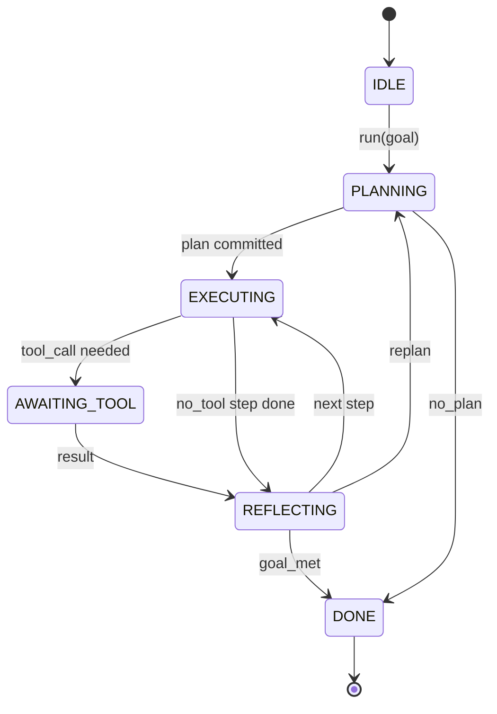

# 代理框架的迴路契約

> 框架才是那個代理。模型是個協處理器。這一課把那份「任何模型都接得進來」的迴路契約定死。

**類型：** 實作
**程式語言：** Python
**先修單元：** 階段 13 第 01-07 課、階段 14 第 01 課
**時間：** 約 90 分鐘

## 學習目標
- 把代理框架的迴路指定成一台帶明確轉移的確定性狀態機。
- 實作十個生命週期掛鉤主題，讓運營方把政策、遙測與護欄接進去。
- 定義兩個拉取點，迴路在那裡把控制權交還給呼叫方，並在收到新輸入後續跑。
- 強制執行逐工作階段的預算（輪數、工具呼叫、實際時間），且超標時不洩漏部分狀態。
- 發出一道帶十一種事件型別的型別化串流，好讓下游的 UI 與追蹤器不必直接窺探迴路就能訂閱。

```figure
cf-loop-contract
```

## 那個框架

一個無人看管跑四十輪的寫程式代理，不是一條聊天迴路。它是一台狀態機，運營方攔截得了它的節點、也稽核得了它的邊。一旦你把契約寫下來，換模型、換工具、換政策就不再是重構了。它變成一次註冊呼叫。

這一課就是要建出那份契約。我們命名六個狀態、十個掛鉤主題、兩個拉取點、十一種事件型別，以及一個預算信封。框架裡的其他一切（工具登錄庫、JSON-RPC 傳輸、派送器、規劃器）都插進這個形狀裡。

## 那些狀態

這條迴路有六個狀態。五個是活躍的。一個是終止的。



`IDLE` 是唯一合法的入口。`DONE` 是唯一合法的出口。`AWAITING_TOOL` 是唯一會產生拉取點的狀態。其餘每一次轉移都是內部的。

這台狀態機是確定性的。給定同樣的事件日誌，框架會回到同樣的狀態。就是這項性質，讓你能重播工作階段來除錯，而不必重新呼叫模型。

## 那些掛鉤主題

掛鉤是運營方進到迴路裡的接縫。框架會觸發十個主題。每個主題接受任意數量的訂閱者。訂閱者依註冊順序觸發。訂閱者可以修改酬載、拋出例外以中止該輪，或回傳一個哨符以跳過下一步。

```text
before_plan         after_plan
before_tool_call    after_tool_call
before_step         after_step
on_error
on_pause
on_budget_exceeded
on_complete
```

這個形狀反映了 Claude Code、Cursor 與 OpenCode 到 2025 年中所共同收斂出來的結果。這些名稱是功能性的，不是品牌化的。一個擋掉 `rm -rf` 的掛鉤住在 `before_tool_call`。一個送出 OpenTelemetry span 的掛鉤住在 `after_step`。一個在暫停的工作階段上續跑的掛鉤住在 `on_pause`。

## 那些拉取點

迴路會交出控制權兩次。第一次在 `AWAITING_TOOL`，當它沒有工具結果就無法推進時。第二次在 `on_pause`，當預算耗盡、或某個掛鉤明確要求人類審查時。

拉取點不是例外。它是一次回傳。呼叫方檢視框架狀態、取得框架所要的東西，然後呼叫 `resume(payload)`。框架就從停下來的地方接下去。這跟 Python 產生器是同一個形狀。拉取點上的傳輸由你決定。在 TUI 裡是按鍵。在 MCP 上是 `tools/call`。在佇列上是一次工作輪詢。

## 那道事件串流

迴路在契約中的特定點上，把事件附加到一道型別化的串流上。這道串流只能追加，訂閱者可以從任何偏移量開始重播。已實作的十一種事件型別是：

- `session.start` —— 在 `run(goal)` 被呼叫時發出一次
- `plan.draft` —— 規劃器回傳一份計畫草稿時發出
- `plan.commit` —— 草稿被確認為活躍計畫後發出
- `step.start` —— 在每一個執行步驟開始時發出
- `step.end` —— 在每一個執行步驟結束時發出
- `tool.call` —— 需要工具的步驟把控制權交還給呼叫方時發出
- `tool.result` —— 帶著工具結果續跑時發出
- `tool.error` —— 帶著錯誤續跑、或某個掛鉤中止該次呼叫時發出
- `budget.warn` —— 觸及某個預算上限時發出
- `session.pause` —— 迴路因暫停（預算或掛鉤）而交出控制權時發出
- `session.complete` —— 迴路抵達 `DONE` 時發出一次

事件不重複掛鉤的酬載。掛鉤是命令式的（修改、中止）。事件是觀察式的（記錄、送出）。把它們當成正交的。

## 那個預算信封

一個工作階段帶著三項上限。輪數、工具呼叫數、實際時間秒數。每一輪把輪數加一。每一次工具呼叫把工具呼叫數加一。實際時間在每一次狀態轉移時檢查。任一項上限被觸及時，迴路觸發 `on_budget_exceeded`、發出 `budget.warn`，然後在下一個拉取點帶著「預算超標」的理由轉移到 `IDLE`。

這份預算不是緊急停止開關。它是一次讓步。由呼叫方決定要延長預算並續跑，還是關掉這個工作階段。

## 這一課不做什麼

它不呼叫模型。它不註冊真實工具。它不實作傳輸。那些是接下來四課的事。這一課把契約釘死，好讓接下來四課插進來時不必重寫。

`main.py` 裡那個確定性規劃器是個替身。它回傳一份寫死的三步驟計畫，其中兩步需要工具結果。重點在迴路，不在計畫。

## 怎麼讀那些程式碼

`HarnessLoop` 是主類別。它持有狀態、觸發掛鉤、發出事件。`Budget` 追蹤上限。`Event` 是串流上那個型別化的信封。`HookRegistry` 是那張派送表。`_transition` 是唯一會改變狀態的函式，所以狀態機的不變量都住在同一個地方。

從頭到尾讀一遍 `main.py`。然後讀 `code/tests/test_loop.py`。那些測試把每一次轉移與每一次掛鉤的觸發順序都釘住了。

## 再往前走

在生產環境建框架，最難的部分不是狀態機。是讓契約變得可強制執行。這份契約得挺過規劃器的熱重載。得挺過一個回傳畸形 JSON 的工具。得挺過一個在四十輪工作階段跑到三分之二時、在 `before_tool_call` 裡拋出例外的掛鉤。這一課的測試就在演練那些失敗模式。去跑它們。把它們弄壞。再加案例。

下一課加上工具登錄庫。之後是 JSON-RPC 傳輸。再之後是派送器。到了第二十四課，這個檔案裡的迴路就會帶著真實預算、對真實工具跑一份真實計畫了。
