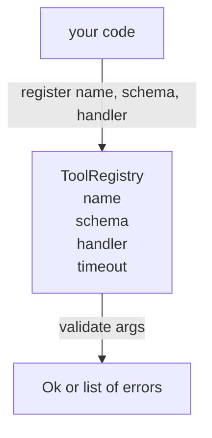

# 帶 Schema 驗證的工具登錄庫

> 代理驗證不了的工具，就是代理呼叫不了的工具。在建工具之前，先把登錄庫與 schema 檢查器建起來。

**類型：** 實作
**程式語言：** Python
**先修單元：** 階段 13 第 01-07 課、階段 14 第 01 課
**時間：** 約 90 分鐘

## 學習目標
- 持有一份「工具名稱 → schema → 處理器」的型別化登錄庫，讓派送器問一次之後就能信任它。
- 實作 JSON Schema 2020-12 的一個子集，涵蓋九成工具呼叫實際會用到的關鍵字。
- 回傳精確、呈 json-pointer 形狀的錯誤路徑，好讓模型能在一次往返中自我修正。
- 沒有明確覆寫就拒絕重複註冊，因為無聲的覆蓋正是生產工具目錄漂移的成因。
- 讓驗證器保持純粹（沒有 I/O、沒有時間、沒有全域變數），好讓它能在一份重播日誌上重跑。

```figure
cf-registry-validate
```

## 為什麼登錄庫排在工具之前

2026 年的寫程式代理，註冊的工具比模型單一個脈絡窗口塞得下的還多。一個非平凡的框架會註冊兩百個工具，並在任一輪次浮現其中十到四十個。登錄庫是「有哪些工具存在」、「它們的參數是什麼形狀」、「我該呼叫哪個處理器」的真實來源。這三個答案一旦釘住，框架其餘部分就不用再猜了。

我們要避開的錯誤是：出貨了沒有 schema 的處理器，或出貨了不做驗證的 schema。兩者都很常見。兩者都會把下一層（第二十三課的派送器）變成一場猜謎，而唯一的失敗模式是處理器丟出來的堆疊追蹤。

## 一筆工具紀錄長什麼樣

```text
ToolRecord
  name        : str          (unique, lowercase alphanumeric and underscore segments separated by dots, e.g., snake_case.segment.case)
  description : str          (one line, shown to the model)
  schema      : dict         (JSON Schema 2020-12 subset)
  handler     : Callable     (async or sync, returns Any)
  idempotent  : bool         (dispatcher uses this for retry decisions)
  timeout_ms  : int          (override per-tool dispatcher default)
```

schema 是驗證器唯一會碰的欄位。處理器對它而言是不透明的。我們刻意把它們分開。schema 是資料。處理器是程式碼。混在一起會誘使你把驗證邏輯放進處理器裡，而那正是我們要擋掉的臭蟲。

## JSON Schema 2020-12 的那個子集

完整的 2020-12 規格是一篇論文。我們需要八個關鍵字。

```text
type           string / number / integer / boolean / object / array / null
properties     map of property name -> schema
required       list of property names
enum           list of allowed primitive values
minLength      integer, applies to strings
maxLength      integer, applies to strings
pattern        ECMA-262-compatible regex, applies to strings
items          schema applied to every array element
```

那足以涵蓋一個工具 API 實際需要的東西。我們沒有加的那些關鍵字（oneOf、anyOf、allOf、$ref、條件式）在生產 schema 裡是合法的，但會把驗證器變成一台會走進環路的樹狀走訪器。我們在建的是登錄庫，不是一台 JSON Schema 引擎。

## Json pointer 的錯誤路徑

驗證失敗時，驗證器回傳一份錯誤清單。每個錯誤帶著一條指進輸入的 json-pointer 路徑。指標是一串以斜線為前綴的屬性名稱與陣列索引。

```text
{"a": {"b": [1, 2, "x"]}}
                    ^
                    /a/b/2
```

模型讀錯誤路徑讀得比讀句子好。若某個 schema 要求 `args.user.email`，而模型傳了一個整數，那個錯誤就該是 `/user/email` 配上 `expected_type: string`。模型會在下一次呼叫時修好它，不需要來回一輪自然語言。

## 註冊與覆寫

`register(name, schema, handler, **opts)` 預設拒絕重複註冊。呼叫方必須傳 `override=True` 才能取代。這是運維衛生。程式碼庫中兩個地方無聲地註冊了同一個工具名稱，這類臭蟲在生產環境裡要花一週才找得到。

登錄庫暴露三個讀取方法。`get(name)` 回傳那筆紀錄或拋出例外。`validate(name, args)` 回傳一個 `Ok` 或一份錯誤清單。`names()` 依註冊順序回傳工具名稱。

## 驗證器是什麼、不是什麼

它是對 schema 樹的單趟遞迴走訪。它是純粹的。它不呼叫處理器。它不做型別強制轉換（字串 `"42"` 通不過 number schema）。它不無聲地截斷。

它不是一道安全邊界。就算驗證通過了，一個惡意的處理器照樣可以亂來。第二十三課的派送器加上逾時與沙箱層。登錄庫加的是形狀。

## 形狀



## 怎麼讀那些程式碼

`code/main.py` 定義了 `ToolRegistry`、`ToolRecord`、`ValidationError`，以及那八個驗證函式。驗證器依 `schema["type"]` 派送（或把帶 `enum` 的 schema 當成無型別的列舉檢查）。每個型別驗證器回傳一份空清單，或一份 `ValidationError` 清單。頂層的走訪器把錯誤串接起來，並在下降時把路徑片段接到前面。

`code/tests/test_registry.py` 涵蓋註冊、覆寫、驗證成功、帶路徑的驗證失敗，以及那個子集裡的每一個關鍵字。

## 再往前走

這一課落地之後，你會想要的兩項擴充是：對本地定義區塊做 `$ref` 解析，以及用於嚴格形狀的 `additionalProperties: false`。兩者都不大。當工具目錄長過五十個工具時，兩者都很常被加上去。我們把它們排除在這一課之外，好讓檔案短到一次讀得完。

下一課（第二十二課）建出把這個登錄庫暴露給模型客戶端的 JSON-RPC stdio 傳輸。再下一課（第二十三課）用一個帶逾時與重試的派送器把兩者包起來。
