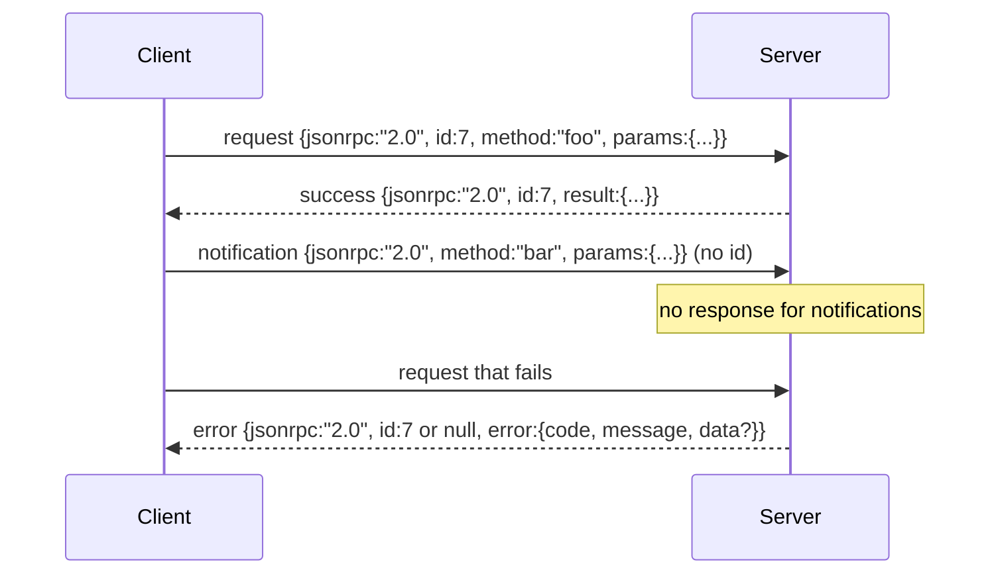

# 跑在換行分隔 stdio 上的 JSON-RPC 2.0

> 模型客戶端與工具伺服器之間的傳輸，是跑在 stdio 上的 JSON-RPC。手工造一次它，你就學到每一層封框到底在付什麼代價。

**類型：** 實作
**程式語言：** Python
**先修單元：** 階段 13 第 01-07 課、階段 14 第 01 課
**時間：** 約 90 分鐘

## 學習目標
- 在 stdin 與 stdout 上，以換行分隔 JSON 的方式封框並講 JSON-RPC 2.0。
- 對映那五個標準錯誤碼（-32700、-32600、-32601、-32602、-32603），並以正確的語意把它們浮現出來。
- 在不發明新信封鍵的前提下，分辨請求、回應、通知與批次。
- 每行處理一個剖析錯誤，而不毒害串流的其餘部分。
- 用 io.BytesIO 建一個會自我終止的示範，好讓這一課不必衍生子行程就跑得起來。

```figure
cf-jsonrpc-frames
```

## 為什麼 JSON-RPC 仍是通用語

2026 年的寫程式代理，一次工作階段大概會跟十二台工具伺服器對話。每一台都是獨立的行程或遠端端點。這個線上格式自 2013 年起就沒變過。JSON-RPC 2.0 是一份兩頁的規格。它活下來，是因為那些替代方案（gRPC、每次呼叫走一次 HTTP、自訂二進位）都強加了一項 JSON-RPC 沒有的取捨：它們在串流、批次或傳輸耦合之間只能挑一個。JSON-RPC 在 stdio、socket、websocket 與 HTTP 上都對稱，而只要雙方都遵守規格，客戶端就驅動得了一台它從沒見過的伺服器。

這一課建的是 stdio 版本。換行分隔的 JSON。每個請求一行。每份回應一行。傳輸邊界是 `\n`。

## 那個線上形狀

有四種信封形狀。兩種由客戶端講。兩種由伺服器講。



通知沒有 `id`。伺服器不得回應它。若伺服器對通知回了一份回應，客戶端沒辦法把它掛回任何呼叫點。就這一條規則，讓封框的算術保持簡單。

批次是一個由請求或通知組成的 JSON 陣列。伺服器回一個回應陣列，順序不拘，每一個非通知項目對應一份。若批次裡每一項都是通知，伺服器什麼都不回。

## 那五個錯誤碼

```text
-32700  Parse error      JSON could not be parsed
-32600  Invalid Request  Envelope shape is wrong
-32601  Method not found
-32602  Invalid params
-32603  Internal error
```

-32000 到 -32099 之間的碼保留給伺服器自定的錯誤。其餘都由應用自行定義。這一課只用那五個。若你的處理器拋出例外，傳輸層會把它包成 -32603，並在 `data.exception` 裡放上例外類別名稱。

剖析錯誤有一條特別規則。回應裡的 `id` 是 `null`，因為那個請求根本沒剖析到足以抽出 id 的程度。

## 換行封框與 BytesIO 示範

傳輸層一次讀一行。一行是直到並含 `\n` 為止的位元組。若某一行剖析不了，傳輸層就寫出一份 `id: null` 的 -32700 回應，然後繼續。串流沒有被毒害。下一行會重新被剖析。

在這一課裡，我們把一對 `io.BytesIO` 包成 stdin 與 stdout。伺服器讀請求直到 EOF、替每一個寫出回應，然後返回。客戶端再把那些回應讀回來。沒有行程衍生。沒有逾時。傳輸行為與真正的子行程管線一模一樣，因為 Python 的 `io` 介面呈現的是同一套 `.readline()` 與 `.write()` 契約。

## 方法派送

傳輸層不知道有哪些方法存在。它把工作交給框架提供的一個可呼叫物 `handler(method, params)`。處理器回傳結果或拋出例外。三種例外類別會浮現特定的錯誤碼。

```text
MethodNotFound -> -32601
InvalidParams  -> -32602
Anything else  -> -32603 with exception name in data
```

傳輸層從不看見工具登錄庫。登錄庫坐在處理器後面。這就是我們要的分層。傳輸層講 JSON-RPC。登錄庫講工具形狀。派送器（第二十三課）把它們縫起來。

## 出錯時的串流行為

```text
client writes              server reads             server writes
---------------            -----------              -------------
{...valid request...}      parses ok                {...response, id matches...}
{...broken json...         parse fails              {id:null, error: -32700}
{...valid request...}      parses ok                {...response, id matches...}
{...missing method...}     invalid envelope         {id:X, error: -32600}
```

一行壞掉的 JSON 不會停下迴路。缺少 `method` 欄位不會停下迴路。處理器丟出例外不會停下迴路。傳輸層一路讀到 EOF。

## 通知與非對稱流

通知是發完就忘。框架用通知來傳進度事件、取消訊號與日誌行。通知就是一個長時間執行的工具，能在不需為每一則狀態更新來回一趟的情況下串流狀態的方式。

這一課實作了一個對外的通知輔助函式，`write_notification`。伺服器在請求執行中用它送出進度。示範展示了那個模式：一個請求進來，處理器送出兩則進度通知，然後才寫出最終回應。

## 怎麼讀那些程式碼

`code/main.py` 定義了 `StdioTransport`、剖析輔助函式（`parse_request`）、三個寫入輔助函式（`write_response`、`write_error`、`write_notification`），以及派送迴路 `serve`。錯誤碼常數住在模組作用域裡。

`code/tests/test_transport.py` 涵蓋那五個錯誤碼、通知（不寫回應）、批次（進去一個陣列、出來一個陣列、通知被略過）、壞掉的 JSON（先剖析錯誤再繼續），以及處理器在呼叫進行中寫出通知的那種非對稱流。

## 再往前走

這個傳輸層對後續的課程來說夠用了。生產環境的傳輸還會多三樣東西。一個能挺過轉發的關聯 id 欄位（你的 `id` 已經是這個了，但在網格裡你還需要一個外層的追蹤 id）。一條取消通道（像是帶著進行中呼叫 id 的 `$/cancelRequest` 通知）。以及一次內容型別協商的握手，好讓同一條 socket 既能講 JSON-RPC 也能講 Streamable HTTP。這些都不改變線上格式。它們加的是中繼資料。
