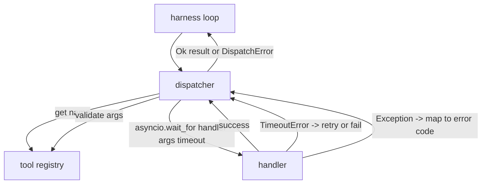
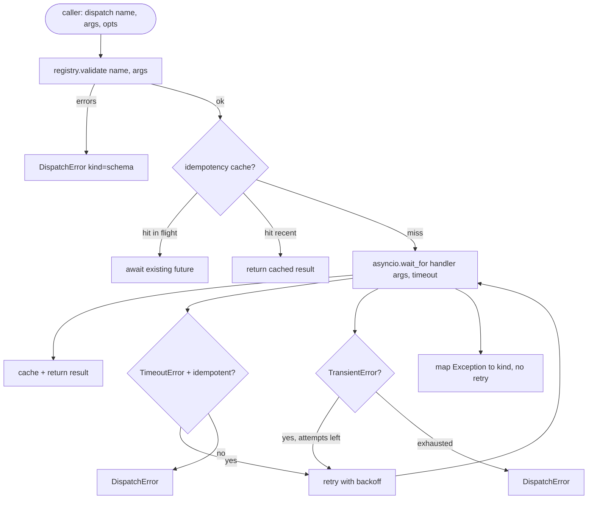

# 函式呼叫派送器

> 派送器就是框架替 schema 開出的每一張支票兌現的地方。逾時、重試、去重、錯誤對映。全都在同一道接縫上。

**類型：** 實作
**程式語言：** Python
**先修單元：** 階段 13 第 01-07 課、階段 14 第 01 課
**時間：** 約 90 分鐘

## 學習目標
- 把工具處理器包在一個逐次呼叫的逾時裡，讓它回傳一個型別化的錯誤，而不是把迴路掛死。
- 套用帶抖動與最大嘗試次數的指數退避重試。
- 依冪等鍵替重試去重，讓一次與緩慢原呼叫賽跑的重試不會跑兩遍。
- 把處理器例外與傳輸故障，對映到一個框架迴路早就懂的統一錯誤信封上。
- 用一個併發上限界住平行派送，好讓四十次工具呼叫的扇出不會把事件迴路榨乾。

```figure
cf-dispatch-retry
```

## 派送器坐在哪裡

在框架迴路（第二十課）與工具登錄庫（第二十一課）之間。傳輸層（第二十二課）餵給迴路。迴路把一次工具呼叫交給派送器。派送器呼叫登錄庫、執行處理器，然後回傳一個結果，或一個呈 JSON-RPC 形狀的錯誤信封。



派送器是唯一知道計時器、重試與冪等性的那一層。迴路不知道。登錄庫不知道。處理器不知道。那份隔離就是重點。

## 逾時

每個工具都有一個預設逾時。登錄庫紀錄帶著 `timeout_ms`。當框架傳入逐次呼叫的覆寫值時，派送器就用它覆蓋掉。我們用 `asyncio.wait_for`。逾時發生時，處理器任務被取消，派送器回傳 `DispatchError(kind="timeout")`。

對非冪等工具而言，逾時預設不是可重試的錯誤。一次逾時的 `db.write` 可能已經提交、也可能沒有。重試會讓寫入重複。派送器尊重登錄庫紀錄裡的 `idempotent` 旗標。冪等工具會重試。非冪等工具不會。

## 帶指數退避的重試

重試政策是最多三次嘗試。退避是帶抖動的指數式。

```text
attempt 1  -> delay 0
attempt 2  -> delay 0.1s * (1 + random[0..0.5])
attempt 3  -> delay 0.4s * (1 + random[0..0.5])
```

只有 `timeout` 與 `transient` 錯誤會重試。`schema` 錯誤、`not_found`，或 `internal` 錯誤不會重試。Schema 錯誤是確定性的。重試不改變結果，只是燒預算。

重試迴路尊重來自框架的預算。若呼叫方的預算已經沒有剩餘的工具呼叫額度，派送器會在第一次嘗試就快速失敗，並回傳 `kind="budget_exceeded"`。

## 冪等鍵去重

一次在原呼叫還在飛的時候就發動的重試，是一個真實的生產臭蟲。第一次呼叫卡在 4.9 秒（就在逾時之下）。重試在 5 秒發動。現在有兩個請求對著同一個後端賽跑。若那個工具是 `payments.charge`，你就扣了兩次款。

派送器接受一個選擇性的 `idempotency_key`。若某次呼叫抵達時同一把鍵還在飛，派送器就等在那個進行中的 future 上，並回傳它的結果。快取在完成後保留鍵 60 秒，以吸收遲來的重試。

那把鍵是呼叫方的責任。框架從規劃器導出它：`f"{step_id}:{tool_name}:{hash(args)}"`。派送器不自己發明鍵，因為只從參數導出鍵，會讓兩個語意上不同的呼叫看起來一樣。

## 錯誤信封

一次失敗的派送回傳單一種形狀。

```text
DispatchError
  kind        : "timeout" | "transient" | "schema" | "not_found" | "internal" | "budget_exceeded"
  message     : str
  attempts    : int
  jsonrpc_code: int   (one of -32601, -32602, -32603)
```

框架迴路把 `kind` 對映到下一個狀態。`schema` 與 `not_found` 走到 `on_error` 並觸發重新規劃。`timeout` 與 `transient` 走到 `on_error`，是否重新規劃視嘗試次數而定。`budget_exceeded` 觸發 `on_budget_exceeded`。

## 扇出上的併發上限

`gather(*calls)` 會同時跑所有協程。四十次工具呼叫，就是四十條打開的 socket 或四十條子行程管線。多數後端不喜歡來自單一客戶端的四十條平行連線。

派送器把 `gather` 包在一個號誌裡。預設併發上限是八。每次呼叫在派送前先取得號誌，完成時釋放。呼叫方看到的是 `gather` 形狀的輸出，但實際排程是有界的。

## 一次呼叫的流程



## 怎麼讀那些程式碼

`code/main.py` 定義了 `Dispatcher`、`DispatchError` 與 `TransientError`。派送器在建構時吃進一個登錄庫。非同步的 `dispatch(name, args, ...)` 是唯一的入口點。逐次嘗試的逾時在 `_run_with_retries` 裡以 `asyncio.wait_for` 內聯套用。`gather_bounded(calls)` 在併發上限之下跑很多次派送。

`code/tests/test_dispatcher.py` 涵蓋逾時觸發、暫時性錯誤上的重試、schema 錯誤上的不重試、冪等去重（兩次帶同一把鍵的並行呼叫收斂成一次處理器呼叫），以及併發限制（號誌實際運作）。

那些測試用 `asyncio.sleep(0)` 與以 `Counter` 為基礎的確定性處理器，所以它們在毫秒內就跑完，而且不依賴實際時鐘。

## 再往前走

生產派送器會加上兩項擴充。第一，在每一次轉移都做結構化記錄（迴路的事件串流已經給了你這個，但派送器也該送出 `dispatch.attempt` 與 `dispatch.retry` 事件）。第二，斷路器：在一個時間窗內失敗 N 次之後，某個工具就進入冷卻期，那期間的派送會立刻以 `kind="circuit_open"` 回傳，而不去嘗試處理器。兩者都能疊在這個派送器之上，而不必改動契約。

第二十四課把派送器黏到一個規劃並執行的代理上，好讓你看見全部四塊一起動起來。
