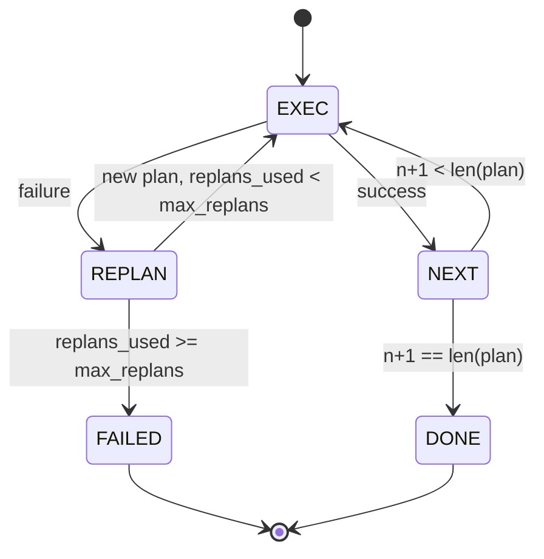

# 規劃－執行的控制流

> 挺不過一次失敗的計畫是一份腳本。一份能重新規劃的腳本才是一個代理。先把重新規劃器建出來。

**類型：** 實作
**程式語言：** Python
**先修單元：** 階段 13 第 01-07 課、階段 14 第 01 課
**時間：** 約 90 分鐘

## 學習目標
- 把計畫表示成一份有序的型別化步驟清單，好讓執行器能對進度與結果做推理。
- 依序執行步驟，並在失敗時以受控的方式交還給規劃器。
- 從當前游標處重新規劃，並把先前的錯誤放進脈絡裡，好讓下一份計畫是有依據的。
- 每次修訂都送出一份計畫差異，好讓下游的追蹤器或 UI 能展示計畫為何改變。
- 強制執行兩份預算：一個硬性的步驟上限，以及一個硬性的重新規劃上限。

```figure
cg-plan-replan
```

## 規劃並執行，不是思維鏈

思維鏈代理吐出詞元，然後讓迴路去猜工具呼叫在哪裡結束。規劃並執行的代理先吐出一份結構化的計畫，再確定性地執行每一步。計畫是框架內省得了的資料。執行則是框架把那份資料跑過一個派送器。

兩塊東西。一個產出計畫的規劃器。一個執行計畫的執行器。有意思的工作在於執行器撞到失敗時會發生什麼。三個選項：

```text
1. Abort         (return failed, surface the error)
2. Skip          (mark step failed, continue with the rest)
3. Replan        (hand the error to the planner, get a new plan from the cursor)
```

重新規劃才是把腳本變成代理的那一個。

## Step 的形狀

```text
Step
  id              : int           (monotonic within a plan revision)
  tool_name       : str
  args            : dict
  expected_outcome: str           (planner's stated success condition)
  result          : Any | None
  error           : str | None
```

`expected_outcome` 是規劃器跟著步驟一起吐出來的一句短話。執行器不強制它。它有兩個用途：重新規劃器在修訂計畫時會讀它；事件串流會把它送出去，好讓追蹤器能顯示「這一步本來應該做 X」。

## 規劃器的形狀

```python
def planner(goal: str, history: list[Step], last_error: str | None) -> list[Step]:
    ...
```

一個純函式。`goal` 是使用者目標。`history` 是已經執行過的步驟（結果與錯誤都填好了）。`last_error` 在第一次呼叫時是 None，其後每一次都是最近一則失敗訊息。規劃器回傳從游標開始的下一份計畫。

規劃器不知道執行器。它不知道重試。它不知道逾時。它產出一份計畫。就這樣。

## 執行器

執行器是一台小型狀態機。每一步都跑過派送器。結果是三種之一：成功、可重新規劃的失敗、致命失敗。可重新規劃的失敗交還給規劃器。致命失敗（預算超標、撞到重新規劃上限）回傳一個 `FAILED` 的工作階段結果。



## 修訂時的計畫差異

當規劃器在一次失敗之後回傳一份新計畫時，執行器會送出一個帶三個欄位的 `plan.diff` 事件。

```text
removed: list of step ids that were in the old plan and are not in the new
added  : list of step ids in the new plan that were not in the old
revised: list of step ids whose tool_name or args changed
```

追蹤器或 UI 可以把它渲染成：被移除步驟上的刪除線，以及被加入步驟上的高亮。重點不在那個差異格式。重點在於修訂是一個看得見的事件，不是一次無聲的改寫。

## 兩份預算，兩份都是硬的

`max_steps` 限制整個工作階段的總步驟執行數，包含重新規劃在內。預設是十二。一份線性的五步驟計畫若重新規劃兩次、每次各加三步，就會到十六次執行而超出預算。執行器會拒絕那次重新規劃並回傳 FAILED。

`max_replans` 限制第一份計畫之後規劃器被呼叫的次數。預設是五。這是比較重要的那個上限。一個連續五次回傳同一份壞計畫的規劃器，否則就會一路迴圈到步驟預算把它逮住。限制重新規劃次數，讓失敗來得更快、理由也更清楚。

## 這一課裡的確定性規劃器

這一課我們不呼叫模型。這一課出貨的是一個依 `last_error` 挑計畫的確定性規劃器。

```text
last_error is None    -> emit a four-step plan
last_error matches X  -> emit a three-step plan that routes around X
last_error matches Y  -> emit a two-step plan that gives up gracefully
otherwise             -> return [] (signals nothing to replan)
```

這足以在每一條轉移路徑上測試執行器的行為：成功、重新規劃一次、重新規劃兩次、重新規劃額度耗盡，以及步驟預算耗盡。

## 結果的形狀

```text
SessionResult
  status      : "completed" | "failed"
  reason      : str     ("goal_met" | "step_budget" | "replan_budget" | "no_plan")
  history     : list[Step]
  revisions   : list[PlanDiff]
  events      : list[Event]
```

第二十課的框架迴路可以直接讀它。第二十三課的派送器就是執行每一步的那個東西。第二十一課的登錄庫驗證每一步的參數。第二十二課的傳輸層會把這整條流程透過 JSON-RPC 浮現給模型客戶端。

## 怎麼讀那些程式碼

`code/main.py` 定義了 `PlanExecuteAgent`、`Step`、`PlanDiff`、`SessionResult`，以及那個確定性規劃器。執行器是單一個回傳 `SessionResult` 的 `run(goal)` 方法。計畫差異則是比較步驟 id 與 `(tool_name, args)` 元組算出來的。

`code/tests/test_agent.py` 涵蓋線性成功、計畫中途失敗並重新規劃一次、重新規劃額度耗盡而回傳 `failed:replan_budget`、步驟預算耗盡，以及計畫差異的事件格式。

## 再往前走

一旦你把它接到真實模型上，你會想要兩項擴充。第一，部分計畫快取：當一份六步驟計畫的前三步成功、之後才失敗時，你不會想把前三步重跑一遍。執行器已經保留了歷史；規劃器只要去讀它就好。第二，平行分支：目前的執行器嚴格依序執行。一個吐出獨立分支（`gather_step` 而不是 `next_step`）的規劃器，就能透過派送器並行跑兩次工具呼叫。

兩者都增加了實際的複雜度。兩者在線性執行器被釘住之後都比較好加。而那就是這一課做的事。
