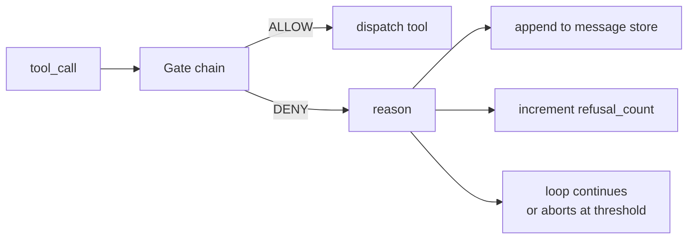
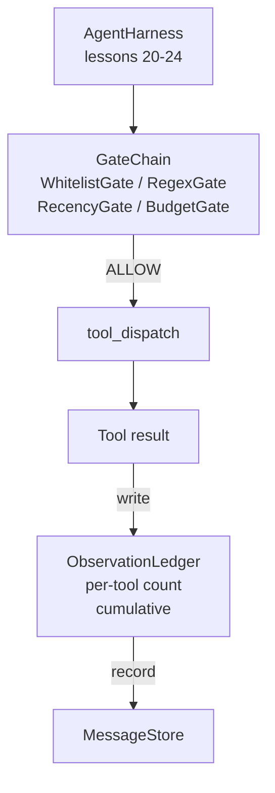

# 綜合專案第 25 課：查證閘門與觀察預算

> 一個沒有查證層的代理框架，是一個披著風衣的願望。這一課要建出那條確定性的閘門鏈，由它決定一次工具呼叫准不准發動、代理被允許看見多少輸出，以及迴路何時因為代理讀太多而必須停下來。這條鏈是一組小巧、有名字的閘門所組成的函數，加上一本追蹤「模型被展示過的每一個詞元」的觀察分類帳。

**類型：** 實作
**程式語言：** Python (stdlib)
**先修單元：** 階段 19 · 20-24（A1 軌：代理迴路、工具登錄庫、訊息儲存、提示詞建構器、模型路由器）、階段 14 · 33（把指示當成約束）、階段 14 · 36（範圍契約）、階段 14 · 38（查證閘門）
**時間：** 約 90 分鐘

## 學習目標

- 建出一個帶確定性 `evaluate(call)` 方法的 `VerificationGate` 協定。
- 把預算、近期性、白名單與正規表示式閘門，組合成一條帶短路語意的鏈。
- 透過一本以工具與輪次為鍵的 `ObservationLedger` 追蹤每一次觀察。
- 當累積觀察預算會被超出時，拒絕一次工具呼叫。
- 浮現一份結構化的 `GateDecision` 紀錄，供下游的可觀測性攝取。

## 那個問題

當代理框架讓模型自由呼叫工具時，真實使用的第一個小時內就會冒出三類臭蟲。

第一類是無界的觀察。對一個 20 萬行的儲存庫做一次 grep，會把 50 萬個詞元的輸出倒進下一輪。模型每千位元組看到一個相符項，脈絡其餘部分全浪費掉。詞元帳單很大，而代理在這項任務上變得更差，不是更好。

第二類是過期的近期性。一項長時間執行的任務累積了五十次工具呼叫。模型把第三輪的第一次 read_file 當成活的狀態重讀一遍。第四十七輪做的編輯從沒現身，因為提示詞建構器把最早的觀察排在最前面序列化了。

第三類是權限蔓延。一項研究任務從呼叫 `web_search` 開始，然後不知怎地跑去執行 `shell`，因為模型發明了一個工具名稱，而框架預設是放行的。等到有人去讀那份軌跡時，/tmp 裡已經躺了一個垃圾檔案，而且有一次 curl 打到了私有 API。

查證閘門就是那個會說不的框架元件。它不是模型。它不是裁判。它是一個 `(call, history, ledger)` 的確定性函數，回傳 ALLOW 或 DENY 加上一個理由。理由被記錄下來。模型被告知。迴路繼續或中止。

## 那個概念



閘門就是任何帶有 `evaluate(call, ctx) -> GateDecision` 方法的東西。鏈是一份有序清單。評估在第一次拒絕時短路。順序要緊：便宜的結構性閘門跑在昂貴的詞元計數閘門之前。

這一課出貨四道閘門：

- `WhitelistGate`。允許的工具名稱是一個明確集合。之外的一律拒絕。這是最便宜的閘門，跑第一個。
- `RegexGate`。工具參數以正規表示式比對。用來拒絕帶 `rm -rf` 的 shell 呼叫，或打到內部 IP 的 HTTP 呼叫很好用。純粹作用在呼叫酬載上。
- `RecencyGate`。模型只看得到最近 N 輪的觀察。較舊的觀察會被遮蔽。這道閘門會拒絕那些「其結果會延伸一個已經老化過期之觀察窗口」的工具呼叫。
- `BudgetGate`。模型在整個工作階段讀過的累積詞元有一個上限。當分類帳說上限到了，其後每一次工具呼叫都被拒絕。

觀察分類帳就是那本帳。每一次成功的工具呼叫都寫一列：工具名稱、輪次、送出的詞元數、累積數。這本分類帳回答兩個問題：模型總共看了多少，以及它看了工具 X 多少。預算閘門讀第一個。至於逐工具的預算閘門，你會在練習裡寫，它讀第二個。

## 架構



框架去問那條鏈。鏈要嘛點頭、要嘛拒絕。點頭的話，工具就跑、分類帳就記一筆，結果被附加到訊息儲存上。拒絕的話，那份拒絕就以系統訊息交給模型，由迴路決定要重試還是中止。

## 你會建出什麼

實作是單一個 `main.py` 加上測試。

1. `Observation` 與 `ToolCall` 這兩個 dataclass 定義了線上的形狀。
2. `ObservationLedger` 記錄 `(turn, tool, tokens)` 各列，並回答 `cumulative()` 與 `per_tool(name)`。
3. `GateDecision` 帶著 `(allow, reason, gate_name)`。
4. `VerificationGate` 是那個協定。每道閘門都實作 `evaluate(call, ctx)`。
5. `GateChain` 包住一份有序清單。它呼叫每一道閘門，回傳第一次拒絕，或在每一道都通過時回傳允許。
6. 那個示範跑一個極小的合成代理迴路。三輪。第三輪絆到預算閘門，迴路以非零的拒絕計數回報一次乾淨的拒絕。

那個詞元計數器刻意做成一個笨拙的 `len(text) // 4` 捷思。這一課的重點在閘門的管路，不在分詞器。生產環境請換一個真的分詞器進去。

## 為什麼鏈的順序要緊

一次拒絕比一次允許便宜。`WhitelistGate` 跑的是 O(1) 的雜湊查找。`RegexGate` 跑的是 O(pattern * argv)。`RecencyGate` 讀訊息儲存的一小片。`BudgetGate` 讀整本分類帳。你依成本遞增排序它們，好讓被拒絕的呼叫在做那些昂貴工作之前就短路。

你也依爆炸半徑排序它們。白名單是最強的主張：這個工具不在契約裡。正規表示式閘門其次：這個參數不在契約裡。近期性再其次：框架還是在意，但這次呼叫在結構上是合法的。預算擺最後，因為就定義而言，它只有在其他全都通過時才會發作。

## 這與 A 軌其餘部分怎麼組合

前面幾課給了你迴路、工具登錄庫、訊息儲存、提示詞建構器與模型路由器。這一課加上模型與工具之間那一層。第 26 課出貨那個沙箱 —— 閘門鏈說 ALLOW 之後，派送器就把工具呼叫交給它。第 27 課出貨那個把拒絕計數當成品質訊號記錄下來的評估框架。第 28 課把閘門決策接進 OpenTelemetry span。第 29 課把這一切縫成一個能動的寫程式代理。

## 怎麼跑它

```bash
cd phases/19-capstone-projects/25-verification-gates-observation-budget
python3 code/main.py
python3 -m pytest code/tests/ -v
```

那個示範會逐輪印出一份軌跡，含每一次閘門決策，並以零結束碼退出。那些測試涵蓋分類帳、各道閘門的獨立行為、鏈的短路，以及那個合成迴路的端到端行為。
