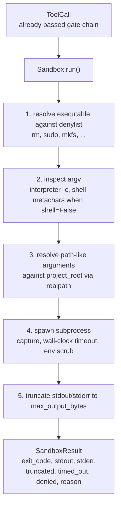
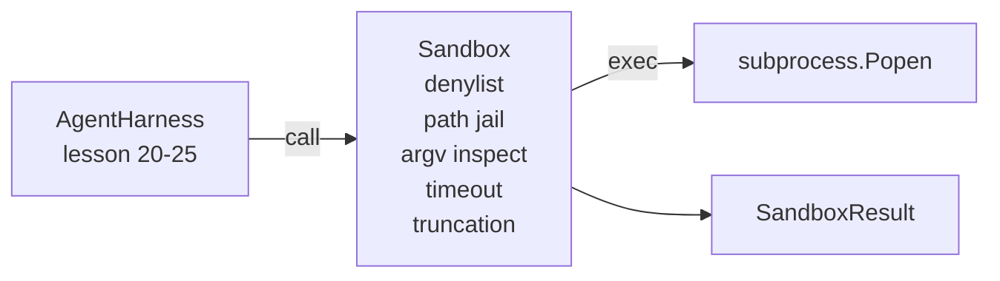

# 綜合專案第 26 課：帶拒絕清單與路徑牢籠的沙箱執行器

> 查證閘門決定一次工具呼叫該不該跑。沙箱決定它真的跑起來時會發生什麼。這一課出貨一個子行程執行器：它拒絕危險的可執行檔、拒絕危險的 argv 形狀、把每一條檔案路徑關進一個專案根目錄的牢籠、把過大的輸出截斷，並在實際時間逾時時殺掉失控的行程。它是坐在模型與作業系統之間那兩層裡的第二層。

**類型：** 實作
**程式語言：** Python (stdlib)
**先修單元：** 階段 19 · 25（查證閘門與觀察預算）、階段 14 · 33（把指示當成約束）、階段 14 · 38（查證閘門）
**時間：** 約 90 分鐘

## 學習目標

- 建出一個把 `subprocess.run` 包起來、帶逾時、擷取與截斷的 `Sandbox` 類別。
- 依拒絕清單以名稱拒絕一道指令，並依 argv 檢查器以結構拒絕它。
- 拒絕任何解析後落在宣告的專案根目錄之外的路徑參數。
- 在非 shell 模式下拒絕 shell 中介字元。
- 回傳一份結構化的 `SandboxResult`，供下游的可觀測性與評估框架攝取。

## 那個問題

一個能開 shell 的寫程式代理，可以在一輪之內裝後門、外洩金鑰、把開發者的筆電變磚，並累積一筆雲端帳單。成本最低的防禦是不要給它 shell。第二低的是一個對一份精確樣式清單說不的沙箱。

代理軌跡裡反覆出現三類失敗。

第一類是危險的可執行檔。一個被逼著要修好路徑問題的模型會去試 `sudo`、`chmod -R 777`、`rm -rf`、`mkfs`、`dd`。這些沒有一個屬於代理的執行過程。拒絕清單以名稱與別名把它們攔下。

第二類是 argv 花招。一個被告知不准用 shell 的模型，會把攻擊透過直譯器管進去：`python3 -c "import os; os.system('rm -rf /')"`、`bash -c '...'`、`node -e '...'`、`perl -e '...'`。沙箱得知道，任何帶著類 `-c` 旗標執行的直譯器，都只是多繞幾步的 shell 呼叫。

第三類是路徑逃逸。模型被告知去讀 `./src/main.py`，結果卻讀了 `../../etc/passwd`。沙箱把每一個路徑參數透過 `os.path.realpath` 解析、並主張前綴，藉此把它關進牢籠。

沙箱不是作業系統意義上的安全邊界。一個握有程式碼執行能力、鐵了心的攻擊者仍然逃得出去。沙箱是一道開發期的護欄：它讓常見的失敗模式變得吵，並阻止代理純粹因為笨拙而造成損害。

## 那個概念



沙箱有四條拒絕軸：名稱、argv、路徑、結構。每一條軸都是那次呼叫的純函數，此時還沒有子行程。子行程只在每一條軸都通過之後才衍生出來。

`SandboxResult` 的結束碼是慣例的那些：0 成功、非零失敗，加上三個哨符碼分別給被拒絕（-100）、逾時（-101），以及被截斷（結束碼是真的那個，另外設一個旗標）。下游的課程讀的是這份結構化結果，而不是去剖析 stderr。

## 架構



拒絕清單是一個由可執行檔基本名稱組成的 frozenset。別名（`/bin/rm`、`/usr/bin/rm`）全都解析到同一個基本名稱。argv 檢查器知道直譯器的形狀：任何 argv[0] 是直譯器、且後面任一個參數以 `-c` 或 `-e` 開頭的呼叫都會被拒絕。當那次呼叫沒有明確要求 shell 時，shell 中介字元（`;`、`|`、`&`、`>`、`<`、反引號、`$()`）會導致拒絕。

路徑牢籠是最微妙的那一塊。沙箱在建構時接受一個 `project_root`。任何看起來像路徑的參數（含 `/`，或與既有檔案相符）都會透過 `os.path.realpath` 正規化，然後對照專案根目錄的 realpath 檢查。若解析後的目標不在根目錄之下，就拒絕。符號連結的逃逸嘗試（專案根目錄裡有個指向外面的符號連結）會因為檢查的是 realpath 而不是字面路徑而被擋下。

## 你會建出什麼

實作是 `main.py` 加上一個測試目錄。

1. `SandboxResult` dataclass：exit_code、stdout、stderr、truncated、timed_out、denied、reason、duration_ms。
2. `SandboxConfig` dataclass：project_root、max_output_bytes、timeout_seconds、denylist、interpreter_block。
3. `Sandbox` 類別：`run(argv, *, shell=False, cwd=None)` 回傳一份 `SandboxResult`。
4. 內部的拒絕輔助函式：`_check_executable_denylist`、`_check_argv_interpreter`、`_check_shell_metachars`、`_check_path_jail`。
5. 輸出截斷，帶一個清楚的 `truncated` 旗標，並在被擷取的串流裡放一行標記。
6. 底部的示範：一連串正當與對抗性的呼叫。每一個都連同它的結果一起顯示。

沙箱使用 `subprocess.run`，預設 `shell=False` 且 `capture_output=True`。實際時間逾時用 `timeout` 參數；遇到 `TimeoutExpired` 時，沙箱會殺掉整個行程群組，並合成出一份 SandboxResult。

## 為什麼這不是一個真的沙箱

這一課的沙箱沒有用命名空間、cgroups、seccomp、gVisor、Firecracker，或任何核心層級的隔離。子行程做得到的事，沙箱也做得到。這份保護是結構性的：代理被拒絕了那些最常見的危險呼叫，而那聲響亮的拒絕會進到可觀測性裡，而不是無聲地跑掉。

生產環境的代理要往上疊：跑在無特權的 Docker 容器裡、跑在 microVM 裡、卸掉權能、把專案根目錄唯讀掛載並另外掛一個可讀寫的暫存目錄、對記憶體與 CPU 設 ulimit、把環境變數清洗成一份已知安全的白名單。第 29 課會做其中一些。作業系統層級的隔離不在這一課的範圍內。

## 怎麼跑它

```bash
cd phases/19-capstone-projects/26-sandbox-runner-denylist
python3 code/main.py
python3 -m pytest code/tests/ -v
```

那個示範會建一個暫存目錄、把一個乾淨檔案放進去，然後跑一整組呼叫。合法的呼叫會成功。被拒絕的呼叫回傳 `denied=True` 與一個理由的 SandboxResult。逾時回傳 `timed_out=True`。截斷則設定 `truncated=True`。示範會印出一張 JSON 結果表，並以零結束碼退出。

## 這與 A 軌其餘部分怎麼組合

第 25 課產出了閘門鏈。第 26 課是閘門說 ALLOW 之後才跑的那個執行器。第 27 課的評估框架把沙箱結果拿去對照每項任務的預期結束碼。第 28 課在每一次 `Sandbox.run` 呼叫外面送出一個 `gen_ai.tool.execution` span。第 29 課的端到端示範把一個真的寫程式代理接過這兩層。
