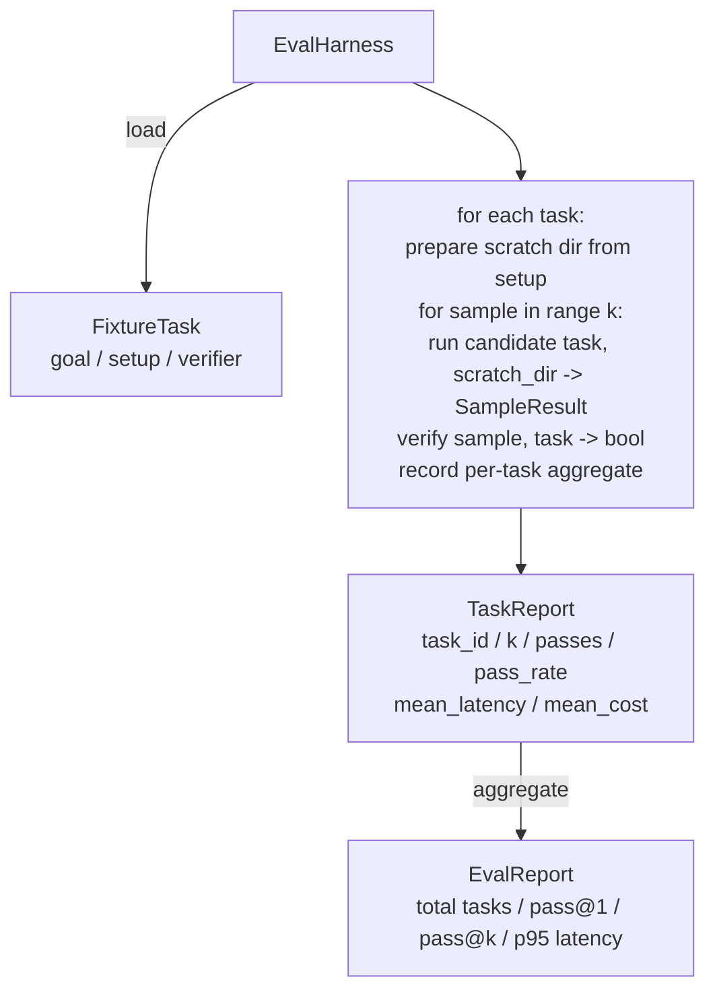

# 綜合專案第 27 課：帶固定任務的評估框架

> 一個寫程式代理，只跟你拿來量它的那組任務一樣好。這一課要建出一個評估框架：它吃下一個裝滿固定任務的資料夾、把每一項跑過候選代理、透過一個確定性驗證器評出通過或失敗，並把結果彙總成 pass@1、pass@k、平均延遲與平均成本。這個框架就是那個真實來源，讓你分得出退化與重構。

**類型：** 實作
**程式語言：** Python (stdlib)
**先修單元：** 階段 19 · 25（查證閘門）、階段 19 · 26（沙箱執行器）、階段 14 · 30（以評估驅動的代理開發）、階段 14 · 19（SWE-bench 與 GAIA 基準）
**時間：** 約 90 分鐘

## 學習目標

- 把固定任務定義成「目標、設置、驗證器」的三元組。
- 替每項任務的多次抽樣執行評分，並計算 pass@1 與 pass@k。
- 把延遲與成本彙總成平均值與第 95 百分位指標。
- 把確定性驗證器（檔案差異、結束碼、正規表示式相符）接成可重用的函式。
- 產出一份結構化的 JSON 報告，供追蹤退化的腳本攝取。

## 那個問題

沒有評估框架而建起來的代理基準，有三種失敗模式如影隨形。

第一是未經查證的通過。代理說它修好了那個臭蟲、人類瞄了一眼差異、套件被標成綠燈，三週後那個回歸測試又冒出同一個臭蟲。代理只是講得頭頭是道，實際上什麼都沒修。

第二是沒被偵測到的退化。改一下提示詞樣板，讓代理在那個吵鬧的任務上好了 4%、在那個安靜的任務上差了 14%。沒有黃金集、沒有逐任務分數，這次退化就這樣搭順風車進了 main，等到客戶抱怨才浮上來。

第三是逐任務的漂移。週一那次評估跑了 100 項任務，週五跑了其中 95 項，因為有人把五個固定任務改了名。通過率看起來像進步了 5%。其實沒有。

框架就是那支把這些失敗變成事實的程式。它每一次都以可重現的順序跑過每一個固定任務，對著一個「在確定性檢查上回傳真或假」的驗證器。

## 那個概念

```mermaid
flowchart LR
  F1[fixtures/task_001/<br/>task.json + expected/] --> Harness
  F2[fixtures/task_002/<br/>...] --> Harness
  Harness[Harness<br/>for each task:<br/>setup / run agent k samples /<br/>verify each sample /<br/>record latency, cost]
  Harness --> Report[EvalReport<br/>pass@1 / pass@k<br/>mean ms / p95 ms<br/>mean cost]
```

一個 `FixtureTask` 是一個小型 JSON 檔，加上一個選擇性的 `expected/` 目錄。那份 JSON 宣告一個 `id`、一個 `goal`（餵給代理的提示詞）、一個 `setup` 區塊（要放進暫存目錄的檔案），以及一個 `verifier` 區塊。verifier 區塊指名框架驗證器登錄庫裡的一個函式，並提供它的參數。

三種驗證器形狀涵蓋了大多數有用的任務。

第一是 `file_equals`。代理跑完之後，把某個指名檔案與預期內容比對。這抓的是「用這個特定方式修好這個臭蟲」型的任務。

第二是 `regex_match`。指名檔案的內容以正規表示式比對。這抓的是「那個函式必須存在並回傳 X」型、有很多可接受解法的任務。

第三是 `shell_exit_zero`。框架跑一道 shell 指令（透過第 26 課的沙箱），只有在該指令以零結束碼退出時任務才算通過。這抓的是「測試必須通過」型的任務。

框架把每項任務跑 `k` 次。Pass@k 是 `1 - (1 - p)^k`，其中 p 是經驗通過率；框架也回報原始計數，好讓你看得出變異。延遲是逐次抽樣的實際時間。成本是代理自行回報的東西（詞元數、美元，或兩者）；框架把它跨抽樣加總，並呈現逐任務與彙總的數字。

```figure
pass-at-k
```

## 架構



候選者是一個可呼叫物：`Callable[[FixtureTask, str], SampleResult]`。框架透過 `tempfile.mkdtemp()` 建出暫存目錄，並把它的路徑以純字串傳過去。框架不在乎候選者怎麼運作。候選者可以是一個確定性的修補套用器（做框架自我測試很好用）、一個真的 LLM 代理，或一個模糊測試器。契約就是那個 SampleResult。

## 你會建出什麼

`main.py` 出貨：

1. `FixtureTask` dataclass。
2. `SampleResult` dataclass：success_self_reported、latency_ms、cost_units、edits。
3. 帶 `to_dict()` 的 `TaskReport`、`EvalReport` dataclass。
4. `VerifierRegistry`，把驗證器名稱對映到函式。內建驗證器：file_equals、regex_match、shell_exit_zero。
5. `EvalHarness` 類別。把一個任務目錄跑過一個候選者。回傳 EvalReport。
6. 打包在 `tasks/` 裡的五個固定任務：
   - `fizzbuzz` 裡的差一錯誤
   - `factorial` 裡缺少的 return
   - 錯誤訊息裡的錯字
   - 空的函式主體
   - 鏈結串列走訪裡的差一錯誤
7. 一個確定性的參考候選者（`apply_known_fixes`），框架用它來示範乾淨的 pass@1 為 1.0。
8. 示範印出 EvalReport 的 JSON，並以零結束碼退出。

那些固定任務是打包在 `tasks/` 裡的 JSON 檔，加上配對的原始檔，放在 `tasks/<id>/buggy/` 與 `tasks/<id>/expected/`。框架把 buggy 複製到一個暫存目錄、交給候選者，再對照 expected 做驗證。

## 為什麼要 pass@k 而不是只有 pass@1

真實的 LLM 代理是隨機的。pass@1 為 0.6 看起來像失敗。pass@5 為 0.95 則說：代理大多時候答得對，只是在早期抽樣上挑錯了。修法是抽樣與排序，不是一味多訓練。Pass@k 把這件事攤開來。

Pass@k 要與 pass@1 並列回報，因為 pass@k 會粉飾一個真實的失敗：若模型二十次才對一次，你手上並沒有一個好用的代理。框架兩個都秀出來。

## 這與 A 軌其餘部分怎麼組合

第 25 課產出了閘門鏈。第 26 課產出了沙箱。框架在任何 `shell_exit_zero` 驗證器上都用那個沙箱。第 28 課把每一次框架執行包進一條 OTel 軌跡。第 29 課對其中一個打包好的固定任務跑端到端示範，並斷言參考候選者的 pass@1 = 1.0。

## 怎麼跑它

```bash
cd phases/19-capstone-projects/27-eval-harness-fixture-tasks
python3 code/main.py
python3 -m pytest code/tests/ -v
```

那個示範會以 JSON 印出 EvalReport，含 pass@1、pass@5、平均延遲，以及逐任務的拆解。結束碼是零。那些測試涵蓋驗證器函式、pass@k 的算術、固定任務載入，以及框架對打包參考候選者的端到端行為。
