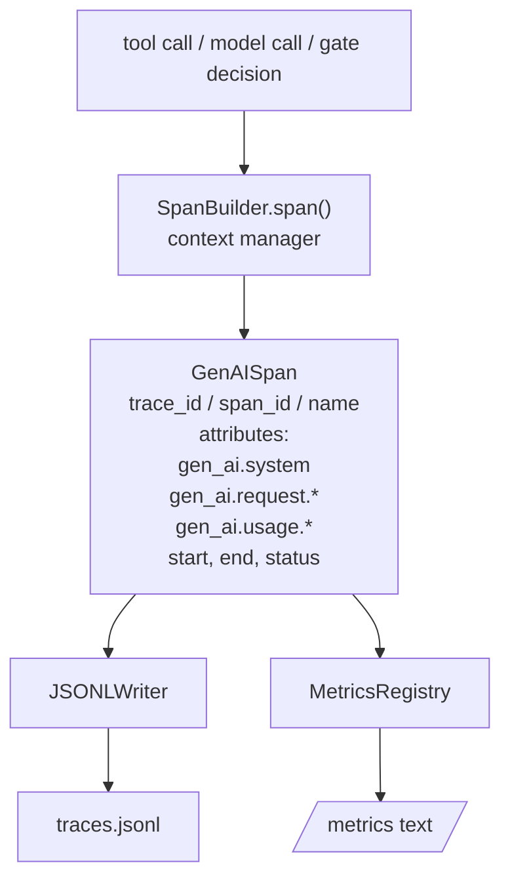
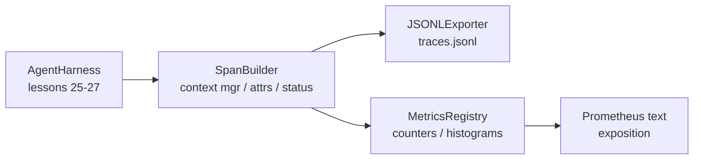

# 綜合專案第 28 課：用 OTel GenAI Span 與 Prometheus 指標做可觀測性

> 一個沒有可觀測性的代理框架，是一個會燒錢的黑箱。這一課手工造一個 span 建構器，它產出符合 OpenTelemetry GenAI 語意慣例的紀錄、以每行一個 span 的方式寫進一個 JSON-Lines 檔案，並以 Prometheus 文字格式暴露計數器與直方圖。整套東西都是標準函式庫的 Python，而且離線就跑得起來。

**類型：** 實作
**程式語言：** Python (stdlib)
**先修單元：** 階段 19 · 25（查證閘門）、階段 19 · 26（沙箱）、階段 19 · 27（評估框架）、階段 13 · 20（OpenTelemetry GenAI）、階段 14 · 23（OTel GenAI 慣例）
**時間：** 約 90 分鐘

## 學習目標

- 建出一個形狀符合 OpenTelemetry GenAI 語意慣例的 span 資料類別。
- 實作一個每行寫出一個自足 span 的 JSONL 匯出器。
- 建出帶標籤的計數器與直方圖，並做 Prometheus 文字格式的暴露。
- 把任何可呼叫物包進一個會記錄時長、狀態與例外的 span 脈絡管理器裡。
- 驗證產出的 span 能透過 `json.loads` 來回轉換，並符合規格形狀。

## 那個問題

生產環境的寫程式代理每一輪都產出三類產出物：一次模型呼叫、一次工具執行，以及一次查證閘門決策。少了結構化遙測，這些都沒有用。

第一種失敗模式是缺失的軌跡。週二出了事，但唯一的紀錄是一份 500 行的聊天日誌。沒有紀錄說跑了哪個工具、花了多久、提示詞進了多少詞元，或閘門有沒有拒絕什麼。代理的作者只能靠猜。

第二種失敗模式是剖析不了的軌跡。框架有寫 span，但用的是自己隨手取的欄位名稱。Grafana、Honeycomb、Jaeger 或本地 CLI 沒有一個讀得懂它們。團隊堆疊裡既有的工具全都白費了，因為那些 span 不合標準。

第三種失敗模式是沒有彙總的指標。你在軌跡裡看得到某一次很慢的工具呼叫，但回答不了「過去一小時 read_file 呼叫的 p95 延遲是多少？」，因為根本沒有指標，只有軌跡。

OpenTelemetry 的 GenAI 語意慣例存在的目的正是這個。它們定義了一小組標準屬性，讓跨 LLM 框架的 span 產出方共用。若你的框架寫出那些屬性，每一個 OTel 相容的後端都讀得懂它們。

## 那個概念



框架裡的每一項操作都產生一個 span。一個 span 有一個軌跡 id（整次代理呼叫）、一個 span id（這一項操作）、一個名稱（例如 `gen_ai.chat`、`gen_ai.tool.execution`）、一組遵循 GenAI 慣例的屬性、一個起訖時間，以及一個狀態。

GenAI 慣例把這些屬性鍵標準化：`gen_ai.system`（哪家供應商，例如 `anthropic`、`openai`）、`gen_ai.request.model`（模型 id）、`gen_ai.request.max_tokens`、`gen_ai.usage.input_tokens`、`gen_ai.usage.output_tokens`、`gen_ai.response.model`、`gen_ai.response.id`、`gen_ai.operation.name`，加上工具專屬的鍵 `gen_ai.tool.name` 與 `gen_ai.tool.call.id`。

匯出器寫的是 JSONL。每行一個 JSON 物件。這是下游工具能串流、grep 與匯入的最簡單格式。真正的 OTel 匯出器會講 OTLP gRPC；這一課的 JSONL 匯出器是那個離線的等價物，在每一台工作站上都以零結束碼退出。

指標就住在軌跡旁邊。每次工具呼叫都讓一個計數器加一：`tools_called_total{tool="read_file"}`。一個直方圖記錄觀察到的延遲：`tool_latency_ms{tool="read_file"}`。兩者都序列化成 Prometheus 的文字暴露格式，那是拉取式指標的事實標準。

```figure
trace-spans
```

## 架構



span 建構器是一個小類別，帶一個回傳脈絡管理器的 `span(name, attrs)` 方法。那個脈絡管理器在進入時記下起始時間、在離開時記下結束時間、若有例外被拋出就把它附上去，並把定稿的 span 推給匯出器。

指標登錄庫是兩個字典。計數器是 `{(name, frozen_labels): int}`。直方圖把原始樣本留在一個清單裡，並在暴露時序列化成 Prometheus 的直方圖分桶。

## 你會建出什麼

`main.py` 出貨：

1. `GenAISpan` dataclass：trace_id、span_id、parent_span_id、name、attributes、start_unix_nano、end_unix_nano、status、status_message、events。
2. `SpanBuilder` 類別，帶 `span(name, attrs, parent=None)` 脈絡管理器。
3. `JSONLExporter` 類別，帶會追加一行的 `export(span)`。
4. `Counter` 與 `Histogram` 類別，加上 `MetricsRegistry`。
5. `prometheus_exposition(registry)`，產出文字格式的輸出。
6. `wrap_tool_call(name)` 裝飾器，會送出一個 span 並更新指標。
7. 示範：合成出一次完整的代理呼叫（一個包住多個工具 span 的 gen_ai.chat span）、寫出 traces.jsonl、印出 Prometheus 暴露內容，並以零結束碼退出。

span id 與軌跡 id 是 16 位元組的十六進位字串，由 `os.urandom` 產生。那符合 OTel 的 W3C trace context。匯出器從不拋出例外；IO 錯誤會被浮現出來，但框架繼續跑。

直方圖有一組固定分桶（OTel 對毫秒延遲的預設：5、10、25、50、100、250、500、1000、2500、5000、10000、+Inf）。樣本存成一個清單；暴露時才依需求算出逐桶計數。

## 為什麼手工造而不用 opentelemetry-sdk

OTel 的 Python SDK 是一項真實相依。它也是好幾千行程式碼、OTLP 匯出器要多個行程，以及一份會把一課的預算淹掉的執行期成本。手工版本教的是那個線上格式。到了生產環境，你把同樣的屬性接進真的 SDK，就免費拿到 OTLP 匯出器、批次處理與資源偵測。

那些慣例是穩定的。這一課產出的線上格式到 2030 年還是剖析得了，因為 OTel 從不破壞 GenAI 屬性名稱；它們只會加新的。

## 這與 A 軌其餘部分怎麼組合

第 25 課產出了閘門鏈。第 26 課產出了沙箱。第 27 課產出了評估框架。第 28 課讓這三者都變得可觀測。第 29 課把端到端示範的每一步都包進 span，並在最後印出 Prometheus 文字。

## 怎麼跑它

```bash
cd phases/19-capstone-projects/28-observability-otel-traces
python3 code/main.py
python3 -m pytest code/tests/ -v
```

那個示範會在這一課的工作目錄裡產出一個 `traces.jsonl`（結束時清掉），接著印出三個 span 的樣本，然後印出那些計數器與直方圖的 Prometheus 暴露內容。那些測試驗證 span 序列化能來回轉換、那些經典的 GenAI 屬性都在、計數器正確累加，以及直方圖暴露內容含有預期的分桶計數。
