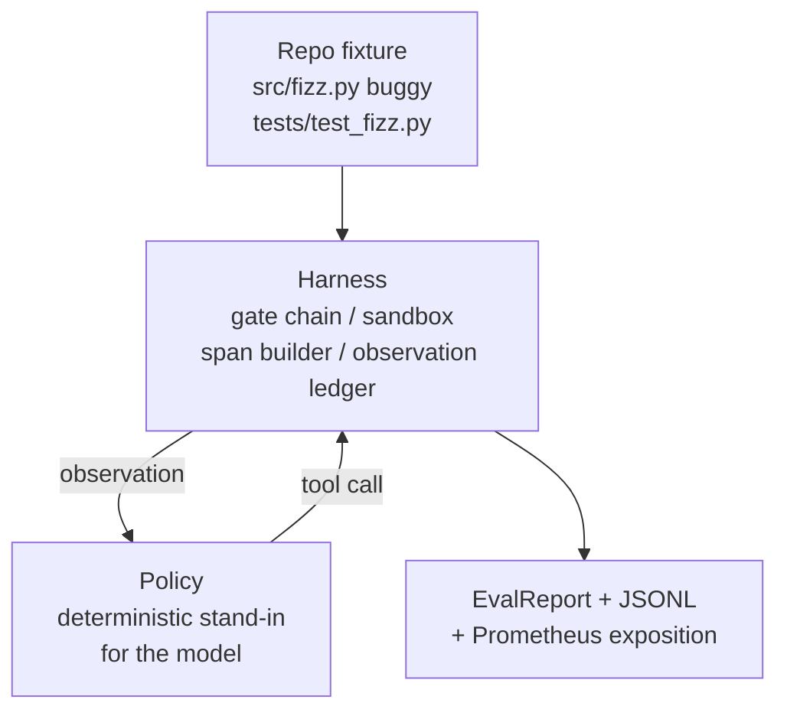
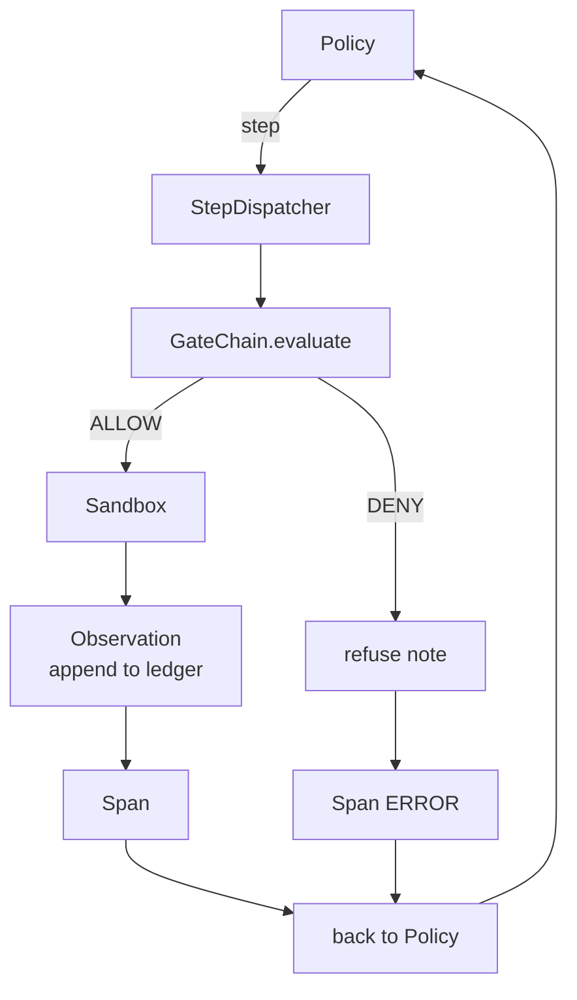

# 綜合專案第 29 課：跑在框架上的端到端寫程式代理

> A 軌的回報。這一課把閘門鏈、沙箱、評估框架與 OTel span 縫成一個能動的寫程式代理，去修一個真實（雖然小、只有固定任務規模）的多檔案 Python 專案裡的臭蟲。那個代理是一套確定性策略，不是 LLM；這次代換讓這一課可重現，也顯示了框架從頭到尾才是有意思的那部分。契約完全一樣：真實模型從那道策略接縫插進來。

**類型：** 實作
**程式語言：** Python (stdlib)
**先修單元：** 階段 19 · 25（查證閘門）、階段 19 · 26（沙箱）、階段 19 · 27（評估框架）、階段 19 · 28（可觀測性）、階段 14 · 38（查證閘門）、階段 14 · 41（真實儲存庫的工作台）、階段 14 · 42（代理工作台綜合專案）
**時間：** 約 90 分鐘

## 學習目標

- 把閘門鏈、沙箱、評估框架與 span 建構器組合進單一條代理迴路。
- 實作一套用 read_file、run_tests 與 write_file 修好固定任務臭蟲的確定性策略。
- 在一次端到端執行中，強制執行一個全域步驟預算加上一個觀察詞元預算。
- 替整次執行送出完整的 OTel GenAI 軌跡與 Prometheus 指標。
- 驗證代理在 12 步以內解出那個固定任務，且在合法工具上零次觸發閘門。

## 那個問題

多數代理示範都在孤立狀態下運作：沙箱自己一個、評估框架自己一個、span 產出器自己一個。它們看起來都好好的。把它們組合起來，接縫就現形了。

閘門鏈說 ALLOW，但沙箱以一個鏈沒預料到的理由拒絕了。評估框架記下一次通過，但 OTel span 說閘門拒絕了一個代理宣稱它用過的工具。Prometheus 計數器該加一次卻加了兩次。觀察預算超標了，代理卻還在跑，因為預算是在鏈裡追蹤的，而沙箱不知道。

這一課就是整條軌的整合測試。代理得依序做四件事：讀專案、跑測試、從測試失敗中指認出臭蟲、寫出修正、重跑測試，然後停下。每一項操作都走過閘門鏈。每一次工具執行都走過沙箱。每一步都被包進一個 span。評估框架在最後替整件事評分。

## 那個概念



代理的策略是一台狀態機。五個狀態。

`SURVEY`：代理讀專案的檔案列表。下一個狀態是 RUN_TESTS。

`RUN_TESTS`：代理執行測試指令。若測試通過，狀態機就以成功停止。否則下一個狀態是 INSPECT。

`INSPECT`：代理讀那個失敗的原始檔。下一個狀態是 FIX。

`FIX`：代理寫出修正後的檔案。下一個狀態是 VERIFY。

`VERIFY`：代理再跑一次測試指令。若測試通過就以成功停止。否則以失敗停止。

每個狀態對應一次工具呼叫。每一次工具呼叫都通過閘門鏈。若某次工具呼叫被拒絕，代理就在軌跡裡回報那次拒絕並停下。

那個固定任務的臭蟲是 `fizz.py` 裡的差一錯誤。確定性策略透過正規表示式從測試失敗訊息中偵測到那個臭蟲，並產出修正後的檔案。把策略換成 LLM，不會改變框架的契約。

## 架構



這一課是自足的。先前各課的原語都在 `main.py` 裡以最小規模重新實作了一次（閘門、沙箱、分類帳、span），好讓這一課不必匯入手足課程就跑得起來。名稱與第 25-28 課完全一致，好讓概念上的對映毫不含糊。

## 你會建出什麼

`main.py` 出貨：

1. 那些最小的框架原語，用與第 25-28 課相同的名稱複製過來：`GateChain`、`Sandbox`、`ObservationLedger`、`SpanBuilder`、`MetricsRegistry`。
2. `CodingAgentPolicy` 類別：帶五個狀態的狀態機。
3. `Repo` 輔助類別：用打包好的有臭蟲固定任務準備一個暫存目錄。
4. `AgentRun` 類別：驅動那套策略、透過框架派送，並回傳一份 `AgentRunReport`。
5. 一個打包好的固定任務（`fixture_repo/`），含 src/fizz.py、tests/test_fizz.py，以及供評估框架用的 expected/ 樹。
6. 示範：端到端跑那套策略、印出逐步軌跡、斷言通過、印出指標。

那個打包好的固定任務與第 27 課的任務結構是同一個形狀：一個有臭蟲的檔案加一個測試檔。測試失敗訊息含有足夠的資訊，讓確定性策略指認出修正方式。真實的 LLM 會做同樣的工作，只是慢一點、召回範圍更廣，但它不會改變框架的預期。

## 為什麼那套策略不是 LLM

真實的 LLM 需要一把 API 金鑰、一次網路呼叫，以及無法查證的隨機性。框架才是這一課在乎的部分。換上一套確定性策略，讓這一課能在任何開發者筆電上零外部相依地跑起來，也讓測試套件能斷言精確的步數。

這一課的策略是 LLM 代理所做之事的一個嚴格子集。策略讀儲存庫、看見失敗的測試、指認出那一行，然後產出一份修正。LLM 會用同樣的框架契約走同一條迴路；記帳方式完全一樣。

## 那個示範斷言了什麼

端到端示範在退出時斷言五件事，而測試套件會用程式重新斷言一遍。

策略在 12 步以內解出了那個固定任務。

觀察預算從未被超出。

合法工具上零次閘門拒絕。（代理從未發明出一個會被拒絕的工具名稱。）

每一步在 traces.jsonl 裡都有對應的 span。

Prometheus 暴露內容含有一項 `tools_called_total{tool="read_file"}` 條目，以及一個 `tool_latency_ms` 直方圖。

## 這與 A 軌其餘部分怎麼組合

這一課就是那次整合。第 25 課寫了閘門鏈。第 26 課寫了沙箱。第 27 課寫了評估框架。第 28 課寫了可觀測性。第 29 課證明它們作為一個系統能運作。真實的代理框架從這裡往外長：把確定性策略換成模型、把打包好的固定任務換成真實儲存庫的任務、把 JSONL 匯出器換成 OTLP。

## 怎麼跑它

```bash
cd phases/19-capstone-projects/29-end-to-end-coding-task-demo
python3 code/main.py
python3 -m pytest code/tests/ -v
```

那個示範印出逐步軌跡、最終的評估報告，以及 Prometheus 暴露內容。結束碼是零。那些測試涵蓋策略的狀態轉移、對合成工具呼叫的閘門拒絕、在打包固定任務上的端到端執行，以及步驟預算的不變量。
