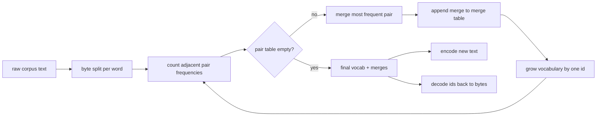
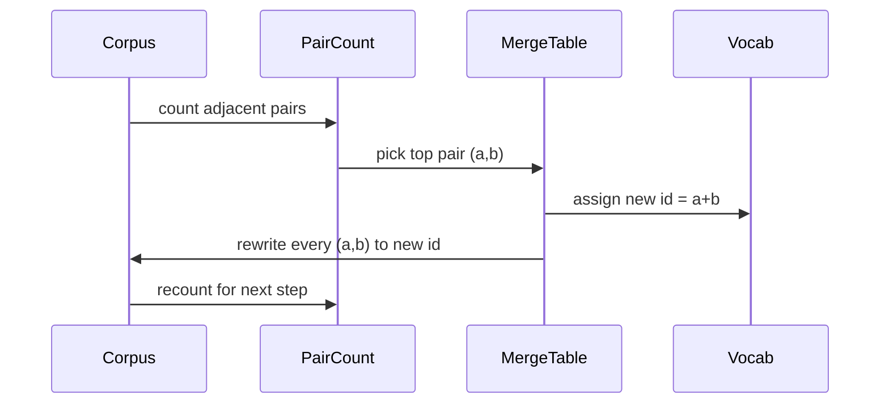

# 從零打造 BPE 分詞器

> 位元組進去，id 出來，id 再變回同一批位元組。把那個每一個現代文字模型至今仍從它出發的分詞器建出來。

**類型：** 實作
**程式語言：** Python
**先修單元：** 階段 04 各課、階段 07 的 transformer 各課
**時間：** 約 90 分鐘

## 學習目標
- 從一份原始文字語料訓練出一份位元組對編碼詞彙表，做法是反覆合併出現頻率最高的相鄰符號對。
- 實作一張確定性的合併表，並把它套用在新文字上以產出一串子詞 id。
- 讓任意 UTF-8 輸入來回轉成 id 再轉回來，不損失資訊。
- 保留並保護特殊詞元（`<|endoftext|>`、`<|pad|>`），好讓它們挺過訓練與解碼。
- 想清楚為什麼位元組層級的字母表，對一個通用分詞器而言是正確的地板。

## 那個框架

語言模型從不看見文字。它看見整數。從一個字串到一串整數、再回來的那張對映，就是分詞器。這一層搞錯了，訓練過程裡的每一條損失曲線量的都是錯的東西。

通用文字模型上主導性的子詞分詞器家族是位元組對編碼。這個想法很小。從一份已知的字母表出發。找出在訓練語料中出現最頻繁的相鄰符號對。把它合併成一個新符號。重複，直到詞彙表達到目標大小。編碼新文字時，以同樣的順序重用同一份合併清單。

我們要建的是位元組層級的變體。字母表是那 256 個原始位元組，不是 Unicode 編碼點。就是這個選擇，讓分詞器能處理任何 UTF-8 輸入，而不必退回一個未知詞元。

## 那條管線

訓練端與推論端共用那張合併表。那份共用就是契約。你在推論時改了合併順序，解出來的就是另一串 id。

## 那份位元組字母表

前 256 個 id 保留給 0x00 到 0xFF 的原始位元組。這保證了在任何合併發生之前，每一個輸入字串都表達得出來。位元組區塊之後，我們保留一小段範圍給特殊詞元。訓練迴路從不把那些 id 當成合併目標，因為我們把它們整個排除在預分詞後的串流之外。

預分詞器在訓練看到語料之前，先依空白與標點邊界把它切開。沒有那道切分，BPE 的合併步驟會很樂意學到跨越詞邊界的合併，而詞彙表就被整段常見片語塞滿。有了那道切分，合併就留在詞的內部，結果才推廣得出去。

## 那條訓練迴路

在每一個訓練步驟裡，迴路做三件事。它走過語料中的每一個詞，數出當前符號的每一個相鄰對出現多少次，並依該詞本身的出現頻率加權。它挑出計數最高的那個對。它把那個對的每一次出現都改寫成一個新符號，其 id 是詞彙表裡下一個空位。然後它記下那次合併。

每一步的成本，與「以符號序列清單表示的語料」大小成線性關係。對一百萬個詞、目標詞彙表一萬個 id 而言，這條迴路幾秒就跑完，因為隨著合併落地，符號序列會縮短。

## 編碼新文字

推論不呼叫那個配對計數器。它以學到的同樣順序套用那張合併表。對一個新的詞，編碼器從位元組切分開始。它掃描當前序列，找出排名最低的那個合併（最早適用的那一個）。它執行那次合併。再掃描一次。當表裡沒有任何合併適用於當前序列時，迴路就結束。

依排名排序這件事，就是讓編碼具確定性、並在同樣輸入上與訓練行為一致的那項性質。最早學到的合併坐在表的最上面，也最先被套用。若兩個合併在同一位置都適用，排名較低的那個勝出。

## 特殊詞元

特殊詞元是位元組串流永遠產不出來的那些 id。我們手動保留它們。這一課兩個就夠了。

- `<|endoftext|>` 在預訓練期間分隔文件。它告訴模型「一份新文件從這裡開始，別讓上一份的脈絡滲進來」。
- `<|pad|>` 把短序列填滿，好讓一個批次能是一個矩形張量。訓練時損失遮罩會把它藏起來。

編碼器接受一個旗標，允許輸入中出現特殊詞元。旗標關掉時，字串 `<|endoftext|>` 與 `<|pad|>` 會被分詞成拼出它們的那些位元組。旗標打開時，那些字面字串會被對映到它們保留的 id，並且不受任何合併影響。

## 來回轉換的保證

先編碼再解碼，必須精確地回傳輸入的位元組。解碼器依序把每一個 id 的位元組展開串接起來。既然每個 id 要嘛是一個原始位元組、要嘛是兩個先前已知 id 的串接，那個遞迴展開最終一定終止在原始位元組上。接著解碼回傳那些位元組所拼出的 UTF-8 字串。

這一課的測試套件會在一個沒看過的句子上、一個帶 Unicode 表情符號的句子上，以及一個含有字面 `<|endoftext|>` 詞元的句子上，檢查那項性質。

## 這一課不做什麼

它不建那種最大型生產分詞器所用、由正規表示式驅動的預分詞器。這裡的預分詞器是一個小小的空白與標點切分。它足以在小型訓練語料上產出合理的合併，而與後續課程鏈的契約維持不變。下一課把分詞器當成黑箱，並在它之上建出滑動窗口資料集。

它不把配對計數器平行化。在幾千個詞的語料上跑一條 Python 迴路，遠遠不到一秒就結束。對更大的語料，顯而易見的做法是平行地逐詞計數配對再歸約。

## 怎麼讀那些程式碼

`main.py` 定義了四個物件。`BPETokenizer` 持有詞彙表、合併表與特殊詞元表。`train` 是訓練迴路。`encode` 是推論路徑。`decode` 是位元組串接。底部的示範在一份內建語料上訓練一個小分詞器、編碼一個保留句子、把 id 解碼回來，並把兩者印出來。`code/tests/test_bpe.py` 裡的測試釘住了來回轉換的性質、特殊詞元的保留，以及合併順序。

跑那個示範。然後把示範裡的目標詞彙表大小從 300 改成 600，看看那個保留句子的編碼長度怎麼掉下去。那條曲線就是 BPE 的壓縮曲線。
