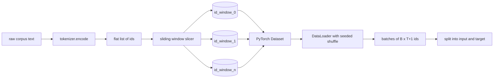
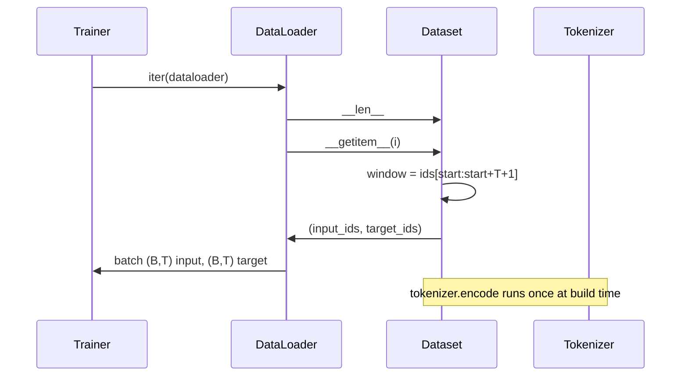

# 帶滑動窗口的分詞資料集

> 一次預訓練是從詞元 id 到梯度的一個函數。這一課建的是把那些 id 送進去的輸送帶。

**類型：** 實作
**程式語言：** Python
**先修單元：** 階段 04 各課、階段 07 的 transformer 各課、本階段第 30 課
**時間：** 約 90 分鐘

## 學習目標
- 呼叫分詞器一次，把原始語料轉成一串詞元 id。
- 用一個可設定的重疊步幅，把 id 串流切成固定長度的窗口。
- 建出一個 PyTorch Dataset，替下一詞元預測回傳輸入與目標張量。
- 把資料集包進一個 DataLoader，並用逐訓練週期設種子的確定性洗牌。
- 想清楚步幅、冗餘與有效資料集大小之間的取捨。

## 那個框架

一次預訓練每次讀一個批次的詞元 id，並更新模型。每個批次的形狀由訓練契約定死。對一個因果語言模型而言，批次持有 `(B, T)` 的輸入 id 與 `(B, T)` 的目標 id，其中目標是輸入往左平移一格。資料管線的工作，就是從一份可能有好幾 GB 原始文字的語料中，以確定性且可重現的方式，隨需產出那份契約。

這一課要建那條管線。上一課的分詞器把文字變成一長串扁平的 id。一個滑動窗口把那份清單切成訓練樣本。一個自訂的 Dataset 把樣本以張量形式暴露出來。一個 DataLoader 把它們批次化，並用一個已知的種子洗牌。

## 那份形狀契約

一個因果語言模型吃下形狀為 `(B, T)` 的 id，其中 `B` 是批次大小、`T` 是脈絡長度。位置 `t` 的目標是位置 `t+1` 的輸入。這代表每一個訓練樣本涵蓋 `T+1` 個原始 id。窗口步幅控制相鄰樣本之間有多少重疊。

切片器從不與語料的邊界重疊。若最後一個窗口沒有足夠的 id 填滿 `T+1` 個位置，切片器就把它丟掉。用 `<|pad|>` 把尾巴填滿也是一個有效的選擇，但那會讓損失遮罩變複雜。這一課我們選擇丟掉。

## 為什麼要滑動窗口

一份預訓練語料是一長串 id。若模型只看得到不重疊的窗口，每一個訓練樣本教給它的都是同樣的那 `T` 個邊界。調整步幅會把那些邊界挪來挪去，好讓模型看到更多樣的「預測下一詞元」任務。

步幅為 `T` 產出不重疊的窗口。步幅為 `T // 2` 產出五成重疊，並把有效資料集翻倍。步幅為 `1` 產出最大重疊，並把資料集放大 `T` 倍。代價是每個訓練週期更多運算。好處是更多邊界多樣性。多數預訓練會用等於脈絡長度的步幅，因為語料本來就大到模型在一個週期內跑不完，所以邊界多樣性那個論點比較弱。

## Dataset 類別

一個 PyTorch Dataset 有兩個必要方法。`__len__` 回傳樣本數。`__getitem__` 以一對張量的形式回傳一個樣本。我們的 Dataset 儲存那份編碼後的 id 串流與步幅。對它做索引時會即時算出窗口起點，所以不管步幅產出多少樣本，記憶體成本都只是那份 id 串流的一份副本。

那個平移一格在 `__getitem__` 裡發生。Dataset 回傳 `(input, target)`，其中 `input = window[:-1]`、`target = window[1:]`。兩者都是 PyTorch 的 long 張量。訓練迴路把它們當成標準答案。

## 確定性洗牌

一個 `shuffle=True` 的 DataLoader 會從 PyTorch 的隨機產生器讀取。透過傳入一個逐訓練週期設種子的明確 `torch.Generator`，我們讓每次重啟都得到同樣的洗牌結果。當你想比較兩次只差一個超參數的執行時，那項性質就要緊。沒有種子的話，兩次執行看到的資料順序不同，而損失曲線會因為與那項改動無關的理由而分岔。

這一課的種子契約很簡單。`epoch_seed = base_seed + epoch_index`。基礎種子在建構時傳入。訓練者在每個週期開頭把週期索引加一。以同樣的基礎種子重跑，每個週期看到的順序永遠一樣。

## 批次取樣器

PyTorch 的預設取樣器以均勻隨機、不放回的方式挑索引。那正是我們預訓練要的。在小型資料集上做微調時契約也一樣。DataLoader 呼叫 `__getitem__` `B` 次並把結果疊起來，藉此組出一個批次。因為就構造而言每個樣本長度都一樣，所以不需要任何填補邏輯。

這一課為求簡單把 `num_workers=0`。在生產環境的執行裡，那些工作者會把 `__getitem__` 呼叫平行化。以我們這條管線而言那大致上沒作用，因為那份工作只是對一個記憶體內張量做切片，不過同一套 Dataset API 乾淨地支援工作者。

## 計算樣本數

對長度為 `N` 的 id 串流、脈絡長度 `T` 與步幅 `S` 而言，樣本數是 `max(0, 1 + (N - (T + 1)) // S)`。這一課把那個計算暴露成 Dataset 上的一個靜態方法，好讓訓練者不必迭代就算得出每個週期的總步數。

## 這一課不做什麼

它不從磁碟做串流。語料整份在記憶體裡編碼完，並以單一張量持有。對幾百萬個 id 的語料而言那遠低於一百 MB，而且對這一課是對的形狀。磁碟串流是另一個關注點，只要換掉儲存就插得進來，而 Dataset 的契約維持不變。

它不處理多份文件。語料被當成一道連續的 id 串流。當語料由多份文件組成時，文件邊界是藉由插入 `<|endoftext|>` id 來編碼的。模型會學著在那個邊界周圍做預測。

## 怎麼讀那些程式碼

`main.py` 定義了兩個類別與一個輔助函式。`SlidingWindowDataset` 是那個 PyTorch Dataset。`make_dataloader` 回傳一個配好種子產生器的 DataLoader。`_encode_corpus_to_ids` 是那一次性的分詞器呼叫。底部的示範在行程內建出一個小分詞器、編碼一份內建語料、建構出資料集與 dataloader、印出一個批次，並斷言那份形狀契約。`code/tests/test_dataset.py` 裡的測試釘住了窗口數的公式、平移一格的性質、確定性洗牌，以及步幅的取捨。

跑那個示範。然後把脈絡長度從 16 改成 32，看看每個訓練週期的樣本數怎麼掉下去。那個數字就是你每個週期的步數預算。
