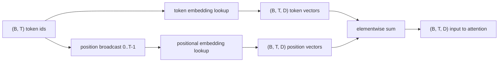
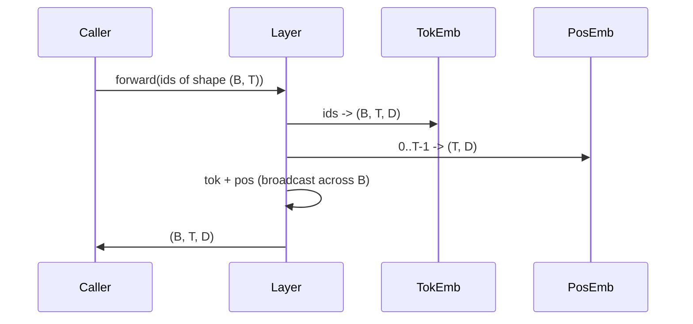

# 詞元嵌入與位置嵌入

> id 是整數。模型要的是向量。兩張查找表坐在它們之間，而位置那張的選擇，形塑了模型學得到什麼。

**類型：** 實作
**程式語言：** Python
**先修單元：** 階段 04 各課、階段 07 的 transformer 各課、本階段第 30 與 31 課
**時間：** 約 90 分鐘

## 學習目標
- 建出一張把詞彙表 id 對映到稠密向量的詞元嵌入查找表。
- 建出一張以位置為索引、可學習的位置嵌入查找表。
- 建出一張以位置為索引、沒有參數的固定正弦位置嵌入。
- 把詞元嵌入與位置嵌入組合成 transformer 區塊的單一輸入。
- 在長度類推與參數量上，對比可學習嵌入與正弦嵌入。

```figure
cc-embedding-lookup
```

## 那個框架

模型與詞元 id 的第一次接觸，是在詞元嵌入矩陣裡做一次列查找。這個矩陣每個詞彙表 id 一列、每個模型維度一欄。查找回傳一個向量，模型其餘部分把它當成那個 id 的意義。反向傳播更新前向傳遞中用過的那些列。訓練久了，那些列的幾何結構就學會把相似性編碼進方向裡。

光有詞元 id 沒有順序。模型需要第二道訊號，告訴它位置一與位置十七不一樣。那道訊號的兩個主導選擇是：可學習的位置嵌入（第二張查找表，每個位置一列）與固定的正弦位置嵌入（一條沒有參數的數學公式）。這個選擇有後果。可學習的表是一項參數，而且被模型訓練時的最大脈絡長度界住。正弦表在理論上沒有參數，而且公式延伸得到任何位置，但這一課的 `SinusoidalPositionalEmbedding` 在 `max_context_length` 處預先算好一張固定表，超過那個界限它的 `forward` 就會拋出例外；因此這裡兩個模組都強制了一個最大脈絡長度。就算那張表大到索引得了，模型在超過訓練長度時仍可能吃力。

這一課兩者都建，並把它們與詞元嵌入組合成下一課注意力區塊的單一輸入。

## 那份形狀契約

嵌入階段的輸入是一批形狀為 `(B, T)` 的詞元 id。輸出是一個形狀為 `(B, T, D)` 的張量，其中 `D` 是模型維度。批次裡每個元素的脈絡長度 `T` 都一樣。每個位置的向量維度 `D` 都一樣。



那個組合是相加，不是串接。相加讓 `D` 在整個網路裡維持不變，並讓模型在每一層逐特徵地決定：這裡是詞元意義主導、還是位置主導。

## 詞元嵌入矩陣

詞元嵌入是一個形狀為 `(V, D)` 的參數張量，其中 `V` 是詞彙表大小。PyTorch 把它暴露成 `nn.Embedding(V, D)`。初始化時，那些項目從一個小高斯分布抽出來，對 transformer 規模的模型而言，傳統上平均值為零、標準差約 `0.02`。確切的初始化沒那麼要緊，要緊的是它在各次執行間保持一致。

前向傳遞是單一次索引操作。PyTorch 藉由蒐集列，把 `(B, T)` 的 int64 id 對映成 `(B, T, D)` 的浮點數。反向傳遞只把梯度累積進前向傳遞中被碰到的那些列。兩列若從沒在那個批次裡出現，在那一步就拿到零梯度。

一個微妙的細節。詞元嵌入與模型末端的輸出投影常常共用權重（權重綁定）。發生這種情況時，每一次反向傳遞都會透過輸出那一側碰到嵌入的每一列。這一課把兩者暴露成獨立的模組，但在一個完整模型裡，同一個矩陣可以身兼二職。

## 可學習的位置嵌入

可學習的位置嵌入是第二個形狀為 `(max_context_length, D)` 的 `nn.Embedding`。查找以位置 id `0, 1, 2, ..., T-1` 為鍵。前向傳遞把那個位置向量沿批次維度廣播出去。

可學習表的缺點是：若模型只訓練到位置 `T-1`，它就查不了位置 `T`。那一列不存在。使用這套方案的生產級純解碼器模型，會把最大脈絡長度烤進架構裡，並拒絕處理更長的輸入。

## 正弦位置嵌入

正弦位置嵌入是一個從位置到向量的函數。位置 `p` 與特徵 `i` 產出

```python
angle = p / (10000 ** (2 * (i // 2) / D))
emb[p, 2k]     = sin(angle)
emb[p, 2k + 1] = cos(angle)
```

這個函數沒有參數。每個位置都有一個獨一無二的向量。波長在各特徵維度間以幾何級數變化，所以低維度編碼粗略位置、高維度編碼精細位置。

同時採用 `sin` 與 `cos` 所帶來的性質是：位置 `p + k` 的向量，是位置 `p` 向量的一個線性函數。這讓注意力層有一條學習相對位置偏移的簡便途徑。模型不需要另外一項參數去表達「往回看五個詞元」。

這一課在建構時把整張正弦表算好一次，並在前向時對它做索引。

## 那個組合

輸入管線依序做三件事。讀詞元 id。查出詞元向量。加上位置向量。回傳那個和。



相加步驟裡的廣播，把那個 `(T, D)` 的位置張量沿批次維度複製開來。PyTorch 會自動處理，因為那個位置張量在 unsqueeze 之後形狀是 `(1, T, D)`。

## 對比分析

這一課在同樣的輸入上跑這兩種變體，並印出兩項診斷。

第一是參數量。可學習的變體在詞元嵌入之上多加了 `max_context_length * D` 個參數。正弦變體加零。

第二是相鄰位置嵌入之間的餘弦相似度。正弦變體因為函數連續，衰減得平滑而可預測。可學習的變體在初始化時相似度接近隨機，因為那些列是各自獨立抽出來的。訓練之後，可學習的變體通常會發展出類似的平滑結構，但它得從資料中自己發現那個結構。

## 這一課不做什麼

它不建旋轉位置編碼（RoPE）或 AliBi。那些是生產 transformer 裡的現代選擇。兩者都遵循與這裡嵌入相同的形狀契約（對形狀為 `(B, T, D)` 的向量施加一個依位置而定的變換），但它們套用在注意力投影那一步，而不是在輸入端。下一課建注意力區塊，而其中一項選配的擴充，就是把旋轉編碼摺進那裡的查詢－鍵投影。

它不訓練那份嵌入。訓練需要一個損失，那需要模型輸出，那需要注意力與一個語言模型頭。那是下一課、以及再下一課的事。

## 怎麼讀那些程式碼

`main.py` 定義了三個模組。`TokenEmbedding` 包住 `nn.Embedding(V, D)`。`LearnedPositionalEmbedding` 包住 `nn.Embedding(L, D)`。`SinusoidalPositionalEmbedding` 預先算好那張表，並把它暴露成一個緩衝區。`EmbeddingComposer` 把一個詞元嵌入與一個位置嵌入綁在一起。底部的示範印出形狀、參數量，以及那項相鄰位置的相似度診斷。`code/tests/test_embeddings.py` 裡的測試釘住了形狀、廣播行為、參數量，以及那條正弦公式。

跑那個示範。然後把模型維度 `D` 從 64 改成 32，看看那些正弦波長帶怎麼變。
