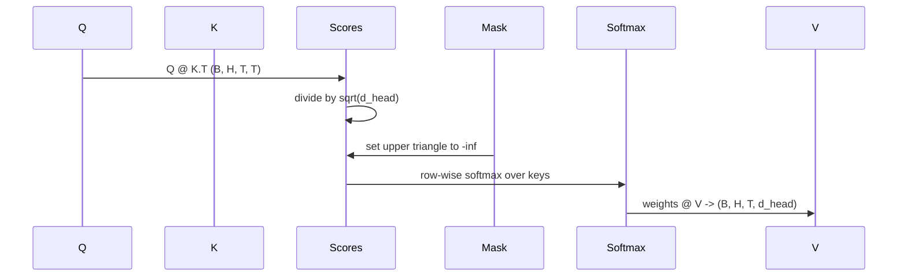

# 多頭自注意力

> 一次線性投影、三種視角、H 個平行的頭、一張遮罩。就是模型實際在用的那個注意力區塊。

**類型：** 實作
**程式語言：** Python
**先修單元：** 階段 04 各課、階段 07 的 transformer 各課、本階段第 30 到 32 課
**時間：** 約 90 分鐘

## 學習目標
- 把批次化的查詢／鍵／值投影，實作成單一個切分成 H 個頭的線性層。
- 以正確的正規化與 dtype 處理，計算縮放點積注意力。
- 套用一張因果遮罩，防止某個位置去注意未來的位置。
- 對一個固定輸入檢視逐頭的注意力權重，並推理每個頭在看什麼。
- 在一項玩具任務上訓練一個小注意力區塊，看著損失隨頭的專門化而下降。

```figure
cap-multihead-attention
```

## 那個框架

注意力是那個讓一個詞元的表示，從同一序列中其他詞元拉取資訊的函數。自注意力的意思是查詢、鍵與值全都由同一個輸入導出。多頭的意思是那次投影被切成 H 個平行的注意力問題，它們的輸出被串接起來再投影回去。

高效的實作模式是：一個從 `D` 投影到 `3 * D` 的線性層，切成三個視角，然後重塑成 H 個各為 `D // H` 大小的頭。矩陣乘法、softmax 與加權和以批次張量運算的形式發生，所以那些頭在加速器上平行地跑。

這一課要建那個區塊。它也加上因果遮罩，好讓同一份程式碼在純解碼器語言模型裡也能當注意力層用。下一課把這個區塊疊成一個完整的 transformer，再下一課訓練它。

## 那份形狀契約

輸入是 `(B, T, D)`。輸出是 `(B, T, D)`。遮罩是 `(T, T)`，或可廣播成它。區塊內部的中間張量形狀是 `(B, H, T, d_head)`，其中 `d_head = D // H`。約束是 `D % H == 0`。

```mermaid
flowchart LR
    A["(B, T, D) input"] --> B[Linear D -> 3D]
    B --> C["split into Q, K, V"]
    C --> D["reshape to (B, H, T, d_head)"]
    D --> E["scores = Q @ K.T / sqrt(d_head)"]
    E --> F[apply causal mask]
    F --> G[softmax over keys]
    G --> H["context = weights @ V"]
    H --> I["reshape to (B, T, D)"]
    I --> J[output Linear D -> D]
    J --> K["(B, T, D) output"]
```



那兩個線性層（QKV 投影與輸出投影）是這個區塊裡唯一的參數。遮罩、softmax、那些矩陣乘法與重塑，全都沒有參數。

## QKV 的切分

天真的實作有三個獨立的線性層，Q、K、V 各一個。高效的那個只有一層，輸出 `3 * D` 個特徵再把結果切開。兩者在數學上等價，因為三次分別乘上 `(D, D)` 權重的矩陣乘法，恰好就是一次乘上由它們堆疊而成之 `(3D, D)` 權重的矩陣乘法。

高效版本比較快，因為加速器發動的是一次矩陣乘法而不是三次。它初始化起來也比較容易，因為那三個子矩陣住在同一個參數張量裡，可以一起初始化。

## 頭的重塑

切分之後，Q、K、V 各自是 `(B, T, D)`。要把它變成 H 個平行的注意力問題，我們重塑成 `(B, T, H, d_head)`，再轉置成 `(B, H, T, d_head)`。頭這個維度現在挨著批次維度，所以 PyTorch 把逐頭的注意力當成一次跨 `B * H` 個獨立實例的批次運算。

d_head 這個維度留在最後，好讓分數的矩陣乘法 `Q @ K.transpose(-2, -1)` 把它縮掉。結果是 `(B, H, T, T)` 的逐頭注意力分數。

## 縮放

分數在 softmax 之前先除以 `sqrt(d_head)`。少了那次縮放，點積會隨 `d_head` 變大而增長，並把 softmax 推進一個「某一項幾乎拿走全部質量、其餘小得可以忽略」的區間。那個區間裡的梯度極小，學習就停滯了。除以 `sqrt(d_head)` 讓分數的變異數在不同頭大小之間大致維持不變。

## 那張因果遮罩

一個純解碼器語言模型在預測下一個詞元時，只能以過去為條件。那張遮罩就是在強制這件事。具體來說，在 softmax 之前，`(T, T)` 分數矩陣中對角線以上的每一項都被換成負無限大。softmax 之後那些位置的權重就是零。



我們在建構時把遮罩註冊成一個緩衝區，好讓它與模型待在同一個裝置上，而且不屬於梯度圖的一部分。那張遮罩涵蓋這個區塊會看到的最大脈絡長度。前向時我們切出左上角的 `(T, T)`。

## 那個輸出投影

在逐頭的脈絡向量 `(B, H, T, d_head)` 之後，我們轉置回 `(B, T, H, d_head)`、重塑成 `(B, T, D)`，再套用一個最終的 `(D, D)` 線性投影。輸出投影讓模型把那些頭混合起來。少了它，那 H 個頭就只能透過後續各層重新組合，而這個區塊會被人為地約束住。

## 注意力權重的檢視

這一課在前向傳遞上暴露一個 `return_weights=True` 旗標。設定之後，這個區塊會連同輸出一起回傳形狀為 `(B, H, T, T)` 的逐頭注意力權重。示範會在一個短輸入上印出某個頭權重的熱圖，好讓你看見那個因果三角結構與逐位置的聚焦。

在一個訓練好的模型裡，不同的頭學到不同的樣式。有些頭注意緊鄰的前一個詞元。有些頭注意序列的開頭。有些頭幾乎均勻地分散注意力。這個檢視掛鉤，就是那項可解釋性工作的入口。

## 那個訓練示範

`main.py` 底部的示範，把注意力區塊接到一個極小的語言模型頭上，並在一項複製任務上訓練整個東西。輸入的每一列，是一個在整個脈絡上重複的隨機 id。目標是輸入平移一格，所以模型必須學到下一個詞元就等於前一個詞元。損失是交叉熵。在 H=4、D=32、T=12、詞彙表 64 的情況下，損失在 CPU 上經過三個訓練週期，從隨機水準（約 `log(64) ~ 4.16`）掉到遠低於 `1.0`。

這個示範的重點不是訓練出一個有用的模型。重點是確認梯度流過了這個區塊的每一塊，而那些頭在一個答案顯而易見的問題上學到了東西。

## 這一課不做什麼

它不加前饋區塊。真實模型裡的 transformer 層，是注意力之後接一個兩層的 MLP，並在各自周圍配上殘差連接與層正規化。下一課會加上那些。

它不實作旋轉或 AliBi 位置編碼。兩者都套用在同一區塊的 QKV 投影那一步，但它們是另一個教學單元。這裡建出來的區塊，只要在矩陣乘法之前變換 Q 與 K，就與兩者相容。

它不實作供推論用的 KV 快取。跨前向傳遞快取鍵與值，是讓自迴歸解碼變快的那項最佳化。它改變 K 與 V 張量的形狀契約，但不改 Q 的。那屬於推論那一課。

## 怎麼讀那些程式碼

`main.py` 定義了 `MultiHeadSelfAttention`。這個類別持有兩個線性層與一個註冊過的遮罩緩衝區。前向傳遞做投影、重塑、算分數、遮罩、softmax、加權、再重塑、再投影。底部的示範建出一個小模型，把注意力與詞元嵌入、位置嵌入及一個語言模型頭包在一起，在一項複製任務上訓練三個週期，並印出損失曲線與一張逐頭的注意力熱圖。`code/tests/test_attention.py` 裡的測試釘住了形狀契約、因果性、softmax 的性質、頭切分的性質，以及梯度流動。

跑那個示範。然後把 `n_heads` 從 4 加到 8（保持 `d_model=32`，所以 `d_head=4`），看看熱圖怎麼變。
