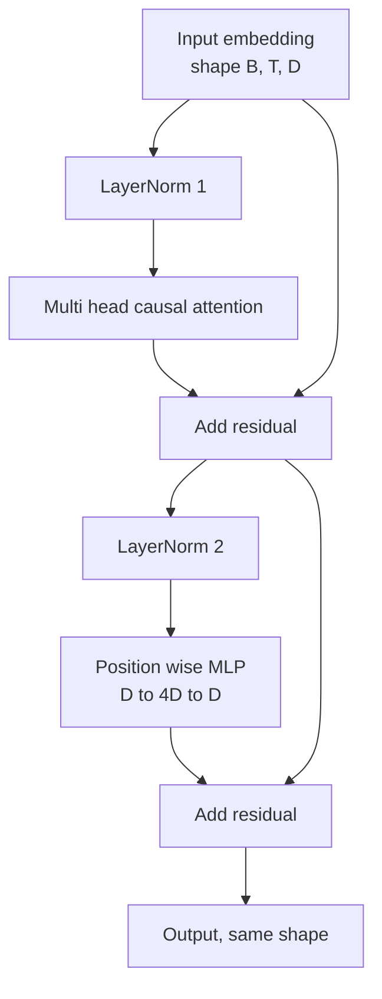
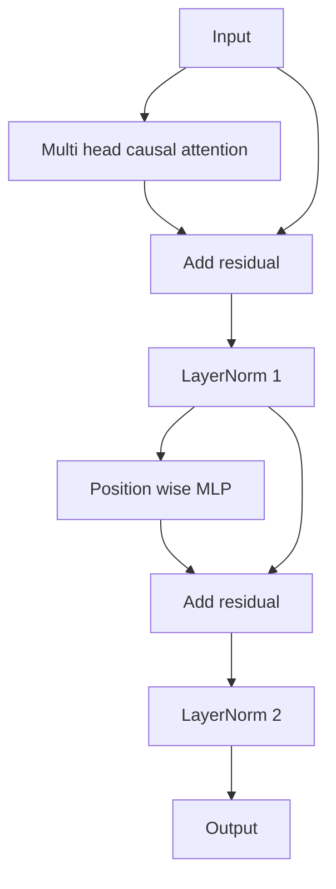

# 從零打造 Transformer 區塊

> 一個區塊就是每一個現代解碼器 LLM 的單位。層正規化、多頭注意力、殘差、MLP、殘差。pre-LN 變體不用暖身就訓練得穩。post-LN 變體則是原論文出貨的那個。這一課把兩者並排建出來，並展示在常見學習率下，哪一個挺得過 12 層的堆疊。

**類型：** 實作
**程式語言：** Python
**先修單元：** 階段 19 第 30 到 33 課（分詞器、嵌入、注意力數學、批次資料載入器）
**時間：** 約 90 分鐘

## 學習目標

- 用四塊活動元件在 PyTorch 裡建出一個 transformer 區塊：LayerNorm、多頭因果注意力、殘差連接、逐位置的 MLP。
- 把那些 LayerNorm 擺成兩種組態（pre-LN 與 post-LN），並解釋為何其中一個不用暖身就訓練得穩。
- 在多頭注意力內部實作因果遮罩，讓詞元 `i` 看不到詞元 `j > i`。
- 在一個 12 層的堆疊上追蹤這兩種變體的梯度流動，並不含糊地讀出結果。
- 在下一課組裝一個一億兩千四百萬參數的 GPT 時，把這個區塊當成即插即用的單位重複使用。

## 那個問題

一個 transformer 就是同一個區塊重複而已。這個區塊做錯一次、重複十二次，你出貨的就是一個在第一個訓練週期就發散、或往後一路都得靠暖身花招的模型。你在這一課會看到的那兩種失敗模式並不奇特。第一次天真地把區塊疊起來時它們就冒出來了。一個是注意力層注意到了未來。另一個是 LayerNorm 被擺在一個馴服不了深處殘差訊號的位置。

一旦你看懂了，修法就是機械的。這個區塊剛好有兩條殘差路徑、剛好有兩個正規化位置。把位置選對，堆疊其餘的就只是記帳而已。

## 那個概念

每一個純解碼器的 transformer 區塊，都是一個吃下形狀為 `(batch, sequence, embedding)` 的張量、並回傳同樣形狀張量的函數。裡面有兩個子層在做事。



這是 pre-LN 變體。LayerNorm 坐在殘差分支之內、子層之前。殘差連接把未正規化的訊號往前帶。

post-LN 變體把 LayerNorm 移到殘差相加之後。



形狀完全一樣。訓練行為不一樣。用 post-LN 時，沿殘差路徑往回流的梯度必須通過 LayerNorm。在深度十二、學習率 `3e-4` 之下，那個梯度縮得夠快，快到需要一份暖身排程。Pre-LN 讓殘差路徑保持未正規化，所以梯度乾淨地傳播到嵌入層。就是為了這個理由，GPT-2 以降出貨的都是 pre-LN 組態。

### 因果多頭注意力

注意力子層把輸入投影成查詢、鍵、值三個張量。每一個都從 `(B, T, D)` 重塑成 `(B, H, T, D/H)`，其中 `H` 是頭數。縮放點積注意力逐頭計算 `softmax(Q K^T / sqrt(d_k))`、把上三角遮成負無限大、透過 softmax 套用那張遮罩，再乘上 `V`。那些頭被串接回單一個 `(B, T, D)` 張量，並再投影一次。遮罩是唯一讓這個模型具因果性的那一塊。忘了遮罩，你訓練出來的就是一個會作弊的模型。

### 那個 MLP

逐位置的 MLP 對每個詞元各自獨立地套用同一個兩層網路。隱藏層寬度是嵌入寬度的四倍，激活函數是 GELU，第二個線性層之後接一個 dropout。MLP 內部沒有詞元彼此對話。所有的詞元混合都發生在注意力裡。

### 殘差連接做兩件事

它們讓梯度路徑在深度上變成可加的，這讓梯度範數在十二層之間維持在合理尺度。它們也讓每個區塊學到的是對那道流動表示的一次加法式更新，而不是整份替換。這兩種效應就是這個區塊擴縮得起來的原因。

## 動手建

`code/main.py` 實作：

- `class LayerNorm`，帶可學習的縮放與位移、有偏的 eps，逐詞元向量套用。
- `class MultiHeadAttention`，帶 `num_heads`、`head_dim = d_model // num_heads`、融合的 QKV 投影、註冊過的因果遮罩、注意力與殘差 dropout。
- `class FeedForward`，帶兩個線性層、GELU 激活、dropout。
- `class TransformerBlock`，帶一個在兩種變體之間切換的 `pre_ln` 旗標。
- 一個示範：用完全相同的輸入建出一個 6 層的 pre-LN 堆疊與一個 6 層的 post-LN 堆疊，並印出 (a) 輸出形狀、(b) 一次反向傳遞之後嵌入處的梯度範數。

跑它：

```bash
python3 code/main.py
```

輸出：兩個堆疊的形狀檢查、並排的梯度範數。在同樣的學習率下，pre-LN 堆疊的嵌入梯度比 post-LN 堆疊大一個數量級，而那就是「pre-LN 不用暖身就訓練得起來」的實證訊號。

## 技術堆疊

- `torch`，用於張量運算、自動微分與 `nn.Module` 的管路。
- 不用 `transformers`，不用預訓練權重。這個區塊是從原語實作出來的。

## 現實世界裡的生產模式

有三種模式，能把教科書上的區塊變成你出貨得了的東西。

**融合的 QKV 投影。** 三個獨立的線性層要花三次核心啟動與三次矩陣乘法。一個寬度為 `3 * d_model` 的線性層，一次啟動就做完同樣的工作，然後沿最後一軸把輸出切開。在每一種加速器上，融合路徑都比較快，而且與 GPT-2、LLaMA、Mistral 的參考實作所出貨的一致。

**註冊成緩衝區的因果遮罩。** 那張遮罩只依賴最大脈絡長度。在建構時用 `register_buffer` 配置一次、每次前向傳遞切出使用中的窗口，就能省掉逐次呼叫的配置。忘了這件事，在長脈絡時那張遮罩就變成記憶體配置器的熱點。

**Dropout 放兩個地方，不是三個。** Dropout 屬於注意力 softmax 之後（注意力 dropout）與 MLP 第二個線性層之後（殘差 dropout）。在殘差本身上放 dropout，會打壞那個「讓梯度在深處流得動」的加法恆等性。有些早期實作把這件事做錯了，代價是訓練變得脆弱。

## 動手用

- 這一課的區塊不必修改就直接插得進第 35 課的 GPT 組裝。
- pre-LN 變體是每一個現代開放權重 LLM 在用的。post-LN 變體則是 2017 年那篇注意力論文用的。懂這兩種，就足以讀懂你會遇到的任何解碼器架構。
- 把 GELU 換成 SiLU，你就有了 LLaMA 家族的激活函數。把 LayerNorm 換成 RMSNorm，你就有了 LLaMA 家族的正規化。同一副骨架。

## 練習

1. 替區塊裡的每一個線性層加上一個 `bias=False` 旗標。現代開放權重 LLM 出貨時線性層都不帶偏置。量出在一個 12 層、768 維的模型裡你省下多少參數。
2. 把 `nn.LayerNorm` 換成手工寫的 RMSNorm，並驗證輸出形狀不變。
3. 加上一個旗標，把第一個頭的注意力權重以 `(B, T, T)` 張量回傳。把上三角畫出來，確認它在 softmax 之後為零。
4. 建一項健全性檢查：把一個 `(2, 16, 384)` 的張量以 `H=6` 餵過這兩種變體，並在權重以相同方式初始化、dropout 設為零時，斷言前向輸出是不同的（例如 `not torch.allclose`）。

## 關鍵術語

| 術語 | 大家怎麼說 | 實際是什麼意思 |
|------|-----------------|------------------------|
| Pre-LN | 「前置正規化」 | LayerNorm 在殘差分支之內、每個子層之前；殘差帶的是未正規化的訊號 |
| Post-LN | 「後置正規化」 | LayerNorm 在殘差相加之後；2017 年那篇論文出貨的、而且需要暖身的那個 |
| 因果遮罩 | 「三角遮罩」 | 把注意力 logits 的上三角設成負無限大，讓詞元 i 在 j 大於 i 時讀不到詞元 j |
| 融合 QKV | 「合併投影」 | 一個寬度 3D 的線性層，取代三個寬度 D 的線性層；一次核心、一次矩陣乘法 |
| 殘差流 | 「跳接」 | 那個由上而下流過每個區塊、未正規化的張量；每個區塊往上加東西的對象 |

## 延伸閱讀

- 階段 7 第 02 課（從零打造自注意力），了解這個區塊底下的注意力數學。
- 階段 7 第 05 課（完整 transformer），了解同一副骨架的編碼器－解碼器版本。
- 階段 10 第 04 課（預訓練迷你 GPT），了解這個區塊插進去的那套訓練流程。
- 階段 19 第 35 課（本軌），它把十二個這樣的區塊疊成一個 GPT 模型。
