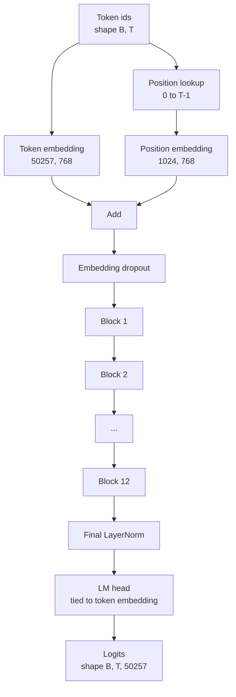
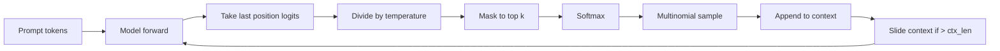

# GPT 模型組裝

> 十二個區塊疊起來、一個詞元嵌入、一個可學習的位置嵌入、一個最終的 LayerNorm，以及一個綁定權重的語言模型頭。那就是整個一億兩千四百萬參數的 GPT 模型。這一課把那些零件組裝成一個能動的類別、清點參數以確認模型符合參考的 124M 形狀，並以多項式取樣、溫度與 top-k 生成文字。

**類型：** 實作
**程式語言：** Python
**先修單元：** 階段 19 第 30 到 34 課
**時間：** 約 90 分鐘

## 學習目標

- 把第 34 課的 transformer 區塊組裝成一個完整的 GPT 模型：詞元嵌入、位置嵌入、N 個區塊、最終 LayerNorm、語言模型頭。
- 重現那份一億兩千四百萬參數的組態：詞彙 50257、脈絡 1024、嵌入 768、十二個頭、十二層。
- 把語言模型頭的權重綁到詞元嵌入上，並解釋為何在這個規模下那省下約三千八百萬個參數。
- 以多項式取樣、溫度縮放與 top-k 截斷，從一段提示詞生成文字，並用滑動窗口守住脈絡長度。
- 對照 124M 這個目標，量測參數量與前向傳遞成本。

## 那個問題

一個 transformer 區塊自己什麼都做不了。你得把詞元 id 變成向量、混進位置資訊、讓它們跑過那個堆疊，再投影回詞彙 logits。這四步漏掉任何一步，模型就要嘛前向失敗、要嘛位置資訊飄掉、要嘛開不了口。

模型的形狀也要緊。參考的 GPT-2 small 在上述那個組態下剛好是一億兩千四百萬參數。那些數字並不神奇。詞彙 50257 乘上嵌入 768 就是詞元表。位置 1024 乘上 768 就是位置表。十二個區塊、每個大約七百萬參數，就是八千四百萬。最終的頭透過權重綁定重用詞元表。把這些加起來，你就落在一億兩千四百萬上。建出一個參數量與參考對不上的模型，就是你哪裡接錯了的徵兆。

## 那個概念



詞元 id 變成詞元向量。位置 id 變成位置向量。兩者相加後送過那個堆疊。最終的 LayerNorm 是區塊之外、唯一在每一個現代變體裡都存活下來的那一塊。語言模型頭重用詞元嵌入矩陣，而那就是權重綁定的意思。

### 權重綁定

詞元嵌入的形狀是 `(vocab, d_model)`。語言模型頭需要從 `d_model` 投影回 `vocab`。兩者互為轉置。把兩者綁起來，意思是字面上使用同一個參數張量兩次。在詞彙 50257、d_model 768 之下，那個矩陣是三千八百萬個參數。不綁的話你要付兩次。綁了就只付一次，而且你還得到一個稍微乾淨一點的梯度訊號，因為嵌入與頭是一起更新的。

### 位置嵌入是學出來的，不是正弦的

GPT-2 出貨的是一個可學習的位置嵌入。那張位置表是一個形狀為 `(1024, 768)` 的參數張量。模型每次前向都查位置 0 到 T-1，並把查到的東西加到詞元嵌入上。這是最簡單的位置方案（RoPE、ALiBi、T5 相對偏置是替代選項），也是那個 124M 參考所用的。

### 生成：溫度、top-k、多項式取樣

生成是自迴歸的。每一步模型都在每個位置上回傳整個詞彙表的 logits。你只取最後一個位置、除以溫度、選擇性地把 top k 之外的 logits 全遮成負無限大、softmax 拿到機率，然後從得到的分布中抽出一個詞元。



三個旋鈕，三種不同行為。溫度趨近零就塌成貪婪。溫度為一就符合模型的自然分布。top-k 為一就是貪婪。top-k 為四十則濾掉長尾。這些組合很要緊；下一課談訓練時，會把生成當成一個質性的評估訊號。

## 動手建

`code/main.py` 實作：

- `class GPTConfig` dataclass，帶那些 124M 預設值：`vocab_size=50257`、`context_length=1024`、`d_model=768`、`num_heads=12`、`num_layers=12`、`mlp_expansion=4`、`dropout=0.1`、`use_bias=True`、`weight_tying=True`。
- `class GPTModel`，帶詞元嵌入、位置嵌入、嵌入 dropout、十二個 `TransformerBlock`、最終 LayerNorm，以及一個在旗標開啟時綁到詞元嵌入的 `lm_head`。
- 一個 `count_parameters` 輔助函式，回傳唯一的參數量（所以清點時會尊重權重綁定）。
- 一個 `generate` 函式，做溫度、top-k、多項式取樣與滑動窗口脈絡。
- 一個示範：建出模型、把參數量印在參考的 124M 旁邊，並從一段固定提示詞生成一小段序列，以展示這條管線端到端可用。

跑它：

```bash
python3 code/main.py
```

輸出：參數量與 124M 參考並列、從一段隨機提示詞生成的詞元 id，以及一項確認 —— 綁定開啟時，語言模型頭與詞元嵌入共用同一份儲存。

為了讓示範跑得快，這支腳本也會端到端跑一個極小的組態（`d_model=64`、`num_layers=2`），並把生成的詞元序列直接印出來。那個 124M 組態雖然被建出來，但只演練它的參數量與一次前向傳遞。

## 技術堆疊

- `torch`，用於張量運算、自動微分與模組管路。
- `code/main.py` 在本地重新實作了第 34 課那個相同的區塊模式。

## 現實世界裡的生產模式

有三種模式，決定了一個模型是「跑得動」還是「出得了貨」。

**把那些殘差投影初始化得小一點。** 注意力的輸出投影與 MLP 的第二個線性層，兩者都直接餵進一次殘差相加。若把它們用跟其他線性層一樣的標準差初始化，殘差流就會隨深度增長，並把最終的 LayerNorm 推進一個過熱的區間。替那兩個投影把標準差乘上 `1 / sqrt(2 * num_layers)`；殘差流在十二層之間就會待在合理範圍。

**把位置 id 張量快取起來，不要重算。** `torch.arange(T)` 每次前向都配置新記憶體。在 `__init__` 裡替最大脈絡配置一次、每次呼叫切出前 T 項，就能省掉那趟記憶體配置器。

**在參數層級綁權重，不要只是複製。** 設定 `lm_head.weight = token_embedding.weight` 是共用那個張量；複製則不是。最佳化器需要更新的是一個參數，而自動微分圖需要的是一次累積。若你用複製，那個頭就會從嵌入那裡飄走，而權重綁定什麼也沒替你買到。

## 動手用

- 這一課的模型類別，與下一課要訓練的那個是同一個形狀。
- 把可學習的位置嵌入換成 RoPE，你就得到 LLaMA 家族，而且不必動那個區塊或那個頭。
- 把 GELU 換成 SiLU、把 LayerNorm 換成 RMSNorm，你就補齊了 LLaMA 家族其餘的改動。
- 那個生成函式適用於任何 logits 來源，不只是這個模型。第 37 課你可以從一個預訓練的 GPT-2 檔案拉出 logits，並重用同一條生成迴路。

## 練習

1. 把語言模型頭從詞元嵌入解綁，並重新清點參數。驗證那個差值是 50257 乘 768 = 三千八百萬。
2. 把可學習的位置嵌入換成一張在建構時算好的正弦表。確認模型仍然前向得了，而參數量掉了 786,432。
3. 替生成加上一個 `greedy=True` 旗標，跳過取樣改取 argmax。確認那段序列在各次執行間是確定性的。
4. 加上一個 `repetition_penalty` 旋鈕，在 softmax 之前把提示詞或已生成歷史中任何詞元的 logit 除以一個常數。在一段固定提示詞上展示：大於一的值會降低輸出中的重複次數。
5. 在 `top_k` 旁邊加上 `top_p`（核心）取樣。用兩行檢查被保留詞元的機率總和超過 `top_p`。

## 關鍵術語

| 術語 | 大家怎麼說 | 實際是什麼意思 |
|------|-----------------|------------------------|
| 權重綁定 | 「綁定嵌入」 | 語言模型頭與詞元嵌入共用同一個參數張量；省下「詞彙乘 d_model」個參數，並符合 GPT-2 參考 |
| 位置嵌入 | 「學出來的位置」 | 一張形狀為（脈絡長度, d_model）、加到詞元向量上的獨立表；端到端學出來 |
| 滑動窗口脈絡 | 「脈絡上限」 | 當提示詞加上已生成詞元超過脈絡長度時，丟掉最舊的詞元，好讓使用中的窗口塞得下 |
| Top-k 取樣 | 「K 截斷」 | 保留值最高的那 K 個 logits、其餘遮成負無限大，再對剩下的做 softmax |
| 溫度 | 「取樣溫度」 | 在 softmax 之前把 logits 除以 T；T 小於 1 變銳利、T 等於 1 保持自然分布、T 大於 1 變平坦 |

## 延伸閱讀

- 階段 19 第 34 課，了解這個模型所疊的那個區塊。
- 階段 19 第 36 課，了解那條用交叉熵損失驅動這個模型的訓練迴路。
- 階段 19 第 37 課，了解如何把預訓練的 GPT-2 權重載進這個確切的架構。
- 階段 7 第 07 課（GPT 因果語言建模），了解下一詞元預測的數學。
- 階段 10 第 04 課（預訓練迷你 GPT），了解同一架構上最初的那套訓練流程。
