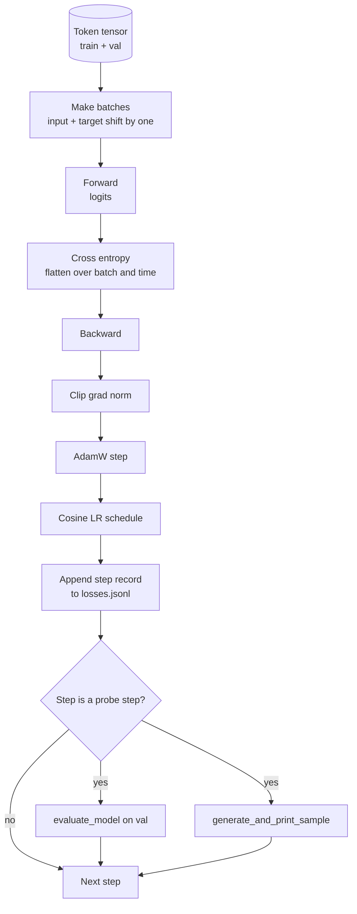

# 訓練迴路與評估

> 一條不量測的迴路是一條會說謊的迴路。這一課要建出那條驅動 GPT 模型的訓練迴路：帶權重衰減切分的 AdamW、一份暖身加餘弦的學習率排程、一個 `calc_loss_batch` 輔助函式、一趟跑在保留資料上的 `evaluate_model`、每 K 步一次的 `generate_and_print_sample` 質性探測，以及一份你事後可以畫圖的 JSONL 損失日誌。同一副骨架訓練得了你這輩子會建的每一個解碼器 LLM。

**類型：** 實作
**程式語言：** Python
**先修單元：** 階段 19 第 30 到 35 課
**時間：** 約 90 分鐘

## 學習目標

- 建出一條訓練迴路，以正確的輸入與目標對齊，替下一詞元預測計算交叉熵損失。
- 設定 AdamW，把權重衰減套用在權重張量上，而不套在 LayerNorm 或偏置張量上。
- 實作一份帶線性暖身與餘弦衰減的學習率排程，並讀出學習率隨時間的變化。
- 用 `evaluate_model` 在一份保留切分上做評估，好讓評估損失在各次執行間可以比較。
- 每 K 步用 `generate_and_print_sample` 生成一個質性樣本，在損失曲線之前先抓到發散。
- 把逐步損失持久化成 JSONL，好讓你能重新載入、畫圖，並把訓練日誌當成交付物出貨。

## 那個問題

一支只印損失、其他什麼都不做的訓練腳本，會以三種方式失敗。它沒辦法告訴你損失是不是為了對的理由在下降（模型可能過擬合訓練集卻什麼都沒學到）。它沒辦法告訴你發散是不是正在開始（損失可能只噴一步就恢復，也可能噴一步就崩掉）。它沒辦法告訴你模型學到了什麼（損失是一個純量；生成出來的樣本是一整段）。這三種失敗都藏得好好的，除非迴路會量測。

這一課的迴路用三種方式量測。每一步量訓練批次上的損失。每 K 步量一份保留批次上的損失。每 K 步從一段固定提示詞生成一段續寫。訓練日誌落成 JSONL，於是那份產出物就是迴路的證詞。

## 那個概念



那兩塊不那麼顯而易見的東西，是損失對齊與 AdamW 的衰減切分。

### 損失對齊

模型在每一個位置上預測下一個詞元。若輸入批次是詞元 `[t0, t1, t2, t3]`，目標批次就必須是 `[t1, t2, t3, t4]`。交叉熵是在攤平後的形狀 `(batch * seq, vocab)` 上、對著攤平的目標 `(batch * seq,)` 計算的。忘了那次平移，你就訓練模型去預測它自己，那會收斂到零損失、卻什麼有用的都沒學到。

### AdamW 的衰減切分

權重衰減正則化的是權重張量，不是正規化的縮放參數或偏置。把衰減放在 LayerNorm 的縮放上，會慢慢把那個縮放推向零並打壞正規化。把衰減放在偏置上在數學上無害，但是浪費運算週期。標準的切法是：矩陣形狀的張量（線性層權重、嵌入表）吃衰減，任何看起來像縮放或位移的都不吃。

### 暖身加餘弦排程

暖身在幾百步之內把學習率從零拉到目標值，好讓最佳化器的狀態有時間填起來。餘弦衰減在剩下的步數裡把學習率降回接近零，好讓最後階段以很小的步長微調權重。這個組合是開放權重 LLM 訓練中最常見的排程，因為它把前一千步與後一千步裡大部分脆弱的時刻都拿掉了。

### 保留評估

`evaluate_model` 從驗證切分跑固定數量的批次、累積損失、除以批次數，然後回傳。沒有梯度。沒有 dropout。在同樣的種子與同樣的切分之下，這個數字在各次執行間可重現。把保留損失擺在訓練損失旁邊回報，就是你發現過擬合的方式。

### 把質性取樣當成早期訊號

一個訓練損失掉得漂亮、但生成樣本全是同一個詞元的模型，是壞的。一個損失曲線看起來很平、但生成樣本正在銳化成連貫詞語的模型，是在學習的。那項質性探測跑得比讀完整條曲線快，而且抓得到純量漏掉的模式。

```figure
cap-training-loop
```

## 動手建

`code/main.py` 實作：

- `make_batches(token_ids, batch_size, context_length)`，把一個長詞元張量切成輸入與目標配對。
- `calc_loss_batch(model, inputs, targets)`，做前向、攤平，並回傳那個純量交叉熵。
- `evaluate_model(model, val_loader, max_batches)`，在無梯度之下迭代固定數量的驗證批次，並回傳平均損失。
- `generate_and_print_sample(model, prompt, max_new_tokens)`，在一段固定提示詞上跑第 35 課的生成函式，並印出結果。
- `build_param_groups(model, weight_decay)`，產出那份兩組式的 AdamW 參數清單。
- `cosine_with_warmup(step, warmup_steps, total_steps, max_lr, min_lr)`，回傳給定步數下的學習率。
- `train(...)`，跑那條迴路、持久化 `outputs/losses.jsonl`，並每 `eval_every` 步印出評估損失與一個樣本。
- 一個示範：在合成資料上訓練一個極小的模型跑少量步數、寫出一份 JSONL 日誌，並在探測點印出評估損失與一個樣本。這個示範在 CPU 上遠不到一分鐘就跑完。

跑它：

```bash
python3 code/main.py
```

輸出：逐步的損失行、每個探測步的評估損失、每個探測步的生成樣本，以及最終一份可以逐行用 `json.loads` 載入的 `outputs/losses.jsonl`。

## 技術堆疊

- `torch`，用於自動微分、最佳化器與模組。
- `main.py` 在本地重新實作了第 35 課的 `GPTModel` 與相關支援模組。

## 現實世界裡的生產模式

有三種模式，能把教科書上的迴路變成你敢放著跑一整夜的東西。

**梯度範數裁剪沒得商量。** 一個壞批次（異常資料、學習率暴衝、某個數值邊界情況）會產出一個巨大的梯度，把好幾小時的訓練一筆抹掉。在 `backward` 之後、`step` 之前加上 `torch.nn.utils.clip_grad_norm_(params, max_norm=1.0)`，就能讓最佳化器待在安全範圍內。那個裁剪值是自由參數；一是那個在多數設定下都活得下來的預設值。

**可續跑的 JSONL 記錄，不是 pickle 出來的狀態。** 把逐步損失記錄成 JSONL 裡 `{"step": int, "train_loss": float, "lr": float}` 這樣的行，是耐久的：任何當機都留下一份讀得懂的產出物、你可以 grep、你可以用三十行 Python 畫圖，而且你可以讀最後一步來續跑訓練。Pickle 出來的狀態把你綁死在產生那個檔案的確切模組佈局上，而那在重構之間很脆弱。

**評估批次取自一份固定切片。** 驗證詞元在腳本開始時就被切成批次，不是即時切。可重現性取決於評估批次在各次執行間完全相同；否則比較兩次執行的評估損失，量到的就有一半是批次洗牌而不是模型。

## 動手用

- 這一課的迴路，就是那副在真實資料上訓練一個 124M 模型的相同骨架。把合成詞元張量換成一個 `datasets` 風格的載入器，迴路原封不動就能跑。
- 那份 JSONL 日誌，就是把一次訓練變成證據的那個交付物。下一課會用一份它來比較一個剛訓練好的檢查點與一個預訓練的檢查點。
- 那項質性樣本探測，是純量損失取代不了的萬用網。

## 練習

1. 加上 `weight_decay_groups()` 的單元測試，確認縮放與偏置參數落進不衰減那一組，而線性層與嵌入權重落進衰減那一組。
2. 把合成的隨機詞元換成一個小文字檔的位元組，好讓示範訓練在看得懂的東西上。驗證生成樣本用的是該檔案中出現過的字元。
3. 替餘弦排程加上一個為 `max_lr` 一成的 `min_lr` 地板，並重新畫圖。
4. 除了 JSONL 日誌之外，每 `eval_every` 步再存一個檢查點。加上一個 `resume_from` 旗標，重新載入模型狀態與最佳化器狀態。
5. 在損失旁邊記錄逐步吞吐量（每秒詞元數），並確認它待在一個穩定的區間裡。

## 關鍵術語

| 術語 | 大家怎麼說 | 實際是什麼意思 |
|------|-----------------|------------------------|
| 損失對齊 | 「平移一格」 | 輸入詞元在位置 0..T-1、目標詞元在位置 1..T；交叉熵在攤平後的形狀上計算 |
| 衰減切分 | 「兩組」 | AdamW 收到的是「帶權重衰減的矩陣形狀張量」與「不帶衰減的縮放或偏置張量」 |
| 暖身 | 「爬坡」 | 學習率在固定步數之內從零爬到目標值，好讓最佳化器狀態填起來 |
| 評估批次 | 「保留批次」 | 驗證詞元張量的一份固定切片，在腳本開始時切一次，每次探測都一模一樣地使用 |
| 質性探測 | 「印出樣本」 | 每 K 步從固定提示詞印出一小段生成，用來抓那些光看損失藏得住的失敗模式 |

## 延伸閱讀

- 階段 19 第 35 課，了解這條迴路所驅動的那個模型。
- 階段 19 第 37 課，了解如何把預訓練權重載進同一個模型。
- 階段 10 第 04 課（預訓練迷你 GPT），了解在真實資料上的那套流程。
- 階段 10 第 10 課（評估），了解交叉熵損失之外更廣的評估面。
