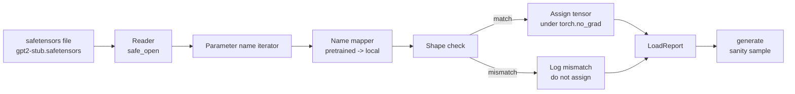

# 載入預訓練權重

> 從零訓練一個一億兩千四百萬參數的模型是一項預算決策；載入一份已發布的檢查點只是個星期二。這一課從一個 safetensors 檔案，把 GPT-2 風格的預訓練權重載進第 35 課那個確切的架構、一塊一塊走過參數名稱的對映，並做一次健全性生成以證明載入成功。不連網、沒有第三方載入器、沒有不透明的魔法。

**類型：** 實作
**程式語言：** Python
**先修單元：** 階段 19 第 30 到 36 課
**時間：** 約 90 分鐘

## 學習目標

- 用 `safetensors` 這個 Python 函式庫讀一個 safetensors 檔案，並檢視張量名稱與形狀。
- 把每一個預訓練參數名稱，對映到第 35 課那個 GPT 模型裡的某個參數上。
- 處理已發布 GPT-2 權重與本軌模型之間的兩套命名慣例差異：`wte/wpe/h.N.attn.c_attn/c_proj` 與 `mlp.c_fc/c_proj`，對上本地命名的 `tok_embed/pos_embed/blocks.N.attn.qkv/out_proj` 與 `mlp.fc1/fc2`。
- 在任何權重賦值發生之前，就以清楚的錯誤偵測並拒絕形狀不符。
- 用載入好的權重生成一小段續寫，並確認那些詞元來自載入後的分布，不是隨機初始化的那個。

## 那個問題

已發布的權重不是為你的架構打包的。它們帶的是原始實作所用的名稱。預訓練檔案裡有一個形狀為 `(2304, 768)` 的 `transformer.h.0.attn.c_attn.weight`；而你的模型期待的是形狀為 `(2304, 768)` 的 `blocks.0.attn.qkv.weight`（那是同一個矩陣、只是佈局慣例不同），或者你的模型用 `nn.Linear`，而它把矩陣轉置著存。同一個參數以三種微妙不同的身分（名稱、形狀、位元組佈局）現身，而載入器得把這三者全部調和起來。

一個盲目複製的載入器，會把對的張量放到錯的位置，然後你得到一個生成胡言亂語的模型。一個在形狀不同時拒絕複製、卻什麼都不記錄的載入器，會讓你猜是哪個張量沒落地。這一課的載入器是明確的：每一次賦值都被記錄、每一個形狀都被檢查，而一份 `LoadReport` 摘要出命中、遺漏與形狀不符，好讓你讀得出發生了什麼。

## 那個概念



名稱對映器就只是一個從字串到字串的函數。形狀檢查是一個 if。賦值發生在 `torch.no_grad()` 裡面，好讓自動微分不去追蹤這次載入。那份報告持有每一個名稱的結果。

### GPT-2 的命名慣例

已發布的 GPT-2 權重住在像這樣的名稱底下：

| 預訓練名稱 | 形狀 | 意義 |
|-----------------|-------|---------|
| `wte.weight` | (50257, 768) | 詞元嵌入 |
| `wpe.weight` | (1024, 768) | 位置嵌入 |
| `h.N.ln_1.weight` | (768,) | 區塊 N 的 LayerNorm 1 縮放 |
| `h.N.ln_1.bias` | (768,) | 區塊 N 的 LayerNorm 1 位移 |
| `h.N.attn.c_attn.weight` | (768, 2304) | 融合 QKV 的線性權重 |
| `h.N.attn.c_attn.bias` | (2304,) | 融合 QKV 的線性偏置 |
| `h.N.attn.c_proj.weight` | (768, 768) | 注意力輸出投影 |
| `h.N.attn.c_proj.bias` | (768,) | 注意力輸出投影偏置 |
| `h.N.ln_2.weight` | (768,) | LayerNorm 2 縮放 |
| `h.N.ln_2.bias` | (768,) | LayerNorm 2 位移 |
| `h.N.mlp.c_fc.weight` | (768, 3072) | MLP fc1 權重 |
| `h.N.mlp.c_fc.bias` | (3072,) | MLP fc1 偏置 |
| `h.N.mlp.c_proj.weight` | (3072, 768) | MLP fc2 權重 |
| `h.N.mlp.c_proj.bias` | (768,) | MLP fc2 偏置 |
| `ln_f.weight` | (768,) | 最終 LayerNorm 縮放 |
| `ln_f.bias` | (768,) | 最終 LayerNorm 位移 |

有兩個驚喜要先規劃好。`c_attn`、`c_proj`、`c_fc` 這些線性層存的矩陣，相對於 `nn.Linear.weight` 所期待的是轉置過的。載入器在賦值時做轉置。語言模型頭根本不在那個檔案裡；模型倚賴與 `wte` 的權重綁定，所以 `wte` 一落地，那個頭就靠別名設好了。

### 本地的命名慣例

本軌的模型用的是描述性的名稱：

| 本地名稱 | 意義 |
|------------|---------|
| `tok_embed.weight` | 詞元嵌入 |
| `pos_embed.weight` | 位置嵌入 |
| `blocks.N.ln1.scale` | 區塊 N 的 LayerNorm 1 縮放 |
| `blocks.N.ln1.shift` | LayerNorm 1 位移 |
| `blocks.N.attn.qkv.weight` | 融合 QKV |
| `blocks.N.attn.qkv.bias` | 融合 QKV 偏置 |
| `blocks.N.attn.out_proj.weight` | 注意力輸出投影 |
| `blocks.N.attn.out_proj.bias` | 輸出投影偏置 |
| `blocks.N.ln2.scale` | LayerNorm 2 縮放 |
| `blocks.N.ln2.shift` | LayerNorm 2 位移 |
| `blocks.N.mlp.fc1.weight` | MLP fc1 |
| `blocks.N.mlp.fc1.bias` | MLP fc1 偏置 |
| `blocks.N.mlp.fc2.weight` | MLP fc2 |
| `blocks.N.mlp.fc2.bias` | MLP fc2 偏置 |
| `final_ln.scale` | 最終 LayerNorm 縮放 |
| `final_ln.shift` | 最終 LayerNorm 位移 |

那份對映是一個固定函數。這一課把它出貨成一個字典，供載入器迭代。

### 那份存根固定檔

真實的 GPT-2 權重有 0.5 GB。示範不去下載它們；它在第一次執行時生出一個小型的 safetensors 固定檔，帶著完全一樣的 GPT-2 命名慣例，形狀則對應一個 12 區塊、d_model 為 192（而不是 768）的模型。那份固定檔的結構足以演練載入器裡的每一條程式碼路徑。把固定檔換成真實檔案，載入器不必修改就能用。

```figure
cc-weight-remap
```

## 動手建

`code/main.py` 實作：

- 第 35 課 `GPTModel` 的一份小型複本，好讓這一課自足。
- `make_pretrained_to_local(num_layers)`，把逐層的條目展開。
- `load_safetensors(model, path)`，它迭代名稱、做對映、檢查形狀、轉置那些 conv1d 風格的權重，並在 `torch.no_grad()` 底下賦值。回傳一份 `LoadReport`。
- `make_stub_safetensors(path, cfg)`，用完全一樣的預訓練命名慣例生出一個固定檔。
- 一個示範：第一次執行時建出 `outputs/gpt2-stub.safetensors`、建一個全新模型、從隨機初始化擷取一段生成續寫、載入那份存根、再擷取另一段續寫、把兩者印出來，並驗證兩者不同（這次載入確實改變了模型）。

跑它：

```bash
python3 code/main.py
```

輸出：那份固定檔的路徑、逐名稱的載入日誌、一份 `LoadReport` 摘要、載入前的一段續寫、載入後的一段續寫，以及一個刻意注入固定檔裡的壞張量所造成的形狀不符，好讓失敗路徑也被演練到。

## 技術堆疊

- `safetensors`，用於磁碟格式與一個串流讀取器。
- `torch`，用於模型與賦值的運算。
- 不用 `transformers`、不用 `huggingface_hub`、不做網路呼叫。

## 現實世界裡的生產模式

有三種模式，讓載入器在碰上不是你做的權重時活得下來。

**在任何賦值之前一律先驗證檔案。** 打開檔案、列出每一個張量名稱連同它的 dtype 與形狀、帶著形狀檢查跑完整份對映，只有在成功之後才開始賦值。載到一半的模型是無聲失敗製造機。

**每一次賦值都連同來源名稱與目的名稱一起記錄。** 當有東西看起來不對時，日誌會告訴你哪個張量落到了哪裡；不然你就得去讀十六進位傾印。這一課的 `LoadReport` dataclass 追蹤 `loaded`、`missing`、`unexpected` 與 `shape_mismatch` 幾份清單，並在最後印出摘要。

**語言模型頭是一個權重綁定的別名，不是另一份副本。** 在載入 `tok_embed` 之後設定 `model.lm_head.weight = model.tok_embed.weight`，是那個經典模式。把嵌入矩陣複製到一個全新的 `lm_head.weight` 參數裡，會打壞綁定，並悄悄地把你的參數量翻倍。

## 動手用

- 這個載入器適用於任何採用該預訓練命名慣例的 safetensors 檔案。真實的 GPT-2 檔案（small / medium / large / xl）不必改程式碼就能用；差別只在模型組態。
- 一旦你更新那份名稱對映，同一個模式就延伸得到 LLaMA、Mistral、Qwen 的權重。形狀檢查與那份報告維持不變。
- 載入後做健全性生成是一道快速閘門：若載入後的樣本看起來跟載入前的樣本一樣，那這次載入根本沒改到模型，也就是說那份對映無聲地漏掉了每一個張量。

## 練習

1. 替載入器加上一個 `dtype` 參數，在賦值時把每個張量轉成目標 dtype（`bfloat16`、`float16`、`float32`）。確認一個 `float32` 模型可以降轉成 `bfloat16` 而仍然生成得了。
2. 加上一個 `expected_layers` 參數，拒絕載入那些 `h.N` 索引與模型 `num_layers` 對不上的檢查點。
3. 把載入器接進第 35 課的生成函式，產出兩份並排樣本：一份來自隨機初始化，一份來自載入的固定檔。
4. 加上一條匯出路徑：用那套預訓練命名慣例，把當前模型狀態寫進一個全新的 safetensors 檔案。讓載入器來回轉換一趟，並確認報告裡的形狀不符是零。
5. 擴充 `NAME_MAP` 以處理 LLaMA 的命名慣例（沒有偏置、RMSNorm、融合 qkv 佈局），並在一份你自己生成的 LLaMA 存根固定檔上重跑載入器。

## 關鍵術語

| 術語 | 大家怎麼說 | 實際是什麼意思 |
|------|-----------------|------------------------|
| 名稱對映 | 「鍵重映」 | 從預訓練張量名稱到本地參數名稱的函數；通常是一個字面字典，每個層索引一筆並在迴圈中展開 |
| 形狀不符 | 「形狀壞了」 | 預訓練張量以對映後的名稱存在，但它的維度與本地參數不一致；載入器拒絕賦值並記錄那一組 |
| 載入時轉置 | 「Conv1d 佈局」 | 已發布的 GPT-2 把注意力與 MLP 的投影，以 nn.Linear 所期待形狀的轉置存放；載入器在賦值時轉置 |
| 權重綁定別名 | 「共用的語言模型頭」 | 設定 model.lm_head.weight = model.tok_embed.weight，讓頭與嵌入共用儲存；正因如此那個頭不在檔案裡 |
| 載入報告 | 「涵蓋率摘要」 | 一個追蹤 loaded、missing、unexpected 與 shape_mismatch 幾份清單的小型 dataclass；把它印出來就是你判斷載入有沒有成功的方式 |

## 延伸閱讀

- 階段 19 第 35 課，了解接收這些權重的那個架構。
- 階段 19 第 36 課，了解那條產出同樣形狀檢查點的訓練迴路。
- 階段 10 第 11 課（量化），了解記憶體吃緊時該拿載入好的權重怎麼辦。
- 階段 10 第 13 課（打造完整的 LLM 管線），了解圍繞載入與推論的完整生命週期。
