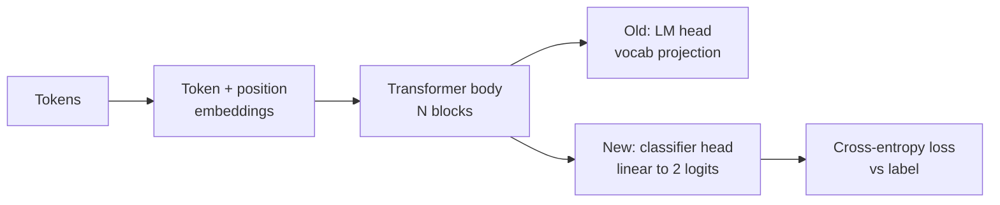
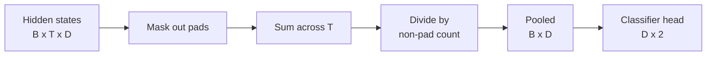
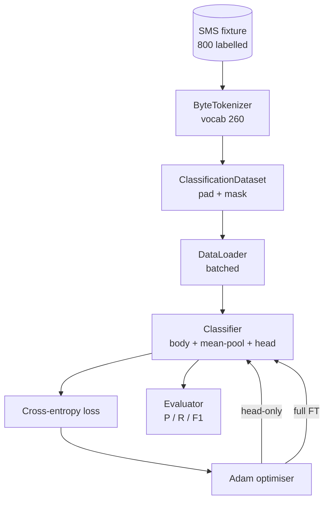

# 綜合專案第 38 課：以換頭做分類器微調

> B 軌的第一個綜合專案。一個預訓練語言模型，是一疊自注意力區塊，末端接一個詞元預測頭。當你要的是垃圾訊息與正常訊息的判別時，那個頭是錯的，但身體大致是對的。這一課把頭扯掉、在池化後的表示上黏一個兩類別的線性層，然後用兩種不同方式訓練這個分類器：只訓練最後一層，以及完整微調。評估是保留切分上的精確率、召回率與 F1。你會學到每一種策略買到了什麼、又付出了什麼。

**類型：** 實作
**程式語言：** Python (torch, numpy)
**先修單元：** 階段 19 第 30-37 課（NLP LLM 軌：分詞器、嵌入表、注意力區塊、transformer 身體、預訓練迴路、檢查點、生成、困惑度）
**時間：** 約 90 分鐘

## 學習目標

- 在不重新初始化身體的情況下，把語言模型頭換成分類頭。
- 實作兩種訓練體制：凍結身體（只訓練頭）與完整微調，兩者共用同一條訓練迴路。
- 建出一條感知分詞器的資料管線，會做填補、遮蔽填補位，並池化注意力輸出。
- 從原始 logits 計算精確率、召回率、F1 與一張混淆矩陣。
- 想清楚參數量、訓練時間與提升空間三者之間的取捨。

## 那個問題

你在一份通用語料上預訓練了一個小型 transformer。輸出頭把最後的隱藏狀態投影到一個 1000 詞元的詞彙表上。你現在手上有 800 則標了垃圾／正常的簡訊，而你想要一個二元分類器。有三個選項。

錯的那個選項是在 800 個樣本上從零訓練一個全新的分類器。那個預訓練模型的身體已經編碼了有用的結構：詞的身分、位置、簡單的共現。把它丟掉，就浪費了建出它的那些運算。

對的那兩個選項是：換頭並凍結身體，以及換頭並讓身體可訓練。只訓練頭很快、記憶體上幾乎免費，而且在這麼少資料下很少過擬合。完整微調比較慢、在小資料上可能過擬合，但當下游領域偏離預訓練語料時，它達得到更高的準確率。

這一課兩個都建，好讓你在同一份固定資料上比較它們。

## 那個概念



模型是一個函數 `f_theta(tokens) -> hidden_states`。頭是一個函數 `g_phi(hidden) -> logits`。換頭的意思是保住 `theta` 並換掉 `g_phi`。身體的參數是昂貴的那部分。頭是單一個線性層。

有兩組可訓練參數要緊：

- `theta`（身體）：每個注意力區塊有數萬個權重。
- `phi`（頭）：`hidden_dim * num_classes` 個權重加一個偏置。

在只訓練頭的體制裡，你對 `phi` 算梯度、對 `theta` 歸零。PyTorch 讓你透過在身體參數上設 `requires_grad=False` 來做這件事。最佳化器於是只看得到頭，而身體維持凍結。

在完整微調裡，你讓梯度一路流回整個堆疊。身體的權重會漂移去貼合分類目標。風險是在小資料上發生災難性遺忘：身體的預訓練會被過擬合的雜訊沖掉。

## 那個池化問題

分類器需要的是每個序列一個向量，不是每個詞元一個向量。三種常見選擇：

- **平均池化**：把隱藏狀態沿序列平均，並依注意力遮罩加權。
- **CLS 池化**：在前面加一個特殊詞元，只用它的輸出。BERT 就是這樣做的。
- **末詞元池化**：用最後一個非填補詞元。GPT 類的分類器就是這樣做的。

這一課用的是帶明確注意力遮罩加權的平均池化。它最簡單、在不同序列長度上給出穩定的訊號，而且不需要預訓練一個 CLS 詞元。



## 那份資料

八百則簡訊，垃圾與正常各 400 則、平衡的，在 `code/main.py` 裡以確定性方式生成。那個產生器用固定種子、挑選樣板並代入插槽填充物，產出 5 到 25 個詞元長的訊息。真實資料集的雜訊比這份固定資料多。這份固定資料的重點在可重現性。

資料以 80/20 切分：640 筆訓練、160 筆測試。切分是分層的，好讓測試集維持 50/50 的平衡。一份平衡已知的保留集，讓精確率與召回率讀起來是誠實的數字。

## 那些指標

二元分類，以類別 1（垃圾）為正類。計數為：

- `TP`：預測為垃圾，實際是垃圾。
- `FP`：預測為垃圾，實際是正常。
- `FN`：預測為正常，實際是垃圾。
- `TN`：預測為正常，實際是正常。

三個頭條指標：

- `precision = TP / (TP + FP)`。在被標為垃圾的訊息中，實際是垃圾的比例是多少？
- `recall = TP / (TP + FN)`。在實際的垃圾訊息中，模型標出了多少比例？
- `F1 = 2 * P * R / (P + R)`。兩者的調和平均。

混淆矩陣把那四個計數印成一個 2x2 的網格。示範會替兩種訓練體制都把它寫到標準輸出。

```figure
cap-classifier-head-swap
```

## 架構



那個身體是一個刻意做得極小的 transformer：詞彙 260、隱藏 64、4 個頭、2 個區塊、最大序列 32。它小到能在 CPU 上九十秒之內把兩種體制都訓練到收斂。這一課裡它並沒有被預訓練；取而代之的是 `pretrain_quick` 這個輔助函式，在同一份固定資料的文字上跑五個訓練週期的語言模型訓練，給那個身體一個非平凡的起點。這讓這一課保持自足。

## 你會建出什麼

實作是一個 `main.py` 加一個測試模組（`code/tests/test_main.py`）。

1. `ByteTokenizer`：把位元組對映到 id，並保留一個填補 id。
2. `Block`：一個帶多頭注意力與前饋層的 transformer 區塊。前置正規化。
3. `LMBody`：詞元 + 位置嵌入，加上一疊區塊。回傳隱藏狀態。
4. `MeanPool`：沿序列軸做遮罩加權的平均。
5. `Classifier`：身體、池化、線性頭。身體在兩種體制之間是同一個實例。
6. `freeze_body` 與 `unfreeze_body`：切換身體參數上的 `requires_grad`。
7. `train_classifier`：一條共用的迴路。接受模型，以及一個針對「哪一組參數可訓練」而設定好的最佳化器。
8. `evaluate`：跑測試集並回傳 `Metrics(precision, recall, f1, confusion)`。
9. `run_demo`：先簡短預訓練身體，接著訓練並評估「只訓練頭」，再訓練並評估「完整微調」，把兩份報告印出來，並以零結束碼退出。

## 為什麼那次比較要緊

只訓練頭的體制通常訓練得比較快，欠擬合時也比較優雅。在這份固定資料上，只訓練頭跑二十個週期後，你通常會看到精確率接近 0.9、召回率接近 0.85。完整微調要花大約三倍時間，落點則視隨機種子而定，在正負幾個百分點之內。

這一課不挑贏家。它教你讀那些數字與代價。在 800 個樣本與一個極小的身體上，只訓練頭是對的選擇。在 80,000 個樣本與一個更大的身體上，完整微調就開始划算了。你從這一課帶走的契約是那組 API：同一個 `train_classifier` 函式兩種都處理，而切換只是一次呼叫。

## 延伸目標

- 加上第三種體制，只解凍最後一個區塊。這有時被稱為部分微調。它比完整微調便宜，又比只訓練頭學得多。
- 加上一份學習率排程。頭上跑餘弦排程、身體上跑一個較小的固定速率，是常見的生產設定。
- 把平均池化換成一個學出來的注意力池化：一個帶單一個學習查詢的小型注意力層。在較長的序列上，這常常勝過平均池化。

實作給了你那些掛鉤。測試釘住了那份契約。那些數字就交給你去推了。
