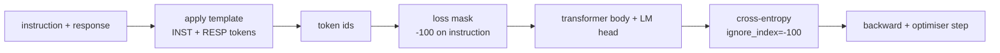
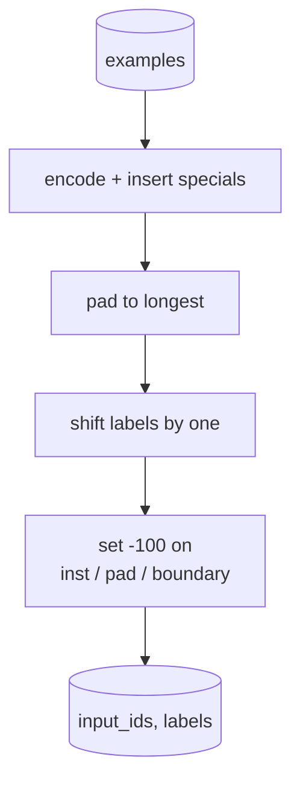
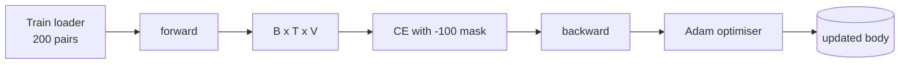

# 綜合專案第 39 課：以監督式微調做指令調校

> 一個預訓練的基礎模型續寫得了序列，卻遵循不了指令。監督式微調是修好這件事的最小改動：餵給模型成對的「指令與期望回應」樣本，並訓練那個身體去預測回應的詞元。訣竅在於：你只想讓損失算進回應，不算進指令。這一課要建出一條 Alpaca 風格的 SFT 迴路，配一個用 `ignore_index=-100` 遮蔽指令詞元的自訂 collate 函式，在 200 組指令－回應配對上訓練，並用完全相符在一份保留切分上做評估。

**類型：** 實作
**程式語言：** Python (torch, numpy)
**先修單元：** 階段 19 第 30-37 課（NLP LLM 軌：分詞器、嵌入表、注意力區塊、transformer 身體、預訓練迴路、檢查點、生成、困惑度）
**時間：** 約 90 分鐘

## 學習目標

- 把成對的指令－回應資料，格式化成一段帶明確邊界詞元的因果序列。
- 建出一個 collate 函式，遮蔽指令詞元，好讓交叉熵只算進回應詞元。
- 在 SFT 目標之下訓練一個極小的 transformer 身體，並看著評估指標動起來。
- 實作尊重回應起始邊界的貪婪與溫度取樣生成。
- 在生成的補完上計算保留集的完全相符率。

## 那個問題

一個以下一詞元預測訓練出來的基礎模型，根本不知道指令是什麼。給它看字串 `"What is the capital of France?"`，它會把那個問題續寫下去，或發明一句新的話。模型有語言，但沒有那份格式契約。

SFT 的契約是一個字串樣板。每一個訓練樣本都變成單一段帶三個區域的序列：

```text
<INST> What is the capital of France? <RESP> The capital of France is Paris.
```

那些邊界詞元是訓練時保留下來的特殊詞元。模型學到 `<RESP>` 之後的一切都是回應，而回應才是被評分的東西。基礎模型的下一詞元目標仍然適用；只是它現在被訓練在一份「每個樣本都長這個形狀」的語料上。

但有個陷阱。若你把整段序列餵給一個普通的交叉熵損失，你就同時在訓練模型去預測那些指令詞元。指令是已知的。你要那些位置上的梯度為零。修法就是那張遮罩。

## 那個概念



`ignore_index` 是 `torch.nn.functional.cross_entropy` 的一項功能。任何等於 `ignore_index` 的目標位置，貢獻零損失與零梯度。PyTorch 的慣例是 `-100`。那個 collate 函式替每個樣本建出兩個張量：`input_ids`（完整序列）與 `labels`（`input_ids` 的一份副本，指令位置被 `-100` 覆蓋掉）。

模型在前向傳遞時看得到整段序列；注意力可以去注意那段指令。損失只算進回應詞元。這正是你要的：以指令為條件，預測回應。

## 那份資料

兩百組指令－回應配對，在 `main.py` 裡以確定性方式生成。它們涵蓋六種任務型別：

- 單次事實問答（X 的首都）
- 算術
- 清單抽取
- 一句話摘要
- 程式碼（印出、排序）
- 定義

每種任務都有一個樣板化的指令與一個確定性的回應。這是刻意做得簡單。完全相符很脆，而這一課用的固定資料，正確答案就是一個特定字串。真實的 SFT 資料集需要模糊指標；原理則完全一樣。

切分是 160 筆訓練、40 筆測試。測試集涵蓋全部六種任務型別，好讓逐類別的完全相符率報得出來。

## 分詞與填補

分詞器是位元組層級的，帶三個保留的特殊詞元：

- `INST_ID = 256`：標示指令區的開始。
- `RESP_ID = 257`：標示指令與回應之間的邊界。
- `PAD_ID = 258`：供變動長度批次使用的填補。

序列是 `[INST] inst_bytes [RESP] resp_bytes [PAD]*`。那個 collate 函式：

1. 把每個樣本分詞。
2. 把批次中每個樣本填補到批次裡最長的序列長度。
3. 建出 `labels` = `input_ids` 平移一格（因果語言模型目標），其中：
   - 指令區被換成 `-100`。
   - 填補區被換成 `-100`。
   - `RESP_ID` 那個邊界位置本身也被換成 `-100`（你不訓練模型去預測那個邊界詞元；它預測的是接下來的東西）。



那次平移是標準的因果技巧：`input_ids` 的位置 `i` 預測位置 `i+1`，所以 `labels[i] = input_ids[i+1]`（輸入丟掉最後一個位置、目標丟掉第一個）。遮罩在平移之後才套用，好落在正確的位置上。

## 訓練



那條迴路是標準的 PyTorch SFT 迴路。Adam、學習率約 3e-4 到 1e-3、在這份固定資料上十到二十個訓練週期、不用排程器。模型小到（隱藏 96、2 個區塊、最大長度 64）能在 CPU 上兩分鐘之內訓練到收斂。

每五個週期，迴路會在保留集上跑一趟極小的評估並印出完全相符率。看著完全相符率從第一個週期的 0.0 走到第十五個週期的 0.85 左右，就是這一課的回報：你看得到模型同時在學那個格式與那些答案。

## 生成

評估時，模型拿到指令前綴 `[INST] inst_bytes [RESP]`，並持續生成詞元，直到下列任一發生：

- 序列到達 `max_len`，或
- 模型送出一個特殊的停止捷思：兩個連續的句末位元組（`.`、`!`、`?`）。

這一課出貨貪婪解碼加上一個選配的溫度取樣器。完全相符用貪婪，因為溫度會讓那個指標變成隨機的。真實系統常常先取樣、再做模糊評判；那條管線是第 41 課。

## 完全相符評估

完全相符是最嚴格的文字指標。預測出來的回應字串會被正規化（轉小寫、去頭尾空白、把連續空白收合），並與同樣正規化過的參考回應比對。每個樣本的指標不是 1 就是 0。彙總值是平均。

真實的 SFT 管線會用詞元層級的 F1（第 41 課）與一個裁判模型來補完全相符。完全相符依然有用，因為它毫不含糊；若它說 0.7，那就是恰好 70% 的測試指令逐字元地產出了黃金答案。

```figure
cc-sft-loss-mask
```

## 你會建出什麼

實作是一個 `main.py` 加上測試。

1. `InstructionTokenizer`：帶保留特殊詞元的位元組層級編碼器。可以編碼一段指令前綴，也可以編碼一整組配對。
2. `make_dataset`：以固定種子跨六種任務型別生成 200 組配對。
3. `SFTDataset`：每個樣本回傳 `(input_ids, labels)`，遮罩已經準備好。
4. `sft_collate`：動態填補、建出批次張量、在指令與填補位置設 `-100`。
5. `TinyGPT`：transformer 身體加上綁定或未綁定的語言模型頭。
6. `train_sft`：那條 SFT 迴路，帶逐週期的評估掛鉤。
7. `generate`：從一段前綴做因果解碼，貪婪或取樣，並帶那個停止捷思。
8. `exact_match`：正規化後的字串比對，回傳 `[0, 1]` 之間的浮點數。
9. `run_demo`：建出資料、訓練二十個週期、做評估、印出逐類別的拆解，成功時以零結束碼退出。

## 為什麼那張遮罩要緊

沒有遮罩，損失就把指令詞元當成目標。模型會學著去預測指令。這是另一個目標，而且會在兩方面產出更糟的模型。第一，模型容量被浪費在重建那些使用者本來就會提供的輸入上。第二，在梯度總和裡回應的損失佔比更小，因為在多數批次裡指令詞元的數量勝過回應詞元；於是在你真正在乎的那部分上，最佳化器的有效學習率比你設想的低。那張遮罩不是拋光；它就是那個目標。

## 延伸目標

- 加上學習率暖身，之後接餘弦衰減。SFT 對學習率比預訓練更敏感。
- 加上逐詞元的損失記錄，並把訓練過程的損失曲線畫出來。注意早期週期由樣板詞元（`<RESP>`、常見前綴）主導，而後期週期由真正的答案詞元主導。
- 把評估擴充到 BLEU-1 或 chrF。完全相符會低估那些「換句話說但答案一樣」的模型。
- 加上一份帶多輪格式的聊天樣板，並在一份含追問的固定資料上訓練。

實作給了你那份格式契約、那張遮罩，以及那條迴路。從基礎模型變成指令遵循者的那次目標改動，就是一個 collate 函式。
