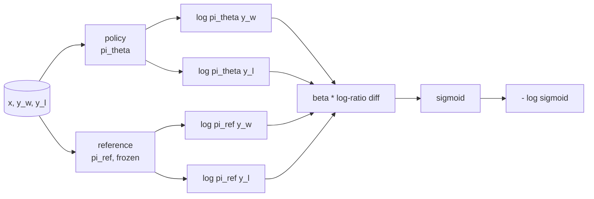
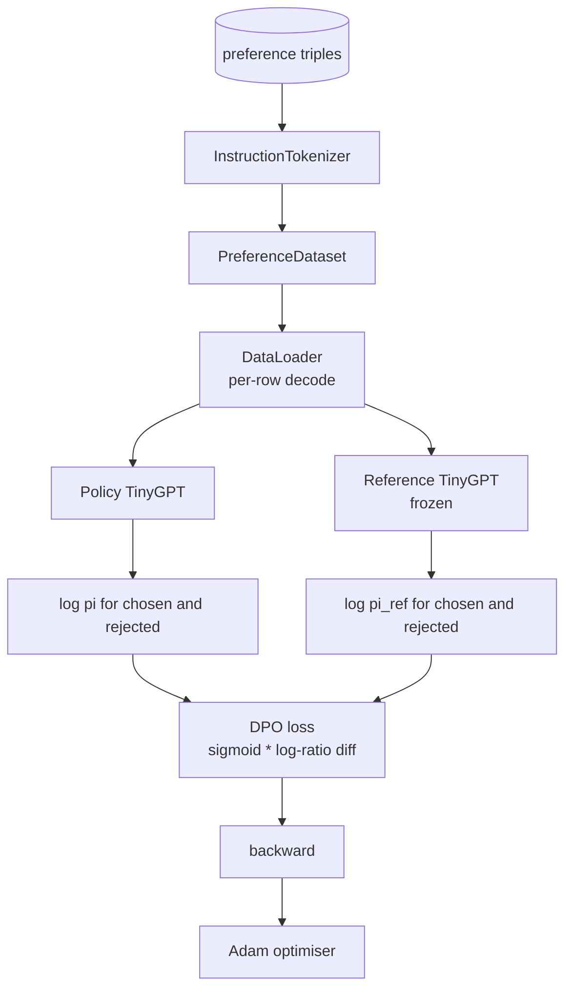

# 綜合專案第 40 課：從零打造直接偏好最佳化

> 獎勵模型與 PPO 是古典的 RLHF 堆疊。DPO 把那個堆疊壓縮成單一個監督式損失，直接對著偏好配對擬合一個策略。這一課從獎勵差值的恆等式推導出 DPO 損失、出貨一個能動的參考模型加策略模型、計算逐詞元的對數機率，並在一份「選中與被拒補完」的偏好固定資料上訓練一個極小的 transformer。測試釘住了損失的數學與梯度方向，好讓你知道實作與論文相符。

**類型：** 實作
**程式語言：** Python (torch, numpy)
**先修單元：** 階段 19 第 30-37 課（NLP LLM 軌：分詞器、嵌入表、注意力區塊、transformer 身體、預訓練迴路、檢查點、生成、困惑度）
**時間：** 約 90 分鐘

## 學習目標

- 把 DPO 損失推導成「對一個縮放後對數比值差」取 sigmoid，並把它連到那個隱含獎勵上。
- 建出一組參考模型 + 策略模型的配對，參考凍結、策略可訓練。
- 在兩個模型之下計算序列層級的對數機率，並遮蔽提示詞詞元。
- 在 `(prompt, chosen, rejected)` 三元組上訓練策略，並看著選中的對數機率相對被拒的上升。
- 用測試把損失數學、梯度符號與參考不變性的行為釘住。

## 那個問題

你有一個 SFT 模型。它遵循指令，但輸出參差不齊；有些補完清楚，有些囉嗦或錯誤。你也有一小份偏好配對資料集：對同一段提示詞，有人把其中一個補完標成選中、另一個標成被拒。

古典的 RLHF 答案是一條兩階段管線。在那些偏好上訓練一個獎勵模型。用 PPO 對著那個獎勵最佳化策略。這行得通，但很昂貴：PPO 期間記憶體裡要放兩個模型、要做 KL 控制以讓策略待在參考附近，而獎勵模型一脆弱就會出現獎勵駭取。

DPO 用單一個監督式損失取代這兩個階段。那個獎勵模型從不明確存在。策略直接在那些偏好配對上訓練，並帶一個朝向 SFT 參考的明確 KL 懲罰。在 Bradley-Terry 偏好模型之下最佳解相同，程式碼卻少得多。

## 那個概念

從 Bradley-Terry 模型出發。給定一段提示詞 `x` 與兩個補完 `y_w`（選中）與 `y_l`（被拒），人類偏好 `y_w` 的機率是

```text
P(y_w > y_l | x) = sigmoid( r(x, y_w) - r(x, y_l) )
```

其中 `r` 是某個潛在的獎勵函數。RLHF 先從偏好擬合出 `r`，再訓練一個策略 `pi` 在 KL 錨點之下最大化 `r`：

```text
max_pi   E_{x, y~pi} [ r(x, y) ] - beta * KL(pi || pi_ref)
```

DPO 的推導觀察到：這個目標之下的最佳策略 `pi*`，可以用 `r` 寫成封閉形式：

```text
pi*(y | x) = (1/Z(x)) * pi_ref(y | x) * exp( r(x, y) / beta )
```

對 `r` 重新整理：

```text
r(x, y) = beta * ( log pi*(y | x) - log pi_ref(y | x) ) + beta * log Z(x)
```

那個 `log Z(x)` 項對 `y_w` 與 `y_l` 是一樣的（它依賴 `x`，不依賴 `y`），所以你在計算偏好差值時它會消掉：

```text
r(x, y_w) - r(x, y_l) = beta * ( log pi_theta(y_w|x) - log pi_ref(y_w|x)
                                - log pi_theta(y_l|x) + log pi_ref(y_l|x) )
```

把它代進 Bradley-Terry 的 sigmoid，並對偏好配對取負對數概似：

```text
L_DPO(theta) = - E_{(x, y_w, y_l)} [
  log sigmoid( beta * ( log pi_theta(y_w|x) - log pi_ref(y_w|x)
                       - log pi_theta(y_l|x) + log pi_ref(y_l|x) ) )
]
```

這就是那個損失。它是對每個樣本一個純量取 sigmoid，而那個純量由四個對數機率算出來。沒有獨立的獎勵模型。沒有 PPO。損失裡沒有 KL 項；那個 KL 約束已經烤進封閉形式的推導裡了。



## 梯度的符號

在任何訓練之前都很有用的一項健全性檢查。對 `log pi_theta(y_w | x)` 取梯度：

```text
d L_DPO / d log pi_theta(y_w | x) = - beta * (1 - sigmoid(z))
```

其中 `z` 是 sigmoid 的引數。這對所有 `z` 都是負的，意思是：提高策略對選中補完的對數機率，會降低損失。對稱地，對 `log pi_theta(y_l | x)` 的梯度是正的：提高被拒補完的對數機率，會提高損失。訓練把選中的往上推、把被拒的往下壓。參考是凍結的；它不動。

## 那份資料

這一課出貨十二組偏好三元組。每一組是 `(prompt, chosen, rejected)`。選中的補完簡短而精確。被拒的則囉嗦、離題，或錯誤。這些配對涵蓋與第 39 課相同的任務家族（首都、算術、清單），好讓一個從 SFT 基礎出發的策略有個合理的起點。

這份固定資料刻意做得很小。生產環境的 DPO 跑的是好幾萬組配對；在這裡，重點是那個損失的數學與那條迴路能在一份極小資料集上端到端跑起來，而選中對被拒的對數機率差距肉眼可見地變大。

## 參考不變性

DPO 的實作必須小心處理那個參考模型。參考是那個被凍在原地的 SFT 模型。有三項性質必須成立：

- 參考的參數從不接收梯度。
- 參考的對數機率在各訓練週期之間從不改變。
- 策略從與參考相同的權重出發。（最佳的 `theta` 是參考加上一次學到的更新；把策略初始化成參考的副本，是那個定義良好的起點。）

實作以這些方式強制它們：

- 前向傳遞時把參考包在 `torch.no_grad()` 裡。
- 在每一個參考參數上設 `requires_grad=False`。
- 在參考建好之後，透過 `policy.load_state_dict(reference.state_dict())` 建構策略。

```figure
cap-dpo-preference
```

## 架構



模型是第 39 課用的那個 TinyGPT（純解碼器、因果、位元組分詞器）。參考與策略共用那個架構；策略的權重在訓練中從參考那裡漂開，而參考維持固定。

## 你會建出什麼

實作是一個 `main.py` 加上測試。

1. `InstructionTokenizer`：帶 `INST` 與 `RESP` 特殊詞元的位元組分詞器。與第 39 課同一個形狀。
2. `TinyGPT`：純解碼器 transformer。與第 39 課同一個形狀，好讓你就算跳過 39 這一課也自足。
3. `make_preferences`：回傳十二組 `(prompt, chosen, rejected)` 三元組。
4. `sequence_log_prob`：給定模型、一段提示詞前綴與一份補完，回傳那份補完上下一詞元對數機率的總和（不含提示詞位置的貢獻）。
5. `dpo_loss`：吃下那四個對數機率與 `beta`，回傳逐樣本的損失張量，以及供記錄用的隱含獎勵差值。
6. `train_dpo`：逐週期的迴路，在策略與參考之下計算選中與被拒的對數機率、套用損失，並讓 Adam 走一步。
7. `evaluate_margins`：在任何時間點回傳策略之下「選中減被拒」的平均對數機率間距。
8. `run_demo`：從一次小型暖身預訓練建出參考與策略、複製權重、訓練三十步、印出逐步的損失與間距，成功時以零結束碼退出。

## 為什麼 DPO 行得通

在 Bradley-Terry 偏好模型之下，DPO 在數學上等價於 RLHF，差別僅在獎勵的參數化。那個隱含獎勵 `r(x, y) = beta * (log pi(y|x) - log pi_ref(y|x))`，從偏好中可辨識到「差一個 `x` 的函數」為止，而那個函數在做差時消掉。那個封閉形式的策略讓你跳過顯式的獎勵模型。KL 約束是結構性地被強制的：`pi` 相對 `pi_ref` 的任何偏離都讓那個對數比值變大，而 sigmoid 會飽和，於是當策略跑太遠時梯度就被抑制。參考就是你的安全網。

## 延伸目標

- 替那個對數機率總和加上長度正規化：除以補完長度。長度偏差是 DPO 一個已知的失敗模式 —— 模型會偏好較短的補完，因為它們的對數機率在絕對值上比較大。
- 加上這個損失的 IPO 變體：把 sigmoid + log 換成 `(z - 1)^2`。在這份固定資料上比較收斂情況。
- 加上一個標籤平滑參數，在「選中－被拒」的硬標籤與均勻的 0.5 之間插值。
- 把參考換成一個較小、較便宜的模型（帶點知識蒸餾的味道）。

實作給了你那個損失、那份參考不變性，以及那條訓練迴路。數學才是這一課。程式碼讓數學變得具體。
