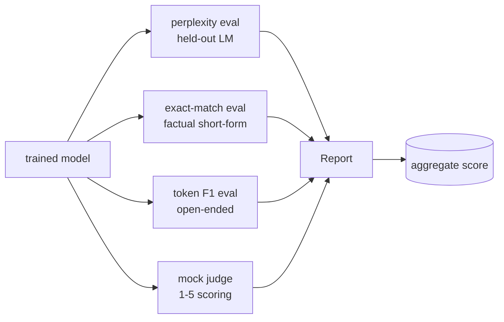
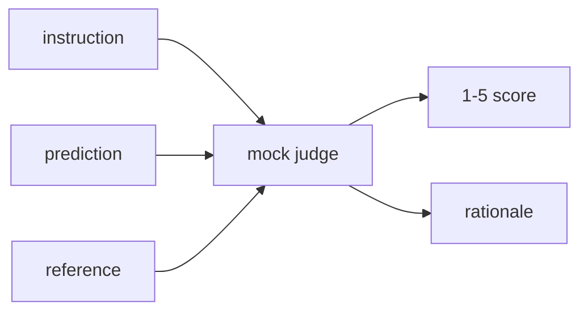
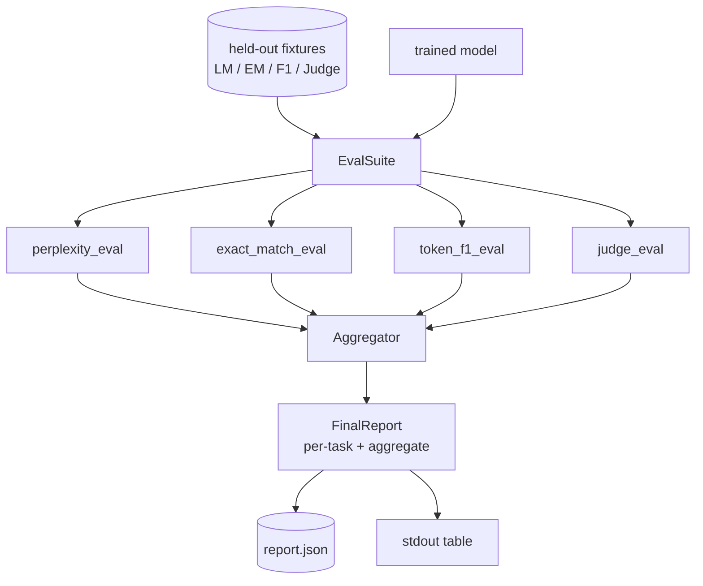

# 綜合專案第 41 課：完整的評估管線

> 訓練是你能用損失曲線盯著的那部分。評估是你必須自己設計的那部分。這一課要建出一條統一的評估管線：它吃下任何一個訓練好的語言模型、對它跑四種異質的評估、把結果彙總成一份逐任務報告，並出貨一個本地的模擬 LLM 裁判，好讓整條迴路不用連網就跑得起來。這四種評估涵蓋每一個要出貨的模型都需要的維度：語言建模（困惑度）、短答正確性（完全相符）、開放式相似度（詞元 F1），以及質性評分（裁判）。

**類型：** 實作
**程式語言：** Python (torch, numpy)
**先修單元：** 階段 19 第 30-37 課（NLP LLM 軌：分詞器、嵌入表、注意力區塊、transformer 身體、預訓練迴路、檢查點、生成、困惑度）
**時間：** 約 90 分鐘

## 學習目標

- 在一個極小的 transformer 上，用遮罩詞元的記帳方式計算保留集的困惑度。
- 在短答式的事實提示詞上跑一次完全相符評估。
- 在預測與參考字串之間，帶正規化地計算詞元層級的 F1。
- 建出一個本地的模擬 LLM 裁判，以 1-5 分的尺度替模型輸出評分。
- 把那四種評估彙總成單一份帶逐任務拆解的加權報告。

## 那個問題

單一指標從來描述不了一個語言模型。困惑度說的是模型多貼合語言分布，卻對它會不會回答問題隻字未提。完全相符說的是模型有沒有產出黃金字串，卻懲罰了正確的換句話說。詞元 F1 原諒換句話說，卻會被「與錯誤內容的詞彙重疊」騙到。LLM 裁判捕捉得到質性維度，但昂貴又隨機。

你真正想要的那條管線四者兼備。每一種評估都涵蓋其他幾種漏掉的維度。每一種都跑在為那個指標而塑形的不同保留資料子集上。最終報告把逐任務的數字並排列出、再給一個彙總值，好讓審查者一眼看出模型做了哪些取捨。

這一課要在同一個檔案裡，端到端把那條管線建出來。

## 那個概念



每一種評估都是一個 `(model, dataset) -> EvalResult` 的函數。結果帶著那個指標值、供檢視用的逐樣本細節，以及一個給彙總用的名稱。管線用一份設定把它們組合起來，那份設定說明要跑哪些評估、以及怎麼加權。

## 困惑度，要算對

困惑度是 `exp(每詞元負對數概似的平均)`。實作上有兩個陷阱：

- 那個平均必須是對實際的詞元位置取的，不是對 batch * sequence 取的。填補詞元必須從分母裡排除，否則困惑度看起來會比實際好。
- 模型預測的是下一個詞元，所以位置 `i` 的 logits 預測的是位置 `i+1` 的詞元。這裡的差一錯誤是無聲的：損失照樣訓練，但那個指標變得毫無意義。

這項評估對非填補位置計算逐批次的 `-log p(token)` 總和，以及逐批次的詞元數，最後才相除。這比「先算每批次的困惑度再平均」（那會低估短序列的權重）在數值上更安全，也符合教科書定義。

## 完全相符，帶正規化

這套框架在比對之前先把預測與參考都正規化：

- 轉小寫。
- 去掉頭尾空白。
- 把內部連續空白收合成單一空格。
- 若兩邊只差在標點上，就把尾端的終止標點（`.`、`!`、`?`）拿掉。

正規化讓完全相符在實務上有用。一個說 `"Paris"` 的模型是對的；一個說 `"Paris."` 的也是對的；一個說 `"  paris  "` 的也是對的。這個指標仍然要求正規化之後答案是同一個字串。

## 詞元 F1，正確的做法

詞元 F1 是在詞袋上計算的精確率與召回率的調和平均。步驟：

1. 把預測與參考正規化（規則與完全相符相同）。
2. 把各自切成一份詞元清單（依空白切分）。
3. 計算多重集合的交集。
4. 精確率 = `intersection_count / len(pred_tokens)`。召回率 = `intersection_count / len(ref_tokens)`。F1 = 調和平均。

若預測與參考兩者都為空，F1 是 1（空泛的相符）。若只有一邊為空，F1 是 0。這個模式與 SQuAD 的評估參考一致，並在各種換句話說之間產出穩定的數字。

## 本地的模擬 LLM 裁判

真正的裁判是一個藏在 API 之後的前沿模型。這一課的裁判必須離線跑。那個模擬裁判是一個確定性的評分器，它吃下一段指令、模型的預測與參考，回傳一個落在 `{1, 2, 3, 4, 5}` 的分數，加上一行理據。評分規則是明確的：

- 若正規化後的預測等於正規化後的參考，給 5。
- 若預測與參考之間的詞元 F1 至少 0.8，給 4。
- 若詞元 F1 落在 `[0.5, 0.8)`，給 3。
- 若詞元 F1 落在 `[0.2, 0.5)`，給 2。
- 其餘給 1。

這不是真的裁判，但它有正確的介面。日後換上真模型，只要改一個函式。管線不在乎。



## 彙總

彙總值是各項正規化後評估分數的加權平均。每一種評估都回報自己落在 `[0, 1]` 的數字：

- 困惑度：正規化成 `1 / (1 + log(perplexity))`。困惑度為 1 對映到 1，無限大對映到 0。
- 完全相符：本來就在 `[0, 1]`。
- 詞元 F1：本來就在 `[0, 1]`。
- 裁判：除以 5。

權重可設定。預設的配比是困惑度 0.2、完全相符 0.3、詞元 F1 0.3、裁判 0.2。權重的選擇是一項產品決策；這一課把那個旋鈕暴露出來，好讓你去實驗。

```figure
cg-eval-quadrant
```

## 架構



`EvalSuite` 是一個很薄的編排器。每一項個別評估都是一個自由函式，吃下 `(model, tokenizer, dataset, config)` 並回傳一份 `EvalResult`。`Aggregator` 蒐集結果並產出最終報告。示範會印出那張表，並寫一份 JSON 副本供下游 CI 攝取。

## 你會建出什麼

實作是一個 `main.py` 加上測試。

1. `TinyGPT`：第 38-40 課用的那個相同的純解碼器架構，收錄進來好讓這一課自足。
2. `InstructionTokenizer`：帶 INST / RESP / PAD 特殊詞元的位元組分詞器。
3. 四份固定資料：一份語言模型語料、一份完全相符集、一份 F1 集，以及一份裁判集。各二十個樣本，確定性的。
4. `perplexity_eval`：回傳一份 `EvalResult`，帶那個困惑度值與逐詞元的損失直方圖。
5. `exact_match_eval`：回傳平均完全相符率與逐樣本紀錄。
6. `token_f1_eval`：回傳平均詞元 F1 與逐樣本紀錄。
7. `mock_judge` 與 `judge_eval`：逐樣本的分數與理據，以及整組的平均分數。
8. `Aggregator.normalise`：逐評估的正規化規則。
9. `Aggregator.aggregate`：加權平均與組裝好的報告。
10. `run_demo`：簡短訓練一個極小模型、跑完那四項評估、印出報告表格並寫出 JSON，成功時以零結束碼退出。

## 讀那份報告

報告有三層。最上面是彙總分數。它下面是那四項逐評估的數字。再下面是供診斷用的逐樣本拆解。一次失敗的 CI 執行通常要看的是彙總值，但一位在追退化的審查者要的是逐樣本拆解，好看出模型在哪些輸入上答錯了。

那份 JSON 傾印用的是穩定的鍵，好讓 CI 儀表板能跨版本畫趨勢線。那張美化列印的表，則是給訓練跑完後盯著終端機的人看的。

## 延伸目標

- 加上一項校準評估：模型的 softmax 機率與它的準確率相符嗎？把預測依信心分桶，並回報每個桶的經驗準確率。
- 加上一項穩健性評估：替每個樣本標上一種擾動（錯字、換句話說、干擾項），並回報逐擾動的指標掉幅。
- 把那個模擬裁判換成一個藏在 HTTP 呼叫後的真模型。那個函式簽章不會變。
- 加上逐任務的權重學習：不用固定權重，而是把權重擬合到一份「模型之間的目標偏好順序」上。

實作給了你那四項評估、那個彙總器，以及那份報告。真實的評估管線會在上面疊上更多維度；但模式不變：每項評估一個函式、一個彙總器、一份報告。
