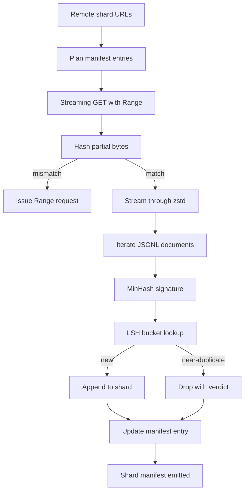

# 大型語料下載器

> 訓練一個語言模型，遠在第一次前向傳遞之前就開始了。語料得先落地到磁碟、解壓縮、去重、變得可定址，而且在網路於 4% 處斷掉之前，續傳的故事就得先想清楚。這一課要建出一個串流下載器：它拉取壓縮分片、用 Zstandard 邊拉邊解壓、透過 MinHash 加區域敏感雜湊替近似重複做指紋，並寫出一份管線其餘部分信得過的分片清單。

**類型：** 實作
**程式語言：** Python
**先修單元：** 階段 19 第 30-37 課
**時間：** 約 90 分鐘

## 學習目標

- 用 `urllib` 串流遠端分片，並用 `zstandard` 解壓縮，過程中不把整份檔案緩衝進記憶體。
- 對一個已驗證的位元組偏移量發出 HTTP `Range` 請求，藉此續傳未完成的下載。
- 替每份文件建出一個 MinHash 簽章，並用 LSH 把它分桶，好讓近似重複互相碰撞。
- 產出一份帶內容雜湊、位元組大小、文件數與去重判定的分片清單。

## 那個問題

你第一次在一份 200 GB 的語料上訓練時，網路在 41% 斷掉，腳本以一個 `urllib` 例外退出。第二次在 78% 斷掉。到 99% 時你已經把那條迴路重寫三遍了。從第一分鐘就得設計進去的那兩種失敗，是部分下載的續傳，以及重複文件的移除。兩者都有廣為人知的解法；兩者也都常常被跳過，因為那條管線一開始只是一行長出獠牙的 `requests.get`。

續傳是個 HTTP 問題。伺服器得遵守 `Range`、客戶端得對照一份磁碟上的紀錄追蹤已驗證偏移量，而那個已驗證偏移量得挺得過行程死亡。若偏移量與檔案哪怕只差一個位元組，續傳寫下去的就是垃圾，而語料以一種「只有在分詞時才會現形」的方式壞掉了。

去重是個簽章問題。精確雜湊去重會漏掉近似重複：同一篇維基百科文章帶著三種不同的樣板頁尾出現、同一份程式碼檔案帶著不同的授權標頭、同一篇部落格文章每個連結上都掛著追蹤參數。MinHash 加 LSH 以次線性成本抓到這些。代價是每份文件一個簽章、每個簽章一次分桶查找。

## 那個概念



### 用 `urllib` 做串流

標準函式庫的 `urllib.request.urlopen` 回傳一個類檔案物件。把它包進 `zstandard.ZstdDecompressor().stream_reader`，位元組就從網路流過解壓器、進到文件迭代器，全程從不把壓縮分片或解壓後的分片實體化在記憶體裡。唯一的記憶體成本是那個行緩衝區、當前文件的 MinHash 簽章，以及那個 LSH 索引。

### 用 `Range` 續傳

下載器每個分片寫兩個檔案：分片本身，以及一個 `.partial.json` 檢查點。檢查點記錄 `verified_bytes`、`expected_size`、`sha256_prefix`（對前 `verified_bytes` 個位元組計算），以及來源網址。啟動時下載器讀那個檢查點、對磁碟上的位元組重算 `sha256_prefix`，只有在重算的雜湊相符時才續傳。若雜湊不對，就把那份未完成檔丟掉，從第零個位元組重新下載。無聲的損壞不可能發生，因為那些已驗證位元組是被檢查過的，不是被假定的。

### MinHash 加 LSH

MinHash 在固定空間內估計兩個集合的 Jaccard 相似度。對一份文件而言，那個集合是它文本的 shingle（重疊的 n-gram）。簽章是 `k` 個最小雜湊值，每個獨立雜湊函數一個。兩份 Jaccard 相似度為 `s` 的文件，在簽章的任一單一分量上一致的機率是 `s`。

LSH 接著把那 `k` 個分量分成 `b` 個帶、每帶 `r` 列，其中 `k = b * r`。兩份文件至少在一個帶上碰撞的機率是 `1 - (1 - s^r)^b`，那在你調 `(b, r)` 所瞄準的 `s` 值附近是一道銳利的門檻。典型語料去重的門檻是 `s = 0.8`，而 LSH 研究文獻用 `k = 128`、`b = 32`、`r = 4` 達到它。

### 把分片清單當成契約

下載器唯一耐久的輸出是那份清單。清單逐分片持有網址、解壓後的位元組數、文件數、去重後的唯一文件數，以及最終分片檔案的 sha256。下游的分詞讀的是那份清單，不是目錄列表。若某個分片不見了、或它的 sha256 不對，清單就會告訴下一階段拒絕啟動。清單就是「資料已下載」與「資料已下載且可驗證」之間那道決定性的分界。

## 動手建

`code/main.py` 實作：

- `ShardPlanner` —— 讀一份分片網址清單，並產出規劃好的清單條目。
- `StreamingDownloader` —— 開一條帶選配 `Range` 的 `urllib` 串流、寫到一個暫存檔、在每個區塊上更新 `.partial.json` 檢查點，並在續傳時驗證 sha256 前綴。
- `ZstdDocIterator` —— 把那個類檔案串流包進 `zstandard.ZstdDecompressor`，並每行產出一份文件。
- `MinHasher` —— 用一族固定的雜湊種子，替一個字串產出一個 `k` 分量的簽章。
- `LSHIndex` —— 依帶把簽章分桶，並回報碰撞。
- `Dedup` —— 把雜湊器與索引結合起來，替每份文件標上 `keep` 或 `near_duplicate`，並附上相符的分片 id。
- `ManifestWriter` —— 蒐集逐分片的統計，並寫出 `manifest.json`。

檔案底部的示範會在磁碟上建出一份小型合成語料、用 `zstandard` 壓縮它、透過一個 `file://` 網址下載它、做去重，並印出那份清單。

跑它：

```bash
python3 code/main.py
```

腳本以零結束碼退出，並印出一份清單摘要。

## 生產模式

有四種模式能把這一課擴縮到真實語料上。

**先檢查點，再寫入。** `.partial.json` 必須在位元組被附加到分片之前先 `fsync`。否則一次斷電就會把順序反過來：分片位元組在磁碟上、檢查點卻沒記到它們，下一次續傳以為自己的已驗證位元組比實際少，於是重複的後綴位元組把檔案弄壞。先檢查點，再寫入。這跟預寫式日誌是同一套紀律。

**分片化的 LSH 索引。** 在 200 GB 的規模上，一個涵蓋整份語料的單一 LSH 索引塞不進 RAM。依第一個帶的雜湊把 LSH 索引分割、把各分割存到磁碟上，只查詢新簽章會落進的那個分割。代價是每份文件多一次磁碟讀取；好處是那個 LSH 索引不再是一道硬性的記憶體上限。

**用墓碑，不要刪除。** 被丟掉的重複項會被記在清單裡，帶著 `near_duplicate` 判定，以及它所碰撞到那份文件的分片 id。刪掉它們就丟失了重複項與它的保留者之間的連結。立墓碑保住了稽核軌跡，也讓下游某一趟能改變對門檻的看法。

**清單裡逐分片的 sha256，外加一個清單自身的 sha256。** 清單自己也拿一個內容雜湊。下游階段在信任那些逐分片條目之前，先驗證清單的雜湊。少了這個，清單就是那個無聲的攻擊面：一個能編輯單一檔案的攻擊者，就能弄壞整條管線。

## 動手用

生產模式：

- **每次 CI 執行都續傳。** CI 執行器是短暫的。下載器必須假設每次執行都是一顆全新的磁碟，並從快取或遠端恢復。`--cache-dir` 是一等公民旗標。
- **在分詞之前去重。** 分詞很貴。對同一份文件跑兩次，就是為同一條損失曲線付兩倍成本。去重在分詞的上游，不是下游。
- **把清單當成合併閘門。** 訓練執行從一個釘住的提交讀取清單的 sha256。一個新的資料集版本需要一次新的清單提交。程式碼與資料之間的連結是 git，不是口耳相傳。

## 產出交付

在一個真實專案裡，`outputs/skill-corpus-downloader.md` 會描述：哪些網址餵給下載器、檢查點目錄怎麼佈局、去重用什麼 shingle 寬度與 `(k, b, r)` 三元組，以及清單住在版本控制的哪裡。這一課出貨的是那具引擎。

## 練習

1. 加上一個 `--shingle-width` 旗標，並量測去重判定在寬度 3、5、9 時怎麼變。替你選的預設值辯護。
2. 在 zstd 旁邊加上 gzip 支援，做法是嗅探魔術位元組。下載器不該要求呼叫方指定編解碼器。
3. 加上一個 `--resume-only` 模式，若找不到檢查點就拒絕開始一次全新下載。在 CI 裡很有用，可以避免某次執行不小心重拉 200 GB。
4. 把 LSH 索引搬到一個 shelf 或 sqlite 檔案裡，並量測吞吐量與記憶體內版本的差別。
5. 在啟動時加上一次清單 sha256 檢查。若磁碟上的清單與 `manifest.lock` 裡的清單雜湊不一致，下載器就該以失敗告終。

## 關鍵術語

| 術語 | 大家怎麼說 | 實際是什麼意思 |
|------|-----------------|------------------------|
| 分片 | 「一個檔案」 | 語料中一塊自足的切片，有自己的 sha256，是續傳與去重的單位 |
| MinHash 簽章 | 「指紋」 | 一個集合的 `k` 分量草圖，每個分量是一個獨立雜湊在該集合上的最小值 |
| LSH 帶 | 「桶」 | 一組 `r` 個簽章分量，被當成偵測碰撞用的單一分桶鍵 |
| 已驗證位元組 | 「續傳偏移量」 | 磁碟上 sha256 前綴與檢查點相符的那些位元組；唯一安全的續傳起點 |
| 清單 | 「那份索引」 | 下載器所產出之物的唯一耐久紀錄，含各內容雜湊 |

## 延伸閱讀

- [RFC 7233](https://datatracker.ietf.org/doc/html/rfc7233) —— HTTP Range 請求，那套續傳協定
- [Zstandard format specification](https://datatracker.ietf.org/doc/html/rfc8478) —— 讓串流解壓縮變安全的那個框格式
- [MinHash](https://en.wikipedia.org/wiki/MinHash) —— 這一課所用的那族簽章
- [Locality-sensitive hashing](https://en.wikipedia.org/wiki/Locality-sensitive_hashing) —— 去重門檻背後的那套分帶方案
- 階段 19 · 43 —— 下載器所餵養的那份 HDF5 分詞語料
- 階段 19 · 44 —— 在那份語料上訓練的餘弦排程
- 階段 19 · 45 —— 消費那份排程的 AMP 迴路
