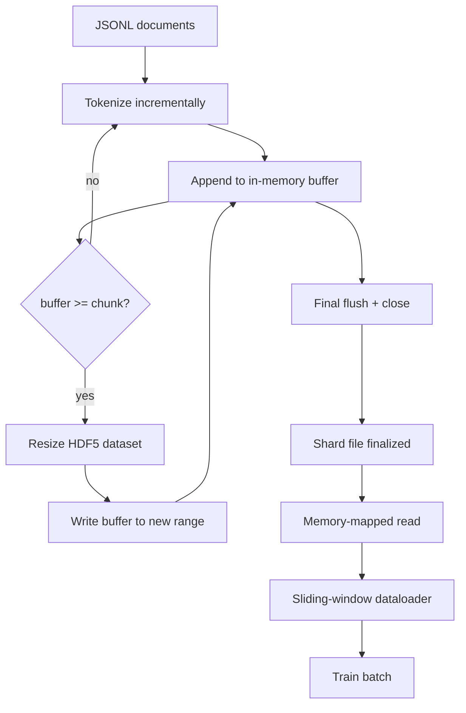

# HDF5 分詞語料

> 下載回來的語料，得落進一個訓練器能以線速串流讀取的佈局裡。磁碟上的 JSONL 撐不過 16 個 dataloader 工作者。帶可調整大小、分塊整數資料集的 HDF5 可以。這一課要建出：串流分詞寫進一個可調整大小的 HDF5 資料集、跨多個檔案的分片寫入、訓練時的記憶體對映讀取，以及一個能以正確打包方式產出定長序列的滑動窗口 dataloader。

**類型：** 實作
**程式語言：** Python
**先修單元：** 階段 19 第 30-37 課
**時間：** 約 90 分鐘

## 學習目標

- 用確定性的分塊，把文件串流進一個可調整大小的 HDF5 整數資料集。
- 把寫入分片到多個 HDF5 檔案上，好讓失敗有界、並讓平行化成為可能。
- 透過 HDF5 那個由頁面快取撐住的分塊佈局把詞元讀回來，好讓 dataloader 只在批次時才複製進批次緩衝區。
- 實作一個滑動窗口 dataloader，以明確的打包規則產出定長的訓練序列。

## 那個問題

一次現代的語言模型訓練，會跨數十個工作者、每秒讀取數十萬個樣本的詞元。磁碟上的 JSONL 在第一次冷快取分頁錯誤就死了：JSON 剖析器很慢、文件邊界不可定址，而要跳到「第 4,217,884 個樣本」得掃過整個檔案。就連壓縮效果很好的 Parquet 也不合適，因為訓練器要的不是欄；它要的是一道帶 O(1) 隨機存取的扁平詞元串流。

HDF5 合適，因為它提供一個分塊、可調整大小、純整數的資料集，而它的分塊在讀取時對頁面快取友善。訓練器要一片 `tokens[3,200,000 : 3,200,8192]`，HDF5 就把要求的那塊超平板從頁面快取複製進一個新配置的 NumPy 陣列。代價是每個工作者一個開啟的檔案控制代碼、加上一個分塊大小的頁面快取足跡，相較於解碼 JSONL 的成本可以忽略不計。

建置上的問題，是把寫入那一側做誠實。可調整大小的資料集很容易誤用：一次寫一份文件，HDF5 檔案就碎片化到不能用。所有文件一次調整大小寫進去，一次行程死亡就丟掉整個分片。正確的紀律是「先緩衝再擴充」，緩衝區大小要與分塊大小相符，再加上分片寫入把工作量切到多個檔案上，好讓一次當機最多只丟掉一個分片。

## 那個概念



### 把可調整大小的 HDF5 做對

那個詞元資料集以 `maxshape=(None,)` 與一個固定的 `chunks=(chunk_size,)` 建立。寫入的做法是：把詞元緩衝在一個長度為 `chunk_size` 的 NumPy 陣列裡。緩衝區一滿，資料集就剛好被調大 `chunk_size`，緩衝區則被寫進那段新範圍。分片結束時，剩餘的緩衝區被寫進最後一段部分範圍。除了最後一次之外，每一次寫入都是連續且分塊對齊的；而讀取端會被告知在該分片 HDF5 屬性裡記下的 `token_count` 處截斷。

### 分片寫入

單一個 HDF5 檔案是一個單點失效。這條管線平行寫入分片：階段 19 第 42 課的每一個輸入分片產出一個 HDF5 輸出分片。一份 `shards.json` 索引逐分片記錄檔案路徑、詞元數、文件數，以及一個涵蓋那些詞元的 sha256。訓練器讀 `shards.json` 來計算全域偏移量並驗證語料。

### 記憶體對映讀取

訓練時每個工作者以 `swmr=True` 模式打開分給它的那些 HDF5 檔案，並要求 `tokens[start:stop]`。HDF5 的分塊佈局讓這在分塊熱起來之後就成了一次由頁面快取撐住的讀取。工作者從不把整份檔案實體化：那一片被複製進 dataloader 的批次緩衝區，dataloader 再在批次時把它複製進一個固定記憶體的訓練張量。熱路徑上每次分塊轉換只有一次系統呼叫；其餘都是 RAM 存取。

### 滑動窗口 dataloader

Dataloader 是唯一知道訓練序列長度的那個階段。它在全域詞元串流裡挑一個隨機起始索引、讀 `window_size + 1` 個詞元，然後回傳 `(input, target) = (tokens[:-1], tokens[1:])`。文件邊界不被強制執行：一個窗口可能跨在兩份文件上，中間有一個明確的 `boundary_token_id`，好讓模型學會使用那個分隔符。這是那條標準的打包規則；它也是初學者會忘掉的規則，結果搞出一份 8% 是訓練邊界詞元、92% 是自然文本的語料。

```figure
cc-hdf5-corpus
```

## 動手建

`code/main.py` 實作：

- `Tokenizer` —— 一個位元組層級的確定性分詞器，對這個示範夠用。介面是 `encode(text) -> list[int]` 與 `vocab_size`。
- `HDF5ShardWriter` —— 開一個可調整大小的整數資料集、把詞元緩衝到分塊大小、以固定步幅調整大小並寫入，並在關閉時把 `token_count` 與 `sha256` 記成 HDF5 屬性。
- `ShardedTokenizationPipeline` —— 迭代輸入文件、把它們路由到某個寫入器，並產出一份 `shards.json` 索引。
- `MmapTokenStore` —— 打開分片檔案做記憶體對映讀取、計算全域偏移量，並暴露單一個 `get_slice(start, stop)` API。
- `SlidingWindowDataloader` —— 從全域串流中挑出隨機窗口，並產出 `(input_ids, target_ids)` 的 NumPy 陣列。

檔案底部的示範會建出一份極小的記憶體內語料、把它分詞成兩個分片、透過記憶體對映打開它們、跑 10 個批次的 dataloader，並印出逐批次的形狀與一個校驗和。

跑它：

```bash
python3 code/main.py
```

腳本以零結束碼退出，並印出批次校驗和。

## 生產模式

有四種模式能把這一課擴縮到一次真實的訓練。

**分塊大小等於典型的讀取量。** 訓練器每個樣本讀 `window_size + 1` 個詞元。把 HDF5 的分塊設成 `window_size` 的倍數，讀取就會與頁面快取對齊。分塊不匹配會讓吞吐量減半，因為每個樣本都碰到兩個分塊。

**詞元數放在屬性裡，不放在資料集裡。** 資料集尾端那一片可能只填了一部分，因為分塊大小不整除文件邊界。把真正的 `token_count` 存成資料集上的一個 HDF5 屬性，並讓讀取端在那個值處截斷。少了這個，讀取端就會走出邊界進到補零的詞元裡，而模型學會去預測零。

**分片化的 sha256 加上平行驗證。** 每個分片都有自己涵蓋詞元位元組的 sha256。訓練器可以在訓練開始前平行驗證所有分片。一個錯的 sha256 會讓執行提早失敗，而不是在第三個訓練週期、十六小時之後才失敗。

**兩邊都用 `swmr=True`，寫入端加上 `libver="latest"`。** 單寫多讀模式要求寫入端以 `libver="latest"` 打開、先把每個資料集都建好，然後才設定 `file.swmr_mode = True`。之後寫入端每次調整大小後都必須呼叫 `dataset.flush()`，好讓（以 `swmr=True` 打開的）讀取端工作者看到一致的資料。跳過 `libver="latest"`、或在結構變更之後才啟用 SWMR，是「檔案被鎖住」這類失敗的常見來源。

## 動手用

生產模式：

- **每個來源分片一個 HDF5。** 下載器（第 42 課）每個網址產出一個分片；分詞（這一課）每個來源分片產出一個 HDF5。這個一對一的對映讓續傳與部分失敗的復原變得無比簡單。
- **邊界詞元 id。** 那個邊界詞元是分詞器詞彙的一部分，也是 dataloader 唯一會注入的詞元。若模型應該忽略它，訓練損失就把邊界詞元遮掉；否則模型就學著把它當成序列分隔符來用。
- **把 `shards.json` 當成真實來源。** 加一個新分片，意思是寫出那份 HDF5、算出它的 sha256、再附上一筆條目。訓練器在啟動時讀一次那個檔案，之後從不碰目錄列表。

## 產出交付

在一個真實專案裡，`outputs/skill-hdf5-tokenized-corpus.md` 會描述：哪個分詞器餵給這條管線、什麼分塊大小與訓練器的窗口相符、`shards.json` 住在版本控制的哪裡，以及 dataloader 的工作者怎麼在各檔案間分片。這一課出貨的是那具引擎。

## 練習

1. 替 HDF5 寫入器加上一個 `--compression gzip` 旗標，並在示範語料上量測吞吐量代價。替你選的預設值辯護。
2. 替滑動窗口 dataloader 加上一個確定性種子，並驗證兩次同種子的執行產出完全相同的批次。
3. 加上一個 `--validate` 模式，讀過每一個分片、對它的詞元重算 sha256，並與 `shards.json` 比對。CI 應該在訓練開始前跑這個。
4. 在分塊大小等於窗口、等於半個窗口、等於兩倍窗口的三種情況下比較 dataloader 的吞吐量。回報那個頁面快取效應。
5. 加上一個 `--max-document-tokens` 旗標，在寫入時就把超長文件截斷。拿它與「在讀取時才決定」做取捨辯護。

## 關鍵術語

| 術語 | 大家怎麼說 | 實際是什麼意思 |
|------|-----------------|------------------------|
| 可調整大小的資料集 | 「只能追加」 | 一個 `maxshape=(None,)` 的 HDF5 資料集，透過 `resize` 呼叫以分塊大小的步幅成長 |
| 分塊佈局 | 「HDF5 怎麼存它」 | 核心對映得了、dataloader 也能連續讀取的固定大小磁碟頁 |
| `swmr` 模式 | 「邊寫邊讀」 | 單寫多讀模式，讓 dataloader 的工作者能安全共用那個檔案 |
| 分片索引 | 「shards.json」 | 所有詞元分片的耐久索引，帶偏移量與內容雜湊 |
| 滑動窗口 | 「訓練樣本」 | 全域詞元串流的一段定長切片，訓練器會替它配上平移一格的目標 |

## 延伸閱讀

- [HDF5 chunking documentation](https://support.hdfgroup.org/documentation/hdf5/latest/hdf5_chunking.html) —— 這一課所用的分塊、可調整大小資料集佈局
- [h5py user guide](https://docs.h5py.org/en/stable/) —— HDF5 的 Python 綁定
- [NumPy memory mapping](https://numpy.org/doc/stable/reference/generated/numpy.memmap.html) —— HDF5 透過 h5py 暴露的那個讀取端原語
- 階段 19 · 42 —— 這一課所分詞的那個下載器輸出
- 階段 19 · 44 —— 消費這個 dataloader 的餘弦排程
- 階段 19 · 45 —— 包住那個訓練步驟的 AMP 迴路
