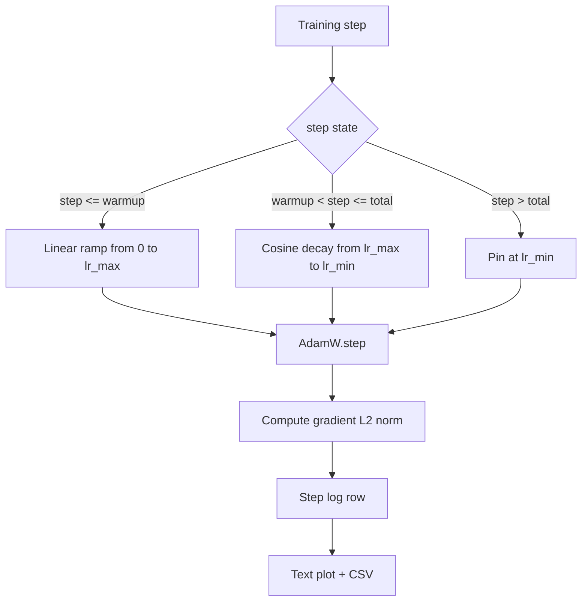

# 帶線性暖身的餘弦學習率

> 學習率排程是損失函數之後第二重要的決定。帶餘弦衰減與線性暖身的 AdamW，是現代語言模型訓練的預設，因為它讓模型在脆弱的前一千次更新中看到很小的有效步長、再爬升到設定好的峰值，然後平滑地衰減回接近零。這一課要建出那份排程、把曲線隨訓練步數畫出來、把梯度範數記在排程旁邊，並證明那份排程守住了暖身、峰值與衰減的邊界。

**類型：** 實作
**程式語言：** Python
**先修單元：** 階段 19 第 30-37 課
**時間：** 約 90 分鐘

## 學習目標

- 實作一個接上「帶線性暖身之餘弦學習率排程」的 AdamW 最佳化器。
- 在任何一步都算出排程的精確值，且各次執行之間不會有浮點漂移。
- 把梯度的 L2 範數與學習率並排記錄下來，好讓訓練健康狀況可觀測。
- 把排程渲染成一份肉眼讀得懂的文字圖，以及一份任何工具都消費得了的 CSV。

## 那個問題

前一千次訓練更新最吵。模型的權重還很靠近初始化。最佳化器的二階動差運行估計還沒穩定。梯度範數又大又吵。若學習率在這些更新期間就處在峰值，模型要嘛直接發散，要嘛落進一個它永遠爬不出來的損失平原。那兩個廣為人知的修法是梯度裁剪（那是階段 19 第 45 課的主題），以及一份從小開始再爬升的學習率排程。

帶暖身的餘弦排程有三個區段。從第零步到第 `warmup_steps` 步，學習率從零線性縮放到設定好的峰值 `lr_max`。從第 `warmup_steps` 步到第 `total_steps` 步，學習率沿著餘弦曲線的上半段，從 `lr_max` 衰減到 `lr_min`。超過 `total_steps` 之後，學習率被釘在 `lr_min`，好讓一個設定錯誤、跑過頭的訓練器不會無聲地離開排程。

建置上的問題是：排程很容易差一步做錯。那個差一錯誤會在訓練跑了六小時後現形 —— 就在模型開始過擬合的那一刻，學習率高了或低了 1%，而除非那份排程在邊界上被徹底測過，否則這件事看不見。

## 那個概念



### 暖身公式

對 `warmup_steps > 0` 且 `step` 落在 `[0, warmup_steps]` 的情況，學習率是 `lr_max * step / warmup_steps`。退化的 `warmup_steps = 0` 情況被當成「沒有暖身」：排程在第零步直接從 `lr_max` 開始，並立刻進入餘弦衰減。有些測試框架會傳 `warmup_steps = 0` 來檢查排程仍然產得出一條可用的曲線。

### 餘弦公式

對 `step` 落在 `(warmup_steps, total_steps]` 的情況，學習率是 `lr_min + 0.5 * (lr_max - lr_min) * (1 + cos(pi * progress))`，其中 `progress = (step - warmup_steps) / max(1, total_steps - warmup_steps)`。在 `step = warmup_steps` 時，餘弦算出 `cos(0) = 1`，給出 `lr_max`，恰好與暖身的終點相符。在 `step = total_steps` 時，餘弦算出 `cos(pi) = -1`，給出 `lr_min`，恰好與衰減的終點相符。

兩個端點上的連續性不是意外。那正是這份排程被實作成一個「以 `step` 為變數的單一函數」、而不是三個黏在一起的函數的原因。黏起來的排程，在 `lr_max` 第一次被改動時就會弄丟一個邊界。

### 總步數之後的地板

對 `step > total_steps`，學習率停在 `lr_min`。契約是明確的：排程不報錯、也不外推；它釘在地板上，並讓訓練器記一則警告。需要延長訓練的訓練器，改的是排程的 `total_steps`，不是那條迴路。

### 把梯度範數記在學習率旁邊

排程是訓練健康的一半。梯度範數是另一半。訓練迴路逐步把兩者都記下來。一次發散的訓練，梯度範數會在損失之前先噴上去；一份調得好的暖身，會讓範數隨學習率線性上升；一個太激進的峰值，則會表現為暖身之後範數居高不下。磁碟上的資料集是 `step, lr, grad_l2_norm, loss`。那份 CSV 是唯一耐久的紀錄。

## 動手建

`code/main.py` 實作：

- `CosineWithWarmup` —— 在設定好的排程上，一個無狀態的 `lr(step) -> float` 函數。
- `TrainState` —— 把一個模型、一個 `AdamW` 最佳化器與那份排程，包進單一個 step 函數裡。
- `TrainState.step` —— 跑一次前向、一次反向，記錄梯度 L2 範數，並把 `lr(step)` 套用到最佳化器上。
- `plot_schedule_ascii` —— 把排程渲染成一份肉眼讀得懂的文字圖。
- `write_schedule_csv` —— 每一步輸出一列，帶著那個學習率。

檔案底部的示範建出一個極小的 `nn.Linear` 模型、在一個固定輸入批次上訓練 20 步，並印出逐步的學習率、梯度範數與損失。那份排程也會被渲染成文字圖，供視覺上的健全性檢查。

跑它：

```bash
python3 code/main.py
```

腳本以零結束碼退出，並印出一份逐步的訓練日誌加上那張排程圖。

## 生產模式

有四種模式，能把這份排程提升為一件生產產出物。

**排程住在設定裡，不住在程式碼裡。** 訓練器從一份提交進 git 的 YAML 或 JSON 設定中讀取 `warmup_steps`、`total_steps`、`lr_max`、`lr_min`。排程可重現，因為那份設定是內容定址的；排程可稽核，因為那份設定是 PR 差異的一部分。

**步數計數器是單調的，而且與訓練週期解耦。** 有些框架在資料集被分片、或 dataloader 重啟時，會把步數與訓練週期搞混。排程從訓練器的檢查點讀 `global_step`，不從一個本地計數器讀。一次續跑的執行會從正確的排程位置繼續，因為那個步數計數器是耐久的座標軸。

**排程圖放在執行目錄裡。** 每一次訓練都把 `outputs/lr_schedule.png`（在這一課裡是一份文字圖）寫進它的執行目錄。一位隨手翻過那個目錄的審查者，不必重跑任何東西就能替排程做健全性檢查。這在 PR 階段就抓到「排程設定錯誤」那一類臭蟲。

**日誌列的結構是固定的。** 依序是 `step, lr, grad_l2_norm, loss`。下游的筆記本或儀表板讀的是這個結構；不升版就改欄位名稱，會讓每一個既有的儀表板失效。

## 動手用

生產模式：

- **在掃描其他任何東西之前先掃峰值。** `lr_max` 是最敏感的旋鈕。先在小模型上掃它；最佳的 `lr_max` 隨模型大小的變化很弱，所以小模型的掃描是一個很強的先驗。
- **暖身是總步數的一個比例，不是一個絕對數。** 一次兩億步的執行配 2,000 步暖身，幾乎立刻就進到峰值；一次兩萬步的執行配同樣的步數，卻暖身了 10%。把暖身設定成一個比例（典型是 1-3%），好讓排程隨訓練時長一起縮放。
- **`lr_min` 不為零是刻意的。** 一個為 `lr_max` 一成的地板，讓最佳化器在那條長尾裡持續學習。`lr_min = 0` 的排程產出的，是一條在圖上看起來很棒的訓練曲線，以及一個其實還沒訓練完的模型。

## 產出交付

在一個真實專案裡，`outputs/skill-cosine-warmup.md` 會描述：哪份設定承載那個排程、全域計數器是從訓練器的哪一步讀出來的，以及是哪一次 `lr_max` 掃描產出了那個上線的數值。這一課出貨的是那具引擎。

## 練習

1. 加上這份排程的「反平方根」變體，並在一次 200 步的玩具訓練上比較。哪一條曲線產出較低的最終損失？
2. 加上一個 `--restart` 旗標，在 `total_steps / 2` 處再加一次暖身。針對「暖重啟在這次玩具訓練上是有幫助還是有害」提出辯護。
3. 加上一項單元測試，檢驗排程是連續的：對 `[0, total_steps]` 內的每一步，差值 `|lr(step+1) - lr(step)|` 都被 `lr_max / warmup_steps` 界住。
4. 把排程接進一個 `torch.optim.lr_scheduler.LambdaLR`，好讓它與框架程式碼組合。這一課用的是一個純粹的 step 函數；那層包裝改變了什麼？
5. 加上一個 `--plot-png` 旗標，透過 `matplotlib` 寫出一張真的圖。針對「對 CI 執行而言，這一課的文字圖與 PNG 哪一個是更好的預設」提出辯護。

## 關鍵術語

| 術語 | 大家怎麼說 | 實際是什麼意思 |
|------|-----------------|------------------------|
| 暖身 | 「慢啟動」 | 在前 `warmup_steps` 次更新中，從零線性爬升到 `lr_max` |
| 餘弦衰減 | 「平滑下降」 | 在其餘步數中，從 `lr_max` 到 `lr_min` 的餘弦上半段曲線 |
| 地板 | 「訓練之後」 | 排程在 `total_steps` 之後釘住的那個固定 `lr_min` 值 |
| 梯度範數 | 「梯度的 L2」 | 串接後梯度向量的歐氏範數，每一步記錄一次 |
| 全域步數 | 「排程的座標軸」 | 一個挺得過重啟、並驅動排程的單調步數計數器 |

## 延伸閱讀

- [Loshchilov and Hutter, SGDR: Stochastic Gradient Descent with Warm Restarts (arXiv 1608.03983)](https://arxiv.org/abs/1608.03983) —— 餘弦排程的參考論文
- [Loshchilov and Hutter, Decoupled Weight Decay Regularization (arXiv 1711.05101)](https://arxiv.org/abs/1711.05101) —— AdamW 的參考論文
- [PyTorch torch.optim.lr_scheduler](https://docs.pytorch.org/docs/stable/optim.html#how-to-adjust-learning-rate) —— step 函數如何與框架的排程器組合
- 階段 19 · 42 —— 這份排程所消費之語料的下載器
- 階段 19 · 43 —— 與這份排程共同演化的那個 dataloader
- 階段 19 · 45 —— 梯度裁剪與 AMP，迴路裡的下一層
