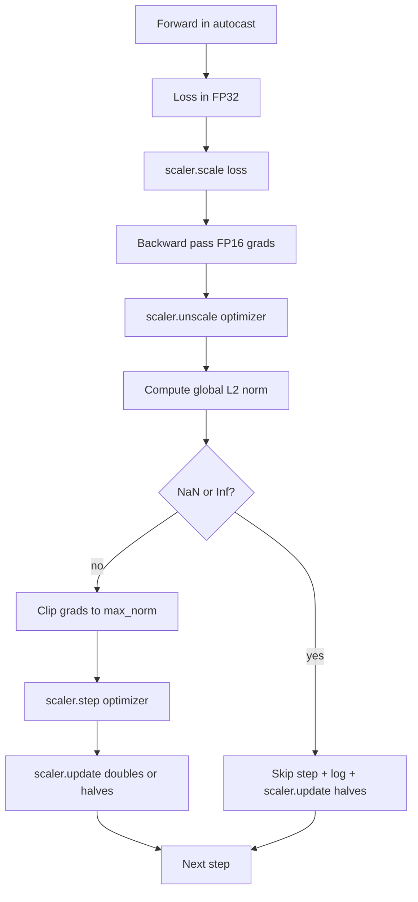

# 梯度裁剪與混合精度

> 上一課的最佳化器與排程，假設梯度是健全的。它們通常不是。單一個壞批次就能把梯度範數噴高三個數量級。混合精度訓練在損失那一側引入 FP16 溢位，把這件事放大。這一課要建出生產訓練不可能不帶的那兩條安全帶：把梯度裁剪到一個設定好的全域 L2 範數，以及一條帶 autocast 與 GradScaler 的混合精度迴路 —— 它偵測 NaN 與 Inf、乾淨地跳過那一步，並把縮放因子記下來供事後鑑識。

**類型：** 實作
**程式語言：** Python
**先修單元：** 階段 19 第 30-37 課
**時間：** 約 90 分鐘

## 學習目標

- 對所有參數梯度計算全域 L2 範數，並在它超過設定門檻時就地裁剪。
- 把一個訓練步驟包進 autocast 加 GradScaler，好讓 FP16 的前向與反向傳遞挺得過溢位。
- 在損失或梯度中偵測 NaN 與 Inf、跳過最佳化器那一步，並記錄那次跳過。
- 每一步都回報 GradScaler 的縮放因子，好讓一長串跳過立刻現形。

## 那個問題

一次昨天還跑得乾乾淨淨的訓練，產出的損失曲線在第 8,217 步垂直往上。元凶是單一個批次，它的梯度範數是 4,200，比先前的峰值高二十倍。沒有裁剪，最佳化器就套用一次把模型前一小時所有學習全部重置的更新。有了範數 1.0 的全域 L2 裁剪，同一個批次貢獻的就是一次單位範數的更新；損失待在它的趨勢線上；那次執行活下來了。

混合精度訓練靠在 FP16 裡計算前向傳遞與大部分反向傳遞，把吞吐量推高 2-3 倍。代價是 FP16 的指數範圍很窄。一個在 FP16 裡溢位的典型梯度會算成 Inf，它會以 NaN 的形式傳播過後續各層，然後在下一次最佳化器步驟時把每一個權重都設成 NaN。PyTorch 的 GradScaler 解決這件事的方式，是在反向傳遞之前把損失乘上一個很大的縮放因子，並在最佳化器步驟之前把梯度除以同一個因子。若在解縮放時有任何梯度是 Inf 或 NaN，縮放器就跳過那一步並把縮放因子減半；若前 N 步都乾淨，縮放器就把因子加倍。訓練過程中，那個因子會找到 FP16 範圍所允許的最高值。

建置上的問題是把兩者接對。在解縮放之前裁剪，那門檻就是在縮放過的梯度上；在解縮放之後裁剪，那 GradScaler 上的操作順序就要緊。正確的順序是：`scaler.scale(loss).backward()`，然後 `scaler.unscale_(optimizer)`，然後 `clip_grad_norm_`，然後 `scaler.step(optimizer)`，然後 `scaler.update()`。任何其他順序都產出一條無聲壞掉的迴路。

## 那個概念



### 全域 L2 範數

全域 L2 範數是那個串接後梯度向量的歐氏範數，不是逐參數的範數。PyTorch 把它實作成 `torch.nn.utils.clip_grad_norm_(parameters, max_norm)`。這個函式回傳裁剪前的範數，好讓這一課能同時記錄自然值與裁剪後的值 —— 那對於「我們每一步都在裁剪」這項診斷是必要的。

### autocast 與 GradScaler

`torch.amp.autocast(device_type)` 是那個脈絡管理器，它選擇性地在 FP16 中執行合格的操作（多數屬於矩陣乘法類的操作）。`torch.amp.GradScaler(device_type)` 是那個輔助工具，在反向之前縮放損失、在最佳化器步驟之前反向縮放梯度。這兩者是一起設計的；只用一個而不用另一個，是一項測試該抓到的組態錯誤。

這一課用 CPU autocast，因為那是 CI 裡跑的東西；只要把 `device_type="cpu"` 改成 `device_type="cuda"`，同一個模式就原封不動地移到 CUDA 上。CPU 上的 GradScaler 是個存根（CPU autocast 預設已經在 BF16 下運作，不需要損失縮放），但這一課仍然放進那些呼叫點，好讓接線方式與 GPU 迴路一模一樣。

### NaN 與 Inf 偵測

偵測發生在兩個地方。第一，在反向之前用 `torch.isfinite` 檢查損失本身；Inf 或 NaN 的損失產不出有用的梯度，於是在進入最佳化器之前就被跳過。第二，在 `scaler.unscale_(optimizer)` 之後，這一課用 `has_non_finite_grad(...)` 掃描解縮放後的梯度，並把任何 Inf 或 NaN 視為一次跳過。這兩項檢查合起來，涵蓋了前向傳遞與反向傳遞兩種失敗模式。

### 縮放因子的診斷

那個縮放因子是 GradScaler 的內部狀態。每一步這一課都讀 `scaler.get_scale()`，並把它記在學習率與梯度範數旁邊。一次健康的執行，會顯示縮放因子以二的冪次往上爬，直到在 `2^17` 或 `2^18` 附近飽和。一次行為異常的執行，則顯示那個因子在高低值之間震盪，那就是「模型的梯度有時在範圍內、有時不在」的訊號。沒有記錄，這項診斷就看不見。

```figure
grad-clip-monitor
```

## 動手建

`code/main.py` 實作：

- `clip_global_l2_norm` —— 包住 `torch.nn.utils.clip_grad_norm_` 的一層，同時回傳裁剪前與裁剪後的範數。
- `has_non_finite_grad` —— 一個掃描梯度中 NaN 與 Inf 的輔助函式。
- `AmpTrainState` —— 把一個模型、一個 `AdamW` 最佳化器、一個 GradScaler 與一個 autocast 裝置包起來。暴露一個 `step(inputs, targets)`，跑完整條裁剪、縮放與「遇 NaN 就跳過」的管線。
- `StepLog` 與 `SkipLog` —— 結構化的逐步紀錄。
- 一個示範：把一個小 `nn.Linear` 模型訓練 20 步、在第 5 步往梯度裡注入一個 Inf 以演練那條跳過路徑，並印出結果日誌。

跑它：

```bash
python3 code/main.py
```

腳本以零結束碼退出，並印出一份逐步日誌，每一列標著 `STEP` 或 `SKIP`；至少有一列是 `SKIP`。

## 生產模式

有四種模式，能把這條迴路提升成一個生產訓練步驟。

**把跳過計數當成警報，不是一行日誌。** 一次訓練裡有寥寥幾次跳過是健康的。每個訓練週期幾百次跳過就是硬警報：模型處在一個 FP16 撐不住的區間，而那條迴路正在無聲地失敗。這一課追蹤一個 1,000 步的滾動跳過率，而在生產環境裡，超過 5% 就該呼叫待命。

**裁剪門檻住在設定裡。** `max_norm = 1.0` 是語言模型訓練的現代預設。先在小模型上掃它；較大的門檻讓模型能從真正困難的批次中恢復；較小的門檻界住最差情況，代價是損失曲線更吵。那個門檻該和第 44 課的排程住在同一份 YAML 或 JSON 設定裡。

**範數日誌與排程寫進同一份 CSV。** CSV 的欄位是 `step, lr, grad_l2_pre_clip, grad_l2_post_clip, loss, skipped, skip_reason, scaler_scale`。打開那個檔案的審查者，能在同一列裡看見排程、梯度的故事、縮放因子，以及跳過的結果（連同它的理由）。把欄位拆到不同檔案，就是製造分析錯位的配方。

**`scaler.update()` 每一步都要跑，就算跳過也一樣。** 在乾淨的一步上，縮放器讀它的無 Inf 計數器、加一，並可能把因子加倍。在被跳過的一步上，縮放器把因子減半並重置計數器。在跳過路徑上忘了 `update()`，就是那個產出「縮放因子從來沒變過」的臭蟲。

## 動手用

生產模式：

- **autocast 裝置與最佳化器裝置一致。** GPU 訓練用 `torch.amp.autocast(device_type="cuda")`；CPU 用 `torch.amp.autocast(device_type="cpu")`。把裝置混著用會產出一個無聲的型別錯誤，它表現成「損失曲線看起來沒問題、但模型沒在學」。
- **反向之前檢查損失。** `torch.isfinite(loss).all()` 是一次張量歸約；成本可以忽略，而在一個 NaN 損失上省下的是一整個訓練步驟。永遠跑它。
- **`zero_grad` 裡用 `set_to_none=True`。** 把梯度設成 `None` 而不是零，讓最佳化器能對未受影響的參數群組跳過運算。這個設定是免費的吞吐量改善，也稍微縮小了臭蟲的表面積。

## 產出交付

在一個真實專案裡，`outputs/skill-clip-amp.md` 會描述：訓練步驟用了什麼裁剪門檻與 autocast 裝置、那份逐步 CSV 住在版本控制的哪裡，以及生產環境的跳過率警報門檻是多少。這一課出貨的是那具引擎。

## 練習

1. 把那個合成的 Inf 注入換成一次真實的損失暴衝（把某個批次的目標乘上 1e8），並驗證那條跳過路徑會觸發。
2. 加上一個 `--bf16` 模式，把 autocast 切成 BF16 而不是 FP16。BF16 的指數範圍比 FP16 寬，而且很少需要損失縮放；驗證在同一個示範上跳過率降到零。
3. 加上一項單元測試：當沒有發生裁剪時，那個梯度裁剪包裝函式仍正確回傳裁剪前與裁剪後的範數。
4. 加上一個滾動窗口的跳過率計算，以及一個 CLI 旗標 —— 若該率連續 100 步超過設定門檻，就讓那次執行失敗。
5. 把那條迴路接起來，寫出那份標準 CSV（`step, lr, grad_l2_pre_clip, grad_l2_post_clip, loss, skipped, skip_reason, scaler_scale`），並藉由每一列之後都 flush，確認那個檔案挺得過一次 Ctrl-C。

## 關鍵術語

| 術語 | 大家怎麼說 | 實際是什麼意思 |
|------|-----------------|------------------------|
| 全域 L2 範數 | 「裁剪目標」 | 跨所有可訓練參數、串接後梯度向量的歐氏範數 |
| autocast | 「混合精度」 | 在一個 `with` 區塊內，對合格操作選擇性地以 FP16（或 BF16）執行 |
| GradScaler | 「損失縮放器」 | 在反向之前乘上損失、在最佳化器步驟之前反向縮放梯度的輔助工具 |
| 跳過 | 「壞的一步」 | 因為梯度或損失非有限而被拒絕的最佳化器步驟；縮放器會把因子減半 |
| 縮放因子 | 「縮放器狀態」 | GradScaler 當前的乘數；在乾淨一段之後加倍、每次跳過就減半 |

## 延伸閱讀

- [Micikevicius et al., Mixed Precision Training (arXiv 1710.03740)](https://arxiv.org/abs/1710.03740) —— 最初的損失縮放提案
- [Pascanu, Mikolov, Bengio, On the difficulty of training recurrent neural networks (arXiv 1211.5063)](https://arxiv.org/abs/1211.5063) —— 梯度裁剪的參考論文
- [PyTorch torch.amp.GradScaler](https://docs.pytorch.org/docs/stable/amp.html) —— 這一課所包裝的縮放器 API
- [PyTorch torch.nn.utils.clip_grad_norm_](https://docs.pytorch.org/docs/stable/generated/torch.nn.utils.clip_grad_norm_.html) —— 這一課所用的裁剪原語
- 階段 19 · 42 —— 餵給這條迴路之語料的下載器
- 階段 19 · 43 —— 這條迴路所消費的 dataloader
- 階段 19 · 44 —— 與這條迴路組合的那份排程
