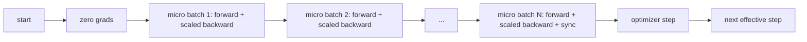
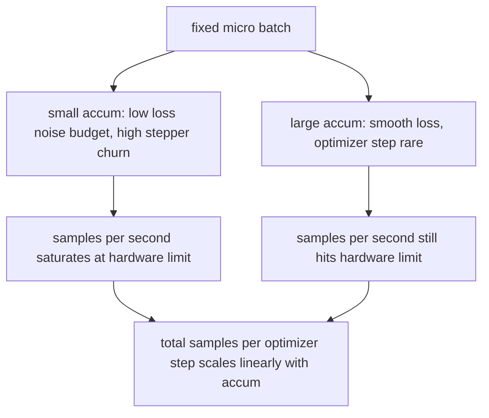

# 梯度累積

> 用一個你負擔不起的有效批次來訓練，一次一個微批次。縮放損失、把最佳化器那一步扣住，然後讓梯度堆起來。

**類型：** 實作
**程式語言：** Python
**先修單元：** 階段 19 第 42 到 45 課
**時間：** 約 90 分鐘

## 學習目標

- 推導出有效批次的恆等式：`effective_batch = micro_batch * accum_steps`。
- 實作逐微批次的損失縮放，好讓累積出來的梯度與單次全批次反向傳遞相符。
- 在最後一個微批次之前跳過最佳化器同步（sync-on-last-step）。
- 讀懂「吞吐量對有效批次」的曲線，並解釋那個報酬遞減。

## 那個問題

你想用 512 的有效批次訓練，因為損失曲線更平滑，而且在那個尺度上最佳化器那一步更說得通。桌上那台加速器在記憶體用完之前只裝得下 32 個樣本。加倍批次不是選項。把模型砍半不是選項。這個領域在 2017 年抓來、從此再沒放下的訣竅，是跑 16 次反向傳遞、讓梯度累積在參數緩衝區裡，只在計數達到目標時才讓最佳化器走一步。

風險在於：損失不再是那個更大批次時的同一個數字。16 個小批次的交叉熵天真地加總起來，是一個全批次損失的 16 倍。沒有縮放，梯度方向是對的，但大小是錯的，而最佳化器那一步大了 16 倍。修法是一次除法。修法也很容易被忘掉。

## 那個概念



契約很短：

- 每個微批次的損失，在 `backward()` 之前先除以 `accum_steps`。PyTorch 預設把梯度加總進 `param.grad`；那次除法把那個運行總和推回正確的尺度。
- 最佳化器那一步在每個有效批次觸發一次，也就是最後一個微批次反向之後。在累積中途就走一步，會歪掉那次執行其餘部分所倚賴的每一個參數。
- 最佳化器的狀態（動量緩衝、Adam 的動差）每個有效步驟前進一次，不是每個微批次一次。否則那些指數移動平均看到的頻率就錯了，並會把排程燒光。
- 在單一裝置上這只是記帳。在多 rank 的叢集上，同一個模式會把非最後的微批次包進一個 `no_sync` 脈絡，跳過梯度的 all-reduce；最後一個微批次一趟就把完整累積梯度歸約完，而不是付 N 次網路成本。

### 用程式碼寫的等價性證明

```python
loss = criterion(model(x_full), y_full)
loss.backward()
opt.step()
```

等價於

```python
for x, y in chunks(x_full, y_full, n):
    scaled = criterion(model(x), y) / n
    scaled.backward()
opt.step()
```

在浮點加總順序的差異之內。迴圈結束時那個累積的梯度緩衝區，就是單次全批次反向會產出的同一個張量。這一課的程式碼在 `equivalence_check` 裡以「最大絕對差小於 1e-4」斷言了這件事。

### 成本跑到哪去了

每個微批次的成本是一次前向與一次反向。用累積，你是拿記憶體換時間。`outputs/accum-curve.json` 裡的吞吐量曲線，展示了在微批次固定、有效批次成長時會發生什麼：



天下沒有白吃的午餐。把 `accum_steps` 加倍，就把每個最佳化器步驟的實際時間加倍。變的是那個梯度估計的變異數：在同樣的時間預算下，你做的最佳化器步驟更少，但每一步都是在更多樣本上平均出來的。文獻把大批次與小批次當成不同的最佳化問題；這裡這一課講的是機械層面，不是統計層面。

## 動手建

`code/main.py` 是那件跑得起來的產出物。它做三件事。

### 第一步：等價性檢查

`equivalence_check()` 用同一個種子建出同一個網路的兩份副本。一份在一次前向傳遞裡看見一個 16 樣本的批次。另一份看見四個 4 樣本的區塊，損失除以四。這個函式比較最佳化器步驟之前的梯度緩衝區，以及之後的參數。斷言是 `max_abs_diff < 1e-4`。

### 第二步：sync-on-last-step 模式

`train_one_optimizer_step` 走過各個微批次。除了最後一個之外，每一個微批次它都進入 `no_sync_context(model)`。在單一行程上，那個脈絡什麼也不做；在 DDP 上，那就是梯度 all-reduce 被跳過的地方。不管怎樣記帳都一樣。一個 `sync_counter` 記錄我們離開 no_sync 範圍幾次；對 N 個微批次而言，那個計數是每個有效步驟一次，不是 N 次。

### 第三步：那條吞吐量曲線

`sweep_effective_batches` 以固定的微批次與一份累積步數清單，跑同一個模型。對每一組設定它記錄：

- `samples_per_sec`：看過的總樣本數除以實際時間
- `median_step_ms`：每個有效步驟的第 50 百分位
- `sync_calls`：演練到的集合通訊點數
- `avg_loss`：這次掃描中各最佳化器步驟的平均

輸出落在 `outputs/accum-curve.json`，可以從筆記本重複使用。

跑它：

```bash
python3 code/main.py
```

腳本印出那個等價性差值、接著是掃描表格、然後是 JSON 路徑。結束碼為零。

## 動手用

在生產訓練裡，梯度累積住在一個旋鈕後面。PyTorch 的模式是 `accumulation_steps = effective_batch // (micro_batch * world_size)`。那些你在這裡不被允許使用的框架，包的是同一條迴路，但步驟是一樣的：縮放損失、在非最後的微批次上跳過同步、累積、走一步。

現實世界裡的三種模式：

- 微批次大小的選擇，是為了把裝置記憶體吃滿。比它小就浪費加速器週期。比它大就當機。
- 有效批次是從一份學習率排程中選出來的。大的有效批次需要縮放過的學習率與暖身；那就是自 2017 年起被談論的線性縮放法則。
- 累積次數是那兩者之間的橋，也是唯一一個你不必重寫資料載入器就能在執行期自由調整的旋鈕。

## 產出交付

`outputs/skill-gradient-accumulation.md` 把那份配方記下來，好讓同事能把它扔進一個新的儲存庫：把損失除以 `accum_steps`、在非最後的微批次上跳過最佳化器同步、每個有效批次讓最佳化器走一步、把「吞吐量對有效批次」記成 JSON，好讓那個取捨看得見。

## 練習

1. 用 `--num-steps 100` 重跑那次掃描，並把每秒樣本數對有效批次畫出來。那條曲線在哪裡變平？
2. 加上一個錯誤縮放的變體（不做除法），並在第 1 步展示它與參考版本的參數差異。
3. 把 SGD 換成 AdamW，並確認最佳化器狀態是每個有效步驟前進一次，不是每個微批次一次。
4. 引入一個真的 `DistributedDataParallel` 包裝，並把 `no_sync_context` 路由到它的方法上。確認每個有效批次的 sync_calls 少了 N-1 次。
5. 修改那個等價性檢查，去比較兩種不同的微切分（2 乘 8 對 4 乘 4），並解釋你需要放寬的任何容許誤差。

## 關鍵術語

| 術語 | 大家怎麼說 | 實際是什麼意思 |
|------|-----------------|------------------------|
| 微批次 | 你做前向的那個批次 | 單次前向傳遞裡塞得進記憶體的那一片 |
| 累積步數 | 每一步的反向傳遞次數 | 在一次最佳化器步驟之前被加總的反向傳遞次數 |
| 有效批次 | 那個批次 | 微批次乘上累積步數乘上資料平行的世界大小 |
| 損失縮放 | 除以 N | 逐微批次的除法，好讓加總後的梯度與全批次相符 |
| 最後一步才同步 | 其餘的跳過 | 只在窗口內最後一次反向上跑那個梯度集合通訊 |

## 延伸閱讀

- PyTorch 關於 `DistributedDataParallel.no_sync` 的文件，那是 sync-on-last-step 技巧的生產版本。
- Goyal 等人，2017，關於大批次訓練的線性縮放，那是在乎有效批次的經典理由。
- PyTorch 議題追蹤器上關於「梯度累積與混合精度解縮放之互動」的討論。
- 階段 19 第 42 到 45 課，涵蓋這一課所假設的模型、資料載入器、最佳化器與訓練器骨架。
- 階段 19 第 47 課，涵蓋檢查點與續跑，好讓一次長時間的累積訓練挺得過實際時間上限。
