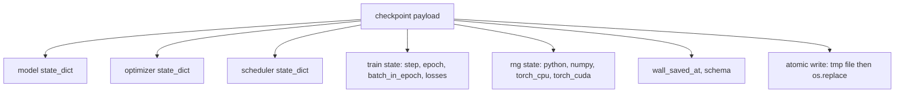
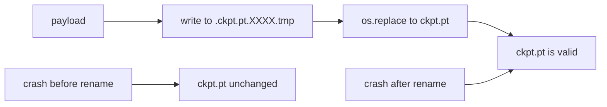
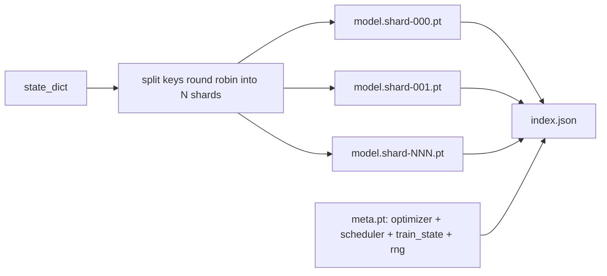

# 檢查點的儲存與續跑

> 訓練被中斷會殺掉一次執行；檢查點讓它們得以繼續。原子性地儲存模型、最佳化器、排程器、損失歷史、步數計數器與 RNG 狀態，好讓任何一刻被砍掉，磁碟上都留著一個有效的檔案。

**類型：** 實作
**程式語言：** Python
**先修單元：** 階段 19 第 42 到 45 課
**時間：** 約 90 分鐘

## 學習目標

- 把完整的訓練狀態捕捉進單一份酬載，好讓它能被重新載入一個全新的行程。
- 用「先寫暫存檔再改名」實作原子性儲存，好讓一次當機永遠不會留下寫到一半的檔案。
- 還原 Python、NumPy 與 PyTorch 的 RNG 狀態，好讓續跑之後的損失與未中斷的基線相符。
- 替那些已經塞不進單一檔案的模型，建出一份分片檢查點佈局，帶雜湊驗證的分片與一份 JSON 索引。

## 那個問題

你設了一個 18 小時的訓練工作。實際時間上限是 4 小時。叢集在第 11 小時重開機，因為某位職等比你高的人核准了一次核心升級。沒有檢查點你就得從頭開始。沒有續跑你還會丟掉那份花了前 11 小時學出來的最佳化器狀態，所以就算模型權重活了下來，AdamW 的動差也沒了，而下一步會朝著訓練軌跡早就越過的方向猛地一竄。

正確的產出物是一個單一檔案，裡面放著繼續所需的一切：模型參數、最佳化器狀態、排程器狀態、供繪圖用的損失歷史、當前步數與訓練週期與週期內批次的計數器，以及每一個隨機性來源的 RNG 狀態。沒有 RNG 狀態，續跑之後的損失曲線就是另一條曲線。同樣的模型、同樣的資料、不同的洗牌、不同的 dropout 遮罩、儀表板上不同的數字。

原子性儲存是那份契約的另一半。直接寫進最終檔名，意味著寫到一半當機就留下一個壞掉的檔案；續跑讀到的是垃圾。寫進同一目錄下的一個暫存檔再改名，意味著寫到一半當機時，先前那個好的檔案原封不動。在 POSIX 檔案系統上，改名是原子的。

## 那個概念



### 那五個狀態桶

| 桶 | 為什麼要緊 |
|--------|----------------|
| 模型 | 權重與緩衝區；模型之所以是模型的東西。 |
| 最佳化器 | 動量與適應性動差；少了它們，下一步就是另一個最佳化問題。 |
| 排程器 | 學習率在它那條曲線上的位置；餘弦排程尤其在意。 |
| 訓練計數器 | 步數、訓練週期、週期內批次，加上畫出儀表板的那份損失歷史。 |
| RNG 狀態 | dropout、資料洗牌，以及模型內部任何取樣的確定性。 |

### 原子性儲存



兩條規則。第一，那個暫存檔要與目標住在同一個目錄，好讓改名留在同一個檔案系統之內；跨裝置的改名不是原子的。第二，暫存檔名每次嘗試都要唯一，好讓兩個寫入者不會互踩。

### 分片檢查點

當模型變大，單一檔案的酬載就大到載不快、大到檢視不了，而且網路共享在讀到一半打嗝時痛苦不堪。修法是把參數狀態切成分片，並寫一份小索引把它們綁在一起。



索引記錄分片數、每個分片的 sha256，以及那份 meta 檔案的 sha256。任何雜湊不符時，載入器就大聲失敗。那些分片可以落在不同的實體磁碟上；meta 很小，而且最先被讀。

### 續跑要能從訓練週期中間接下去

一次「跳到下一個訓練週期開頭」的續跑，會浪費從幾分鐘到一整天不等的時間。修法是 `(epoch, batch_in_epoch)` 加上 RNG 狀態。載入之後，訓練迴路把亂數產生器快轉過當前週期中已經消費掉的那些批次，並從 `batch_in_epoch` 繼續。這一課的程式碼正是這麼做的；斷言是續跑之後的損失軌跡，與未中斷的基線在 1e-4 之內相符。

```figure
cc-atomic-checkpoint
```

## 動手建

`code/main.py` 提供四個原語與一個示範驅動器。

### 第一步：捕捉並還原 RNG 狀態

`capture_rng_state` 回傳一個字典，帶著 Python 的 `random.getstate`、NumPy 的 `np.random.get_state`，以及 PyTorch CPU 與 CUDA 的 RNG 位元組。`restore_rng_state` 把它反過來。那個 CPU 張量是一個 uint8 位元組緩衝區，PyTorch 的 RNG 知道怎麼消費它。

### 第二步：原子性儲存

`atomic_save` 把酬載寫進目標目錄裡的一個暫存檔，然後用 `os.replace` 把它換成最終檔名。`atomic_write_json` 替那份分片索引做同樣的事。

### 第三步：完整檢查點的來回轉換

`save_checkpoint` 把模型、最佳化器、排程器、訓練狀態與 RNG 打包進一個字典。`load_checkpoint` 把它反過來，並回傳一個 `TrainState`。那個 schema 欄位是升級用的掛鉤：未來格式改變時把版本字串升上去，載入器就據此派送。

### 第四步：分片變體

`save_sharded_checkpoint` 以輪詢方式把參數的鍵分到 N 個分片上、以各自的原子性儲存寫出每個分片、寫一份帶最佳化器與排程器與訓練狀態的 meta 檔案，並寫出那份帶各分片 sha256 的 JSON 索引。`load_sharded_checkpoint` 在合併之前驗證每一個分片。

### 第五步：續跑示範

`run_resume_demo` 把一個小模型訓練 `total_steps` 步、在 `interrupt_at` 處存一個檢查點，然後繼續。第二個行程還原那個檢查點，並跑完剩下的步數。這個函式回傳中斷點之後兩條損失軌跡之間的最大絕對差。RNG 還原之後，那個差是零或浮點雜訊。

跑它：

```bash
python3 code/main.py
```

單一檔案與分片這兩個示範，都斷言最大差值低於 1e-4。摘要落在 `outputs/resume-demo.json`。

## 動手用

生產訓練堆疊把檢查點當成訓練器的一部分出貨。形狀都一樣：模型 + 最佳化器 + 排程器 + 計數器 + RNG，原子性地寫出、以步數命名，好讓最新的那個容易找到。分片佈局讓大型模型能以平行讀取載入；讓那件事行得通的正是 index.json。

有三種模式要強制執行：

- **Schema 是酬載裡的一個字串。** 遷移依它分支。少了它，你就沒辦法在不弄壞舊執行的情況下演進格式。
- **每一個分片都算 sha256。** 一次無聲截斷的下載是最糟的那種臭蟲；載入器要嘛快速失敗、要嘛很晚才失敗。
- **讓檢查點節奏誠實。** 每 N 步存一次，也每 N 分鐘實際時間存一次，取較短者。否則那個當掉的長步驟就浪費了整整一個窗口的工作。

## 產出交付

`outputs/skill-checkpoint-save-resume.md` 是任何新訓練腳本的配方：酬載形狀、原子性寫入、RNG 捕捉、分片索引。把這項技能扔進一個儲存庫、在定期儲存的地方接上 `save_checkpoint`、在啟動時接上 `load_checkpoint`，那次執行就挺得過被砍掉。

## 練習

1. 把輪詢式分片換成依參數群組分片（結尾為 `.weight` 的層 vs `.bias`）。什麼時候哪種佈局比較好？
2. 擴充儲存迴路，只保留最近 K 個檢查點並修剪掉更舊的。當磁碟很小時，正確的 K 是多少？
3. 加上一個 `--ckpt-every-seconds` 旗標，依實際時間間隔而不只是步數觸發儲存。
4. 加上一條校驗和驗證路徑，在啟動時執行、掃描目錄裡的每一個檢查點，並回報哪些是壞的。
5. 實作一個 `migrate_v1_to_v2` 函式，往酬載裡加一個新欄位並把 schema 字串升上去。讓載入能容忍兩個版本。

## 關鍵術語

| 術語 | 大家怎麼說 | 實際是什麼意思 |
|------|-----------------|------------------------|
| 原子性儲存 | 「寫下去然後祈禱」 | 寫進同一目錄下的暫存檔，再用 os.replace 換成目標檔名 |
| State dict | 「那些權重」 | 以參數名稱為鍵的模型參數與緩衝區 |
| 分片檢查點 | 「大模型檔案」 | 多個檔案，每個分片一個，加上一份 meta 檔案與一份帶 sha256 的 JSON 索引 |
| RNG 狀態 | 「隨機種子」 | 捕捉下來的 python random、numpy、torch CPU、torch CUDA 狀態；不只是種子 |
| 週期中續跑 | 「重啟」 | 把 RNG 快轉，並從同一訓練週期的下一個批次繼續 |

## 延伸閱讀

- POSIX `rename` 的語意，那是 `os.replace` 所倚賴之原子性宣稱的依據。
- PyTorch 關於 `torch.save` 與 `torch.load` 的文件，包含供跨裝置還原用的 `map_location`。
- 階段 19 第 46 課，涵蓋這一課檢查點酬載所要挺過的那個梯度累積。
- 階段 19 第 48 課，涵蓋這套方案所容納之 state dict 格式的那些分散式包裝。
- Linux 核心的 `fsync` 文件，那是原子性改名背後的耐久性保證。
