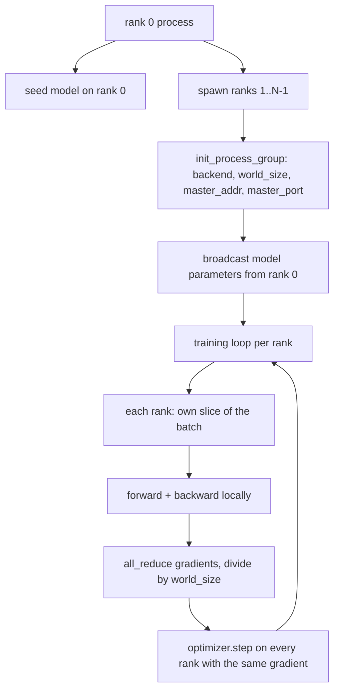
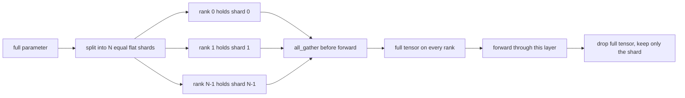

# 從零打造分散式資料平行與 FSDP

> 多 rank 訓練就是兩個集合通訊加一條規則。啟動時廣播參數、反向之後平均梯度，永遠別讓那些 rank 對「現在是第幾步」有不同意見。

**類型：** 實作
**程式語言：** Python
**先修單元：** 階段 19 第 42 到 45 課
**時間：** 約 90 分鐘

## 學習目標

- 用 `gloo` 後端在 N 個 rank 上把一個行程群組拉起來，不需要特殊硬體。
- 實作一個極簡的 DDP 包裝，在建構時廣播參數、在反向之後對梯度做 all-reduce。
- 證明「逐 rank 梯度的 all-reduce」與「單一行程在串接後輸入上的梯度」相符。
- 勾勒 FSDP 的參數分片：每個 rank 持有一片，前向傳遞時把完整張量蒐集起來，之後就丟掉。

## 那個問題

模型塞得進一個裝置。資料集塞不進。最佳化預算說你想在每一秒實際時間裡看到 N 倍的樣本。第一根槓桿是資料平行：每個 rank 在不同的批次切片上跑同一個模型，然後在最佳化器步驟之前平均梯度。第二根槓桿是 FSDP：模型也塞不進一個裝置，於是每個 rank 只持有每個參數的一小部分，並在前向傳遞時逐層重建完整張量。

痛點在記帳。若參數在各 rank 之間漂開，那次執行就無聲地壞了。若你平均了梯度卻沒平均損失，儀表板就在說謊。若集合通訊後端對拓撲談不攏，那次執行就永遠卡住。修法是親手把那些集合通訊寫一次，然後永遠別信任一個你重現不了的包裝。

這一課跑在 CPU 上。不假設有 CUDA。`gloo` 後端隨每一份 PyTorch 建置一起出貨，並接受 `torch.multiprocessing` 的工作者；同一份程式碼在多 GPU 節點上換成 `nccl`，結構完全不必改。

## 那個概念



### 那兩個要緊的集合通訊

| 集合通訊 | 它做什麼 | 什麼時候 |
|------------|--------------|------|
| `broadcast` | 把一個張量從某個 rank 複製到所有其他 rank | 參數初始化、排程器狀態、任何一對多的同步 |
| `all_reduce` | 跨所有 rank 對一個張量求和（或平均、或最大），每個 rank 都拿到結果 | 反向之後的梯度平均 |
| `all_gather` | 每個 rank 貢獻一個張量，每個 rank 都拿到串接結果 | logits 蒐集、FSDP 的參數解分片 |

DDP 的契約是：建構時 `broadcast`、反向之後 `all_reduce`。FSDP 的草圖在每一層前向傳遞之前加上 `all_gather`。

### 梯度平均與單一行程的梯度相符

一個在 N 個 rank 上、以 B 個樣本批次訓練的模型，必須產出與「單一行程在 N*B 批次上訓練」相同的梯度。訣竅在於：把逐 rank 的梯度加總再除以 N，得到的是平均損失的梯度，而那正是「以平均歸約做交叉熵」在整個批次上會產出的東西。這一課的程式碼以「手工 all-reduce 梯度與參考單行程梯度之間 `max-abs-diff < 1e-3`」斷言了這件事。

### FSDP 草圖



記憶體上的勝利是精確的：每個 rank 用於參數的記憶體掉到 1/N。代價是那次蒐集，而它每次前向傳遞都要付。生產級的 FSDP 會把蒐集與前一層的運算重疊起來，所以實際時間成本遠小於天真計算所預測的。這一課對每一個參數都做一次來回，並斷言重建結果與原始的位元完全相同。

### CPU 與 gloo 後端

CUDA 是生產標的，但同樣的程式碼路徑在 CPU 上也存在。`gloo` 是 CPU 的集合通訊後端。它在 GPU 上比 `nccl` 慢好幾個數量級，但 API 表面完全一樣。這一課的行程群組以 `backend="gloo"` 初始化，而各 rank 是用 `torch.multiprocessing` 而不是 `torchrun` 衍生出來的；兩者最後落到的是同樣的 `torch.distributed` 呼叫。在多 GPU 節點上，唯一的改動是 `backend="nccl"`、裝置張量，以及改用 `torchrun` 啟動。

## 動手建

`code/main.py` 是那件跑得起來的產出物。

### 第一步：把行程群組拉起來

```python
os.environ["MASTER_ADDR"] = "127.0.0.1"
os.environ["MASTER_PORT"] = str(port)
dist.init_process_group(backend="gloo", rank=rank, world_size=world_size)
```

`MASTER_ADDR` 與 `MASTER_PORT` 就是那個會合點：每個 rank 都撥打同一台主機上的同一個埠。這一課用一個「綁定再關閉」的技巧挑一個空閒埠，以避免好幾次執行共用一台機器時發生衝突。

### 第二步：建構時廣播

`MinimalDDP.__init__` 走過每一個參數與緩衝區，並呼叫 `dist.broadcast(tensor, src=0)`。rank 0 的值成為那份標準初始化。少了這個，每個 rank 都用自己的種子初始化，於是從第一步就開始分岔。

### 第三步：反向之後對梯度做 all-reduce

```python
def all_reduce_grads_(module, world_size):
    for p in module.parameters():
        if p.grad is None:
            p.grad = torch.zeros_like(p.data)
        dist.all_reduce(p.grad.data, op=dist.ReduceOp.SUM)
        p.grad.data.div_(world_size)
```

每個 rank 最後都拿到同一份平均梯度。最佳化器那一步現在是「每個 rank 上同一個輸入」的函數，這就是為什麼參數在整次執行中維持同步。

### 第四步：證明那份等價性

`manual_all_reduce_matches_single_process` 在 rank 0 上建出同一個模型，並把 all-reduce 之後的梯度，與單一行程在串接後輸入上會算出的梯度做比較。最大絕對差在 1e-8 左右。

### 第五步：FSDP 來回轉換

`fsdp_round_trip_sketch` 把每個參數攤平、補齊到 `world_size` 的倍數、切片、做 all-gather，再去掉補齊。每個 rank 的重建結果都等於原始的。這是解分片那一步；反過來的（前向之後重新分片）就是從蒐集到的張量上切一片。

跑它：

```bash
python3 code/main.py
```

預設的世界大小是 2。兩個 CPU 行程被衍生出來、透過 `gloo` 彼此對話，然後以零結束碼退出。輸出 `outputs/ddp-demo.json` 記下了逐 rank 的參數總和、all-reduce 之後的梯度範數、FSDP 來回轉換的結果，以及「手工對參考」的梯度差。

## 動手用

生產訓練堆疊呼叫的是同樣的原語。PyTorch 的 `DistributedDataParallel` 額外加上：讓 all-reduce 與反向重疊的反向後梯度掛鉤、把好幾個小梯度合成一次集合通訊的分桶 all-reduce，以及第 46 課用過的那個 `no_sync` 脈絡。

PyTorch 的 FSDP 額外加上：每層一個扁平參數視圖，好讓每個 rank 持有一塊連續緩衝區；把下一層的解分片與當前層的運算重疊；以及供分片使用的選配 CPU 卸載。

形狀維持不變：啟動時廣播、反向之後歸約、參數塞不下時就分片。

## 產出交付

`outputs/skill-distributed-fsdp-ddp.md` 承載了新訓練腳本的那份配方：CPU 用 `gloo`、GPU 用 `nccl` 把行程群組拉起來，把模型包進一層「建構時廣播、反向後歸約」的 DDP 外殼，並可選擇性地用 FSDP 草圖裡那個 all_gather 模式把參數分片。

## 練習

1. 用 `--world-size 4` 跑，並確認整次執行中參數的離散度維持在 1e-3 以下。
2. 把手工平均換成 `dist.all_reduce(op=dist.ReduceOp.AVG)`，並替差異計時。
3. 替那個 DDP 包裝加上一個反向後掛鉤，好讓 all-reduce 與反向的其餘部分重疊；量測實際時間的改善。
4. 實作 FSDP 的重新分片步驟：前向傳遞之後，把完整張量換回本地那一片。確認每個 rank 的記憶體下降。
5. 在一台 CUDA 機器上把後端換成 `nccl`。記下哪些環境變數變了、哪些沒變。

## 關鍵術語

| 術語 | 大家怎麼說 | 實際是什麼意思 |
|------|-----------------|------------------------|
| 後端 | 「gloo 還是 nccl」 | 實作那些集合通訊操作的函式庫；gloo 是 CPU、nccl 是 GPU |
| 世界大小 | 「總 rank 數」 | 群組裡的行程數；群組是集合通訊所作用的單位 |
| Rank | 「工作者 id」 | 群組內的行程識別碼，從零開始編號 |
| All-reduce | 「把梯度加總」 | 跨所有 rank 對一個張量求和，每個 rank 最後都拿到同一個結果 |
| 解分片 | 「把參數蒐集起來」 | 透過 all_gather 從逐 rank 的切片重建出完整張量 |

## 延伸閱讀

- PyTorch `torch.distributed` 的文件，涵蓋這一課所倚賴的那些集合通訊語意。
- `gloo` 函式庫的集合通訊清單，其形狀與 CUDA 支撐的 `nccl` 原語完全一致。
- 階段 19 第 46 課，了解那個把 DDP 的 all-reduce 包進 `no_sync` 的梯度累積模式。
- 階段 19 第 47 課，了解那份挺得過 DDP 與 FSDP 執行的檢查點佈局。
- PyTorch FSDP 的文件，那是這裡所勾勒之參數分片的生產實作。
