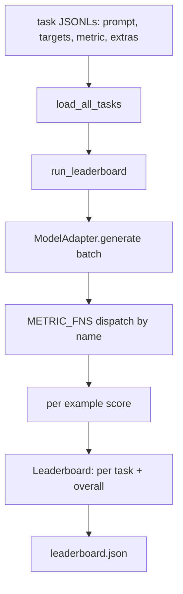
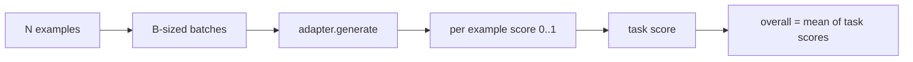

# 語言模型評估框架

> 一個在你定義不出來的任務上表現良好的模型，是碰巧表現良好的模型。這個框架就是那份任務定義、那個指標、那個執行器與那張排行榜，全都收進一個簡短、可抽換的形狀裡。

**類型：** 實作
**程式語言：** Python
**先修單元：** 階段 19 第 42 到 45 課
**時間：** 約 90 分鐘

## 學習目標

- 把一項任務定義成一個 JSONL 檔案，每個樣本帶 `prompt`、`targets`、`metric` 與選配的 `extras`。
- 實作五種指標：完全相符、rouge-l F1、可執行檢查、多選題，以及子字串包含。
- 建出一個執行器，逐任務把樣本批次化，並派送給一個可抽換的模型轉接器。
- 產出一份帶逐任務分數、延遲，以及一個可重現整體平均值的排行榜 JSON。

## 那個問題

每週都有一個新的語言模型落地。行銷宣稱是它表現良好。誠實的問題是：在什麼上面良好？誠實的答案是你自己寫的那張排行榜，因為廠商的排行榜是他們調校過的那一張。

儲存庫裡沒有這樣一個框架，你就靠感覺比較兩個模型。有了框架，你就用「固定任務集上以固定指標得到的分數」來比較，而且輸出是一份你 diff 得了的 JSON。這個框架是昨天那次執行與今天這次執行之間的契約。少了它，退化就出貨了。

陷阱是把框架過擬合到單一個模型上。修法是把同一個陷阱反過來用：框架小到十五分鐘讀得完、任務小到能塞進儲存庫、指標從零寫起好讓同事能稽核它們，而轉接器是唯一住著模型專屬程式碼的地方。換掉轉接器，排行榜就動；換掉任務，排行榜就動。其他任何東西都不該動。

## 那個概念



### 任務規格

每個樣本是一行 JSONL：

```json
{"id": "arith-00", "prompt": "compute: 2 + 2", "targets": ["4"], "metric": "exact_match"}
```

對於需要評分輔助資料的指標，`extras` 承載那份側邊酬載：

```json
{
  "id": "code-00",
  "prompt": "python: write a function f that doubles its input",
  "targets": ["ok"],
  "metric": "code_exec",
  "extras": {"io_pairs": [[1, 2], [3, 6]]}
}
```

一項任務是 `outputs/tasks/` 底下的一個 `.jsonl` 檔案。檔名就是任務名稱。同一個檔案裡的所有樣本共用一個指標。

### 那五項固定任務

| 任務 | 指標 | 它測什麼 |
|------|--------|---------------|
| arithmetic | exact_match | 在一個確定性答案上的詞元層級正確性 |
| summary | rouge_l | 對照一行參考摘要的最長共同子序列 F1 |
| code-exec | code_exec | 可執行測試：預測出來的函式必須滿足一份輸入輸出配對清單 |
| multiple-choice | multiple_choice | 預測的第一個字母必須與某個允許的字母相符 |
| generation | substring_contains | 自由形式的文本必須至少含有一個目標子字串 |

### 那份指標契約

每一項指標都是一個從 `(prediction, targets, extras) -> float in [0.0, 1.0]` 的函數。框架把逐樣本分數平均起來得到任務分數，再把任務分數平均起來得到整體分數。那些指標函式都很小：

- `exact_match`：轉小寫、收合空白、判等。
- `substring_contains`：同樣的正規化，做子字串測試。
- `multiple_choice`：第一個字元轉大寫。
- `rouge_l`：LCS 長度分別除以預測與參考的長度，再取精確率與召回率的 F1。
- `code_exec`：在一個受限的命名空間中執行那份預測、對每一組輸入輸出配對呼叫 `f(x)`，並數出相符的個數。

那個 code_exec 指標在一個被剝光內建函式的命名空間裡執行預測。這一課的測試斷言 `import os` 會炸掉，因為 `os` 不在那個命名空間裡；你沒辦法從一份程式碼預測裡搆到檔案系統。

### 那個模型轉接器

```python
class ModelAdapter(Protocol):
    def generate(self, prompts: Sequence[str]) -> List[str]: ...
    @property
    def name(self) -> str: ...
```

轉接器就是那道接縫。這一課出貨 `ToyAdapter`，一個確定性的樣式比對器，會替五項固定任務裡的每一段提示詞回傳正確答案。真的轉接器會呼叫模型並回傳它的輸出。框架不在乎是哪一個。

### 那個執行器

`run_task` 一次批次處理 `batch_size` 段提示詞，並派送給指標函式。`run_leaderboard` 走過每一項任務並取平均。`write_leaderboard` 產出帶一個 schema 字串的 JSON，好讓未來的格式改動不會無聲地弄壞儀表板。



```figure
eval-harness-matrix
```

## 動手建

`code/main.py` 是那件跑得起來的產出物。

### 第一步：種下固定任務

`seed_fixture_tasks(target_dir)` 寫出那五個 `.jsonl` 檔案。`main.py` 第一次執行時，若目錄是空的就種下它們。

### 第二步：載入任務

`load_all_tasks(task_dir)` 讀取每一個 `.jsonl`，並回傳一個從任務名稱到 `Example` 紀錄清單的字典。以 `#` 開頭的註解行與空白行會被跳過，好讓貢獻者能在檔案裡加註。

### 第三步：實作那些指標

每一項指標都是一個帶單元測試的小函式。這一課的測試套件包含 13 個案例，涵蓋正規化、部分重疊、程式碼執行，以及不安全程式碼的拒絕。

### 第四步：寫那個執行器

`run_task` 迭代各批次，並產出一份帶分數、正確數、總數與延遲的 `TaskResult`。`run_leaderboard` 走過所有任務，並產出一份帶整體平均值的 `Leaderboard`。

### 第五步：產出 JSON

`write_leaderboard` 把那張榜序列化。`--include-per-example` 旗標會把逐樣本紀錄傾印出來，好讓你在分數變動時能把預測與前一次執行做 diff。

跑它：

```bash
python3 code/main.py
```

腳本在第一次執行時種下那些固定資料、用那個玩具轉接器（它每一項固定任務都答對）替它們評分，並寫出 `outputs/leaderboard.json`。用玩具轉接器時整體分數是 1.0；`test_main.py` 裡的存根轉接器測試顯示，當轉接器答不出來時，同一個框架產出 0.0。

## 動手用

要接上一個真的模型，就寫一個轉接器。形狀是：

```python
class HttpAdapter:
    name = "vendor.v1"

    def __init__(self, endpoint, api_key):
        self.endpoint = endpoint
        self.api_key = api_key

    def generate(self, prompts):
        out = []
        for prompt in prompts:
            response = http_post(self.endpoint, prompt, self.api_key)
            out.append(response["text"])
        return out
```

在 `main()` 頂端把 `ToyAdapter` 換成 `HttpAdapter`。框架、任務、指標與排行榜都維持不變。

在真實專案裡出貨這個框架時，有三種模式要強制執行：

- **把任務檔案釘住。** 那份 leaderboard.json 要嘛帶著雜湊釘死的任務內容、要嘛把那些 JSONL 一起帶著；否則任務檔案一變分數就變，而你分不出來是哪個原因。
- **Diff 預測，不只 diff 分數。** `--include-per-example` 旗標讓你在分數掉下去的那天，看得到模型說了什麼。
- **限制批次大小。** 真實的轉接器有速率限制。小批次讓這個框架在各家廠商之間都相容。

## 產出交付

`outputs/skill-lm-eval-harness.md` 承載了那份配方：JSONL 任務規格、五種指標、可抽換的轉接器、批次執行器、帶 schema 字串的排行榜 JSON。`outputs/tasks/` 裡的那些任務檔案就是固定資料；把它們複製進一個真實專案當起手式。

## 練習

1. 加上第六項任務，配一個你從零寫起的自訂指標（類 BLEU 的重疊、類 BLEURT 的參考評分，任何契約清楚的東西都行）。
2. 擴充 `code_exec`，讓它擷取 stdout，並接受一份預期 stdout 的清單當作目標。
3. 加上一個排行榜 diff 指令：給定兩份 `leaderboard.json`，印出哪些任務動了、動了多少。
4. 限制每個樣本的延遲。把轉接器呼叫包進一個逾時；在排行榜上另外呈現一個 `timeouts` 欄位。
5. 在排行榜裡用一個 sha256 把任務內容釘住，好讓未來的讀者能驗證他們評的是同一批任務。

## 關鍵術語

| 術語 | 大家怎麼說 | 實際是什麼意思 |
|------|-----------------|------------------------|
| 任務規格 | 「那個評估格式」 | 一個 JSONL 檔案，每個樣本帶 prompt、targets、metric 與選配的 extras |
| 指標 | 「你怎麼評分」 | 從（預測, 目標, extras）到 [0, 1] 之間一個浮點數的函數 |
| 轉接器 | 「那個模型客戶端」 | 一個帶 generate(prompts) -> list[str] 方法的物件；唯一的模型專屬程式碼 |
| 排行榜 | 「那張計分板」 | 一份帶逐任務分數、總數、延遲與整體平均值的 JSON |
| 程式碼執行指標 | 「跑跑看再檢查」 | 在一個受限命名空間裡執行預測，並與輸入輸出配對比對 |

## 延伸閱讀

- 最初的 lm-evaluation-harness，那是生產參考，大得多但形狀一樣。
- HuggingFace 的 lighteval，那是同一份契約的另一種實作。
- 階段 19 第 46 課，涵蓋這個框架所評分之訓練堆疊裡用到的梯度累積模式。
- 階段 19 第 47 課，涵蓋你所評分的那個檢查點格式；把檢查點雜湊釘進排行榜裡。
- 階段 19 第 48 課，涵蓋產出這個受測模型的那套分散式訓練堆疊。
