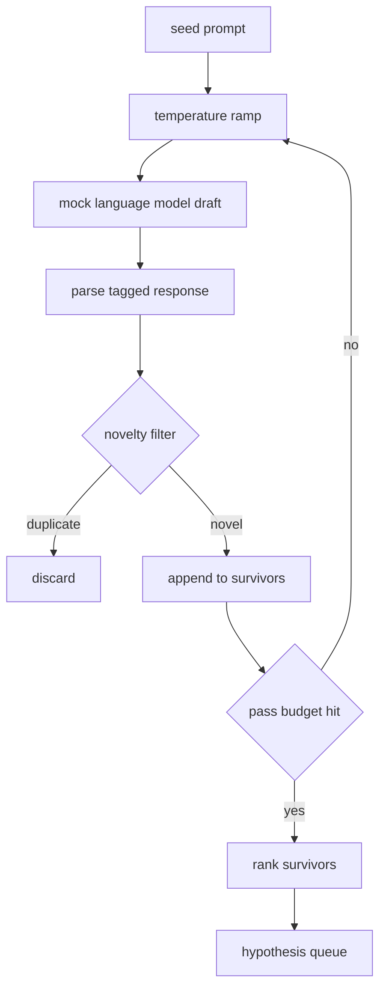

# 假說產生器

> 一個把同一個問題問兩次的研究代理，是在浪費詞元。訣竅在於逼每一份草稿落到新的地方。

**類型：** 實作
**程式語言：** Python
**先修單元：** 階段 19 A 軌第 20-29 課
**時間：** 約 90 分鐘

## 學習目標
- 從一段種子提示詞驅動一個取樣器，並把它的輸出變成型別化的假說紀錄。
- 每一趟都把取樣器溫度往上調，好讓下一份草稿離上一份更遠。
- 用一個小型嵌入模型與一個餘弦距離門檻，濾掉近似重複。
- 用一個把新穎度、具體度與可測試性混合起來的評分函數，替存活下來的假說排序。
- 讓每一步都保持確定性，好讓同樣的種子永遠產出同樣的佇列。

## 為什麼要先生成、再過濾

一個把一個模型問一次的規劃器，得到一個假說。做示範是夠了。對研究迴路而言那是錯的形狀。迴路要的是一份有深度的排序佇列，好讓第一個假說失敗時，執行器手上就有下一個，不必再付一次完整取樣的代價。

有兩個想法合起來產出那份佇列。第一是溫度爬升：每一趟通過取樣器就把溫度往上調一格，好鼓勵較後面的草稿去遊蕩。第二是新穎度過濾：每一份草稿之後，產生器量測它與每一個先前存活者之間的嵌入距離，並拒絕任何落在那個聚類之內的東西。

這一課出貨一個模擬語言模型，對固定提示詞回傳寫好的詞元序列。那個模擬足以演練完整路徑：種子提示詞進來、溫度爬升被套用、候選被剖析、新穎度過濾跑過、排序佇列出去。

## Hypothesis 的形狀

```text
Hypothesis
  id             : int           (monotonic within a run)
  text           : str           (the claim)
  variables      : list[str]     (what changes between conditions)
  metric         : str           (what the runner will measure)
  baseline_ref   : str | None    (which paper or run the comparison cites)
  draft_pass     : int           (which sampler pass produced this)
  temperature    : float         (the sampler setting at draft time)
  novelty_score  : float         (distance from prior survivors, 0..1)
  rank_score     : float         (weighted sum used for ordering)
```

`variables` 與 `metric` 不是自由文字。剖析器從一份帶標記的回應中把它們拉出來。第五十二課的執行器在建構實驗設定時直接讀這些欄位。

`baseline_ref` 是選配的，但建議填。第五十三課的評估器需要一個基線來比對。若假說省略了它，評估器就退回同一指標上的前一次執行。

```figure
cg-novelty-ramp
```

## 架構



這條迴路很直白。有意思的地方在於每一個方框都有一份硬性契約。

## 溫度爬升

從 `t_min` 開始、到 `t_max` 結束，步長 `(t_max - t_min) / (n_passes - 1)`。每一趟都以當前溫度呼叫取樣器，從 `GeneratorConfig.schedule()` 產出 `n_passes` 個等距的值。那個模擬模型以「在一小組寫好的回應之間切換」的方式尊重溫度，鍵是 `(prompt, temp_bucket)`。那些桶是開區間，所以溫度小小一變就挑到不同的桶，產出不同的草稿。在生產環境裡，那個取樣器會是一個真的模型，並把 `temperature=t` 傳進去。

預設排程是從 `0.2` 到 `1.2` 的六趟。六趟足以把佇列填滿，又不必替那些反正會被新穎度過濾掉的樣本付錢。低於 `0.2` 模型就把種子鸚鵡學舌回來。高於 `1.2` 回應就傾向離題，並讓剖析器失敗。

## 新穎度過濾

每一份草稿被剖析之後，產生器把那段文字嵌入，並與每一個已接受的假說比較。那個嵌入是一個小型的雜湊詞袋，正規化成單位長度。兩個單位向量之間的餘弦距離是 `1 - dot(a, b)`。若一份草稿與任何先前存活者的最小距離高於 `novelty_threshold`，它就通過。預設是 `0.25`。

那個雜湊嵌入並不花俏。它是確定性的、沒有任何相依，而且足以抓到那個顯而易見的情況：兩份草稿共用了大部分的名詞。生產部署會換上一個小型句子模型。介面維持不變。

## 排序分數

```text
rank_score = w_novelty * novelty_score
           + w_specificity * specificity_score
           + w_testability * testability_score
```

三個子分數。`novelty_score` 是與先前存活者的最小嵌入距離。`specificity_score` 是假說中具體變數的數量除以一個目標數。`testability_score` 在假說同時指定了指標與基線時為一、只有指標時為二分之一、都沒有時為零。

預設權重是 `0.4`、`0.3`、`0.3`。那些權重住在產生器的設定裡，好讓下游課程不必分叉程式碼就能調整它們。

## 模擬語言模型

```python
class MockLLM:
    def sample(self, prompt: str, temperature: float, seed: int) -> str:
        ...
```

在給定 `(prompt, temperature, seed)` 三元組時，這個取樣器是確定性的。那個模擬保有一張以 `(prompt_signature, temperature_bucket)` 為鍵、寫好的回應表。若表裡沒有某個鍵的條目，取樣器就回傳一個會讓剖析器失敗的退路。那條退路路徑被其中一項測試演練到。

那個種子被混進回應裡，所以同樣的 `(prompt, temperature)` 配上不同的種子會產出不同的草稿。測試時我們把種子釘住，好讓結果可重現。在真實部署裡，種子會來自系統時鐘或一個計數器。

## 輸出佇列

輸出是一份依 `rank_score` 遞減排序的 `Hypothesis` 紀錄清單。第五十二課的執行器彈出頭部、跑那個實驗，而第五十三課的評估器把一份判定寫回來。若判定說那個假說是錯的，執行器就彈出下一個。

那份佇列是有限的。當它空了，編排者可以選擇把種子提示詞放寬再跑一次產生器，或停下來回報預算耗盡。

## 怎麼讀那些程式碼

`code/main.py` 定義了 `Hypothesis`、`MockLLM`、`HypothesisGenerator`，以及一個確定性的示範。產生器暴露單一個 `run(seed_prompt)` 方法，回傳一份排序過的佇列；趟數是從 `GeneratorConfig.n_passes` 讀出來的，不是當成參數傳進去。那個嵌入是一個雜湊詞袋。新穎度過濾是單一個函式。排序分數是單一個函式。沒有任何東西依賴 `numpy`；那些嵌入運算是純標準函式庫，好讓這一課保持可攜。

`code/tests/test_generator.py` 涵蓋線性路徑、重複拒絕路徑、剖析器失敗路徑、溫度爬升的邊界，以及排序順序。

## 這一課插在哪裡

第五十課產出那份佇列。第五十一課取佇列的頭部，跑一次文獻檢索來確認或駁斥它。第五十二課取同一個頭部，跑一次真正的實驗。第五十三課讀那兩份輸出並寫下一份判定。這四課組合成一條沒有人類在裡面的研究迴路；而人類在任何一道邊界上都插得進來。
